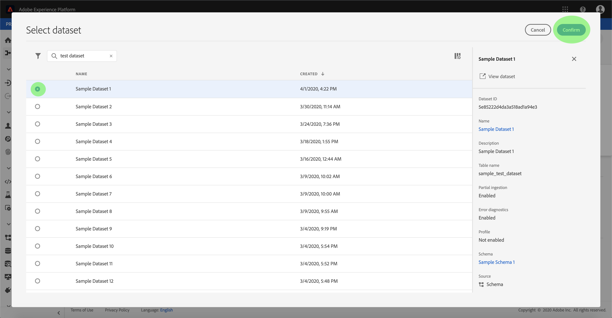

# Een gegevensstroom configureren voor een protocolverbinding in de gebruikersinterface

Een dataflow is een geplande taak die gegevens van een bron aan een dataset van Adobe Experience Platform terugwint en opneemt. Dit leerprogramma verstrekt stappen om een nieuwe dataflow te vormen gebruikend uw protocolrekening.

## Aan de slag

Deze zelfstudie vereist een goed begrip van de volgende onderdelen van Adobe Experience Platform:

- [[!DNL Experience Data Model (XDM)] Systeem](../../../../xdm/home.md): Het gestandaardiseerde kader waardoor de gegevens van de  [!DNL Experience Platform] klantenervaring worden georganiseerd.
   - [Basisbeginselen van de schemacompositie](../../../../xdm/schema/composition.md): Leer over de basisbouwstenen van schema&#39;s XDM, met inbegrip van zeer belangrijke principes en beste praktijken in schemacompositie.
   - [Zelfstudie](../../../../xdm/tutorials/create-schema-ui.md) Schema-editor: Leer hoe te om douaneschema&#39;s tot stand te brengen gebruikend de Redacteur UI van het Schema.
- [[!DNL Real-time Customer Profile]](../../../../profile/home.md): Verstrekt een verenigd, real-time consumentenprofiel dat op bijeengevoegde gegevens van veelvoudige bronnen wordt gebaseerd.

Bovendien, vereist dit leerprogramma dat u reeds een protocolrekening hebt gecreeerd. Een lijst van leerprogramma&#39;s voor het creëren van verschillende protocolschakelaars in UI kan in [overzicht van bronschakelaars](../../../home.md) worden gevonden.

## Gegevens selecteren

Nadat u uw protocolaccount hebt gemaakt, wordt de stap **[!UICONTROL Gegevens selecteren]** weergegeven. Deze stap biedt een interactieve interface waarmee u de bestandshiërarchie kunt verkennen.

- De linkerhelft van de interface is een directorybrowser waarin de bestanden en mappen van uw server worden weergegeven.
- Met de rechterhelft van de interface kunt u maximaal 100 rijen gegevens uit een compatibel bestand voorvertonen.

Met de optie **[!UICONTROL Zoeken]** boven aan de pagina kunt u snel de brongegevens identificeren die u wilt gebruiken.

>[!NOTE]
>
>De optie van onderzoeksbrongegevens is beschikbaar aan alle op tabelvorm-gebaseerde bronschakelaars behalve de Analytics, Classifications, de Hubs van de Gebeurtenis, en de schakelaars van Kinesis.

Nadat u de brongegevens hebt gevonden, selecteert u de map en klikt u op **[!UICONTROL Volgende]**.

## Gegevensvelden toewijzen aan een XDM-schema

De stap **[!UICONTROL Toewijzing]** verschijnt, die een interactieve interface verstrekt om de brongegevens aan een [!DNL Platform] dataset in kaart te brengen.

Kies een dataset voor binnenkomende gegevens waarin moeten worden opgenomen. U kunt of een bestaande dataset gebruiken of een nieuwe dataset tot stand brengen.

### Een bestaande gegevensset gebruiken

Om gegevens in een bestaande dataset in te voeren, selecteer **[!UICONTROL bestaande dataset]** gebruiken, dan klik het datasetpictogram.

Het dialoogvenster **[!UICONTROL Gegevensset selecteren]** wordt weergegeven. Zoek de dataset u wenst te gebruiken, het te selecteren, dan **[!UICONTROL ga]** te klikken.

### Een nieuwe gegevensset gebruiken

Om gegevens in een nieuwe dataset in te voeren, selecteer **[!UICONTROL nieuwe dataset]** creëren en ga een naam en een beschrijving voor de dataset op de verstrekte gebieden in.

U kunt een schemagebied vastmaken door een schemanaam in te gaan **[!UICONTROL Selecteer schema]** onderzoeksbar. U kunt ook het vervolgkeuzepictogram selecteren om een lijst met bestaande schema&#39;s weer te geven. U kunt ook **[!UICONTROL Geavanceerd zoeken]** selecteren om toegang te krijgen tot het scherm van bestaande schema&#39;s met hun respectievelijke details.

Tijdens deze stap, kunt u uw dataset voor [!DNL Real-time Customer Profile] toelaten en een holistische mening van de attributen en het gedrag van een entiteit creëren. De gegevens van alle toegelaten datasets zullen in [!DNL Profile] worden omvat en de veranderingen worden toegepast wanneer u uw gegevensstroom bewaart.

Schakel de knop **[!UICONTROL Profieldataset]** in of uit om uw doelgegevensset in te schakelen voor [!DNL Profile].

Het dialoogvenster **[!UICONTROL Selecteer schema]** wordt weergegeven. Selecteer het schema u wenst om op de nieuwe dataset toe te passen, dan klik **[!UICONTROL Done]**.

Op basis van uw behoeften kunt u ervoor kiezen om velden rechtstreeks toe te wijzen of mapperfuncties te gebruiken om brongegevens om berekende of berekende waarden af te leiden. Raadpleeg de zelfstudie over het toewijzen van CSV-gegevens aan XDM-schemavelden](../../../../ingestion/tutorials/map-a-csv-file.md) voor meer informatie over gegevenstoewijzing en mapperfuncties.[

>[!TIP]
>
>[!DNL Platform] verstrekt intelligente aanbevelingen voor auto-in kaart gebrachte gebieden die op het doelschema of de dataset worden gebaseerd dat u selecteerde. U kunt toewijzingsregels handmatig aanpassen aan uw gebruiksgevallen.

Selecteer **[!UICONTROL Voorvertoningsgegevens]** om de toewijzingsresultaten van maximaal 100 rijen met voorbeeldgegevens uit de geselecteerde gegevensset weer te geven.

Tijdens de voorvertoning krijgt de identiteitskolom de prioriteit als het eerste veld, omdat dit de belangrijkste informatie is die nodig is voor het valideren van toewijzingsresultaten.

Wanneer uw brongegevens zijn toegewezen, selecteert u **[!UICONTROL Close]**.

## Planninguitvoering

De **[!UICONTROL Plannende]** stap verschijnt, toestaand u om een insluitingsprogramma te vormen om de geselecteerde brongegevens automatisch in te nemen gebruikend de gevormde afbeeldingen. De volgende lijst schetst de verschillende configureerbare gebieden voor het plannen:

| Veld | Beschrijving |
| --- | --- |
| Frequentie | Selecteerbare frequenties zijn onder andere `Once`, `Minute`, `Hour`, `Day` en `Week`. |
| Interval | Een geheel getal dat het interval voor de geselecteerde frequentie instelt. |
| Begintijd | Een UTC-tijdstempel die aangeeft wanneer de eerste opname wordt uitgevoerd. |
| Achtergrond | Een booleaanse waarde die bepaalt welke gegevens eerst worden ingevoerd. Als **[!UICONTROL Backfill]** wordt toegelaten, zullen alle huidige dossiers in de gespecificeerde weg tijdens de eerste geplande opname worden opgenomen. Als **[!UICONTROL Backfill]** is uitgeschakeld, worden alleen de bestanden opgenomen die tussen de eerste opname en de begintijd worden geladen. Bestanden die vóór de begintijd zijn geladen, worden niet opgenomen. |
| Delta-kolom | Een optie met een gefilterde reeks gebieden van het bronschema van type, datum, of tijd. Dit veld wordt gebruikt om onderscheid te maken tussen nieuwe en bestaande gegevens. Incrementele gegevens worden opgenomen op basis van het tijdstempel van de geselecteerde kolom. |

Dataflows worden ontworpen om gegevens automatisch in te voeren op een geplande basis. Begin door de innamefrequentie te selecteren. Daarna, plaats het interval om de periode tussen twee stroomlooppas aan te wijzen. De waarde van het interval moet een geheel getal zijn dat niet gelijk is aan nul en moet worden ingesteld op groter dan of gelijk aan 15.

Als u de begintijd voor inname wilt instellen, past u de datum en tijd aan die worden weergegeven in het vak Begintijd. U kunt ook het kalenderpictogram selecteren om de begintijdwaarde te bewerken. De begintijd moet groter zijn dan of gelijk zijn aan de huidige UTC-tijd.

Selecteer **[!UICONTROL Incrementele gegevens laden door]** om de deltabkolom toe te wijzen. In dit veld wordt een onderscheid gemaakt tussen nieuwe en bestaande gegevens.

### Eenmalige gegevensstroom voor inname instellen

Als u eenmalige invoer wilt instellen, selecteert u de pijl voor de frequentieverlaging en selecteert u **[!UICONTROL Eenmaal]**.

>[!TIP]
>
>**** Intervaland  **** Backfillare is niet zichtbaar tijdens eenmalige inname.

Nadat u de juiste waarden voor het schema hebt opgegeven, selecteert u **[!UICONTROL Volgende]**.

## Gegevens over gegevensstroom opgeven

De stap **[!UICONTROL Dataflow detail]** verschijnt, toestaand u om een korte beschrijving over uw nieuwe dataflow te noemen en te verstrekken.

Tijdens dit proces kunt u **[!UICONTROL Gedeeltelijke inname]** en **[!UICONTROL Foutdiagnostiek]** ook inschakelen. Als u **[!UICONTROL Gedeeltelijke inname]** inschakelt, kunt u gegevens met fouten tot een bepaalde drempel invoeren. Als **[!UICONTROL Gedeeltelijke inname]** is ingeschakeld, sleept u de oproep **[!UICONTROL Foutdrempel %]** om de foutdrempel van de batch aan te passen. U kunt de drempelwaarde ook handmatig aanpassen door het invoervak te selecteren. Voor meer informatie, zie [gedeeltelijk partijingesinzicht overzicht](../../../../ingestion/batch-ingestion/partial.md).

Geef waarden op voor de gegevensstroom en selecteer **[!UICONTROL Volgende]**.

## Controleer uw gegevensstroom

De stap **[!UICONTROL Review]** verschijnt, die u toestaat om uw nieuwe gegevensstroom te herzien alvorens het wordt gecreeerd. De details worden gegroepeerd in de volgende categorieën:

- **[!UICONTROL Verbinding]**: Toont het brontype, de relevante weg van het gekozen brondossier, en de hoeveelheid kolommen binnen dat brondossier.
- **[!UICONTROL Gegevensset- en kaartvelden]** toewijzen: Toont welke dataset de brongegevens worden opgenomen in, met inbegrip van het schema dat de dataset zich aan houdt.
- **[!UICONTROL Planning]**: Toont de actieve periode, de frequentie, en het interval van het innameprogramma.

Zodra u uw gegevensstroom hebt herzien, klik **[!UICONTROL Afwerking]** en laat wat tijd voor dataflow toe om worden gecreeerd.

## Uw gegevensstroom controleren

Zodra uw gegevensstroom is gecreeerd, kunt u de gegevens controleren die door het worden opgenomen om informatie over innamepercentages, succes, en fouten te zien. Voor meer informatie over hoe te om dataflow te controleren, zie de zelfstudie over [het controleren van rekeningen en dataflows in UI](../monitor.md).

## Uw gegevensstroom verwijderen

U kunt gegevensstromen schrappen die niet meer noodzakelijk of verkeerd gecreeerd gebruikend **[!UICONTROL Delete]** functie beschikbaar in **[!UICONTROL Dataflows]** werkruimte zijn. Voor meer informatie over hoe te om dataflows te schrappen, zie de zelfstudie over [het schrappen van gegevensstromen in UI](../delete.md).

## Volgende stappen

Door deze zelfstudie te volgen, hebt u met succes een dataflow gecreeerd om gegevens van een systeem van de marketingautomatisering in te brengen en inzicht verworven in de controle van datasets. Binnenkomende gegevens kunnen nu worden gebruikt door downstreamservices [!DNL Platform] zoals [!DNL Real-time Customer Profile] en [!DNL Data Science Workspace]. Raadpleeg de volgende documenten voor meer informatie:

- [[!DNL Real-time Customer Profile]  - overzicht](../../../../profile/home.md)
- [[!DNL Data Science Workspace]  - overzicht](../../../../data-science-workspace/home.md)

## Aanhangsel

De volgende secties verstrekken extra informatie voor het werken met bronschakelaars.

### Een gegevensstroom uitschakelen

Wanneer een gegevensstroom wordt gecreeerd, wordt het onmiddellijk actief en neemt gegevens volgens het programma op het werd gegeven. U kunt een actieve gegevensstroom op elk ogenblik onbruikbaar maken door de instructies hieronder te volgen.

Selecteer in het scherm **[!UICONTROL Dataflows]** de naam van de gegevensstroom die u wilt uitschakelen.

De kolom **[!UICONTROL Eigenschappen]** wordt aan de rechterkant van het scherm weergegeven. Dit deelvenster bevat een schakelknop **[!UICONTROL Ingeschakeld]**. Klik op de schakeloptie om de gegevensstroom uit te schakelen. Dezelfde schakeloptie kan worden gebruikt om een gegevensstroom opnieuw in te schakelen nadat deze is uitgeschakeld.

### Binnenkomende gegevens voor [!DNL Profile] populatie activeren

De binnenkomende gegevens van uw bronschakelaar kunnen worden gebruikt om uw [!DNL Real-time Customer Profile] gegevens te verrijken en te vullen. Zie de zelfstudie over [Profielpopulatie](../profile.md) voor meer informatie over het vullen van uw [!DNL Real-time Customer Profile]-gegevens.