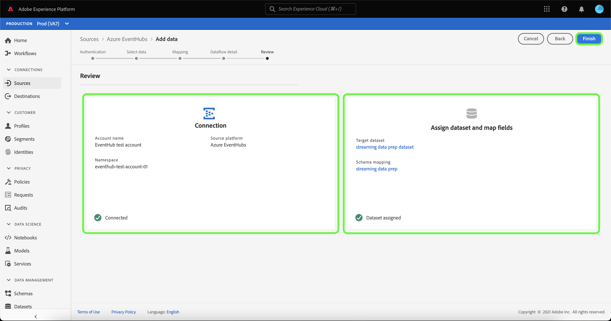

# Een streaminggegevensstroom maken voor een bron voor cloudopslag in de gebruikersinterface

Een dataflow is een geplande taak die gegevens van een bron aan een dataset van Adobe Experience Platform terugwint en opneemt. Deze zelfstudie bevat stappen voor het maken van een streaminggegevensstroom voor een bron voor cloudopslag in de gebruikersinterface.

Voordat u deze zelfstudie kunt proberen, moet u eerst een geldige en geverifieerde verbinding tot stand brengen tussen uw account voor cloudopslag en Experience Platform. Als u nog geen geverifieerde verbinding hebt, raadpleegt u een van de volgende zelfstudies voor informatie over het verifiëren van uw streaming cloudopslagaccounts:

- [[!DNL Amazon Kinesis]](../../../ui/create/cloud-storage/kinesis.md)
- [[!DNL Azure Event Hubs]](../../../ui/create/cloud-storage/eventhub.md)
- [[!DNL Google PubSub]](../../../ui/create/cloud-storage/google-pubsub.md)

## Aan de slag

Deze zelfstudie vereist een goed begrip van de volgende onderdelen van Adobe Experience Platform:

- [ Dataflows ](../../../../../dataflows/home.md): Dataflows zijn een vertegenwoordiging van gegevensbanen die gegevens over Experience Platform bewegen. Dataflows worden geconfigureerd voor verschillende services, van bronnen tot [!DNL Identity Service] , [!DNL Profile] en [!DNL Destinations] .
- [ Prep van Gegevens ](../../../../../data-prep/home.md): De Prep van Gegevens staat gegevensingenieurs toe om, gegevens in kaart te brengen om te transformeren en te bevestigen aan en van het Model van Gegevens van de Ervaring (XDM). De Prep van gegevens verschijnt als &quot;Kaart&quot;stap in de processen van de Ingestie van Gegevens, met inbegrip van CSV Ingestiewerkschema.
- [[!DNL Experience Data Model (XDM)]  Systeem ](../../../../../xdm/home.md): Het gestandaardiseerde kader waardoor [!DNL Experience Platform] gegevens van de klantenervaring organiseert.
   - [ Grondbeginselen van schemacompositie ](../../../../../xdm/schema/composition.md): Leer over de basisbouwstenen van schema&#39;s XDM, met inbegrip van zeer belangrijke principes en beste praktijken in schemacompositie.
   - [ het leerprogramma van de Redacteur van het Schema ](../../../../../xdm/tutorials/create-schema-ui.md): Leer hoe te om douaneschema&#39;s tot stand te brengen gebruikend de Redacteur UI van het Schema.
- [[!DNL Real-Time Customer Profile]](../../../../../profile/home.md): biedt een uniform, real-time consumentenprofiel dat is gebaseerd op geaggregeerde gegevens van meerdere bronnen.

## Gegevens toevoegen

>[!NOTE]
>
>U kunt slechts één brondataflow per consumentengroep voor een bepaalde Hub van de Gebeurtenis tot stand brengen.

Nadat u uw streamingcloud-opslagaccount hebt gemaakt, wordt de stap **[!UICONTROL Select data]** weergegeven en krijgt u een interface om te selecteren welke gegevensstroom u naar Experience Platform wilt verzenden.

- Het linkergedeelte van de interface is een browser waarmee u de beschikbare gegevensstromen binnen uw account kunt bekijken.
- In het rechtergedeelte van de interface kunt u maximaal 100 rijen gegevens uit een JSON-bestand voorvertonen.

Selecteer de gegevensstroom die u wilt gebruiken en selecteer **[!UICONTROL Choose file]** om een voorbeeldschema te uploaden.

>[!TIP]
>
>Als uw gegevens XDM-compatibel zijn, kunt u het uploaden van een voorbeeldschema overslaan en **[!UICONTROL Next]** selecteren om verder te gaan.

Zodra uw schema uploadt, werkt de voorproefinterface bij om een voorproef van het schema te tonen u uploadde. Met de voorvertoningsinterface kunt u de inhoud en structuur van een bestand controleren. U kunt het hulpprogramma [!UICONTROL Search field] ook gebruiken om toegang te krijgen tot specifieke items binnen uw schema.

Selecteer **[!UICONTROL Next]** als u klaar bent.

## Toewijzing

De stap **[!UICONTROL Mapping]** wordt weergegeven en biedt een interface voor het toewijzen van de brongegevens aan een Experience Platform-gegevensset.

Kies een dataset voor binnenkomende gegevens waarin moeten worden opgenomen. U kunt een bestaande gegevensset gebruiken of een nieuwe gegevensset maken.

### Nieuwe gegevensset

Als u gegevens in een nieuwe gegevensset wilt opnemen, selecteert u **[!UICONTROL New dataset]** en voert u een naam en beschrijving in voor de gegevensset in de opgegeven velden. Als u een schema wilt toevoegen, kunt u een bestaande schemanaam in het dialoogvenster **[!UICONTROL Select schema]** invoeren. U kunt ook **[!UICONTROL Schema advanced search]** selecteren om te zoeken naar een geschikt schema.

Het [!UICONTROL Select schema] -venster wordt weergegeven en bevat een lijst met beschikbare schema&#39;s waaruit u kunt kiezen. Selecteer een schema in de lijst om de rechterrail bij te werken om details te tonen specifiek voor het schema u selecteerde, met inbegrip van informatie over of het schema voor [!DNL Profile] wordt toegelaten.

Selecteer **[!UICONTROL Done]** als u het schema dat u wilt gebruiken hebt geïdentificeerd en geselecteerd.

De pagina [!UICONTROL Target dataset] wordt bijgewerkt met het geselecteerde schema dat als onderdeel van de gegevensset wordt weergegeven. Tijdens deze stap, kunt u uw dataset voor [!DNL Profile] toelaten en een holistische mening van de attributen en het gedrag van een entiteit creëren. Gegevens van alle ingeschakelde gegevenssets worden opgenomen in [!DNL Profile] en wijzigingen worden toegepast wanneer u de gegevensstroom opslaat.

Schakel de knop **[!UICONTROL Profile dataset]** in of uit om uw doelgegevensset in te schakelen voor [!DNL Profile] .

### Bestaande gegevensset

Als u gegevens in een bestaande gegevensset wilt opnemen, selecteert u **[!UICONTROL Existing dataset]** en selecteert u vervolgens het pictogram van de gegevensset.

Het dialoogvenster **[!UICONTROL Select dataset]** wordt weergegeven, waarin u een lijst met beschikbare gegevenssets kunt kiezen. Selecteer een dataset van de lijst om de juiste spoorlijn bij te werken om details te tonen specifiek voor de dataset u selecteerde, met inbegrip van informatie over of de dataset voor [!DNL Profile] kan worden toegelaten.

Als u de gegevensset hebt geïdentificeerd en geselecteerd die u wilt gebruiken, selecteert u **[!UICONTROL Done]** .

Nadat u de gegevensset hebt geselecteerd, selecteert u de schakeloptie [!DNL Profile] om de gegevensset in te schakelen voor [!DNL Profile] .

### Standaardvelden toewijzen

Met uw dataset en schema gevestigd, verschijnt de **[!UICONTROL Map standard fields]** interface, toestaand u om kaartgebieden voor uw gegevens manueel te vormen.

>[!TIP]
>
>Experience Platform biedt intelligente aanbevelingen voor automatisch toegewezen velden op basis van het doelschema of de gegevensset die u hebt geselecteerd. U kunt toewijzingsregels handmatig aanpassen aan uw gebruiksgevallen.

Op basis van uw behoeften kunt u ervoor kiezen om velden rechtstreeks toe te wijzen of gegevens prep-functies te gebruiken om brongegevens om berekende of berekende waarden af te leiden. Voor uitvoerige stappen bij het gebruiken van de kaartperinterface en berekende gebieden, zie de [ gids UI van de Prep van Gegevens ](../../../../../data-prep/ui/mapping.md).

Selecteer **[!UICONTROL Next]** wanneer de brongegevens zijn toegewezen.

## Gegevens

De stap **[!UICONTROL Dataflow detail]** wordt weergegeven, zodat u een naam kunt geven en een korte beschrijving kunt geven van de nieuwe gegevensstroom.

Geef waarden op voor de gegevensstroom en selecteer **[!UICONTROL Next]** .

### Controleren

De stap **[!UICONTROL Review]** wordt weergegeven, zodat u de nieuwe gegevensstroom kunt bekijken voordat deze wordt gemaakt. De details worden gegroepeerd in de volgende categorieën:

- **[!UICONTROL Connection]**: geeft de naam van uw account, het type bron en andere informatie weer die specifiek is voor de streamingbron voor cloudopslag die u gebruikt.
- **[!UICONTROL Assign dataset and map fields]**: geeft de doeldataset en het doelschema weer u voor uw gegevensstroom gebruikt.

Nadat u de gegevensstroom hebt gereviseerd, selecteert u **[!UICONTROL Finish]** en laat u enige tijd over om de gegevensstroom te maken.

## Uw gegevensstroom controleren en verwijderen

Nadat u de gegevens voor de streaming cloud storage hebt gemaakt, kunt u de gegevens controleren die er doorheen worden ingevoerd. Voor meer informatie bij het controleren van en het schrappen van het stromen dataflows, zie het leerprogramma bij [ controle het stromen dataflows ](../../monitor-streaming.md).

## Volgende stappen

Aan de hand van deze zelfstudie hebt u een gegevensstroom gemaakt om gegevens van een bron voor cloudopslag te streamen. Binnenkomende gegevens kunnen nu worden gebruikt door downstream Experience Platform-services, zoals [!DNL Real-Time Customer Profile] en [!DNL Data Science Workspace] . Raadpleeg de volgende documenten voor meer informatie:

- [[!DNL Real-Time Customer Profile]-overzicht](../../../../../profile/home.md)
- [[!DNL Data Science Workspace]-overzicht](../../../../../data-science-workspace/home.md)