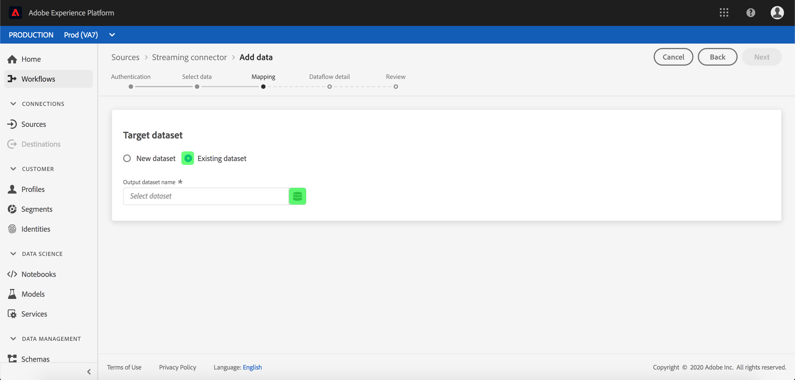
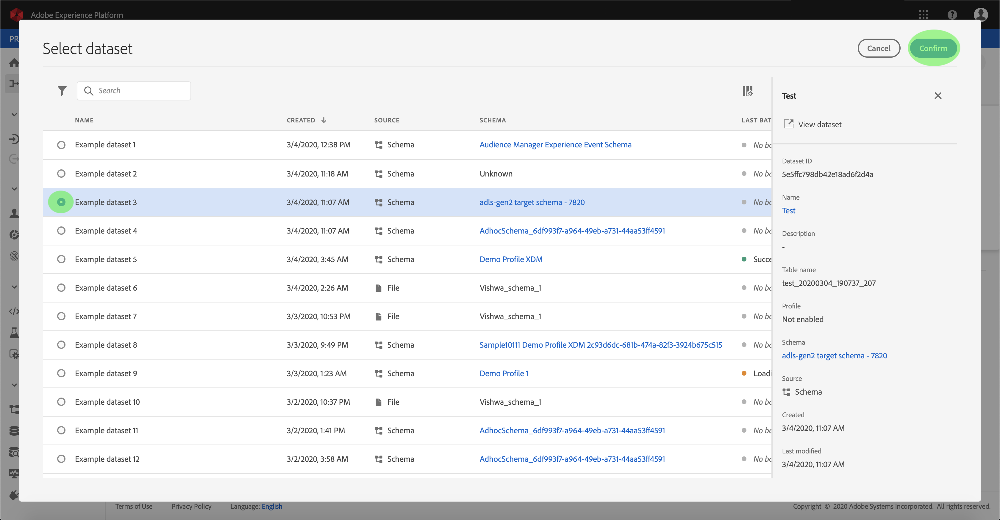

# Een dataflow configureren voor een streamingconnector voor cloudopslag in de gebruikersinterface

Een dataflow is een geplande taak die gegevens van een bron aan een dataset van het Platform terugwint en opneemt. Deze zelfstudie bevat stappen voor het configureren van een nieuwe gegevensstroom met behulp van de basisaansluiting voor cloudopslag.

## Aan de slag

Voor deze zelfstudie is een goed begrip vereist van de volgende componenten van het Adobe Experience Platform:

- [XDM-systeem](../../../../../xdm/home.md)(Experience Data Model): Het gestandaardiseerde kader waardoor het Platform van de Ervaring gegevens van de klantenervaring organiseert.
   - [Basisbeginselen van de schemacompositie](../../../../../xdm/schema/composition.md): Leer over de basisbouwstenen van schema&#39;s XDM, met inbegrip van zeer belangrijke principes en beste praktijken in schemacompositie.
   - [Zelfstudie](../../../../../xdm/tutorials/create-schema-ui.md)Schema-editor: Leer hoe te om douaneschema&#39;s tot stand te brengen gebruikend de Redacteur UI van het Schema.
- [Klantprofiel](../../../../../profile/home.md)in realtime: Verstrekt een verenigd, real-time consumentenprofiel dat op bijeengevoegde gegevens van veelvoudige bronnen wordt gebaseerd.

Bovendien is voor deze zelfstudie vereist dat u al een cloudopslagaansluiting hebt gemaakt. Een lijst met zelfstudies voor het maken van verschillende cloudopslagconnectors in de gebruikersinterface vindt u in het overzicht [van de](../../../../home.md)bronconnectors.

## Gegevens selecteren

Nadat u de aansluiting voor de cloudopslag hebt gemaakt, wordt de stap Gegevens ** selecteren weergegeven. Deze stap bevat een interface waarmee u kunt selecteren uit welke stream u gegevens wilt streamen.

## Gegevensvelden toewijzen aan een XDM-schema

De stap *Toewijzing* verschijnt, die een interactieve interface verstrekt om de brongegevens aan een dataset van het Platform in kaart te brengen.

Kies een dataset voor binnenkomende gegevens waarin moeten worden opgenomen. U kunt of een bestaande dataset gebruiken of nieuwe creëren.

**Een bestaande gegevensset gebruiken**

Om gegevens in een bestaande dataset in te voeren, selecteer **Gebruik bestaande dataset**, dan klik het datasetpictogram.

Het dialoogvenster _Gegevensset_ selecteren wordt geopend. Zoek de gegevensset die u wilt gebruiken, selecteer deze en klik op **Doorgaan**.

**Een nieuwe gegevensset gebruiken**

Om gegevens in een nieuwe dataset in te voeren, **creeer nieuwe dataset** en ga een naam en een beschrijving voor de dataset op de verstrekte gebieden in. Selecteer vervolgens het schema dat u wilt gebruiken onder het vervolgkeuzemenu.

## Geef uw gegevensstroom een naam

De stap met *details* over gegevensstroom wordt weergegeven, zodat u een naam kunt geven en een korte beschrijving kunt geven van uw nieuwe gegevensstroom.

Geef waarden op voor de gegevensstroom en klik op **Volgende**.

### Controleer uw gegevensstroom

De stap *Revisie* wordt weergegeven, zodat u de nieuwe gegevensstroom kunt controleren voordat deze wordt gemaakt. De details worden gegroepeerd in de volgende categorieën:

- *Brongegevens*: Toont het brontype en andere relevante details over de bron.
- *Doelgegevens*: Toont welke dataset de brongegevens worden opgenomen in, met inbegrip van het schema dat de dataset zich aan houdt.

Nadat u de gegevensstroom hebt gereviseerd, klikt u op **Voltooien** en laat u enige tijd over tot de gegevensstroom.

## Uw gegevensstroom controleren

Nadat u de gegevens voor de cloudopslag hebt gemaakt, kunt u de gegevens controleren die er doorheen worden ingevoerd. Voor meer informatie over controledatasets, zie het leerprogramma bij het [controleren van het stromen gegevens](../../../../../ingestion/quality/monitor-data-flows.md).

## Volgende stappen

Door deze zelfstudie te volgen, hebt u met succes een dataflow gemaakt om gegevens van een externe wolkenopslag in te brengen, en hebt u inzicht gekregen in de controle van datasets. De inkomende gegevens kunnen nu door de stroomafwaartse diensten van het Platform zoals het Profiel van de Klant in real time en de Werkruimte van de Wetenschap van Gegevens worden gebruikt. Raadpleeg de volgende documenten voor meer informatie:

- [Overzicht van het realtime klantprofiel](../../../../../profile/home.md)
- [Overzicht van de Data Science Workspace](../../../../../data-science-workspace/home.md)

## Aanhangsel

De volgende secties verstrekken extra informatie voor het werken met bronschakelaars.

### Een gegevensstroom uitschakelen

Wanneer een gegevensstroom wordt gecreeerd, wordt het onmiddellijk actief en neemt gegevens volgens het programma op het werd gegeven. U kunt een actieve gegevensstroom op elk ogenblik onbruikbaar maken door de instructies hieronder te volgen.

Klik in de *werkruimte Bronnen* op het tabblad **Bladeren** . Klik vervolgens op de naam van de basisverbinding die is gekoppeld aan de actieve gegevensstroom die u wilt uitschakelen.

De pagina *Bronactiviteit* wordt weergegeven. Selecteer de actieve gegevensstroom van de lijst om zijn kolom van *Eigenschappen* op de rechterkant van het scherm te openen, die een **Toegelaten** knevelknoop bevat. Klik op de schakeloptie om de gegevensstroom uit te schakelen. Dezelfde schakeloptie kan worden gebruikt om een gegevensstroom opnieuw in te schakelen nadat deze is uitgeschakeld.

### Inkomende gegevens activeren voor profielpopulatie

De binnenkomende gegevens van uw bronschakelaar kunnen worden gebruikt om uw gegevens van het Profiel van de Klant in real time te verrijken en te bevolken. Voor meer informatie over het bevolken van uw gegevens van het Profiel van de Real-Customer, zie de zelfstudie over de [bevolking](../../profile.md)van het Profiel.
