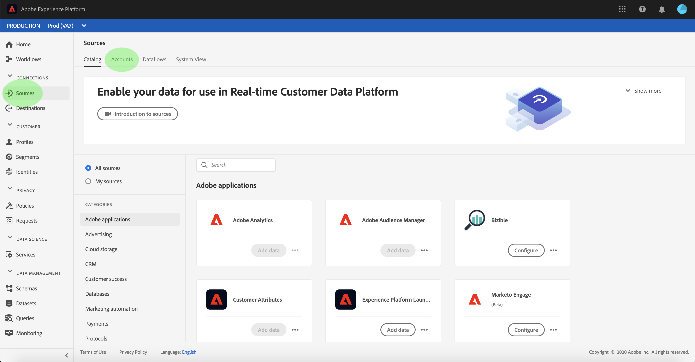
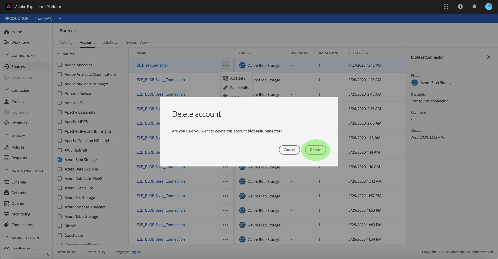

# Accounts verwijderen

De bronschakelaars in Adobe Experience Platform verstrekken de capaciteit om van buitenaf afkomstige gegevens op een geplande basis in te voeren. Dit leerprogramma verstrekt stappen voor het schrappen van rekeningen van de **[!UICONTROL werkruimte van Bronnen]** .

## Aan de slag

Deze zelfstudie vereist een goed begrip van de volgende onderdelen van Adobe Experience Platform:

- [[!DNL Experience Data Model] (XDM) Systeem](../../../xdm/home.md): Het gestandaardiseerde kader waardoor de gegevens van de klantenervaring worden [!DNL Experience Platform] georganiseerd.
   - [Basisbeginselen van de schemacompositie](../../../xdm/schema/composition.md): Leer over de basisbouwstenen van schema&#39;s XDM, met inbegrip van zeer belangrijke principes en beste praktijken in schemacompositie.
   - [Zelfstudie](../../../xdm/tutorials/create-schema-ui.md)Schema-editor: Leer hoe te om douaneschema&#39;s tot stand te brengen gebruikend de Redacteur UI van het Schema.
- [[!DNL Real-time Customer Profile]](../../../profile/home.md): Verstrekt een verenigd, real-time consumentenprofiel dat op bijeengevoegde gegevens van veelvoudige bronnen wordt gebaseerd.

## Accounts verwijderen via de gebruikersinterface

Meld u aan bij [Adobe Experience Platform](https://platform.adobe.com) en selecteer vervolgens **[!UICONTROL Bronnen]** in de linkernavigatiebalk voor toegang tot de werkruimte **[!UICONTROL Bronnen]** . In het scherm **[!UICONTROL Catalogus]** worden diverse bronnen weergegeven waarvoor u accounts en gegevensstromen kunt maken. Elke bron toont het aantal bestaande rekeningen en gegevensstromen verbonden aan hen.

Selecteer **[!UICONTROL Accounts]** om de pagina **[!UICONTROL Accounts]** te openen.

Er wordt een lijst met bestaande accounts weergegeven. Op deze pagina vindt u een lijst met sorteerbare gegevens voor bestaande accounts, zoals bron, gebruikersnaam, gekoppelde gegevens en gemaakte datum. Selecteer het **trechter-pictogram** linksboven om te sorteren.

Het sorteervenster wordt aan de linkerkant van het scherm weergegeven met een lijst met beschikbare bronnen. Met de sorteerfunctie kunt u meerdere bronnen selecteren.

Selecteer de bron die u wilt openen en zoek de account die u wilt verwijderen uit de lijst met accounts in de hoofdinterface. In het voorbeeld is de geselecteerde bron **[!DNL Azure Blob Storage]** en is de accountnaam **[!UICONTROL blobTestConnector]**. Wanneer u meerdere bronnen selecteert in het sorteervenster, worden de laatst gemaakte accounts eerst weergegeven omdat de lijst is gesorteerd op de gemaakte datum.

Selecteer het account dat u wilt verwijderen.

Het deelvenster **[!UICONTROL Eigenschappen]** wordt aan de rechterkant van het scherm weergegeven met informatie over de geselecteerde account.

Selecteer de ovalen (`...`) naast de naam van de account die u wilt verwijderen. Er verschijnt een pop-upvenster met opties voor het **[!UICONTROL toevoegen van gegevens]**, het **[!UICONTROL bewerken van details]** en het **[!UICONTROL verwijderen]**. Selecteer **[!UICONTROL Verwijderen]** om het account te verwijderen.

Er wordt een laatste bevestigingsvenster weergegeven. Selecteer **[!UICONTROL Verwijderen]** om het proces te voltooien.

## Volgende stappen

Door deze zelfstudie te volgen, hebt u met succes de werkruimte **[!UICONTROL Bronnen]** gebruikt om bestaande rekeningen te schrappen.

Raadpleeg de zelfstudie over het [!DNL Flow Service] verwijderen van verbindingen met de Flow Service API voor informatie over hoe u deze bewerkingen programmatisch kunt uitvoeren met de [API.](../../tutorials/api/delete.md)