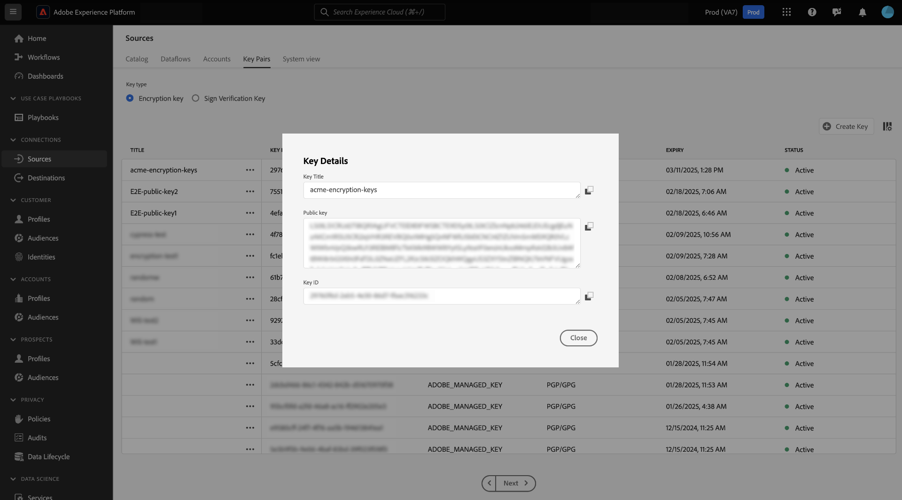

# Voeg gecodeerde gegevens in de interface van bronnen in

U kunt gecodeerde gegevensbestanden en -mappen via batchbronnen voor cloudopslag opnemen in Adobe Experience Platform. Met gecodeerde gegevensinvoer kunt u gebruikmaken van asymmetrische coderingsmechanismen om batchgegevens veilig over te brengen naar Experience Platform. De ondersteunde asymmetrische versleutelingsmechanismen zijn PGP en GPG.

Lees deze handleiding om te leren hoe u gecodeerde gegevens met bronnen voor opslagbatch voor de cloud kunt invoeren met behulp van de gebruikersinterface.

## Aan de slag

Lees voordat u verdergaat met deze zelfstudie de volgende documenten om de volgende Experience Platform-functies en -concepten beter te begrijpen.

* [&#x200B; Bronnen &#x200B;](../../home.md): De bronnen van het gebruik in Experience Platform om gegevens van een Toepassing van Adobe of een derdegegevensbron in te voeren.
* [&#x200B; Dataflows &#x200B;](../../../dataflows/home.md): Dataflows zijn vertegenwoordiging van gegevensbanen die gegevens over Experience Platform bewegen. U kunt de werkruimte voor bronnen gebruiken om gegevensstromen te maken die gegevens van een bepaalde bron naar Experience Platform invoeren.
* [&#x200B; Sandboxes &#x200B;](../../../sandboxes/home.md): De zandbakken van het gebruik in Experience Platform om virtuele verdelingen tussen uw instanties van Experience Platform tot stand te brengen en milieu&#39;s te creëren gewijd aan ontwikkeling of productie.

### Overzicht op hoog niveau

* Maak een sleutelpaar voor versleuteling met behulp van de bronwerkruimte in de gebruikersinterface van Experience Platform.
   * Desgewenst kunt u ook uw eigen sleutelpaar voor tekenverificatie maken om een extra beveiligingslaag voor de gecodeerde gegevens te bieden.
* Gebruik de openbare sleutel van uw encryptiesleutel om uw gegevens te coderen.
* Plaats de gecodeerde gegevens in de cloudopslag. Tijdens deze stap moet u er ook voor zorgen dat u een voorbeeldbestand van uw gegevens in uw cloudopslag hebt dat als referentie kan worden gebruikt om uw brongegevens toe te wijzen aan een XDM-schema (Experience Data Model).
* Gebruik de blokbron voor cloudopslag en begin met het gegevensinvoerproces in de werkruimte voor bronnen in de gebruikersinterface van Experience Platform.
* Geef tijdens het maken van de bronverbinding de sleutel-id op die overeenkomt met de openbare sleutel waarmee u uw gegevens hebt versleuteld.
   * Als u ook het sleutelpaar voor handtekeningverificatie hebt gebruikt, moet u ook de sleutel-id voor tekenverificatie opgeven die overeenkomt met uw gecodeerde gegevens.
* Ga door met de stappen voor het maken van de gegevensstroom.

## Een sleutelpaar voor versleuteling maken {#create-an-encryption-key-pair}

>[!CONTEXTUALHELP]
>id="platform_sources_encrypted_encryptionKeyId"
>title="Versleutelingssleutel-id"
>abstract="Geef de coderingssleutel-id op die overeenkomt met de coderingssleutel die is gebruikt om de brongegevens te coderen."

>[!BEGINSHADEBOX]

**wat is een encryptie zeer belangrijk paar?**

Een sleutelpaar van de encryptie is een asymmetrisch cryptografiemechanisme dat uit een openbare sleutel en een privé sleutel bestaat. De openbare sleutel wordt gebruikt om gegevens te coderen en de privé sleutel wordt dan gebruikt om genoemde gegevens te decrypteren.

U kunt een sleutelpaar voor versleuteling maken via de gebruikersinterface van Experience Platform. Wanneer gegenereerd, ontvangt u een openbare sleutel en een bijbehorende sleutel-id. Gebruik de openbare sleutel om uw gegevens te coderen en gebruik vervolgens de sleutel-id om uw identiteit te bevestigen wanneer u bezig bent met het invoeren van uw gecodeerde gegevens. De persoonlijke sleutel gaat automatisch naar Experience Platform, waar deze in een beveiligde kluis wordt opgeslagen. Deze wordt pas gebruikt wanneer uw gegevens gereed zijn voor decodering.

>[!ENDSHADEBOX]

Navigeer in de gebruikersinterface van Experience Platform naar de werkruimte voor bronnen en selecteer vervolgens [!UICONTROL Key Pairs] in de bovenste koptekst.

U wordt genomen aan een pagina die een lijst van bestaande encryptie zeer belangrijke paren in uw organisatie toont. Deze pagina bevat informatie over de titel, de id, het type, het versleutelingsalgoritme, de vervaldatum en de status van een bepaalde sleutel. Selecteer **[!UICONTROL Create Key]** als u een nieuw sleutelpaar wilt maken.

Kies vervolgens het toetstype dat u wilt maken. Als u een coderingssleutel wilt maken, selecteert u **[!UICONTROL Encryption Key]** en vervolgens **[!UICONTROL Continue]** .

Geef een titel en een wachtwoordzin op voor de coderingssleutel. Passphrase is een extra laag van bescherming voor uw encryptiesleutels. Bij het maken slaat Experience Platform de passphrase op in een andere veilige kluis dan de openbare sleutel. U moet een niet-lege tekenreeks opgeven als een wachtwoordzin. Selecteer **[!UICONTROL Create]** als u klaar bent.

Als dit gelukt is, wordt een nieuw venster weergegeven met de nieuwe coderingssleutel, inclusief de titel, openbare sleutel en sleutel-id. Gebruik de waarde van de openbare sleutel om uw gegevens te coderen. U gebruikt de sleutel-id later om uw identiteit te bewijzen wanneer u uw gecodeerde gegevens opgeeft tijdens het maken van de gegevensstroom.

Om informatie over een bestaande encryptiesleutel te bekijken, selecteer de ellipsen (`...`) naast de belangrijkste titel. Selecteer **[!UICONTROL Key details]** om de openbare sleutel en belangrijkste identiteitskaart te bekijken Of selecteer **[!UICONTROL Delete]** als u de coderingssleutel wilt verwijderen.

### Een verificatietoets voor handtekeningen maken {#create-a-sign-verification-key}

>[!CONTEXTUALHELP]
>id="platform_sources_encrypted_signVerificationKeyId"
>title="Verificatiesleutel-id ondertekenen"
>abstract="Geef de sleutel-id voor ondertekeningsverificatie op die overeenkomt met uw ondertekende, gecodeerde brongegevens."

>[!BEGINSHADEBOX]

**wat is een sleutel van de signaalcontrole?**

Een verificatiesleutel is een ander versleutelingsmechanisme dat een persoonlijke sleutel en een openbare sleutel omvat. In dit geval kunt u een sleutelpaar voor de verificatie van uw handtekening maken en de persoonlijke sleutel gebruiken om uw gegevens te ondertekenen en een extra coderingslaag toe te voegen. Vervolgens deelt u de bijbehorende openbare sleutel met Experience Platform. Tijdens het invoeren gebruikt Experience Platform de openbare sleutel om de handtekening te verifiëren die aan uw persoonlijke sleutel is gekoppeld.

>[!ENDSHADEBOX]

Als u een verificatietoets voor handtekeningen wilt maken, selecteert u **[!UICONTROL Sign Verification Key]** in het selectievenster voor het type sleutel en selecteert u vervolgens **[!UICONTROL Continue]** .

Geef vervolgens een titel en een [!DNL Base64] -gecodeerde PGP-sleutel op als openbare sleutel en selecteer **[!UICONTROL Create]** .

Als dit gelukt is, wordt een nieuw venster weergegeven met daarin de nieuwe verificatietoets voor handtekeningen, inclusief de titel en sleutel-id.

## Gecodeerde gegevens verzamelen {#ingest-encrypted-data}

>[!CONTEXTUALHELP]
>id="platform_sources_encrypted_isFileEncrypted"
>title="Is het bestand versleuteld?"
>abstract="Selecteer deze schakeloptie als u een reeds gecodeerd bestand wilt invoeren."

>[!CONTEXTUALHELP]
>id="platform_sources_encrypted_sampleFile"
>title="Voorbeeldbestand selecteren"
>abstract="Als u een toewijzing wilt maken, moet u een voorbeeldbestand invoeren bij het invoeren van gecodeerde gegevens."

U kunt gecodeerde gegevens invoeren met de volgende batchbronnen voor cloudopslag:

* [[!DNL Amazon S3]](../ui/create/cloud-storage/s3.md)
* [[!DNL Azure Blob]](../ui/create/cloud-storage/blob.md)
* [[!DNL Azure Data Lake Storage Gen2]](../ui/create/cloud-storage/adls-gen2.md)
* [[!DNL Azure File Storage]](../ui/create/cloud-storage/azure-file-storage.md)
* [[!DNL Data Landing Zone]](../ui/create/cloud-storage/data-landing-zone.md)
* [[!DNL FTP]](../ui/create/cloud-storage/ftp.md)
* [[!DNL Google Cloud Storage]](../ui/create/cloud-storage/google-cloud-storage.md)
* [[!DNL HDFS]](../ui/create/cloud-storage/hdfs.md)
* [[!DNL Oracle Object Storage]](../ui/create/cloud-storage/oracle-object-storage.md)
* [[!DNL SFTP]](../ui/create/cloud-storage/sftp.md)

Verifieer met de bron van de wolkenopslag van uw keus. Selecteer tijdens de stap voor gegevensselectie van de workflow het gecodeerde bestand of de gecodeerde map die u wilt invoegen en schakel vervolgens de **[!UICONTROL Is the file encrypted]** -schakeloptie in.

Selecteer vervolgens een voorbeeldbestand uit de brongegevens. Aangezien uw gegevens gecodeerd zijn, heeft Experience Platform een voorbeeldbestand nodig om een XDM-schema te maken dat aan uw brongegevens kan worden toegewezen.

.

Nadat u het voorbeeldbestand hebt geselecteerd, configureert u instellingen voor uw gegevens, zoals de bijbehorende gegevensindeling, het scheidingsteken en het compressietype. Zorg ervoor dat de voorvertoningsinterface enige tijd heeft om volledig te renderen en selecteer vervolgens **[!UICONTROL Save]** .

Van hier, gebruik dropdown menu om de openbare zeer belangrijke titel van openbare zeer belangrijke identiteitskaart te selecteren die met de openbare sleutel beantwoordt die u gebruikte om uw gegevens te coderen.

Als u ook het sleutelpaar voor handtekeningverificatie hebt gebruikt om een extra coderingslaag op te geven, schakelt u het selectievakje voor handtekeningverificatie in en selecteert u op dezelfde manier de sleutel-id voor tekenverificatie die overeenkomt met de sleutel waarmee u uw gegevens hebt versleuteld.

Selecteer **[!UICONTROL Next]** wanneer u klaar bent.

Voltooi de overige stappen in de workflow voor bronnen om het maken van de gegevensstroom te voltooien.

* [Gegevens over gegevensstroom en gegevenssets opgeven](../ui/dataflow/batch/cloud-storage.md#provide-dataflow-details)
* [Wijs uw brongegevens toe aan een XDM-schema](../ui/dataflow/batch/cloud-storage.md#map-data-fields-to-an-xdm-schema)
* [Vorm een innameschema voor uw gegevensstroom](../ui/dataflow/batch/cloud-storage.md#schedule-ingestion-runs)
* [Controleer uw gegevensstroom](../ui/dataflow/batch/cloud-storage.md#review-your-dataflow)

U kunt blijven [&#x200B; updates aan uw dataflow &#x200B;](../ui/update-dataflows.md) maken zodra het met succes is gecreeerd.

## Volgende stappen

Door dit document te lezen, kunt u nu gecodeerde gegevens van uw blokbron voor cloudopslag opnemen in Experience Platform. Voor informatie over hoe te om gecodeerde gegevens in te voeren gebruikend APIs, lees de gids over [&#x200B; het opnemen van gecodeerde gegevens gebruikend  [!DNL Flow Service]  API &#x200B;](../api/encrypt-data.md). Voor algemene informatie over bronnen op Experience Platform, lees het [&#x200B; overzicht van bronnen &#x200B;](../../home.md).
