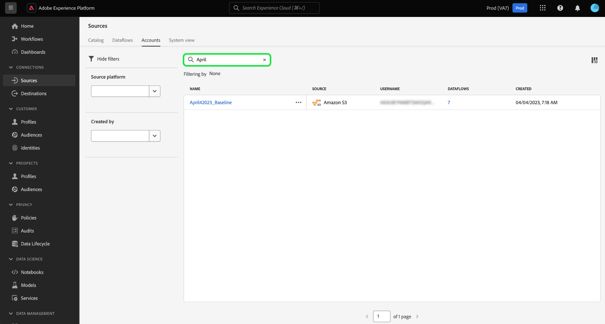

# Bronobjecten filteren in de gebruikersinterface

Gebruik de gereedschappen voor filteren, zoeken en inline-actie in de Adobe Experience Platform-gebruikersinterface om uw workflow in de [!UICONTROL Sources] -werkruimte te stroomlijnen

* Het filtreren en onderzoeksmogelijkheden van het gebruik om uw weg door bronrekeningen en dataflows in uw organisatie te navigeren.
* Gebruik inline handelingen om configuratie-instellingen te wijzigen die worden toegepast op uw gegevensstromen en om organisatorische workflows te verbeteren. U kunt inline-handelingen gebruiken om tags toe te passen, waarschuwingen in te stellen of om innemingstaken op aanvraag te maken.

## Aan de slag

Het is handig om inzicht te krijgen in de volgende functies en concepten van Experience Platforms voordat u gaat werken met de gereedschappen voor objectnavigatie in de werkruimte Bronnen:

* [&#x200B; Bronnen &#x200B;](../../home.md): De bronnen van het gebruik in Experience Platform om gegevens van een Toepassing van de Adobe of een derdegegevensbron in te voeren.
* [&#x200B; Administratieve Markeringen &#x200B;](../../../administrative-tags/overview.md): Gebruik administratieve markeringen om meta-gegevenssleutelwoorden op uw voorwerpen toe te passen en onderzoek toe te laten om dat voorwerp binnen het ecosysteem van het Experience Platform te vinden.
* [&#x200B; Alarm &#x200B;](../../../observability/home.md): Het alarm van het gebruik om berichten te ontvangen die een update op het statuut van voorwerpen zoals uw brongegevens verstrekken.
* [&#x200B; Dataflows &#x200B;](../../../dataflows/home.md): Dataflows zijn vertegenwoordiging van gegevensbanen die gegevens over Experience Platform bewegen. U kunt de werkruimte van bronnen gebruiken om gegevensstromen tot stand te brengen die gegevens van een bepaalde bron aan Experience Platform opnemen.
* [&#x200B; Datasets &#x200B;](../../../catalog/datasets/user-guide.md): Een dataset is een opslag en beheersconstructie voor een inzameling van gegevens, typisch een lijst, die een schema (kolommen) en gebieden (rijen) bevat.
* [&#x200B; Sandboxes &#x200B;](../../../sandboxes/home.md): De zandbakken van het gebruik in Experience Platform om virtuele verdelingen tussen uw instanties van het Experience Platform tot stand te brengen en milieu&#39;s te creëren gewijd aan ontwikkeling of productie.

## Gegevensstromen van bronnen filteren {#filter-sources-dataflows}

Selecteer in de gebruikersinterface van het Experience Platform **[!UICONTROL Sources]** in de linkernavigatie en selecteer vervolgens **[!UICONTROL Dataflows]** in de bovenste koptekst.

Standaard wordt het filtermenu links van de interface weergegeven. Selecteer **[!UICONTROL Hide filters]** om het menu te verbergen.

U kunt uw brongegevens filteren op de volgende parameters:

| Filter | Beschrijving |
| --- | --- |
| [&#x200B; het platform van Source &#x200B;](#filter-dataflows-by-source-platform) | Filter de gegevensstromen op basis van de bron waarmee ze zijn gemaakt. |
| [&#x200B; Markeringen &#x200B;](#filter-dataflows-by-tags) | Filter de gegevensstroom op basis van de tags die erop zijn toegepast. |
| [&#x200B; Status &#x200B;](#filter-dataflows-by-status) | Filter uw gegevensstromen op basis van hun huidige status. |
| [&#x200B; dataset van het Doel &#x200B;](#filter-dataflows-by-target-dataset) | Filter uw gegevensstromen die op de doeldataset worden gebaseerd zij met werden gecreeerd. |
| [&#x200B; de naam van de Rekening &#x200B;](#filter-dataflows-by-account-name) | Filter de gegevensstromen op basis van de naam van de account waarmee ze overeenkomen. |
| [&#x200B; die door &#x200B;](#filter-dataflows-by-user) wordt gecreeerd | Filter de gegevensstroom op basis van wie deze heeft gemaakt. |
| [&#x200B; Aanmaakdatum &#x200B;](#filter-dataflows-by-creation-date) | Filter de gegevensstromen op basis van de datum waarop ze zijn gemaakt. |
| [&#x200B; Gewijzigde datum &#x200B;](#filter-dataflows-by-modification-date) | Filter de gegevensstromen op basis van de datum waarop ze voor het laatst zijn bijgewerkt. |

### Gegevens filteren op bronplatform {#filter-dataflows-by-source-platform}

Gebruik het deelvenster [!UICONTROL Source platform] om de gegevens te filteren op het type bron. U kunt een bepaalde bron typen of het vervolgkeuzemenu gebruiken om een lijst met bronnen in de catalogus weer te geven. U kunt ook filteren op verschillende bronnen voor een bepaalde query. U kunt bijvoorbeeld [!DNL Amazon S3] , [!DNL Azure Data Lake Storage Gen2] en [!DNL Google Cloud Storage] selecteren om de catalogus bij te werken en alleen de gegevensstromen weer te geven die met de geselecteerde bronnen zijn gemaakt.

### Gegevens filteren op labels {#filter-dataflows-by-tags}

Gebruik het venster Codes om de gegevensstromen te filteren op basis van de respectievelijke codes.

Selecteer **[!UICONTROL Has any tag]** en selecteer vervolgens de tags die u wilt filteren in het vervolgkeuzemenu. Gebruik deze instelling om te filteren op gegevensstromen met een van de tags die u hebt geselecteerd.

Selecteer **[!UICONTROL Has all tags]** en selecteer vervolgens de tags die u wilt filteren in het vervolgkeuzemenu. Gebruik deze instelling om te filteren op gegevensstromen met alle tags die u hebt geselecteerd.

### Gegevens filteren op status {#filter-dataflows-by-status}

U kunt filteren op status met het deelvenster [!UICONTROL Status] .

| Status | Beschrijving |
| --- | --- |
| Ingeschakeld | Selecteer **[!UICONTROL Enabled]** om de weergave te filteren en alleen actieve gegevensstromen weer te geven. |
| Uitgeschakeld | Selecteer **[!UICONTROL Disabled]** om de weergave te filteren en alleen gedeactiveerde gegevensstromen weer te geven. |
| Concept | Selecteer **[!UICONTROL Draft]** om uw weergave te filteren en alleen de gegevens in de conceptmodus weer te geven. |

### Gegevens filteren op doelgegevensset {#filter-dataflows-by-target-dataset}

Selecteer **[!UICONTROL Target dataset]** om tot een dropdown menu van alle doeldatasets toegang te hebben. Dan, selecteer een doeldataset om uw mening te filtreren en slechts de dataflows te tonen die gebruikend uw gespecificeerde doeldatasets werden gecreeerd.

### Gegevens filteren op accountnaam {#filter-dataflows-by-account-name}

Selecteer **[!UICONTROL Account name]** om een vervolgkeuzemenu met alle accounts te openen. Selecteer vervolgens een account om de weergave te filteren en de gegevensstromen weer te geven die door uw geselecteerde account zijn gemaakt.

### Gegevens filteren op gebruiker {#filter-dataflows-by-user}

Gebruik het deelvenster [!UICONTROL Created by] om de gegevens te filteren van de gebruiker die de gegevensstromen heeft gemaakt of voor het laatst bijgewerkt. Selecteer de vervolgkeuzelijst en selecteer vervolgens de gebruikersnaam waarop u de gegevensstromen wilt filteren.

### Gegevens filteren op aanmaakdatum {#filter-dataflows-by-creation-date}

U kunt de gegevens filteren op de aanmaakdatum. Configureer in het deelvenster [!UICONTROL Created date] een begin- en einddatum om een tijdframevenster te maken en filtert u de weergave om alleen de gegevens weer te geven die in dat venster zijn gemaakt.

U kunt uw tijdkader vormen door uw begin en einddatum in te voeren. U kunt ook het kalenderpictogram selecteren en de kalender gebruiken om uw datums te configureren.

U kunt ook dezelfde stappen uitvoeren, maar filtergegevens worden op de laatste wijzigingsdatum toegepast, in tegenstelling tot de aanmaakdatum.

### Gegevens filteren op wijzigingsdatum {#filter-dataflows-by-modification-date}

Op dezelfde manier kunt u dezelfde principes toepassen en de gegevensstroom filteren op de wijzigingsdatum. Gebruik **[!UICONTROL Modified date]** om een bepaald tijdkader te vormen en uw mening te filtreren om slechts dataflows te tonen die tijdens die periode zijn gewijzigd.

### Filters combineren {#combine-filters}

U kunt verschillende filters combineren om uw zoekopdracht te verbreden of te verkleinen. In het onderstaande voorbeeld wordt een filter toegepast op het zoeken naar:

* Dataflows die zijn gemaakt met de [!DNL Amazon S3] -bron.
* Gegevensstromen die de tag **[!DNL ACME]** bevatten.
* Datalfows die momenteel zijn ingeschakeld.
* Gegevensstromen die werden gecreeerd gebruikend de [!DNL Loyalty Dataset B2C] dataset.
* Dataflows die tussen 19-4-2024 en 19-4-2024 zijn gemaakt.

Selecteer **[!UICONTROL Clear all]** als u alle filters wilt verwijderen.

## Bronaccounts filteren {#filter-sources-accounts}

Selecteer in de gebruikersinterface van het Experience Platform [!UICONTROL Sources] in de linkernavigatie en selecteer vervolgens **[!UICONTROL Accounts]** in de bovenste koptekst. U kunt uw bronrekeningen filtreren die op de bron worden gebaseerd dat zij met of de gebruiker werden gecreeerd die hen creeerde.

## Zoeken naar accounts en gegevensstromen {#search-for-accounts-and-dataflows}

U kunt de efficiëntie versnellen door met de zoekbalk onmiddellijk naar een bepaalde account of gegevensstroom te navigeren.

>[!BEGINTABS]

>[!TAB  Onderzoek naar dataflows ]

Gebruik de zoekbalk in de pagina [!UICONTROL Dataflows] om een specifieke gegevensstroom te zoeken. U kunt naar een gegevensstroom zoeken gebruikend zijn naam of beschrijving.

>[!TAB  Onderzoek naar rekeningen ]

Gebruik de zoekbalk op de pagina [!UICONTROL Accounts] om een specifieke account te zoeken. U kunt een account zoeken op basis van de naam of beschrijving.

>[!ENDTABS]

## Inline-handelingen voor gegevensstromen van bronnen {#inline-actions-for-sources-dataflows}

Selecteer de ellipsen (`...`) naast een dataflow naam voor een lijst van gealigneerde acties die u kunt gebruiken om wijzigingen in uw gegevensstroom aan te brengen.

| Inline-handelingen | Beschrijving |
| --- | --- |
| [!UICONTROL Edit schedule] | Selecteer **[!UICONTROL Edit schedule]** om het schema voor inname van uw gegevensstroom bij te werken. Een gegevensstroom die is geplaatst aan éénmalige ingestie kan niet worden uitgegeven. |
| [!UICONTROL Disable dataflow] | Selecteer **[!UICONTROL Disable dataflow]** om een gegevensstroomuitvoering te deactiveren. Met deze optie wordt de gegevensstroom niet verwijderd. |
| [!UICONTROL View in monitoring] | Selecteer **[!UICONTROL View in monitoring]** om de metriek en de status van uw gegevensstroom in het controledashboard te bekijken. Voor meer informatie, lees de gids over [&#x200B; controlemogelijkheden dataflows &#x200B;](../../../dataflows/ui/monitor-sources.md). |
| [!UICONTROL Delete] | Selecteer **[!UICONTROL Delete]** om de gegevensstroom te verwijderen. |
| [!UICONTROL Run on-demand] | Selecteer **[!UICONTROL Run on-demand]** om één herhaling van een gegevensstroomuitvoering te activeren. Voor meer informatie, lees de gids op [&#x200B; creërend een dataflow in werking stellen op bestelling &#x200B;](../ui/on-demand-ingestion.md). |
| [!UICONTROL Subscribe to alerts] | Selecteer **[!UICONTROL Subscribe to alerts]** om een pop-upvenster weer te geven met waarschuwingen waarop u zich kunt abonneren: <ul><li>Het Begin van de Looppas van Gegevensstroom van bronnen: Selecteer dit alarm om een bericht te ontvangen wanneer uw dataflow looppas op bestelling begint.</li><li>Bronnen Dataflow Run Success: selecteer dit alarm om een bericht te ontvangen wanneer uw runtime op bestelling met succes voltooit.</li><li>Bronnen Dataflow Run mislukt: selecteer deze waarschuwing wanneer de uitvoering van de gegevensstroom op aanvraag mislukt als gevolg van fouten.</li></ul> Voor meer informatie, lees de gids op [&#x200B; het intekenen aan alarm voor bronnen dataflows &#x200B;](../ui/alerts.md). |
| [!UICONTROL Add to package] | Selecteer **[!UICONTROL Add to package]** om uw gegevensstroom aan een pakket toe te voegen en het voor gebruik in een verschillende zandbak uit te voeren. Tijdens deze stap kunt u een nieuw pakket maken of de gegevensstroom toevoegen aan een bestaand pakket. Voor informatie, leest de gids op [&#x200B; zandbak tooling &#x200B;](../../../sandboxes/ui/sandbox-tooling.md). |
| [!UICONTROL Manage tags] | Selecteer **[!UICONTROL Manage tags]** om tags toe te voegen aan of te verwijderen uit de gegevensstroom. Gebruik labels voor het beheer van metagegevenstaxonomieën en het classificeren van bedrijfsobjecten, zodat u deze eenvoudiger kunt herkennen en indelen. Voor meer informatie, lees de gids op [&#x200B; het leiden markeringen &#x200B;](../../../administrative-tags/ui/managing-tags.md). |

## Volgende stappen

Door dit document te lezen hebt u geleerd hoe u door de pagina&#39;s met bronaccounts en gegevensstromen kunt navigeren. Voor meer informatie over bronnen, lees het [&#x200B; overzicht van bronnen &#x200B;](../../home.md).
