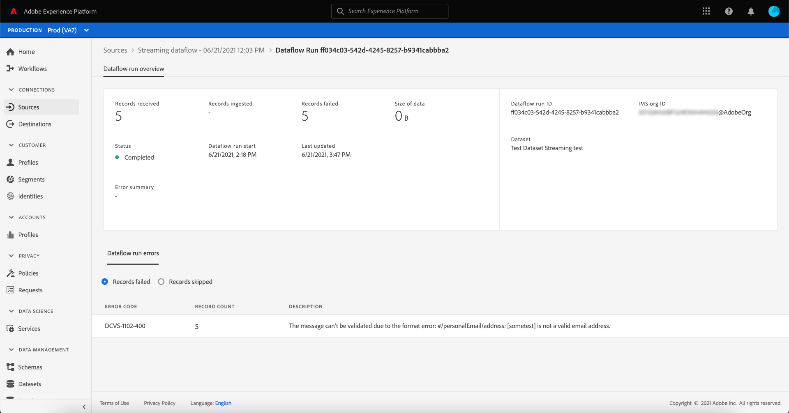

# Dataflows controleren op streamingbronnen in de gebruikersinterface

In deze zelfstudie worden de stappen beschreven voor het controleren van gegevensstromen voor streamingbronnen met de werkruimte [!UICONTROL Sources].

## Aan de slag

Deze zelfstudie vereist een goed begrip van de volgende onderdelen van Adobe Experience Platform:

* [Gegevensstroom](../../../dataflows/home.md): Dataflows zijn een voorstelling van gegevenstaken die gegevens over het Platform verplaatsen. Dataflows worden geconfigureerd op verschillende services, waardoor gegevens van bronconnectors naar doelgegevenssets, naar [!DNL Identity] en [!DNL Profile] en naar [!DNL Destinations] worden verplaatst.
   * [Dataflow wordt uitgevoerd](../../notifications.md): De looppas van Dataflow is de terugkomende geplande banen die op de frequentieconfiguratie van geselecteerde dataflows worden gebaseerd.
* [Bronnen](../../home.md): Met Experience Platform kunnen gegevens uit verschillende bronnen worden ingepakt en kunt u inkomende gegevens structureren, labelen en verbeteren met behulp van de services van Platforms.
* [Sandboxen](../../../sandboxes/home.md): Experience Platform biedt virtuele sandboxen die één Platform-instantie in afzonderlijke virtuele omgevingen verdelen om toepassingen voor digitale ervaringen te ontwikkelen en te ontwikkelen.

## Dataflows controleren voor streamingbronnen

Selecteer **[!UICONTROL Sources]** in de gebruikersinterface van het Platform in de linkernavigatiebalk voor toegang tot de werkruimte [!UICONTROL Sources]. In het scherm [!UICONTROL Catalog] worden diverse bronnen weergegeven waarmee u een account kunt maken.

Als u bestaande gegevensstromen voor streamingbronnen wilt weergeven, selecteert u **[!UICONTROL Dataflows]** in de bovenste koptekst.

De pagina [!UICONTROL Dataflows] bevat een lijst met alle bestaande gegevensstromen in uw organisatie, met inbegrip van informatie over hun brongegevens, rekeningsnaam, en dataflow looppasstatus.

Selecteer de naam van de gegevensstroom u wilt bekijken.

De volgende lijst bevat meer informatie over dataflow looppas statussen:

| Status | Beschrijving |
| ------ | ----------- |
| Voltooid | De status `Completed` wijst erop dat alle verslagen voor de overeenkomstige dataflow looppas binnen de periode van één uur proces waren. Een status `Completed` kan nog steeds fouten bevatten in dataflow-uitvoering. |
| Verwerking | De status `Processing` geeft aan dat een gegevensstroom nog niet actief is. Deze status wordt vaak direct na het maken van een nieuwe gegevensstroom aangetroffen. |
| Fout | De status `Error` geeft aan dat het activeringsproces van een gegevensstroom is onderbroken. |

Op de pagina [!UICONTROL Dataflow Activity] wordt specifieke informatie over uw streaminggegevensstroom weergegeven. De bovenste banner bevat het cumulatieve aantal records dat wordt opgenomen en records die zijn mislukt voor al uw streaming dataflow-uitvoering in het geselecteerde datumbereik.

In de onderste helft van de pagina wordt informatie weergegeven over het aantal records dat per flowuitvoering is ontvangen, opgenomen en mislukt. Elke stroomrun wordt opgenomen binnen een uurvenster.

Elke individuele dataflow run toont de volgende details:

* **[!UICONTROL Dataflow run start]**: De tijd dat dataflow begon bij.
* **[!UICONTROL Processing time]**: De hoeveelheid tijd die het voor dataflow aan proces nam.
* **[!UICONTROL Records Received]**: Het totale aantal verslagen die in dataflow van een bronschakelaar worden ontvangen.
* **[!UICONTROL Records Ingested]**: Het totale aantal records dat wordt ingevoerd in  [!DNL Data Lake].
* **[!UICONTROL Records Failed]**: Het aantal records waarin geen gegevens zijn ingevoerd  [!DNL Data Lake] als gevolg van fouten in de gegevens.
* **[!UICONTROL Ingestion Rate]**: Het succespercentage van records waarin  [!DNL Data Lake]. Deze metrische waarde is van toepassing wanneer [!UICONTROL Partial Ingestion] wordt toegelaten.
* **[!UICONTROL Status]**: Vertegenwoordigt de staat de dataflow is in: of  [!UICONTROL Completed] of  [!UICONTROL Processing]. [!UICONTROL Completed] betekent dat alle verslagen voor de overeenkomstige dataflow looppas binnen de periode van één uur werden verwerkt. [!UICONTROL Processing] betekent dat de dataflow run nog niet is voltooid.

Standaard bevatten de weergegeven gegevens de innamesnelheden van de laatste zeven dagen. Selecteer **[!UICONTROL Last 7 days]** om het tijdkader van getoonde verslagen aan te passen.

Er wordt een kalenderpop-upvenster weergegeven met opties voor alternatieve ingstijd. Selecteer **[!UICONTROL Last 30 days]** en selecteer **[!UICONTROL Apply]**.

Om de details van een specifieke dataflow looppas, met inbegrip van zijn fouten te bekijken, selecteer de begintijd van de looppas van de lijst.

De [!UICONTROL Dataflow run overview] pagina bevat extra informatie over uw dataflow, zoals zijn overeenkomstige dataflow looppas identiteitskaart, doeldataset, en IMS organisatie ID.

Een stroom die met fouten in werking wordt gesteld bevat ook het [!UICONTROL Dataflow run errors] paneel, dat de bijzondere fout toont die tot de mislukking van de looppas leidde, evenals het totale aantal verslagen die ontbrak.

## Volgende stappen

Door deze zelfstudie te volgen, hebt u met succes de [!UICONTROL Sources] werkruimte gebruikt om uw het stromen gegevensstromen te controleren en de fouten te identificeren die tot om het even welke ontbroken gegevensstromen leidden. Raadpleeg de volgende documenten voor meer informatie:

* [Overzicht van bronnen](../../home.md)
* [Overzicht van gegevensstromen](../../../dataflows/home.md)