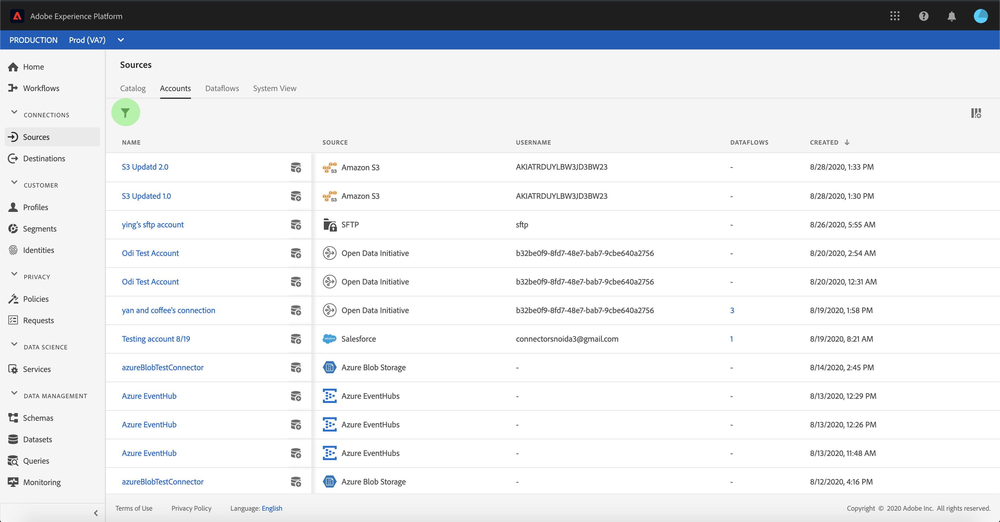

# Accounts en gegevenssetstromen bewaken

De bronschakelaars in Adobe Experience Platform verstrekken de capaciteit om extern gesourceerde gegevens op een geplande basis in te voeren. Dit leerprogramma verstrekt stappen voor het bekijken van bestaande rekeningen en datasetstromen van de werkruimte van *[!UICONTROL Bronnen]* .

## Aan de slag

Deze zelfstudie vereist een goed begrip van de volgende onderdelen van het Adobe Experience Platform:

- [XDM-systeem](../../../xdm/home.md)(Experience Data Model): Het gestandaardiseerde kader waardoor de gegevens van de klantenervaring worden [!DNL Experience Platform] georganiseerd.
   - [Basisbeginselen van de schemacompositie](../../../xdm/schema/composition.md): Leer over de basisbouwstenen van schema&#39;s XDM, met inbegrip van zeer belangrijke principes en beste praktijken in schemacompositie.
   - [Zelfstudie](../../../xdm/tutorials/create-schema-ui.md)Schema-editor: Leer hoe te om douaneschema&#39;s tot stand te brengen gebruikend de Redacteur UI van het Schema.
- [Klantprofiel](../../../profile/home.md)in realtime: Verstrekt een verenigd, real-time consumentenprofiel dat op bijeengevoegde gegevens van veelvoudige bronnen wordt gebaseerd.

## Accounts controleren

Login aan <a href="https://platform.adobe.com" target="_blank">Adobe Experience Platform</a> en selecteer dan **[!UICONTROL Bronnen]** van de linkernavigatiebar om tot de werkruimte van *[!UICONTROL Bronnen]* toegang te hebben. Het scherm van de *[!UICONTROL Catalogus]* toont een verscheidenheid van bronnen waarvoor u de stromen van de rekeningsdataset kunt tot stand brengen met. Elke bron toont het aantal bestaande rekeningen en datasetstromen verbonden aan hen.

Selecteer *[!UICONTROL Accounts]* in de bovenste koptekst om bestaande accounts weer te geven.

De pagina&#39;s *[!UICONTROL Accounts]* worden weergegeven. Op deze pagina vindt u een lijst met te bekijken accounts, waaronder informatie over de bron, gebruikersnaam, het aantal gegevenssetstromen en de aanmaakdatum.

Selecteer het pictogram linksboven om het sorteervenster te openen.

Via het sorteervenster hebt u toegang tot accounts vanuit een specifieke bron. Selecteer de bron waarmee u wilt werken en selecteer het account in de lijst aan de rechterkant.

Van de pagina van *[!UICONTROL Rekeningen]* , kunt u een lijst van bestaande datasetstromen bekijken verbonden aan de rekening u toegang had tot. Selecteer de datasetstroom u wenst om te bekijken.

Het scherm *[!UICONTROL Dataset flow activity]* wordt weergegeven. Op deze pagina wordt de snelheid van berichten weergegeven die in de vorm van een grafiek worden gebruikt.

## Gegevensstromen controleren

Datasetstromen zijn rechtstreeks vanuit de *[!UICONTROL Cataloguspagina]* toegankelijk zonder *[!UICONTROL accounts]* weer te geven. Selecteer *[!UICONTROL Datasetstromen]* in de bovenste koptekst om een lijst met bestaande gegevenssetstromen weer te geven.

Net als bij accounts kunt u de lijst met gegevenssetstromen sorteren met het sorteerpictogram linksboven. Selecteer de bron u wenst om de datasetstroom van de lijst op het recht te bekijken en te selecteren.

Het scherm *[!UICONTROL Dataset flow activity]* wordt weergegeven. Op deze pagina wordt de snelheid van berichten weergegeven die in de vorm van een grafiek worden gebruikt.

Voor meer informatie over het controleren van datasets en ingestie, verwijs naar het leerprogramma bij het [controleren van het stromen gegevens](../../../ingestion/quality/monitor-data-flows.md).

## Volgende stappen

Door dit leerprogramma te volgen, hebt u met succes bestaande rekeningen en datasetstromen van de *[!UICONTROL Bronwerkruimte]* betreden. Inkomende gegevens kunnen nu worden gebruikt door downstreamdiensten [!DNL Platform] zoals [!DNL Real-time Customer Profile] en [!DNL Data Science Workspace]. Raadpleeg de volgende documenten voor meer informatie:

- [Overzicht van het realtime klantprofiel](../../../profile/home.md)
- [Overzicht van de Data Science Workspace](../../../data-science-workspace/home.md)