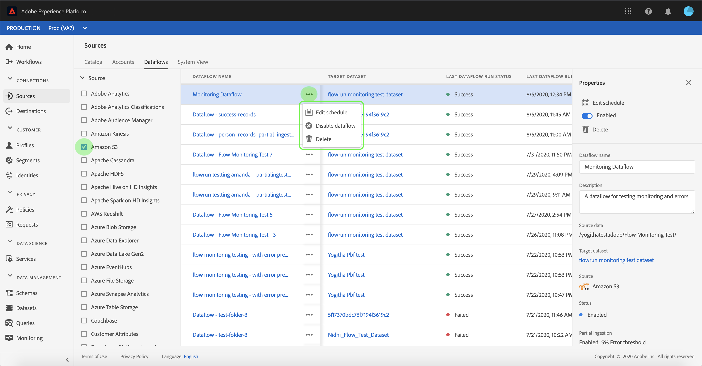

# De rekeningen en de gegevensstromen van de monitor in UI

De bronschakelaars in Adobe Experience Platform verstrekken de capaciteit om van buitenaf afkomstige gegevens op een geplande basis in te voeren. Dit leerprogramma verstrekt stappen voor het bekijken van bestaande rekeningen en gegevensstromen van de [!UICONTROL werkruimte van Bronnen] .

## Aan de slag

Deze zelfstudie vereist een goed begrip van de volgende onderdelen van Adobe Experience Platform:

- [[!DNL Experience Data Model] (XDM) Systeem](../../../xdm/home.md): Het gestandaardiseerde kader waardoor de gegevens van de klantenervaring worden [!DNL Experience Platform] georganiseerd.
   - [Basisbeginselen van de schemacompositie](../../../xdm/schema/composition.md): Leer over de basisbouwstenen van schema&#39;s XDM, met inbegrip van zeer belangrijke principes en beste praktijken in schemacompositie.
   - [Zelfstudie](../../../xdm/tutorials/create-schema-ui.md)Schema-editor: Leer hoe te om douaneschema&#39;s tot stand te brengen gebruikend de Redacteur UI van het Schema.
- [[!DNL Real-time klantprofiel]](../../../profile/home.md): Verstrekt een verenigd, real-time consumentenprofiel dat op bijeengevoegde gegevens van veelvoudige bronnen wordt gebaseerd.

## Accounts controleren

Meld u aan bij [Adobe Experience Platform](https://platform.adobe.com) en selecteer vervolgens **[!UICONTROL Bronnen]** in de linkernavigatiebalk voor toegang tot de werkruimte **[!UICONTROL Bronnen]** . In het scherm **[!UICONTROL Catalogus]** worden diverse bronnen weergegeven waarvoor u accounts en gegevensstromen kunt maken. Elke bron toont het aantal bestaande rekeningen en gegevensstromen verbonden aan hen.

Selecteer **[!UICONTROL Accounts]** in de bovenste koptekst om bestaande accounts weer te geven.

De pagina&#39;s **[!UICONTROL Accounts]** worden weergegeven. Op deze pagina vindt u een lijst met weer te geven accounts, waaronder informatie over de bron, gebruikersnaam, het aantal gegevensstromen en de aanmaakdatum.

Selecteer het trechter-pictogram linksboven om het sorteervenster te openen.

Via het sorteervenster hebt u toegang tot accounts vanuit een specifieke bron. Selecteer de bron waarmee u wilt werken en selecteer het account in de lijst aan de rechterkant.

Van de pagina van **[!UICONTROL Rekeningen]** , kunt u een lijst van bestaande gegevensstromen of doeldatasets bekijken verbonden aan de rekening u toegang had tot.

## Dataflows bewaken

Dataflows zijn rechtstreeks vanuit de **[!UICONTROL Cataloguspagina]** toegankelijk zonder **[!UICONTROL accounts]** weer te geven. Selecteer **[!UICONTROL Gegevensstromen]** van de hoogste kopbal om een lijst van bestaande gegevensstromen te bekijken.

Er wordt een lijst met bestaande gegevensstromen weergegeven. Op deze pagina vindt u een lijst met zichtbare gegevensstromen, waaronder informatie over de bron, gebruikersnaam, het aantal gegevensstromen en de status. Selecteer het trechter-pictogram linksboven om te sorteren.

Het sorteervenster wordt weergegeven. Selecteer de bron die u wilt openen in het schuifmenu en selecteer de gegevensstroom in de lijst aan de rechterkant.

De **[!UICONTROL Dataflow-activiteitenpagina]** bevat details over het aantal records dat wordt opgenomen en records die zijn mislukt, en informatie over de status van de gegevensstroom en de verwerkingstijd. Selecteer het kalenderpictogram boven de gegevensstroom om het tijdkader van uw innameregisters aan te passen.

Met de kalender kunt u de verschillende tijdframes voor opgenomen records bekijken. U kunt kiezen of u een van de twee vooraf ingestelde opties **[!UICONTROL Laatste 7 dagen]** of **[!UICONTROL Laatste 30 dagen]** selecteert. U kunt ook een aangepast tijdframe instellen met de kalender. Selecteer het gewenste tijdkader en selecteer **[!UICONTROL Toepassen]** om door te gaan.

Standaard geeft de activiteit **[!UICONTROL Dataflow]** het deelvenster **[!UICONTROL Eigenschappen]** weer dat is gekoppeld aan de dataflow. Selecteer de doorloop die in de lijst wordt uitgevoerd om de bijbehorende metagegevens weer te geven, inclusief informatie over de unieke uitvoerings-id.

Selecteer **[!UICONTROL Dataflow run start]** om het **[!UICONTROL Dataflow run overzicht]** te openen.

Het **[!UICONTROL Dataflow looppas overzicht]** toont informatie over dataflow met inbegrip van zijn meta-gegevens, **[!UICONTROL Gedeeltelijke inname]** status, en toegewezen **[!UICONTROL Fout drempel]**. De bovenste koptekst bevat ook een **[!UICONTROL foutoverzicht]**. De **[!UICONTROL foutensamenvatting]** bevat de specifieke fout op hoofdniveau die toont bij welke stap het innameproces een fout tegenkwam.

Raadpleeg de volgende tabel voor foutcodes die u kunt zien in het overzicht **** Fout.

| Foutcode | Foutbericht |
| ---------- | ----------- |
| `CONNECTOR-1001-500` | &quot;Er is een probleem opgetreden met de kopieeractiviteit.&quot; |
| `CONNECTOR-2001-500` | &quot;Er is een probleem opgetreden bij het kopiëren van de bron van het Experience Platform naar de gegevensset.&quot; |
| `CONNECTOR-3001-500` | &quot;Er is een probleem opgetreden met de stroomprovider tijdens het maken van batch met de bulkingest-API.&quot; |

De onderste helft van het scherm bevat informatie over **[!UICONTROL Dataflow-uitvoerfouten]**. Van hier kunt u ook de opgenomen bestanden weergeven, een voorbeeld bekijken en fouten downloaden of het bestandmanifest downloaden.

In de **[!UICONTROL sectie met uitvoerfouten]** in DataFlow worden de **[!UICONTROL foutcode]**, het aantal mislukte records en informatie over de fout weergegeven.

Selecteer **[!UICONTROL Voorvertoning van foutdiagnostiek]** voor meer informatie over de innamefout.

Het voorvertoningsvenster voor **[!UICONTROL foutdiagnostiek]** wordt weergegeven. In dit scherm wordt specifieke informatie weergegeven over de fout bij insluiten, zoals de **[!UICONTROL bestandsnaam]**, de **[!UICONTROL foutcode]**, de naam van de kolom waarin de fout is opgetreden en een beschrijving van de fout.

Deze sectie bevat ook een voorvertoning van de kolom die de fout bevat.

>[!IMPORTANT]
>
>Als u de voorvertoning van **[!UICONTROL foutdiagnostiek]** wilt inschakelen, moet u **[!UICONTROL Gedeeltelijke inname]** en **[!UICONTROL foutdiagnose]** activeren bij het configureren van een gegevensstroom. Als u dit doet, kan het systeem alle records scannen die tijdens de flowuitvoering worden ingevoerd.

Nadat u een voorbeeld van de fouten hebt weergegeven, kunt u **[!UICONTROL Downloaden]** vanuit het **[!UICONTROL venster Overzicht]** van de gegevensstroomuitvoering selecteren voor toegang tot volledige diagnostische foutmeldingen en het bestandmanifest downloaden. Zie de documenten over [foutdiagnose](../../../ingestion/batch-ingestion/partial.md#retrieve-errors) en het [downloaden van metagegevens](../../../ingestion/batch-ingestion/partial.md#download-metadata) voor meer informatie.

Raadpleeg de zelfstudie over het [controleren van streaming dataflows voor meer informatie over het controleren van gegevensstromen](../../../ingestion/quality/monitor-data-flows.md)en het opnemen van gegevens.

## Volgende stappen

Door dit leerprogramma te volgen, hebt u met succes bestaande rekeningen en gegevensstromen van de **[!UICONTROL werkruimte van Bronnen]** betreden. Inkomende gegevens kunnen nu worden gebruikt door downstreamdiensten [!DNL Platform] zoals [!DNL Real-time Customer Profile] en [!DNL Data Science Workspace]. Raadpleeg de volgende documenten voor meer informatie:

- [Overzicht van het realtime klantprofiel](../../../profile/home.md)
- [Overzicht van de Data Science Workspace](../../../data-science-workspace/home.md)
