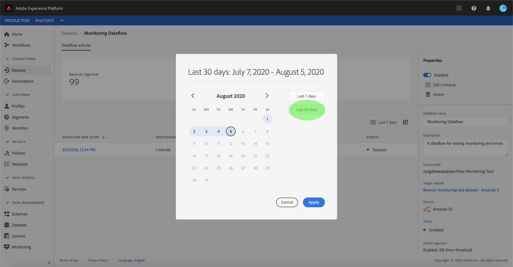
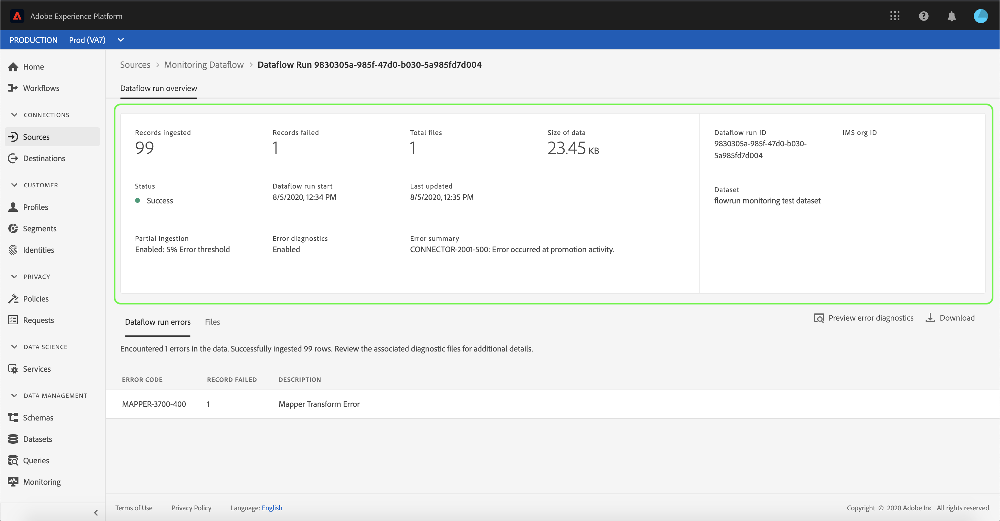

# Gegevens controleren in de gebruikersinterface

De bronschakelaars in Adobe Experience Platform verstrekken de capaciteit om van buitenaf afkomstige gegevens op een geplande basis in te voeren. Dit leerprogramma verstrekt stappen voor het bekijken van bestaande gegevensstromen van de [!UICONTROL werkruimte van Bronnen] .

## Aan de slag

Deze zelfstudie vereist een goed begrip van de volgende onderdelen van Adobe Experience Platform:

- [[!DNL Experience Data Model (XDM)] Systeem](../../../xdm/home.md): Het gestandaardiseerde kader waardoor de gegevens van de klantenervaring worden [!DNL Experience Platform] georganiseerd.
   - [Basisbeginselen van de schemacompositie](../../../xdm/schema/composition.md): Leer over de basisbouwstenen van schema&#39;s XDM, met inbegrip van zeer belangrijke principes en beste praktijken in schemacompositie.
   - [Zelfstudie](../../../xdm/tutorials/create-schema-ui.md)Schema-editor: Leer hoe te om douaneschema&#39;s tot stand te brengen gebruikend de Redacteur UI van het Schema.
- [[!DNL Real-time Customer Profile]](../../../profile/home.md): Verstrekt een verenigd, real-time consumentenprofiel dat op bijeengevoegde gegevens van veelvoudige bronnen wordt gebaseerd.

## Dataflows bewaken

Login aan Login aan Login aan het [Experience Platform UI](https://platform.adobe.com) en selecteer dan **[!UICONTROL Bronnen]** van de linkernavigatie om tot de [!UICONTROL Bronwerkruimte] toegang te hebben. Selecteer **[!UICONTROL Gegevensstromen]** van de hoogste kopbal om bestaande gegevensstromen te bekijken.

Er wordt een lijst met bestaande gegevensstromen weergegeven. Op deze pagina vindt u een lijst met zichtbare gegevensstromen, waaronder informatie over de bron, gebruikersnaam, het aantal gegevensstromen en de status.

Zie de volgende tabel voor meer informatie over statussen:

| Status | Beschrijving |
| ------ | ----------- |
| Ingeschakeld | De `Enabled` status wijst erop dat een dataflow actief is en gegevens volgens het programma opneemt het werd verstrekt. |
| Uitgeschakeld | De `Disabled` status geeft aan dat een gegevensstroom inactief is en geen gegevens opneemt. |
| Verwerking | De `Processing` status geeft aan dat een gegevensstroom nog niet actief is. Deze status wordt vaak direct na het maken van een nieuwe gegevensstroom aangetroffen. |
| Fout | De `Error` status geeft aan dat het activeringsproces van een gegevensstroom is onderbroken. |

Selecteer het trechter-pictogram linksboven om te sorteren.

Het sorteervenster wordt weergegeven. Selecteer de bron die u wilt openen in het schuifmenu en selecteer de gegevensstroom in de lijst aan de rechterkant. U kunt ook de ellipsen (`...`) knoop selecteren om meer beschikbare opties voor uw geselecteerde gegevensstroom te verhogen.

De **[!UICONTROL Dataflow-activiteitenpagina]** bevat details over het aantal records dat wordt opgenomen en records die zijn mislukt, en informatie over de status van de gegevensstroom en de verwerkingstijd. Selecteer het kalenderpictogram boven de gegevensstroom om het tijdkader van uw innameregisters aan te passen.

Met de kalender kunt u de verschillende tijdframes voor opgenomen records bekijken. U kunt kiezen tussen een van de twee vooraf ingestelde opties &quot;[!UICONTROL Laatste 7 dagen]&quot; of &quot;[!UICONTROL Laatste 30 dagen]&quot;. U kunt ook een aangepast tijdframe instellen met de kalender. Selecteer het gewenste tijdkader en selecteer **[!UICONTROL Toepassen]** om door te gaan.

Standaard geeft de activiteit **[!UICONTROL Dataflow]** het deelvenster **[!UICONTROL Eigenschappen]** weer dat is gekoppeld aan de dataflow. Selecteer de doorloop die in de lijst wordt uitgevoerd om de bijbehorende metagegevens weer te geven, inclusief informatie over de unieke uitvoerings-id.

Selecteer **[!UICONTROL Dataflow run start]** om het **[!UICONTROL Dataflow run overzicht]** te openen.

Het **[!UICONTROL Dataflow looppas overzicht]** toont informatie over de dataflow met inbegrip van zijn meta-gegevens, gedeeltelijke innamestatus, en toegewezen foutendrempel. De bovenste koptekst bevat ook een foutoverzicht. De **[!UICONTROL foutensamenvatting]** bevat de specifieke fout op hoofdniveau die toont bij welke stap het innameproces een fout tegenkwam.

Raadpleeg de volgende tabel voor fouten die u kunt zien in het overzicht **** Fout.

| Fout | Beschrijving |
| ---------- | ----------- |
| `CONNECTOR-1001-500` | Er is een fout opgetreden tijdens het kopiëren van gegevens uit een bron. |
| `CONNECTOR-2001-500` | Er is een fout opgetreden tijdens het verwerken van gekopieerde gegevens naar [!DNL Platform]. Deze fout kan betrekking hebben op parseren, valideren of transformeren. |

De onderste helft van het scherm bevat informatie over **[!UICONTROL Dataflow-uitvoerfouten]**. Van hier kunt u ook de opgenomen bestanden weergeven, een voorbeeld bekijken en fouten downloaden of het bestandmanifest downloaden.

In de **[!UICONTROL sectie met uitvoerfouten]** in DataFlow worden de foutcode, het aantal mislukte records en informatie over de fout weergegeven.

Selecteer **[!UICONTROL Voorvertoning van foutdiagnostiek]** voor meer informatie over de innamefout.

Het voorvertoningsvenster voor **[!UICONTROL foutdiagnostiek]** wordt weergegeven. In dit scherm wordt specifieke informatie weergegeven over de fout bij het opnemen, zoals de bestandsnaam, foutcode, de naam van de kolom waarin de fout is opgetreden en een beschrijving van de fout.

Deze sectie bevat ook een voorvertoning van de kolom die de fout bevat.

>[!IMPORTANT]
>
>Als u de voorvertoning van **[!UICONTROL foutdiagnostiek]** wilt inschakelen, moet u **[!UICONTROL Gedeeltelijke inname]** en **[!UICONTROL foutdiagnose]** activeren bij het configureren van een gegevensstroom. Als u dit doet, kan het systeem alle records scannen die tijdens de flowuitvoering worden ingevoerd.

Nadat u een voorbeeld van de fouten hebt weergegeven, kunt u **[!UICONTROL Downloaden]** vanuit het **[!UICONTROL venster Overzicht]** van de gegevensstroomuitvoering selecteren voor toegang tot volledige diagnostische foutmeldingen en het bestandmanifest downloaden. Zie de documenten over [foutdiagnose](../../../ingestion/batch-ingestion/partial.md#retrieve-errors) en het [downloaden van metagegevens](../../../ingestion/batch-ingestion/partial.md#download-metadata) voor meer informatie.

Raadpleeg de zelfstudie over het [controleren van streaming dataflows voor meer informatie over het controleren van gegevensstromen](../../../ingestion/quality/monitor-data-flows.md)en het opnemen van gegevens.

## Volgende stappen

Door dit leerprogramma te volgen, hebt u met succes bestaande rekeningen en gegevensstromen van de **[!UICONTROL werkruimte van Bronnen]** betreden. Inkomende gegevens kunnen nu worden gebruikt door downstreamdiensten [!DNL Platform] zoals [!DNL Real-time Customer Profile] en [!DNL Data Science Workspace]. Raadpleeg de volgende documenten voor meer informatie:

- [Overzicht van het realtime klantprofiel](../../../profile/home.md)
- [Overzicht van de Data Science Workspace](../../../data-science-workspace/home.md)
