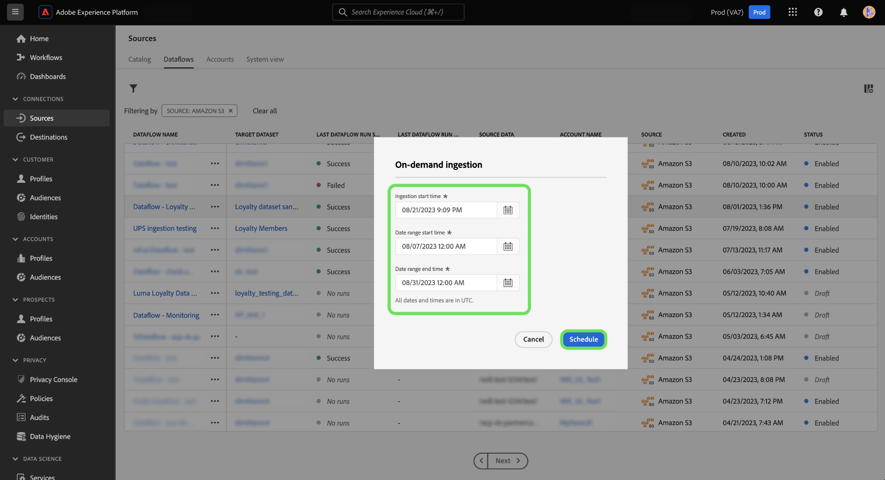

# Op bestelling opnemen voor brongegevens in de gebruikersinterface

Met de werkruimte Bronnen in de Adobe Experience Platform-gebruikersinterface kunt u op aanvraag insluiten gebruiken om een lusrun-iteratie van een bestaande gegevensstroom te activeren.

Dit document biedt u stappen over hoe te om dataflows op bestelling voor bronnen tot stand te brengen, evenals hoe te om stroomlooppas opnieuw te proberen die zijn verwerkt of ontbroken.

>[!BEGINSHADEBOX]

**Wat is een flow run?**

De looppas van de stroom vertegenwoordigt een geval van dataflow uitvoering. Bijvoorbeeld, als een dataflow om 09:00 AM, 10:00 AM, en 11:00 AM gepland is te lopen, dan zou u drie instanties van een stroomlooppas hebben. De looppas van de stroom is specifiek voor uw bepaalde organisatie.

>[!ENDSHADEBOX]

## Aan de slag

Voor dit document is een goed begrip van de volgende onderdelen van het Experience Platform vereist:

* [Bronnen](../../home.md): Met Experience Platform kunnen gegevens uit verschillende bronnen worden ingepakt en kunt u inkomende gegevens structureren, labelen en verbeteren met behulp van de platformservices.
* [Gegevensstromen](../../../dataflows/home.md): Een dataflow is een weergave van gegevenstaken die gegevens over het hele platform verplaatsen. Dataflows worden gevormd over de verschillende diensten, die gegevens van bronschakelaars aan doeldatasets, aan de Dienst van de Identiteit en het Profiel van de Klant in real time, en aan Doelen helpen verplaatsen.
* [Sandboxen](../../../sandboxes/home.md): Experience Platform biedt virtuele sandboxen die één platforminstantie in afzonderlijke virtuele omgevingen verdelen om toepassingen voor digitale ervaringen te ontwikkelen en te ontwikkelen.

## Een gegevensstroom op aanvraag maken {#create-a-dataflow-on-demand}

Ga naar de *[!UICONTROL Dataflows]* tabblad van de werkruimte Bronnen. Van hier, vind dataflow die u op bestelling wilt lopen, en selecteer dan de ellipsen (**`...`**) naast de naam van de gegevensstroom.

Selecteer vervolgens **[!UICONTROL Run on-demand]** in het vervolgkeuzemenu dat wordt weergegeven.

Vorm het programma van uw opname op bestelling. Selecteer de **[!UICONTROL Ingestion start time]** de **[!UICONTROL Date range start time]** en de **[!UICONTROL Date range end time]**.

| Configuratie plannen | Beschrijving |
| --- | --- |
| [!UICONTROL Ingestion start time] | De geplande begintijd in UTC van wanneer de gegevensstroom op bestelling zal beginnen. |
| [!UICONTROL Date range start time] | De begindatum en -tijd vanaf wanneer gegevens worden opgehaald. |
| [!UICONTROL Date range end time] | De einddatum en -tijd vanaf wanneer gegevens worden verzameld tot. |

Selecteren **[!UICONTROL Schedule]** en laat u enkele ogenblikken voor het activeren van uw gegevensstroom op aanvraag.

Selecteer de naam van uw gegevensstroom om uw gegevensstroomactiviteit te bekijken. Hier ziet u een lijst van uw dataflow looppas die zijn verwerkt. Selecteer een gegevensstroomuitvoering en selecteer vervolgens **[!UICONTROL Retry]** van de juiste spoorstaaf om opname voor een geselecteerde dataflow loopherhaling opnieuw te proberen.

Selecteren **[!UICONTROL Scheduled]** om een lijst van dataflow looppas te zien die voor toekomstige opname gepland is.

## Volgende stappen

Door dit document te lezen, hebt u geleerd hoe te om stroomlooppas op bestelling voor bestaande brondataflows tot stand te brengen. Lees voor meer informatie over bronnen de [overzicht van bronnen](../../home.md)