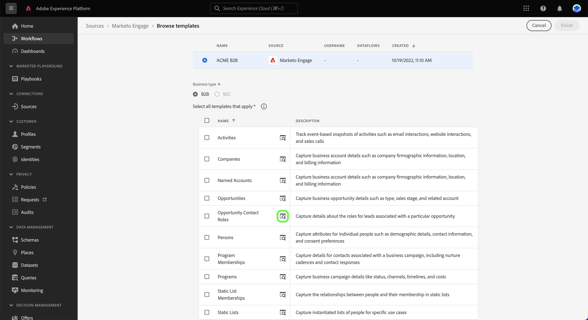
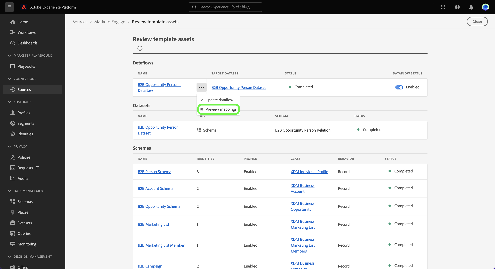

# (Alfa) Maak een gegevensstroom voor bronnen met behulp van sjablonen in de gebruikersinterface

>[!IMPORTANT]
>
>Sjablonen bevinden zich in Alfa en worden momenteel alleen ondersteund door de [[!DNL Marketo Engage] bron](../../connectors/adobe-applications/marketo/marketo.md). De documentatie en functies kunnen worden gewijzigd.

Adobe Experience Platform biedt vooraf geconfigureerde sjablonen die u kunt gebruiken om uw gegevensinvoer te versnellen. De malplaatjes omvatten auto-geproduceerde activa zoals schema&#39;s, datasets, identiteiten, toewijzingsregels, identiteitsnamespaces, en dataflows die u kunt gebruiken wanneer het brengen van gegevens van een bron aan Experience Platform.

Met sjablonen kunt u:

* Verminder tijd-aan-waarde van opname door versnelling van templatized activa verwezenlijking.
* Minimaliseer fouten die tijdens het proces van handmatige gegevensinvoer kunnen voorkomen.
* Werk automatisch gegenereerde elementen op elk gewenst moment bij om deze aan te passen aan uw gebruiksscenario&#39;s.

De volgende zelfstudie biedt stappen voor het gebruik van sjablonen in de gebruikersinterface van het Platform met behulp van de [[!DNL Marketo Engage] bron](../../connectors/adobe-applications/marketo/marketo.md).

## Aan de slag

Deze zelfstudie vereist een goed begrip van de volgende onderdelen van het Experience Platform:

* [Bronnen](../../home.md): Met Experience Platform kunnen gegevens uit verschillende bronnen worden ingepakt en kunt u inkomende gegevens structureren, labelen en verbeteren met behulp van de services van Platforms.
* [[!DNL Experience Data Model (XDM)] Systeem](../../../xdm/home.md): Het gestandaardiseerde kader waardoor het Experience Platform gegevens van de klantenervaring organiseert.
* [Sandboxen](../../../sandboxes/home.md): Experience Platform biedt virtuele sandboxen die één Platform-instantie in afzonderlijke virtuele omgevingen verdelen om toepassingen voor digitale ervaringen te ontwikkelen en te ontwikkelen.

## Sjablonen gebruiken in de gebruikersinterface van het Platform {#use-templates-in-the-platform-ui}

>[!CONTEXTUALHELP]
>id="platform_sources_templates_accounttype"
>title="Bedrijfstype selecteren"
>abstract="Selecteer het juiste bedrijfstype voor uw gebruiksscenario. De toegang hangt af van uw Real-time Customer Data Platform-abonnementaccount."
>additional-url="https://experienceleague.adobe.com/docs/experience-platform/rtcdp/overview.html?lang=nl" text="Real-Time CDP-overzicht"

Selecteer in de gebruikersinterface van het Platform de optie **[!UICONTROL Sources]** van de linkernavigatie om tot [!UICONTROL Sources] werkruimte. De [!UICONTROL Catalog] op het scherm worden diverse bronnen weergegeven die kunnen worden gebruikt om een account te maken.

U kunt de juiste categorie selecteren in de catalogus aan de linkerkant van het scherm. U kunt ook de specifieke bron vinden waarmee u wilt werken met de zoekbalk.

Onder de [!UICONTROL Adobe applications] categorie, selecteert u **[!UICONTROL Marketo Engage]** en selecteer vervolgens **[!UICONTROL Add data]**.

Er verschijnt een pop-upvenster met de optie om sjablonen te doorbladeren of bestaande schema&#39;s en gegevenssets te gebruiken.

* **Door sjablonen bladeren**: Bronsjablonen maken automatisch schema&#39;s, identiteiten, gegevenssets en gegevensstromen met toewijzingsregels voor u. U kunt deze elementen naar wens aanpassen.
* **Mijn bestaande middelen gebruiken**: Maak een overzicht van uw gegevens met behulp van bestaande gegevenssets en schema&#39;s die u hebt gemaakt. U kunt nieuwe datasets en schema&#39;s ook tot stand brengen indien nodig.

Als u automatisch gegenereerde elementen wilt gebruiken, selecteert u **[!UICONTROL Browse templates]** en selecteer vervolgens **[!UICONTROL Select]**.

### Verificatie

De verificatiestap wordt weergegeven en u wordt gevraagd een nieuw account te maken of een bestaand account te gebruiken.

#### Bestaande account

Als u een bestaande account wilt gebruiken, selecteert u [!UICONTROL Existing account] en selecteer vervolgens de account die u wilt gebruiken in de lijst die wordt weergegeven.

#### Nieuwe account

Als u een nieuwe account wilt maken, selecteert u **[!UICONTROL New account]** en geef vervolgens uw bronverbindingsgegevens en accountverificatiegegevens op. Als u klaar bent, selecteert u **[!UICONTROL Connect to source]** en laat de nieuwe verbinding enige tijd tot stand brengen.

### Sjablonen selecteren

Nadat u uw account hebt geverifieerd en geselecteerd, wordt een lijst met sjablonen weergegeven. Selecteer het voorvertoningspictogram naast een sjabloonnaam om een voorvertoning weer te geven van voorbeeldgegevens uit de sjabloon.

Het voorvertoningsvenster wordt weergegeven, zodat u de voorbeeldgegevens van uw sjabloon kunt bekijken en inspecteren. Als u klaar bent, selecteert u **[!UICONTROL Got it]**.

Selecteer vervolgens in de lijst de sjabloon die u wilt gebruiken. U kunt meerdere sjablonen selecteren en meerdere gegevensstromen tegelijk maken. Een sjabloon kan echter slechts eenmaal per account worden gebruikt. Als u de sjablonen hebt geselecteerd, selecteert u **[!UICONTROL Finish]** en laat u even de elementen genereren.

Als u één of gedeeltelijke punten van de lijst van beschikbare malplaatjes selecteert, zullen alle schema&#39;s B2B en identiteitsnamespaces nog worden geproduceerd om ervoor te zorgen dat de verhoudingen B2B over schema&#39;s correct worden gevormd.

>[!NOTE]
>
>Sjablonen die al zijn gebruikt, worden uitgeschakeld in de selectie.

### Elementen bekijken {#review-assets}

>[!CONTEXTUALHELP]
>id="platform_sources_templates_review"
>title="De automatisch gegenereerde elementen bekijken"
>abstract="Het kan tot vijf minuten duren om alle activa te produceren. Als u ervoor kiest om de pagina te verlaten, ontvangt u een melding om terug te keren zodra de elementen zijn voltooid. U kunt de elementen bekijken zodra ze zijn gegenereerd en op elk gewenst moment aanvullende configuraties aan de gegevensstroom toevoegen."

De [!UICONTROL Review template assets] op de pagina worden de elementen weergegeven die automatisch zijn gegenereerd als onderdeel van de sjabloon. In deze pagina, kunt u de auto-geproduceerde schema&#39;s, datasets, identiteitsnamespaces, en dataflows bekijken verbonden aan uw bronverbinding. Het kan tot vijf minuten duren om alle activa te produceren. Als u ervoor kiest om de pagina te verlaten, ontvangt u een melding om terug te keren zodra de elementen zijn voltooid. U kunt de elementen bekijken zodra ze zijn gegenereerd en op elk gewenst moment aanvullende configuraties aan de gegevensstroom toevoegen.

Automatisch gegenereerde gegevensstromen worden standaard ingeschakeld. De ovalen selecteren (`...`) naast de naam van de gegevensstroom en selecteer vervolgens **[!UICONTROL Preview mappings]** om de toewijzingssets te zien die voor uw gegevensstroom zijn gemaakt.

Er wordt een voorvertoningspagina weergegeven waarmee u de toewijzingsrelatie tussen de brongegevensvelden en de doelschemavelden kunt controleren. Zodra u de afbeeldingen van uw gegevensstroom hebt bekeken. Selecteer **[!UICONTROL Got it.]**

U kunt uw gegevensstromen op elk ogenblik na uitvoering bijwerken. De ovalen selecteren (`...`) naast de naam van de gegevensstroom en selecteer vervolgens **[!UICONTROL Update dataflow]**. U wordt genomen aan de pagina van het bronwerkschema waar u uw gegevens kunt bijwerken, met inbegrip van montages voor gedeeltelijke opname, foutendiagnostiek, en waakzame berichten, evenals de afbeelding van uw gegevensstroom.

U kunt de mening van de schemaredacteur gebruiken om updates aan uw auto-geproduceerd schema te maken. Bezoek de handleiding op [het gebruiken van de schemaredacteur](../../../xdm/tutorials/create-schema-ui.md) voor meer informatie .

## Volgende stappen

Door dit leerprogramma te volgen, hebt u nu dataflows, evenals activa zoals schema&#39;s, datasets, en identiteitsnamespaces gebruikend malplaatjes gecreeerd. Voor algemene informatie over bronnen gaat u naar de [overzicht van bronnen](../../home.md).

## Aanhangsel

In de volgende sectie vindt u aanvullende informatie over sjablonen.

### Het venster Meldingen gebruiken om terug te keren naar de overzichtspagina

Sjablonen worden ondersteund door Adobe Experience Platform-waarschuwingen en u kunt het deelvenster Meldingen gebruiken om updates over de status van uw middelen te ontvangen en ook om terug te gaan naar de overzichtspagina.

Selecteer het berichtpictogram de hoogste kopbal van Platform UI en selecteer dan de statusalarm om de activa te zien die u wilt herzien.

