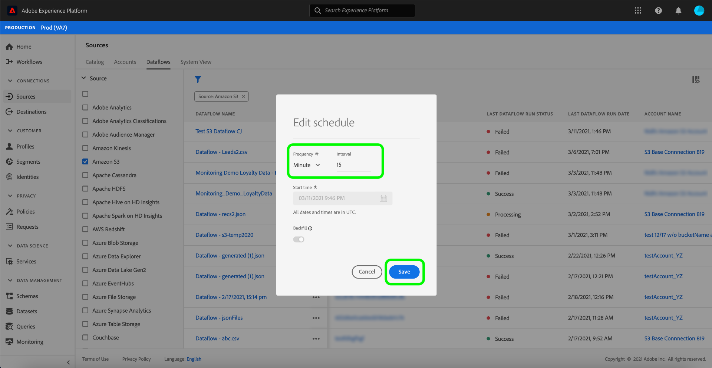

# Dataflows bijwerken in de gebruikersinterface

In deze zelfstudie worden de stappen beschreven voor het bijwerken van een schema voor gegevensstroom, inclusief de innamefrequentie en de intervalsnelheid, met behulp van de [!UICONTROL Sources]-werkruimte.

## Aan de slag

Deze zelfstudie vereist een goed begrip van de volgende onderdelen van Adobe Experience Platform:

- [Bronnen](../../home.md): Met Experience Platform kunnen gegevens uit verschillende bronnen worden ingepakt en kunt u inkomende gegevens structureren, labelen en verbeteren met behulp van de services van Platforms.
- [Sandboxen](../../../sandboxes/home.md): Experience Platform biedt virtuele sandboxen die één Platform-instantie in afzonderlijke virtuele omgevingen verdelen om toepassingen voor digitale ervaringen te ontwikkelen en te ontwikkelen.

## Tijdschema bewerken

Selecteer **[!UICONTROL Sources]** in de gebruikersinterface van het Platform in de linkernavigatie om de werkruimte [!UICONTROL Sources] te openen. Selecteer **[!UICONTROL Dataflows]** van de hoogste kopbal om een lijst van bestaande gegevensstromen te bekijken.

De pagina [!UICONTROL Dataflows] bevat een lijst met alle bestaande gegevensstromen, met inbegrip van informatie over hun looppasstatus, laatste looppasdatum, en rekeningsnaam.

Selecteer het filterpictogram  linksboven om het deelvenster Sorteren te starten.

Het deelvenster Sorteren bevat een lijst met alle beschikbare bronnen. U kunt meer dan één bron in de lijst selecteren om tot een gefilterde selectie van gegevensstromen toegang te hebben die tot verschillende bronnen behoren.

Selecteer de bron waarmee u wilt werken om een lijst met de bestaande gegevensstromen te zien. Nadat u de gegevensstroom hebt geïdentificeerd die u opnieuw wilt plannen, selecteert u de ovalen (`...`) naast de accountnaam.

Er wordt een vervolgkeuzemenu weergegeven waarin u de opties **[!UICONTROL Edit schedule]**, **[!UICONTROL Disable dataflow]**, **[!UICONTROL View in monitoring]** en **[!UICONTROL Delete]** kunt kiezen. Selecteer **[!UICONTROL Edit schedule]** in het menu.

Het **[!UICONTROL Edit schedule]** dialoogvakje voorziet u van opties om de de innamefrequentie en het intervaltarief van uw gegevensstroom bij te werken. Nadat u de bijgewerkte frequentie- en intervalwaarden hebt ingesteld, selecteert u **[!UICONTROL Save]**.

>[!NOTE]
>
>U kunt geen dataflow opnieuw plannen die voor eenmalig opnemen was gepland.

| Planning | Beschrijving |
| ---------- | ----------- |
| Frequentie | De frequentie waarmee de gegevensstroom gegevens zal verzamelen. Acceptabele waarden voor het bewerken van het frequentieschema voor een reeds bestaand gegevensstroomschema zijn: `minute`, `hour`, `day` of `week`. |
| Interval | Het interval geeft de periode aan tussen twee opeenvolgende flowrun. De waarde van het interval moet een geheel getal anders dan nul zijn en moet groter dan of gelijk aan `15` zijn. |

Na enkele ogenblikken verschijnt onder aan het scherm een bevestigingsvak om te bevestigen dat de update is gelukt.

## Volgende stappen

Door deze zelfstudie te volgen, hebt u met succes de [!UICONTROL Sources] werkruimte gebruikt om het innameschema van een dataflow bij te werken.

Voor stappen over hoe te om deze verrichtingen programmatically uit te voeren gebruikend [!DNL Flow Service] API, gelieve te verwijzen naar de zelfstudie over [het bijwerken dataflows gebruikend de Dienst API van de Stroom](../../tutorials/api/update-dataflows.md).