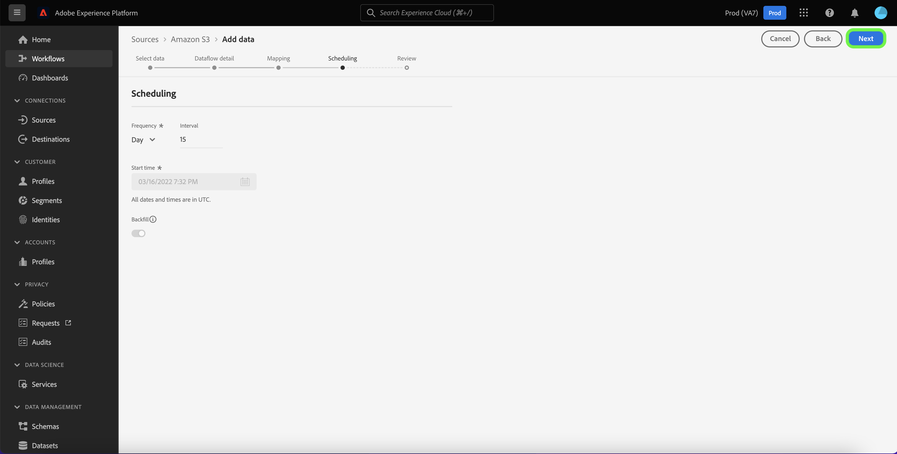

# Dataflows bijwerken in de gebruikersinterface

Deze zelfstudie biedt u stappen voor het bijwerken van een bestaande gegevensstroom, inclusief het schema en de toewijzing ervan, aan de hand van de werkruimte voor bronnen.

## Aan de slag

Deze zelfstudie vereist een goed begrip van de volgende onderdelen van Adobe Experience Platform:

* [Bronnen](../../home.md): Met Experience Platform kunnen gegevens uit verschillende bronnen worden ingepakt en kunt u inkomende gegevens structureren, labelen en verbeteren met behulp van de services van Platforms.
* [Sandboxen](../../../sandboxes/home.md): Experience Platform biedt virtuele sandboxen die één Platform-instantie in afzonderlijke virtuele omgevingen verdelen om toepassingen voor digitale ervaringen te ontwikkelen en te ontwikkelen.

## Gegevensstromen bijwerken

Selecteer in de gebruikersinterface van het Platform de optie **[!UICONTROL Sources]** van de linkernavigatie om tot [!UICONTROL Sources] werkruimte. Selecteren **[!UICONTROL Dataflows]** in de bovenste koptekst om een lijst met bestaande gegevensstromen weer te geven.

De [!UICONTROL Dataflows] De pagina bevat een lijst van alle bestaande gegevensstromen, met inbegrip van informatie over hun overeenkomstige doeldataset, bron, en rekeningsnaam.

Selecteer het filterpictogram om door de lijst te sorteren  bovenaan links om het deelvenster Sorteren te gebruiken.

Het deelvenster Sorteren bevat een lijst met alle beschikbare bronnen. U kunt meer dan één bron in de lijst selecteren om tot een gefilterde selectie van gegevensstromen toegang te hebben die tot verschillende bronnen behoren.

Selecteer de bron waarmee u wilt werken om een lijst met de bestaande gegevensstromen te zien. Nadat u de gegevensstroom hebt geïdentificeerd die u wilt bijwerken, selecteert u de ellipsen (`...`) naast de naam van de gegevensstroom.

Er wordt een vervolgkeuzemenu weergegeven waarin u opties kunt opgeven om de gegevensstroom die u hebt geselecteerd bij te werken. Van hier, kunt u verkiezen om de de kaartreeksen van een dataflow en innameprogramma bij te werken. U kunt ook opties selecteren om de gegevensstroom te inspecteren in het controledashboard, u te abonneren op waarschuwingen en de gegevensstroom uit te schakelen of te verwijderen.

Selecteer **[!UICONTROL Update dataflow]**.

### Gegevens toevoegen

De [!UICONTROL Add data] wordt weergegeven. Selecteer de juiste gegevensindeling om de inhoud van de geselecteerde gegevens te bekijken en selecteer vervolgens **[!UICONTROL Next]** om verder te gaan.

### Gegevens

In de [!UICONTROL Dataflow detail] pagina, kunt u een bijgewerkte naam en een beschrijving voor uw gegevensstroom verstrekken evenals de de foutendrempel van uw gegevensstroom aanpassen. Tijdens deze stap, kunt u montages voor uw waakzaam abonnement ook vormen of wijzigen.

Als u de bijgewerkte waarden hebt opgegeven, selecteert u **[!UICONTROL Next]**.

### Toewijzing

>[!NOTE]
>
>De bewerkingstoewijzingsfunctie wordt momenteel niet ondersteund voor de volgende bronnen: Adobe Analytics, Adobe Audience Manager, HTTP API en [!DNL Marketo Engage].

De [!UICONTROL Mapping] biedt u een interface waarin u toewijzingssets kunt toevoegen en verwijderen die aan uw gegevensstroom zijn gekoppeld.

De toewijzingsinterface toont de bestaande de afbeeldingsreeks van uw gegevensstroom en niet een nieuwe geadviseerde toewijzingsreeks. De updates van de toewijzing worden slechts toegepast op dataflow looppas die in de toekomst wordt gepland. Voor een dataflow die was gepland voor eenmalige invoer, kunnen de sets met toewijzingen niet worden bijgewerkt.

Van hier, kunt u de toewijzingsinterface gebruiken om de afbeeldingsreeksen te wijzigen die op uw gegevensstroom worden toegepast. Voor uitvoerige stappen op hoe te om de kaartinterface te gebruiken, zie [UI-hulplijn voor gegevenprep](../../../data-prep/ui/mapping.md) voor meer informatie .

### Planning

De [!UICONTROL Scheduling] wordt weergegeven, zodat u het schema voor inname van uw gegevensstroom kunt bijwerken en de geselecteerde brongegevens automatisch kunt innemen met de bijgewerkte toewijzingen.

>[!NOTE]
>
>U kunt geen dataflow opnieuw plannen die voor eenmalig opnemen was gepland.

U kunt ook het schema voor inname van uw gegevensstroom bijwerken met behulp van de optie voor inlineupdate die is opgegeven op de pagina met gegevensstromen.

Selecteer op de pagina met gegevensstromen de ovalen (`...`) naast de naam van de gegevensstroom en selecteer vervolgens **[!UICONTROL Edit schedule]** in het vervolgkeuzemenu dat wordt weergegeven.

De **[!UICONTROL Edit schedule]** bevat opties waarmee u de invoerfrequentie en de intervalsnelheid van uw gegevensstroom kunt bijwerken. Als u de bijgewerkte frequentie- en intervalwaarden hebt ingesteld, selecteert u **[!UICONTROL Save]**.

### Controleren

De **[!UICONTROL Review]** wordt weergegeven, zodat u uw gegevensstroom kunt controleren voordat deze wordt bijgewerkt.

Nadat u de gegevensstroom hebt gecontroleerd, selecteert u **[!UICONTROL Finish]** en laat enige tijd voor de gegevensstroom met de nieuwe kaartreeksen toe worden gecreeerd.

## Volgende stappen

Door deze zelfstudie te volgen, hebt u de opdracht [!UICONTROL Sources] werkruimte om het innameschema en toestelsets van uw gegevensstroom bij te werken.

Voor stappen op hoe te om deze verrichtingen programmatically uit te voeren gebruikend [!DNL Flow Service] API, raadpleeg de zelfstudie op [het bijwerken van gegevensstromen gebruikend de Dienst API van de Stroom](../../tutorials/api/update-dataflows.md).
