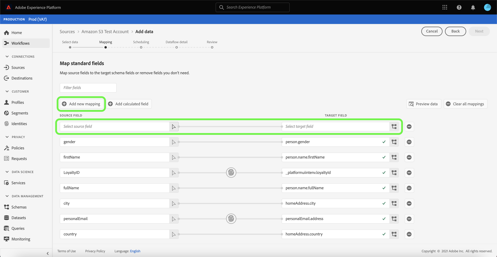

# Dataflows bijwerken in de gebruikersinterface

Deze zelfstudie biedt u stappen voor het bijwerken van een bestaande gegevensstroom voor bronnen, waaronder informatie over het bewerken van een schema en toewijzing voor gegevensstroom met de werkruimte [!UICONTROL Sources].

## Aan de slag

Deze zelfstudie vereist een goed begrip van de volgende onderdelen van Adobe Experience Platform:

- [Bronnen](../../home.md): Met Experience Platform kunnen gegevens uit verschillende bronnen worden ingepakt en kunt u inkomende gegevens structureren, labelen en verbeteren met behulp van de services van Platforms.
- [Sandboxen](../../../sandboxes/home.md): Experience Platform biedt virtuele sandboxen die één Platform-instantie in afzonderlijke virtuele omgevingen verdelen om toepassingen voor digitale ervaringen te ontwikkelen en te ontwikkelen.

## Toewijzing bewerken

>[!NOTE]
>
>De bewerkingstoewijzingsfunctie wordt momenteel niet ondersteund voor de volgende bronnen: Adobe Analytics, Adobe Audience Manager, HTTP API en [!DNL Marketo Engage].

Selecteer **[!UICONTROL Sources]** in de gebruikersinterface van het Platform in de linkernavigatie om de werkruimte [!UICONTROL Sources] te openen. Selecteer **[!UICONTROL Dataflows]** van de hoogste kopbal om een lijst van bestaande gegevensstromen te bekijken.

De pagina [!UICONTROL Dataflows] bevat een lijst met alle bestaande gegevensstromen, met inbegrip van informatie over hun looppasstatus, laatste looppasdatum, en rekeningsnaam.

Selecteer het filterpictogram  linksboven om het deelvenster Sorteren te starten.

Het deelvenster Sorteren bevat een lijst met alle beschikbare bronnen. U kunt meer dan één bron in de lijst selecteren om tot een gefilterde selectie van gegevensstromen toegang te hebben die tot verschillende bronnen behoren.

Selecteer de bron waarmee u wilt werken om een lijst met de bestaande gegevensstromen te zien. Nadat u de gegevensstroom hebt geïdentificeerd die u wilt bijwerken, selecteert u de ovalen (`...`) naast de accountnaam.

Er wordt een vervolgkeuzemenu weergegeven waarin u opties kunt opgeven om de gegevensstroom die u hebt geselecteerd bij te werken. Van hier, kunt u verkiezen om de de kaartreeksen van een dataflow en innameprogramma bij te werken. U kunt ook opties selecteren om de gegevensstroom te inspecteren in het controledashboard, evenals de gegevensstroom onbruikbaar te maken of te schrappen.

Selecteer **[!UICONTROL Edit source]** om de toewijzing bij te werken.

De stap [!UICONTROL Add data] wordt weergegeven. Selecteer de juiste gegevensindeling om de inhoud van de geselecteerde gegevens te bekijken en selecteer **[!UICONTROL Next]** om door te gaan.

De [!UICONTROL Mapping] pagina voorziet u van een interface waar u toewijzingsreeksen kunt toevoegen en verwijderen verbonden aan uw dataset.

>[!TIP]
>
>De updates van de toewijzing worden slechts toegepast op dataflow looppas die in de toekomst wordt gepland.

Selecteer **[!UICONTROL Add new mapping]** om een nieuwe toewijzingsset toe te voegen.

Voer vervolgens het juiste kenmerk voor het bronveld en de gewenste XDM-waarden voor het doel in om de extra toewijzingsset te voltooien. Selecteer **[!UICONTROL Next]** om door te gaan.

De stap [!UICONTROL Scheduling] verschijnt, die u toestaat om het de innameschema van uw gegevensstroom bij te werken en automatisch de geselecteerde brongegevens met de bijgewerkte afbeeldingen in te nemen.

>[!NOTE]
>
>U kunt geen toewijzingssets bijwerken voor gegevensstromen die waren gepland voor eenmalige invoer en de begintijd is in het verleden.

Op de [!UICONTROL Dataflow detail] pagina, kunt u een bijgewerkte naam en een beschrijving voor uw gegevensstroom verstrekken evenals de de foutendrempel van uw gegevensstroom aanpassen.

Als u de bijgewerkte waarden hebt opgegeven, selecteert u **[!UICONTROL Next]**.

De stap **[!UICONTROL Review]** wordt weergegeven, zodat u uw gegevensstroom kunt controleren voordat deze wordt bijgewerkt.

Nadat u de gegevensstroom hebt gereviseerd, selecteert u **[!UICONTROL Finish]** en laat u enige tijd over voor de gegevensstroom met de nieuwe toewijzingssets die moeten worden gemaakt.

## Tijdschema bewerken

Als u het schema voor inname van een bestaande gegevensstroom wilt bewerken, selecteert u de ellipsen (`...`) naast een gegevensstroomnaam en selecteert u **[!UICONTROL Edit schedule]** in het vervolgkeuzemenu.

Het **[!UICONTROL Edit schedule]** dialoogvakje voorziet u van opties om de de innamefrequentie en het intervaltarief van uw gegevensstroom bij te werken. Nadat u de bijgewerkte frequentie- en intervalwaarden hebt ingesteld, selecteert u **[!UICONTROL Save]**.

>[!NOTE]
>
>U kunt geen dataflow opnieuw plannen die voor eenmalig opnemen was gepland.

| Planning | Beschrijving |
| ---------- | ----------- |
| Frequentie | De frequentie waarmee de gegevensstroom gegevens zal verzamelen. Acceptabele waarden voor het bewerken van het frequentieschema voor een reeds bestaand gegevensstroomschema zijn: `minute`, `hour`, `day` of `week`. |
| Interval | Het interval geeft de periode aan tussen twee opeenvolgende flowrun. De waarde van het interval moet een geheel getal anders dan nul zijn en moet groter dan of gelijk aan `15` zijn. |

Na enkele ogenblikken verschijnt onder aan het scherm een bevestigingsvak om te bevestigen dat de update is gelukt.

## Volgende stappen

Door deze zelfstudie te volgen, hebt u met succes de [!UICONTROL Sources] werkruimte gebruikt om het innameschema en toestellingensets van uw gegevensstroom bij te werken.

Voor stappen over hoe te om deze verrichtingen programmatically uit te voeren gebruikend [!DNL Flow Service] API, gelieve te verwijzen naar de zelfstudie over [het bijwerken dataflows gebruikend de Dienst API van de Stroom](../../tutorials/api/update-dataflows.md).
