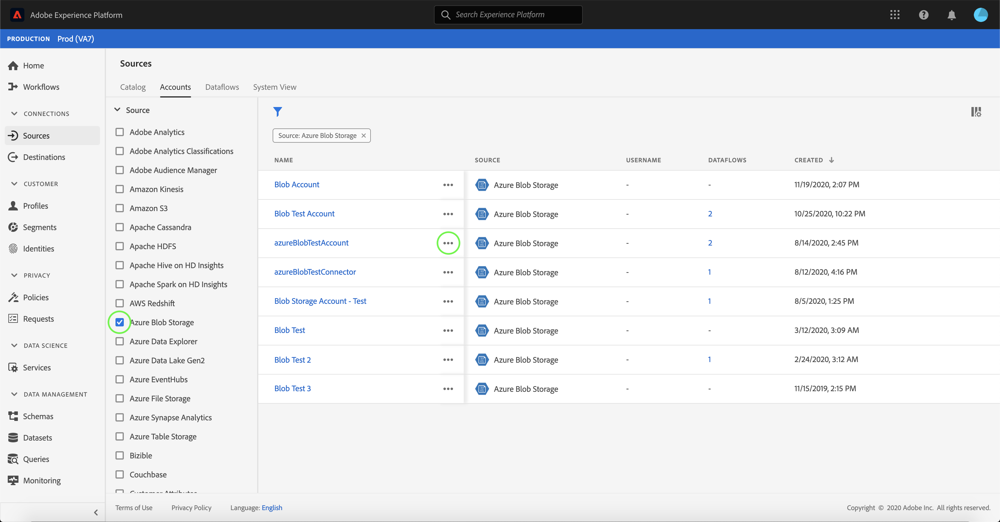

# Accountgegevens bijwerken in de gebruikersinterface

In sommige omstandigheden kan het nodig zijn de details van een bestaande bronrekening bij te werken. De [!UICONTROL Sources] werkruimte biedt u de mogelijkheid om details van een bestaande batch- of streamingverbinding toe te voegen, te bewerken en te verwijderen, inclusief de naam, beschrijving en referenties.

Deze zelfstudie bevat stappen voor het bijwerken van de details en gegevens van een bestaand account in de werkruimte [!UICONTROL Sources].

## Aan de slag

Deze zelfstudie vereist een goed begrip van de volgende onderdelen van Adobe Experience Platform:

- [Bronnen](../../home.md): Met Experience Platform kunnen gegevens uit verschillende bronnen worden ingepakt en kunt u inkomende gegevens structureren, labelen en verbeteren met behulp van de services van Platforms.
- [Sandboxen](../../../sandboxes/home.md): Experience Platform biedt virtuele sandboxen die één Platform-instantie in afzonderlijke virtuele omgevingen verdelen om toepassingen voor digitale ervaringen te ontwikkelen en te ontwikkelen.

## Accounts bijwerken

Meld u aan bij [Experience Platform UI](https://platform.adobe.com) en selecteer **[!UICONTROL Sources]** in de linkernavigatie om de [!UICONTROL Sources] werkruimte te openen. Selecteer **[!UICONTROL Accounts]** in de bovenste koptekst om bestaande accounts weer te geven.

De pagina **[!UICONTROL Accounts]** wordt weergegeven. Op deze pagina vindt u een lijst met weer te geven accounts, waaronder informatie over de bron, gebruikersnaam, het aantal gegevensstromen en de aanmaakdatum.

Selecteer het filterpictogram  linksboven om het deelvenster Sorteren te starten.

Het deelvenster Sorteren bevat een lijst met alle bronnen. U kunt meerdere bronnen in de lijst selecteren om een gefilterde selectie van accounts te openen die aan verschillende bronnen zijn gekoppeld.

Selecteer de bron waarmee u wilt werken om een lijst met bestaande accounts weer te geven. Nadat u de account hebt geïdentificeerd die u wilt bijwerken, selecteert u de ovalen (`...`) naast de accountnaam.

Er wordt een vervolgkeuzemenu weergegeven waarin u de opties **[!UICONTROL Add data]**, **[!UICONTROL Edit details]** en **[!UICONTROL Delete]** kunt kiezen. Selecteer **[!UICONTROL Edit details]** in het menu om uw account bij te werken.

In het dialoogvenster **[!UICONTROL Edit account details]** kunt u de naam, beschrijving en verificatiegegevens van een account bijwerken. Als u de gewenste informatie hebt bijgewerkt, selecteert u **[!UICONTROL Save]**.

Na enkele ogenblikken verschijnt onder aan het scherm een bevestigingsvak om te bevestigen dat de update is gelukt.

## Volgende stappen

Door deze zelfstudie te volgen, hebt u met succes de [!UICONTROL Sources] werkruimte gebruikt om de informatie van een bestaand bronaccount bij te werken.

Voor stappen over hoe te om deze verrichtingen programmatically uit te voeren gebruikend [!DNL Flow Service] API, gelieve te verwijzen naar de zelfstudie over [het bijwerken van verbindingsinformatie gebruikend de Dienst API van de Stroom](../../tutorials/api/update.md).