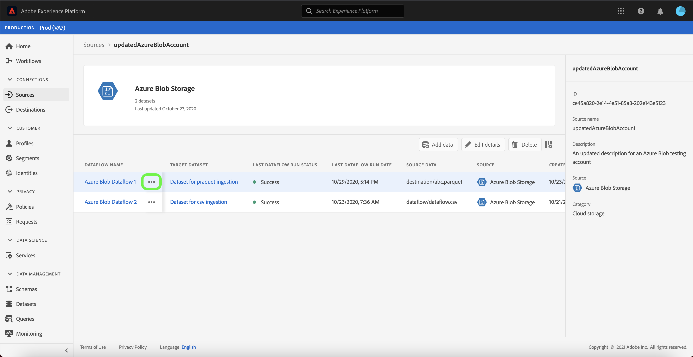

# Accountgegevens bijwerken in de gebruikersinterface

In sommige omstandigheden kan het nodig zijn de details van een bestaande bronrekening bij te werken. De [!UICONTROL Bronnen] werkruimte voorziet u van de capaciteit om, details van een bestaande partij of het stromen verbinding, met inbegrip van zijn naam, beschrijving, en geloofsbrieven toe te voegen uit te geven en te schrappen.

De [!UICONTROL Bronnen] werkruimte voorziet u ook van de capaciteit om het programma van partijdataflows uit te geven, toestaand u om zijn innamefrequentie en het intervaltarief bij te werken.

Dit leerprogramma verstrekt stappen voor het bijwerken van de details en de geloofsbrieven van een bestaand rekening van [!UICONTROL Bronnen] werkruimte, evenals het bijwerken van het innameschema van een dataflow.

## Aan de slag

Deze zelfstudie vereist een goed begrip van de volgende onderdelen van Adobe Experience Platform:

- [Bronnen](../../home.md): Met Experience Platform kunnen gegevens uit verschillende bronnen worden ingepakt en kunt u inkomende gegevens structureren, labelen en verbeteren met behulp van de services van Platforms.
- [Sandboxen](../../../sandboxes/home.md): Experience Platform biedt virtuele sandboxen die één Platform-instantie in afzonderlijke virtuele omgevingen verdelen om toepassingen voor digitale ervaringen te ontwikkelen en te ontwikkelen.

## Accounts bijwerken

Meld u aan bij [Experience Platform UI](https://platform.adobe.com) en selecteer **[!UICONTROL Bronnen]** in de linkernavigatie om de [!UICONTROL Bronnen] werkruimte te openen. Selecteer **[!UICONTROL Accounts]** van de hoogste kopbal om bestaande rekeningen te bekijken.

De pagina **[!UICONTROL Accounts]** wordt weergegeven. Op deze pagina vindt u een lijst met weer te geven accounts, waaronder informatie over de bron, gebruikersnaam, het aantal gegevensstromen en de aanmaakdatum.

Selecteer het filterpictogram  linksboven om het deelvenster Sorteren te starten.

Het deelvenster Sorteren bevat een lijst met alle bronnen. U kunt meerdere bronnen in de lijst selecteren om een gefilterde selectie van accounts te openen die aan verschillende bronnen zijn gekoppeld.

Selecteer de bron waarmee u wilt werken om een lijst met bestaande accounts weer te geven. Nadat u de account hebt geïdentificeerd die u wilt bijwerken, selecteert u de ovalen (`...`) naast de accountnaam.

Er wordt een vervolgkeuzemenu weergegeven waarin u de opties **[!UICONTROL Gegevens toevoegen]**, **[!UICONTROL Details bewerken]** en **[!UICONTROL Verwijderen]** kunt kiezen. Selecteer **[!UICONTROL Details bewerken]** in het menu om uw account bij te werken.

In het dialoogvenster **[!UICONTROL Accountgegevens bewerken]** kunt u de naam, beschrijving en verificatiegegevens van een account bijwerken. Nadat u de gewenste gegevens hebt bijgewerkt, selecteert u **[!UICONTROL Opslaan]**.

Na enkele ogenblikken verschijnt onder aan het scherm een bevestigingsvak om te bevestigen dat de update is gelukt.

## Tijdschema bewerken

U kunt het ingangsschema van een gegevensstroom van **[!UICONTROL Accounts]** pagina uitgeven. Selecteer in de lijst met accounts de account die de gegevensstroom bevat die u opnieuw wilt plannen.

De pagina met gegevensstromen wordt weergegeven. Deze pagina bevat een lijst met bestaande gegevensstromen die zijn gekoppeld aan het account dat u hebt geselecteerd. Selecteer de ellipsen (`...`) naast de dataflow die u wilt opnieuw plannen.

Er wordt een vervolgkeuzemenu weergegeven waarin u opties kunt opgeven voor **[!UICONTROL Schema bewerken]**, **[!UICONTROL Dataflow inschakelen]**, **[!UICONTROL Weergeven in controle]** en **[!UICONTROL Verwijderen]**. Selecteer **[!UICONTROL Programma bewerken]** in het menu.

Het **[!UICONTROL Edit programma]** dialoogvakje voorziet u van opties om de de innamefrequentie en het intervaltarief van uw gegevensstroom bij te werken. Nadat u de bijgewerkte frequentie- en intervalwaarden hebt ingesteld, selecteert u **[!UICONTROL Opslaan]**.

| Planning | Beschrijving |
| ---------- | ----------- |
| Frequentie | De frequentie waarmee de gegevensstroom gegevens zal verzamelen. Acceptabele waarden voor het bewerken van het frequentieschema voor een reeds bestaand gegevensstroomschema zijn: `minute`, `hour`, `day` of `week`. |
| Interval | Het interval geeft de periode aan tussen twee opeenvolgende flowrun. De waarde van het interval moet een geheel getal anders dan nul zijn en moet groter dan of gelijk aan `15` zijn. |

Na enkele ogenblikken verschijnt onder aan het scherm een bevestigingsvak om te bevestigen dat de update is gelukt.

## Volgende stappen

Door deze zelfstudie te volgen, hebt u met succes de [!UICONTROL Bronnen] werkruimte gebruikt om accountinformatie bij te werken en uw schema voor gegevensstroom te bewerken.

Voor stappen over hoe te om deze verrichtingen programmatically uit te voeren gebruikend [!DNL Flow Service] API, gelieve te verwijzen naar de zelfstudie over [het bijwerken van verbindingsinformatie gebruikend de Dienst API van de Stroom](../../tutorials/api/update.md).