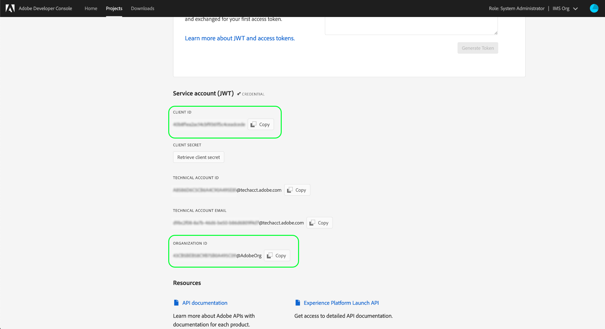

# Aan de slag met de Reactor-API

Als u de [Reactor-API](https://www.adobe.io/apis/experienceplatform/home/api-reference.html#!acpdr/swagger-specs/reactor.yaml) wilt gebruiken, moet elke aanvraag de volgende verificatiekoppen bevatten:

* `Authorization: Bearer {ACCESS_TOKEN}`
* `x-api-key: {API_KEY}`
* `x-gw-ims-org-id: {IMS_ORG}`

In deze handleiding wordt uitgelegd hoe u de Adobe Developer Console kunt gebruiken om de waarden voor elk van deze kopteksten te verzamelen, zodat u aanroepen kunt starten naar de Reactor-API.

## Toegang voor ontwikkelaars tot Adobe Experience Platform

Voordat u verificatiewaarden voor de Reactor-API kunt genereren, moet u ontwikkelaarstoegang tot het Experience Platform hebben. Om ontwikkelaarstoegang te verkrijgen, volg de eerste stappen in [de authentificatiezelfstudie van het Experience Platform](http://www.adobe.com/go/platform-api-authentication-en). Zodra u bij de stap &quot;Genereer toegangsgeloofsbrieven in de Console van de Ontwikkelaar van de Adobe&quot;aankomt, terugkeer aan dit leerprogramma om de geloofsbrieven te produceren specifiek voor Reactor API.

## Toegangsreferenties genereren

Gebruikend de Console van de Ontwikkelaar van Adobe, moet u de volgende drie toegangsgeloofsbrieven produceren:

* `{IMS_ORG}`
* `{API_KEY}`
* `{ACCESS_TOKEN}`

De id (`{IMS_ORG}`) en API-sleutel (`{API_KEY}`) van uw IMS-organisatie kunnen in toekomstige API-aanroepen opnieuw worden gebruikt nadat deze aanvankelijk zijn gegenereerd. Nochtans, is uw toegangstoken (`{ACCESS_TOKEN}`) tijdelijk en moet om de 24 uur opnieuw worden geproduceerd.

De stappen voor het genereren van deze waarden worden hieronder in detail besproken.

### Eenmalige installatie

Ga naar [Adobe Developer Console](https://www.adobe.com/go/devs_console_ui) en meld u aan met uw Adobe ID. Volg vervolgens de stappen die worden beschreven in de zelfstudie over het maken van een leeg project](https://www.adobe.io/apis/experienceplatform/console/docs.html#!AdobeDocs/adobeio-console/master/projects-empty.md) in de documentatie van de ontwikkelaarsconsole.[

Nadat u een project hebt gemaakt, selecteert u **API** toevoegen op het scherm **Project Overview**.


Het scherm **Add een API** verschijnt. Selecteer **Experience Platform Reactor API** in de lijst met beschikbare API&#39;s voordat u **Volgende** selecteert.


Op het volgende scherm, wordt u ertoe aangezet om een geloofsbrieven tot stand te brengen JSON Web Token (JWT) of een nieuw sleutelpaar produceren of uw eigen openbare sleutel uploaden. Voor deze zelfstudie selecteert u de optie **Een sleutelpaar genereren** en selecteert u vervolgens **Keypair genereren** in de rechterbenedenhoek.


Het volgende scherm bevestigt dat het sleutelpaar met succes heeft geproduceerd, en een samengeperste omslag die een openbaar certificaat en een privé sleutel bevat wordt automatisch gedownload aan uw machine. Deze persoonlijke sleutel wordt vereist in een recentere stap om een toegangstoken te produceren.

Selecteer **Volgende** om door te gaan.


In het volgende scherm wordt u gevraagd een of meer productprofielen te selecteren die u aan de API-integratie wilt koppelen.

>[!NOTE]
>
>Productprofielen worden door uw organisatie beheerd via de Adobe Admin Console en bevatten specifieke sets rechten voor korrelfuncties. Productprofielen en hun machtigingen kunnen alleen worden beheerd door gebruikers met beheerdersrechten binnen uw organisatie. Neem contact op met de beheerder als u niet zeker weet welke productprofielen u voor de API moet selecteren.

Selecteer in de lijst de gewenste productprofielen en selecteer vervolgens **geconfigureerde API** opslaan om de API-registratie te voltooien.


Zodra API aan het project is toegevoegd, verschijnt de projectpagina opnieuw op de Experience Platform Reactor API pagina. Van hier, scrol neer aan de **sectie van de Rekening van de Dienst (JWT)**, die de volgende toegangsgeloofsbrieven verstrekt die in alle vraag aan Reactor API worden vereist:

* **CLIENT-ID**: De client-id is de vereiste  `{API_KEY}` die in de  `x-api-key` header moet worden opgegeven.
* **ORGANISATIE-ID**: De organisatie-id is de  `{IMS_ORG}` waarde die in de  `x-gw-ims-org-id` koptekst moet worden gebruikt.



### Verificatie voor elke sessie

Nu u uw `{API_KEY}` en `{IMS_ORG}` waarden hebt, produceert de definitieve stap een `{ACCESS_TOKEN}` waarde.

>[!NOTE]
>
>Deze tokens verlopen na 24 uur. Als u deze integratie voor een toepassing gebruikt, is het een goed idee om uw token programmatically uit uw toepassing te verkrijgen.

U hebt twee opties om uw toegangstokens te produceren, afhankelijk van uw gebruiksgeval:

* [Tkens handmatig genereren](#manual)
* [Tkens programmatisch genereren](#program)

#### Handmatig toegangstekens genereren {#manual}

Open de persoonlijke sleutel die u eerder hebt gedownload in een teksteditor of browser en kopieer de inhoud ervan. Navigeer vervolgens terug naar de Developer Console en plak de persoonlijke sleutel in de sectie **Toegangstoken** genereren op de pagina Reactor API voor uw project voordat u **Token genereren** selecteert.


Er wordt een nieuw toegangstoken gegenereerd en er wordt een knop opgegeven waarmee het token naar het klembord kan worden gekopieerd. Deze waarde wordt gebruikt voor de vereiste `Authorization` kopbal, en moet in formaat `Bearer {ACCESS_TOKEN}` worden verstrekt.


#### Toegangstokens programmatisch genereren {#program}

Als u uw integratie voor een toepassing gebruikt, kunt u programmatically toegangstokens door API verzoeken produceren. Hiervoor hebt u de volgende waarden nodig:

* Client-id (`{API_KEY}`)
* Clientgeheim (`{SECRET}`)
* Een JSON-webtoken (`{JWT}`)

Uw client-id en geheim kunt u verkrijgen via de hoofdpagina voor uw project, zoals in de [vorige stap](#one-time-setup).


Als u uw JWT-referentie wilt verkrijgen, navigeert u naar **Servicerekening (JWT)** in de linkernavigatie en selecteert u vervolgens het tabblad **JWT** genereren. Op deze pagina, onder **Aangepaste JWT genereren**, plakt u de inhoud van uw persoonlijke sleutel in het opgegeven tekstvak en selecteert u **Token genereren**.


De gegenereerde JWT verschijnt hieronder zodra de verwerking is voltooid, samen met een voorbeeld-URL-opdracht waarmee u het token desgewenst kunt testen. Met de knop **Kopiëren** kunt u het token naar het klembord kopiëren.


Zodra u uw geloofsbrieven hebt verzameld, kunt u de API vraag hieronder in uw toepassing integreren om toegangstokens programmatically te produceren.

**Verzoek**

Het verzoek moet een `multipart/form-data` lading verzenden, die uw authentificatiegeloofsbrieven zoals hieronder getoond verstrekt:

```shell
curl -X POST \
  https://ims-na1.adobelogin.com/ims/exchange/jwt/ \
  -H 'Content-Type: multipart/form-data' \
  -F 'client_id={API_KEY}' \
  -F 'client_secret={SECRET}' \
  -F 'jwt_token={JWT}'
```

**Antwoord**

Een succesvolle reactie keert een nieuw toegangstoken, evenals het aantal seconden over tot het verloopt.

```json
{
  "token_type": "bearer",
  "access_token": "{ACCESS_TOKEN}",
  "expires_in": 86399999
}
```

| Eigenschap | Beschrijving |
| :-- | :-- |
| `access_token` | De zojuist gegenereerde waarde van het toegangstoken. Deze waarde wordt gebruikt voor de vereiste `Authorization` kopbal, en moet in formaat `Bearer {ACCESS_TOKEN}` worden verstrekt. |
| `expires_in` | De resterende tijd tot het token verloopt, in milliseconden. Nadat een token is verlopen, moet er een nieuw token worden gegenereerd. |

{style=&quot;table-layout:auto&quot;}

## Volgende stappen

Door de stappen in deze zelfstudie te volgen, zou u geldige waarden voor `{IMS_ORG}`, `{API_KEY}`, en `{ACCESS_TOKEN}` moeten hebben. U kunt deze waarden nu testen door ze te gebruiken in een eenvoudig cURL-verzoek aan de Reactor-API.

Begin door te proberen om een API vraag aan [lijst alle bedrijven ](./endpoints/companies.md#list) te maken.

>[!NOTE]
>
>Mogelijk hebt u geen bedrijven in uw organisatie. In dat geval is de reactie HTTP-status 404 (Niet gevonden). Zolang u geen fout van 403 (Verboden) krijgt, zijn uw toegangsgeloofsbrieven geldig en werkend.

Nadat u hebt bevestigd dat uw toegangsreferenties werken, gaat u verder met de documentatie van de andere API-naslaggids om de vele mogelijkheden van de API te leren kennen.

## Aanvullende bronnen

JWT-bibliotheken en SDK&#39;s: [https://jwt.io/](https://jwt.io/)

Ontwikkeling van de Postman-API: [https://www.postman.com/](https://www.postman.com/)
