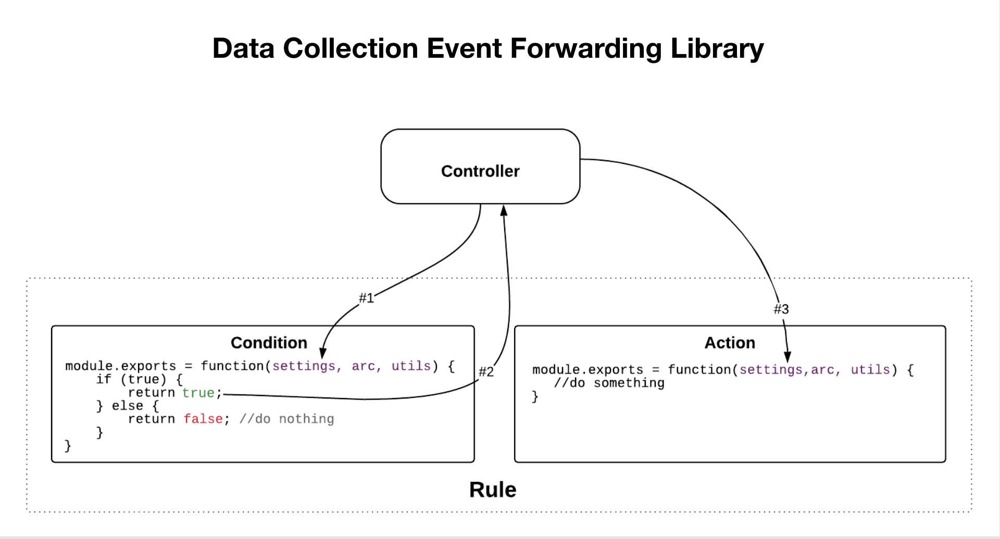

# Edge-extensiestroom

>[!NOTE]
>
>Adobe Experience Platform Launch is omgedoopt tot een reeks technologieën voor dataverzameling in Adobe Experience Platform.  Als gevolg hiervan zijn er verschillende terminologiewijzigingen in de productdocumentatie doorgevoerd. Raadpleeg het volgende [ document ](../../term-updates.md) voor een geconsolideerde referentie van de terminologiewijzigingen.

In randuitbreidingen heeft elke voorwaarde, actie, en het type van gegevenselement zowel een mening die gebruikers toestaat om montages te wijzigen als een bibliotheekmodule om op die user-defined montages te handelen.

Zoals het volgende diagram op hoog niveau toont, wordt de de actietype mening van de uitbreiding getoond binnen iframe binnen de toepassing die met Adobe Experience Platform wordt geïntegreerd. De weergave wordt vervolgens gebruikt om instellingen te wijzigen die vervolgens in Experience Platform worden opgeslagen. Wanneer de tagruntimebibliotheek is gemaakt, worden zowel de actietype van de extensie-bibliotheekmodule als de door de gebruiker gedefinieerde instellingen opgenomen in de runtimebibliotheek die wordt geïmplementeerd op het randknooppunt. Door de gebruiker gedefinieerde instellingen uit Experience Platform worden tijdens runtime in de module Bibliotheek geïnjecteerd.

In het volgende diagram kunt u het verband tussen gebeurtenissen, voorwaarden en acties binnen de stroom van de regelverwerking zien.

De stroom van de regelverwerking bevat de volgende fasen:

1. De methoden `settings` en `trigger` worden bij het opstarten aan de gebeurtenisbibliotheekmodule geleverd.
1. Wanneer de gebeurtenisbibliotheekmodule bepaalt dat de gebeurtenis heeft plaatsgevonden, roept de gebeurtenisbibliotheekmodule `trigger` aan.
1. Experience Platform geeft `settings` door aan de voorwaardenachtige bibliotheekmodules van de regel waar de voorwaarden vervolgens worden geëvalueerd.
1. Elk voorwaardetype keert terug of een voorwaarde aan waar evalueert.
1. Als alle voorwaarden overgaan, worden de acties van de regel uitgevoerd.
