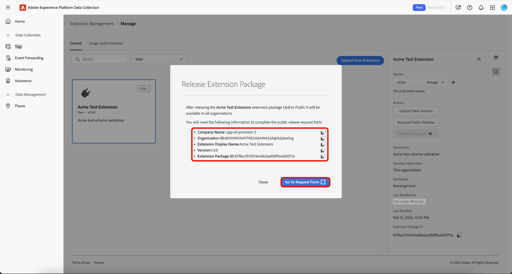

# Extensiebeheer voor tags

Met Adobe Experience Platform kunt u **[!UICONTROL Owned]** -extensies beheren. U kunt nieuwe uitbreidingen uploaden, nieuwe versies opstellen, en hen vrijgeven aan of privé of openbare beschikbaarheid.

## Een extensie beheren  {#manage-extension}

Nadat u uw uitbreidingspakket plaatselijk hebt voorbereid, gebruik **[!UICONTROL Extension Management]** in de Inzameling van Gegevens UI om het te uploaden, het pakket te bevestigen, en versies door **Ontwikkeling**, **Privé**, en **Openbare** beschikbaarheid vrij te geven. Vervolgens kunt u de extensie op een eigenschap installeren en deze gebruiken voor tests.

### Een extensie uploaden {#upload-extension}

Als u een extensie wilt uploaden, navigeert u naar de gebruikersinterface van de gegevensverzameling en selecteert u **[!UICONTROL Extension Management]** in de linkernavigatie. Selecteer van hieruit de tab **[!UICONTROL Owned]** . Op dit tabblad ziet u alle extensies die eigendom zijn van u of uw organisatie. Ze worden van elkaar gescheiden door het platform en u kunt zien welke extensies u op elk platform hebt (Web, Mobiel en Edge) met de vervolgkeuzelijst. Selecteer **[!UICONTROL Upload New Extension]**.

Voor **uploadt de Nieuwe pagina van de Uitbreiding**, selecteert **[!UICONTROL Select Extension Folder]**, navigeert aan de omslag die uw uitbreiding bevat, selecteert de omslag, dan selecteert **[!UICONTROL Upload]**.

Bevestig het aantal bestanden dat u wilt uploaden door **[!UICONTROL Upload]** te selecteren.

Het aantal bestanden dat wordt geüpload, wordt weergegeven, inclusief de naam en versie van de extensie. U kunt een ZIP-bestand naar uw lokale computer downloaden voor inspectie. **[!UICONTROL Dry Run]** Selecteer **[!UICONTROL Validate & Upload]**.

Bevestiging uw uitbreiding met succes is geupload en verwerkt wordt getoond samen met uw **identiteitskaart van het Pakket van de Uitbreiding**. Selecteer **[!UICONTROL Close]** om terug te keren naar het tabblad **[!UICONTROL Owned]** waar de extensie wordt weergegeven.

U wordt teruggestuurd naar het tabblad [!UICONTROL Owned] waar de geüploade extensie wordt weergegeven.

>[!IMPORTANT]
>
>De uitbreidingen worden geupload in **beschikbaarheid van de Ontwikkeling**. De uitbreidingen in **beschikbaarheid van de Ontwikkeling** kunnen niet worden gedeeld tot zij aan **Privé** beschikbaarheid worden vrijgegeven.

### Een extensie opheffen {#release-extension}

Als u de extensie wilt vrijgeven zodat deze persoonlijk beschikbaar is, selecteert u de extensie om het informatievenster rechts weer te geven. Hier ziet u de volgende details van de extensie:

* **Versie** - toont de recentste versie en de staat het momenteel binnen is. U kunt het vervolgkeuzemenu gebruiken om de versiegeschiedenis van de extensie weer te geven.
* **Acties** - staat u toe **[!UICONTROL Upload New Version]** van de uitbreiding en **[!UICONTROL Release To Private]**.
* **identiteitskaart van het Pakket van de Uitbreiding** - bij de bodem wordt getoond die. Dit hangt af van de geselecteerde versie.

 benadrukt

Selecteer **[!UICONTROL Release To Private]** en selecteer vervolgens nogmaals **[!UICONTROL Release To Private]** om de release te bevestigen.

De bevestiging wordt ontvangen zodra de uitbreiding met succes aan **Privé** beschikbaarheid is vrijgegeven. De bijgewerkte beschikbaarheid is zichtbaar in het rechterdeelvenster.

>[!NOTE]
>
>Zodra de uitbreiding aan **Privé** is vrijgegeven, is het beschikbaar om met andere organisaties te worden gedeeld.

Om de uitbreiding aan **Openbare** beschikbaarheid vrij te geven, selecteer **[!UICONTROL Request Public Release]** van het juiste paneel.

Het scherm **[!UICONTROL Release Extension Package]** bevat details die op het aanvraagformulier zijn vereist, met een optie om de details te kopiëren. Selecteer **[!UICONTROL Go To Request Form]**.

Er wordt een nieuw mappentabblad geopend met het aanvraagformulier. Kopieer en plak de informatie van het **[!UICONTROL Release Extension Package]** scherm in de relevante gebieden. Verzend het ingevulde formulier ter controle. U wordt op de hoogte gesteld zodra de extensie openbaar is gemaakt.

## Extensiepakketten delen met andere organisaties {#share-extension}

>[!NOTE]
>
>Extensiepakketten moeten een privéversie of een openbare versie hebben om te kunnen worden gedeeld via [!UICONTROL Usage Authorizations] . Versies die zijn gemarkeerd als Beschikbaarheid voor Ontwikkeling komen niet in aanmerking voor delen en worden niet weergegeven in het vervolgkeuzemenu voor machtigingen. Dit geldt ook als een eerdere versie (bijvoorbeeld 1.0.0) al is gedeeld. Nieuwere versies (bijvoorbeeld 1.0.1) moeten ten minste privé zijn voordat ze door ontvangende organisaties kunnen worden geautoriseerd of geïnstalleerd.
>
>Alle richtlijnen voor het delen van extensiepakketten voor privéextensies zijn ook van toepassing als u deze pakketten later openbaar wilt maken. Dezelfde overwegingen met betrekking tot zichtbaarheid, versioning, beveiliging, compatibiliteit, ondersteuning en documentatie blijven relevant, ongeacht de beschikbaarheidsstatus van het pakket.

**[!UICONTROL Usage Authorizations]** is een krachtige eigenschap die u kunt gebruiken om privé uitbreidingspakketten met vertrouwde op partners veilig te delen zonder hen openbaar te maken beschikbaar in de uitbreidingscatalogus. Met deze functie kunt u een veilige brug tussen organisaties maken, zodat u elkaars aangepaste extensiecode kunt benutten en tegelijk de privacy en controle over uw eigen oplossingen kunt behouden.

Organisaties ontwikkelen vaak gespecialiseerde extensies die zijn afgestemd op hun unieke zakelijke behoeften. Deze uitbreidingen kunnen merkgebonden logica, douaneintegratie, of gevoelige configuraties bevatten die niet openbaar zouden moeten worden gemaakt. De vergunningen van het gebruik lossen deze uitdaging door toe te laten:

* **Selectief het delen**: Deel privé uitbreidingen slechts met vertrouwde op partnerorganisaties.
* **Bewaarde privacy**: Houd gevoelige uitbreidingscode uit de openbare catalogus.
* **Samenwerking ontwikkeling**: Laat vertrouwde op partners toe om van uw douaneoplossingen te profiteren.
* **beheerde toegang**: handhaaf volledige controle over wie tot uw privé uitbreidingen toegang heeft en kan gebruiken.

Bij het deelproces zijn twee belangrijke deelnemers betrokken:

1. **het Delen organisatie**: De organisatie die bezit en het privé uitbreidingspakket deelt
2. **Ontvangende organisatie**: De vertrouwde op organisatie die toegang tot de gedeelde uitbreiding krijgt

Wanneer een persoonlijke versie wordt gedeeld, krijgt de ontvangende organisatie toegang tot die specifieke versie, die tot een directe verbinding tussen de twee organisaties leidt. Als een nieuwere versie later privé wordt gemaakt, zal het ook aan de ontvangende organisatie beschikbaar zijn zonder extra stappen van hun te vereisen.

### Een gebruiksvergunning voor een extensiepakket maken {#package-usage-authorization}

Als u een extensie wilt delen, navigeert u naar de gebruikersinterface voor gegevensverzameling en selecteert u **[!UICONTROL Extension Management]** in de linkernavigatie. Selecteer van hieruit de tab **[!UICONTROL Usage Authorizations]** .

Hier ziet u een lijst met bestaande gedeelde machtigingen die in twee categorieën zijn ingedeeld:

* **Gedeeld met deze org**: Uitbreidingen die andere organisaties met u hebben gedeeld.
* **Gedeeld met andere organisaties**: Uitbreidingen die u met andere organisaties hebt gedeeld.

Selecteer **[!UICONTROL Add Authorization]**.

![&#x200B; Het tabblad [!UICONTROL Usage Authorizations] dat een lijst weergeeft met extensies die worden gedeeld met deze org, markeren [!UICONTROL Add Authorization]](../images/shared-extensions/add-authorization.png)

>[!IMPORTANT]
>
>U moet de eigenaar van de organisatie van het doel **`Organization ID`** verkrijgen. Organisaties kunnen niet op naam worden doorzocht.

Selecteer de **[!UICONTROL Platform]** waarvoor u een extensie wilt autoriseren in het vervolgkeuzemenu. U kunt extensies **[!UICONTROL Web]** , **[!UICONTROL Mobile]** en **[!UICONTROL Edge]** delen.

Selecteer vervolgens de extensies die u wilt delen in het vervolgkeuzemenu **[!UICONTROL Extension]** die u beschikbaar hebt. In de lijst worden extensies die eigendom zijn van uw organisatie, samen met de beschikbaarheidsstatus weergegeven. De uitbreidingen waarvan recentste versie in **de beschikbaarheid van de Ontwikkeling** is zullen niet in deze lijst verschijnen.

Voer vervolgens de id van de ontvangende organisatie in en selecteer **[!UICONTROL Save]** .

![&#x200B; De [!UICONTROL Create extension package usage authorization] -pagina waarop een geselecteerde extensie en een Adobe-organisatie-id worden weergegeven die is ingevoerd, wordt gemarkeerd [!UICONTROL Save]](../images/shared-extensions/save-authorization.png)

U keert terug naar het tabblad [!UICONTROL Usage Authorizations] waar u de extensie kunt zien in uw **[!UICONTROL Shared with other orgs]** -lijst. De status zal **wachten op Goedkeuring** tonen tot de ontvangende organisatie de vergunning goedkeurt, op welk punt het aan **Goedgekeurd** zal worden bijgewerkt.

![&#x200B; het [!UICONTROL Usage Authorizations] lusje dat een lijst van uitbreidingen toont die met andere organen worden gedeeld, die de nieuwe vergunning &#x200B;](../images/shared-extensions/new-authorization.png) benadrukken

>[!TIP]
>
>U kunt extensies ook rechtstreeks delen via **[!UICONTROL Extension Catalog]** door het menu (⋯) op de uitbreidingskaart te selecteren en vervolgens de optie voor delen te selecteren in het menu.

Wanneer een vergunning actief is, toont de gedeelde uitbreiding a ***delend*** badge in de catalogus erop wijst die het met andere organisaties wordt gedeeld.

![&#x200B; het [!UICONTROL Catalog] lusje dat de gedeelde uitbreiding met de badge &#x200B;](../images/shared-extensions/sharing-badge.png) toont

### Gedeelde extensies autoriseren en beheren {#manage-shared-extension}

>[!NOTE]
>
>Als ontvangende organisatie kunt u gedeelde extensies alleen goedkeuren of afwijzen. U kunt de machtigingsdetails niet beheren of wijzigen, omdat deze worden beheerd door de organisatie die de machtiging deelt.

Als u een gedeelde extensie wilt autoriseren voor uw organisatie, navigeert u naar de gebruikersinterface voor gegevensverzameling en selecteert u **[!UICONTROL Extension Management]** in de linkernavigatie en selecteert u vervolgens het tabblad **[!UICONTROL Usage Authorizations]** .

U kunt een lijst van gedeelde uitbreidingen met inbegrip van die **zien die op Goedkeuring** in de **[!UICONTROL Shared with this org]** sectie wachten. Selecteer de extensie die u wilt goedkeuren en selecteer vervolgens **[!UICONTROL Approve]** .

![&#x200B; Het [!UICONTROL Usage Authorizations] lusje dat een lijst toont van uitbreidingen die met dit org met de uitbreiding worden gedeeld die op Goedkeuring wacht geselecteerd, benadrukkend [!UICONTROL Approve]](../images/shared-extensions/approve-authorization.png)

>[!NOTE]
>
>U kunt een aanvraag ook afwijzen op het tabblad **[!UICONTROL Usage Authorizations]** als de gedeelde extensie niet langer wordt vereist door uw organisatie.

Selecteer **[!UICONTROL OK]** in het dialoogvenster **[!UICONTROL Authorization Usages]** .

![&#x200B; Het dialoogvenster [!UICONTROL Authorization Usages] markeren [!UICONTROL OK]](../images/shared-extensions/confirmation.png)

U bent teruggekeerd aan het [!UICONTROL Usage Authorizations] lusje waar u de uitbreiding kunt zien nu een **Goedgekeurde** status toont.

![&#x200B; het [!UICONTROL Usage Authorizations] lusje dat een lijst van uitbreidingen toont die met deze org worden gedeeld, die de uitbreiding met Goedgekeurde status benadrukken &#x200B;](../images/shared-extensions/approved-authorization.png)

Zodra de vergunning wordt goedgekeurd, is de uitbreiding beschikbaar in uw catalogus en kan worden geïnstalleerd en worden gebruikt zoals om het even welke andere uitbreiding. De gedeelde uitbreiding toont a ***Ontvangend*** badge die op het wijst is een uitbreiding die met u door een andere organisatie wordt gedeeld.

![&#x200B; het [!UICONTROL Catalog] lusje dat de gedeelde uitbreiding met &quot;Ontvangend&quot;badge &#x200B;](../images/shared-extensions/receiving-badge.png) toont

### Intrekking van vergunningen {#revoke-authorization}

Als de organisatie die eigenaar is, kunt u op elk gewenst moment een autorisatie verwijderen, ongeacht de huidige status (In afwachting van goedkeuring, Afgewezen of Goedgekeurd).

**als uw uitbreiding nooit openbaar werd gemaakt:**

* Alle privéversies die de ontvangende organisatie al heeft geïnstalleerd, blijven in de lijst met geïnstalleerde extensies staan.
* Als de ontvangende organisatie nooit uw uitbreiding heeft geïnstalleerd, zal het nergens meer in hun interface verschijnen.

**als uw uitbreiding openbaar werd gemaakt:**

* Elke privéversie die de ontvangende organisatie heeft geïnstalleerd, blijft zichtbaar in de lijst met geïnstalleerde extensies.
* Als zij uw privé versie nooit hebben geïnstalleerd, zullen zij nog de recentste openbare versie in hun catalogus zien en kunnen het installeren.
* Ze kunnen desgewenst ook van uw persoonlijke versie naar de meest recente openbare versie worden gedowngraded.

Wanneer u een vergunning intrekt, behoudt de ontvangende organisatie bepaalde rechten om hun bestaande implementaties te beschermen:

* **Vervolg gebruik**: De ontvangende organisatie kan het gebruiken van om het even welke privé versie houden zij reeds geïnstalleerd, zelfs nadat u toegang herroept.
* **bouwt bescherming**: Als de ontvangende organisatie uw privé v1.0.0 installeerde en u later privé v1.0.1 vrijgeeft, zullen zij niet de nieuwere versie zien maar kunnen blijven bouwen met v1.0.0 zonder verstoring.
* **Toekomstige verbeteringen**: Als u later uw uitbreiding openbaar maakt (bijvoorbeeld, die v2.0.0 openlijk vrijgeven), kan de ontvangende organisatie van hun privé v1.0.0 direct aan nieuw openbaar v2.0.0 bevorderen.

>[!IMPORTANT]
>
>Als u de autorisatie intrekt, worden bestaande builds of implementaties niet verbroken. Ontvangende organisaties handhaven toegang tot om het even welke privé versies die zij reeds hebben geïnstalleerd om bedrijfscontinuïteit te verzekeren.

## Volgende stappen {#next-steps}

In dit document wordt getoond hoe u de functie voor gedeelde extensies in Experience Platform kunt gebruiken. Voor informatie over uitbreidingsontwikkeling, zie de [&#x200B; gids van de gebruiker van de uitbreidingsontwikkeling &#x200B;](./getting-started.md).

Voor een overzicht op hoog niveau van uitbreidingsontwikkeling in Experience Platform, verwijs naar de [&#x200B; overzichtsdocumentatie &#x200B;](./overview.md).
