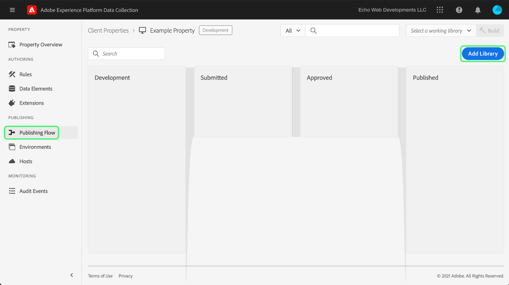

# Test van begin tot eind uploaden en implementeren

>[!NOTE]
>
>Adobe Experience Platform Launch is omgedoopt tot een reeks technologieën voor gegevensverzameling in Adobe Experience Platform. Diverse terminologische wijzigingen zijn als gevolg hiervan in de productdocumentatie doorgevoerd. Raadpleeg het volgende [document](../../term-updates.md) voor een geconsolideerde referentie van de terminologische wijzigingen.

Als u de extensies van tags in Adobe Experience Platform wilt testen, gebruikt u de API-tags en/of opdrachtregelprogramma&#39;s om de extensiepakketten te uploaden. Vervolgens gebruikt u de gebruikersinterface van het Platform of de gebruikersinterface van de gegevensverzameling om uw extensiepakket te installeren in een eigenschap en de mogelijkheden ervan uit te oefenen in een tagbibliotheek en te bouwen.

In dit document wordt beschreven hoe u end-to-end tests voor uw extensie kunt implementeren.

>[!NOTE]
>
>In deze handleiding wordt ervan uitgegaan dat u MacOS gebruikt terwijl Node.js en npm zijn geïnstalleerd en beschikbaar.

## Uw extensie valideren {#validate}

Zodra uw team met de prestaties van uw uitbreiding en de resultaten wordt tevredengesteld zij in zien [Sandbox](https://www.npmjs.com/package/@adobe/reactor-sandbox#running-the-sandbox) moet u klaar zijn om het extensiepakket te uploaden naar tags.

Voordat u gaat uploaden, moet u controleren of de vereiste velden of instellingen aanwezig zijn. U kunt bijvoorbeeld uw [extensiemanifest](../manifest.md), uw [extensieconfiguratie](../configuration.md), uw [views](../web/views.md)en uw [bibliotheekmodules](../web/format.md) (ten minste) is een goede praktijk.

Een specifiek voorbeeld hiervan is uw logobestand: Een `"iconPath": "example.svg",` lijn naar uw `extension.json` en neem dat logoafbeeldingsbestand op in uw project. Dit is het relatieve pad naar het pictogram dat voor de extensie wordt weergegeven. Het mag niet beginnen met een schuine streep. Het moet verwijzen naar een SVG-bestand met een `.svg` extensie. De SVG moet normaal worden weergegeven wanneer deze vierkant wordt gerenderd en kan door de gebruikersinterface worden geschaald. Zie de [SVG-artikel schalen](https://css-tricks.com/scale-svg/) voor meer informatie .

>[!NOTE]
>
>Neem voor openbare extensies een item op in uw `extension.json` met een link naar je aanbieding op eBay. Uw [extensiemanifest](../manifest.md) moet een dergelijke vermelding bevatten: `"exchangeUrl":"https://www.adobeexchange.com/experiencecloud.details.12345.html"` verwijzen naar de URL van je Exchange-aanbieding.

## Een Adobe I/O-integratie maken {#integration}

Als u de API- of opdrachtregelprogramma&#39;s wilt gebruiken, hebt u een technisch account met Adobe I/O nodig. U moet de technische account maken in de I/O-console en vervolgens het gereedschap Uploader gebruiken om het extensiepakket te uploaden.

Voor informatie over het maken van een technisch account voor gebruik met tags in Adobe Experience Platform raadpleegt u de [Toegangstokens](https://developer.adobelaunch.com/api/guides/access_tokens/) hulplijn.

>[!IMPORTANT]
>
>Om tot een Integratie in Adobe I/O te leiden moet u een Beheerder van de Organisatie van de Experience Cloud of een Experience Cloud zijn Org Ontwikkelaar.

Als u geen Integratie kunt tot stand brengen, is het waarschijnlijk dat u niet de correcte toestemmingen hebt. Hiervoor is een Org Admin nodig om de stappen voor u te voltooien of om u toe te wijzen als ontwikkelaar.

## Upload Your extension package {#upload}

Nu u geloofsbrieven hebt, bent u bereid om uw uitbreidingspakket van begin tot eind te testen.

Wanneer u het extensiepakket voor het eerst uploadt, wordt het omgezet in een status van `development`. Dit betekent dat het alleen zichtbaar is voor uw eigen organisatie en alleen met een eigenschap die is gemarkeerd voor extensieontwikkeling.

Gebruik de bevellijn om het volgende bevel binnen de folder in werking te stellen die uw .zip pakket bevat.

```bash
npx @adobe/reactor-uploader
```

`npx` kunt u een npm-pakket downloaden en uitvoeren zonder het daadwerkelijk op uw computer te installeren. Dit is de eenvoudigste manier om de Uploader uit te voeren.

Voor Uploader moet u verschillende gegevens invoeren. De technische account-id, de API-sleutel en andere gegevens kunnen worden opgehaald van de Adobe I/O-console. Ga naar de [Integratiepagina](https://console.adobe.io/integrations) in de I/O-console. Selecteer de juiste organisatie in het vervolgkeuzemenu, zoek de juiste integratie en selecteer **[!UICONTROL View]**.

- Wat is het pad naar uw persoonlijke sleutel? /path/to/private.key. Dit is de plaats u uw privé sleutel in stap 2 hierboven bewaarde.
- Wat is je Org ID? Kopieer en plak deze vanuit de overzichtspagina van de I/O-console die u eerder hebt geopend.
- Wat is je technische account-id? Kopieer en plak deze vanuit de I/O-console.
- Wat is uw API-sleutel? Kopieer en plak deze vanuit de I/O-console.
- Wat is het clientgeheim? Kopieer en plak deze vanuit de I/O-console.
- Wat is het pad naar het extension_package dat u wilt uploaden? /path/to/extension_package.zip. Als u de uploader aanroept vanuit de map die het ZIP-pakket bevat, kunt u dit gewoon in de lijst selecteren in plaats van het pad te typen.

Uw extensiepakket wordt vervolgens geüpload en de uploader geeft u de id van het extension_package.

>[!NOTE]
>
>Tijdens het uploaden of patchen worden extensiepakketten in een status in behandeling geplaatst, terwijl het systeem het pakket asynchroon extraheert en implementeert. Tijdens dit proces kunt u de opdracht `extension_package` ID voor de status met behulp van de API en binnen de UI. Er wordt een extensiekaart weergegeven in de catalogus die is gemarkeerd als In behandeling.

>[!NOTE]
>
>Als u de uploader vaak wilt uitvoeren, kan het lastig zijn al deze informatie telkens in te voeren. U kunt deze ook als argumenten doorgeven vanaf de opdrachtregel. Kijk uit de [Sectie Opdrachtregelargumenten](https://www.npmjs.com/package/@adobe/reactor-uploader#command-line-arguments) van de NPM-documenten voor meer informatie.

## Een ontwikkeleigenschap maken {#property}

Nadat u zich bij UI hebt aangemeld en selecteert u **[!UICONTROL Tags]** in de linkernavigatie [!UICONTROL Properties] wordt weergegeven. Een eigenschap is een container voor de tags die u wilt implementeren en kan op een of meerdere sites worden gebruikt.


De eerste keer dat u zich aanmeldt, worden er geen eigenschappen op het scherm weergegeven. Selecteren **Nieuwe eigenschap** om er een te maken. Voer een naam en een URL in. Gebruik de URL van uw testsite of de pagina waarop u de extensie gaat testen. Dit domeinveld kan door sommige extensies worden gebruikt of door een voorwaarde met de extensie Core.

>[!NOTE]
>
>`localhost` werkt niet als een URL-waarde. Gebruik in plaats daarvan een willekeurige modelwaarde om te testen of u een `localhost` URL. Bijvoorbeeld, example.com.

Als u deze eigenschap wilt gebruiken voor het testen van de extensieontwikkeling, moet u de **GEAVANCEERDE OPTIONS** en controleer of het selectievakje **Configureren voor de ontwikkeling van extensies**.


Selecteren **Opslaan** onderaan om de nieuwe eigenschap op te slaan.

Het scherm Eigenschappen wordt weergegeven. Selecteer de naam van de eigenschap die u zojuist hebt gemaakt. Het scherm van het Overzicht van het Bezit verschijnt. Het voorziet verbindingen met elk gebied van het systeem van de globale navigatiekoppelingen in de kolom op de linkerzijde.

## De extensie installeren {#install-extension}

Als u de extensie in deze eigenschap wilt installeren, selecteert u de optie **Extensies** in de hoofdnavigatiekoppelingen in de linkerkolom. De **Kern** extensie wordt weergegeven op het tabblad **Geïnstalleerd** scherm. De extensie Core bevat alle functionaliteit voor tagbeheer binnen de gegevensverzameling.


Als u de extensie wilt toevoegen, selecteert u de optie **Catalogus** tab.


De catalogus bevat kaartpictogrammen voor elke beschikbare extensie. Als uw extensie niet wordt weergegeven in de catalogus, controleert u of u de bovenstaande stappen hebt uitgevoerd in de secties Stel Adobe beheerconsole in en Creating Your Extension Package. Uw extensiepakket wordt mogelijk ook weergegeven als In behandeling als het Platform de eerste verwerking niet heeft voltooid.

Als u de vorige stappen hebt gevolgd en nog steeds geen extensiepakket in behandeling of Mislukt ziet in de catalogus, moet u de status van het extensiepakket rechtstreeks controleren met de API. Voor informatie over hoe u de juiste API-aanroep kunt maken, leest u [Een ExtensionPackage ophalen](https://developer.adobelaunch.com/api/reference/1.0/extension_packages/fetch/) in de API-documentatie.

Selecteer **Installeren** onder aan de kaart.


Het configuratiescherm wordt geopend (op voorwaarde dat de extensie er een heeft). Voeg om het even welke informatie toe nodig om uw uitbreiding te vormen en te selecteren **Opslaan** onderaan. In het voorbeeld van het configuratiescherm dat u hier ziet, wordt de Facebook-extensie gebruikt waarvoor een Pixel-id is vereist.


U moet nu de **Geïnstalleerd** het scherm van uitbreidingen met de uitbreiding van de Kern en uw uitbreiding.


## Bronnen maken om uw extensie te testen {#resources}

Extensies bieden nieuwe mogelijkheden voor gebruikers van Adobe Experience Platform. Deze worden typisch getoond in de Elementen van Gegevens of de Bouwer van de Regel.

### Gegevenselementen

Het doel van elementen met taggegevens is om gebruikers te helpen bij het behouden van waarden. Elk gegevenselement is een toewijzing of aanwijzer aan brongegevens. Eén gegevenselement is een variabele die kan worden toegewezen aan querytekenreeksen, URL&#39;s, cookie-waarden, JavaScript-variabelen enzovoort. Selecteren **Gegevenselementen** van de linkernavigatiebalk, en **Nieuw gegevenselement maken**.


Extensies kunnen gegevenselementen definiëren als dat nodig is om de extensie te laten werken of eenvoudig als gebruiksvriendelijk voor gebruikers. Wanneer een extensie gegevenselementen bevat, worden deze weergegeven in een vervolgkeuzelijst voor gebruikers in het dialoogvenster **Gegevenselement maken** scherm:


Wanneer een gebruiker de extensie selecteert in het menu **Extensie** vervolgkeuzelijst **Type gegevenselement** dropdown is bevolkt met om het even welke die elementtypes van gegevens door uw uitbreiding worden verstrekt. De gebruiker kan dan elk gegevenselement aan zijn bronwaarde in kaart brengen. De elementen van gegevens kunnen dan worden gebruikt wanneer het bouwen van regels in de Gebeurtenis van de Verandering van het Element van Gegevens of de Gebeurtenis van de Code van de Douane om een uit te voeren regel teweeg te brengen. Een gegevenselement kan ook in de Voorwaarde van het Element van Gegevens of andere Voorwaarden, Uitzonderingen, of Acties in een regel worden gebruikt.

Zodra het gegevenselement wordt gecreeerd (de afbeelding wordt opstelling), kunnen de gebruikers de brongegevens door het gegevenselement eenvoudig van verwijzingen te voorzien van verwijzingen voorzien. Als de bron van de waarde verandert (site wordt opnieuw ontworpen, enz.) gebruikers hoeven de toewijzing slechts eenmaal in UI bij te werken en alle gegevenselementen zullen automatisch de nieuwe bronwaarde ontvangen.

### Regels

Selecteer **Regels** koppeling in de linkernavigatie, dan **Nieuwe regel maken**.


Voer eerst een beschrijvende naam in als regel. De **Regel maken** scherm wordt ingesteld als een `if-then` instructie.


Als een gebeurtenis plaatsvindt en de voorwaarden worden doorgegeven en er zijn geen uitzonderingen, wordt de actie geactiveerd. Deze zelfde stroom bestaat in uitbreidingen waar u gebeurtenissen, voorwaarden, uitzonderingen, gegevenselementen, of acties kunt tot stand brengen of hefboomwerking.

Voeg met het Facebook-extensievoorbeeld een gebeurtenis toe telkens wanneer een pagina op de testsite wordt geladen.


De `Window Loaded` **Type gebeurtenis** zorgt ervoor dat wanneer een pagina op de testplaats laadt deze regel zal worden teweeggebracht. Selecteren **Wijzigingen behouden**. In dit voorbeeld negeert u **Voorwaarden** aangezien de regel voor om het even welke pagina op de testplaats zou moeten in werking worden gesteld.

Onder **ACTIES** selecteren **Toevoegen**. De **Configuratie van handelingen** scherm verschijnt.Daarna moet u de uitbreiding kiezen waarop de regel moet worden toegepast, en de actie om voor te komen wanneer de regel wordt teweeggebracht. Selecteren **Facebook Pixel** van de **Extensie** vervolgkeuzelijst, en **Paginaweergave verzenden** van de **Type handeling** vervolgkeuzelijst. Selecteren **Wijzigingen behouden** en vervolgens **Opslaan** over het volgende **Regel bewerken** scherm.


Selecteer tijdens het testen van de extensie relevante gebeurtenissen, voorwaarden, enzovoort. die door uw extensie worden geleverd, in een willekeurig aantal regels.

## Uw wijzigingen publiceren {#publish}

Selecteer in de hoofdnavigatie de optie **Publiceren**, dan op **Nieuwe bibliotheek toevoegen** koppeling:



Een bibliotheek is een set instructies voor hoe extensies, gegevenselementen en regels met elkaar en met een website communiceren. Bibliotheken worden gecompileerd in builds. Een bibliotheek kan net zoveel wijzigingen bevatten als een gebruiker gemakkelijk kan maken of testen in één keer.

Op de **Bibliotheek maken** scherm, voeg een naam in toe **Naam** tekstveld. Tags bieden een standaardontwikkelomgeving met de naam **Ontwikkeling**. Selecteren **Ontwikkeling** van de **Omgeving** vervolgkeuzelijst. Voeg voor het gemak alle beschikbare bronnen toe. Selecteren **Alle gewijzigde bronnen toevoegen** selecteert u vervolgens **Opslaan**.

>[!NOTE]
>
>Wanneer u een bron aan een bibliotheek toevoegt, wordt een momentopname van die bron op dat exacte moment genomen en aan de bibliotheek toegevoegd. Wanneer u later wijzigingen aanbrengt in uw bronnen (bijvoorbeeld als gevolg van correcties die u moet aanbrengen), moet u de bibliotheek ook bijwerken met de nieuwste wijzigingen in uw bronnen. De **Alle gewijzigde bronnen toevoegen** Deze knop is ook hiervoor nuttig.


Nu alle wijzigingen zijn opgenomen in de nieuwe bibliotheek (met de naam **dev** in het opgegeven voorbeeld) selecteert u **Opslaan en samenstellen tot ontwikkeling**.


Nadat het bouwstijlproces voltooit, groen **succes** wordt weergegeven naast de bibliotheeknaam.


De tagbibliotheek is nu gepubliceerd en beschikbaar voor gebruik. De testpagina moet de nieuwe bibliotheek gebruiken om het paginagedrag voor de eindgebruiker in browser te testen.

## Tags op een testsite installeren {#install-data-collection-tags}

Installatie-instructies zijn beschikbaar op het tabblad Omgevingen. Op deze pagina worden alle beschikbare omgevingen weergegeven en kunt u meer maken. Terwijl de bibliotheek naar de ontwikkelomgeving is gepubliceerd, selecteert u het vakpictogram in het dialoogvenster **INSTALLEREN** kolom op de **Ontwikkeling** rij.


De **Webinstallatieinstructies** wordt een dialoog voor de ontwikkelomgeving weergegeven. Selecteer het pictogram Kopiëren om het volledige te kopiëren `<script>` tag.


Voltooi de installatie door deze installatie te plaatsen `<script>` tag in de `<head>` van uw document of sitesjabloon. Ga vervolgens naar de testsite om het gedrag van uw gepubliceerde tagbibliotheek te bekijken.

## Testen {#test}

Hieronder volgt een lijst met handige consoleopdrachten voor het valideren van uw extensie op uw testpagina of site.

- `_satellite.setDebug(true);` zal zuivert wijze en output nuttige registrerenverklaringen aan de console toelaten.
- De `_satellite._container` Het object bevat nuttige informatie over de geïmplementeerde bibliotheek, waaronder informatie over de opgenomen build, gegevenselementen, regels en extensies.

Het doel van deze test is de functionaliteit van de geïmplementeerde bibliotheek te controleren en ervoor te zorgen dat het extensiepakket zich gedraagt zoals u had verwacht nadat het in een bibliotheek is opgenomen.

Wanneer u veranderingen ontdekt die aan uw uitbreidingspakket moeten worden aangebracht, is het herhalingsproces gelijkaardig aan het ontwikkelingsproces.

1. Breng wijzigingen aan in de code in uw project.
1. Valideer de wijzigingen met het gereedschap Sandbox.
1. Gebruik het gereedschap Packager om een nieuw ZIP-pakket te maken
1. Gebruik het gereedschap Uploader om het nieuwe ZIP-pakket te uploaden. Het proces volgt dezelfde instructies als voor de eerste upload. Aangezien er in de ontwikkelingsmodus al een extensiepakket met die naam bestaat, wordt de oudere versie door dit nieuwe pakket overschreven in plaats van een nieuwe versie te maken.

   >[!NOTE]
   >
   >Argumenten kunnen op de bevellijn worden overgegaan om tijd te besparen door het herhaalde ingaan van geloofsbrieven te vermijden. Lees voor meer informatie hierover de [reactoruploader, documentatie](https://www.npmjs.com/package/@adobe/reactor-uploader).
1. De installatiestap kan worden overgeslagen wanneer een bestaand pakket wordt bijgewerkt.
1. Wijzig middelen - als de configuratie voor om het even welk van uw uitbreidingscomponenten is veranderd, zult u die middelen in UI moeten bijwerken.
1. Voeg de meest recente wijzigingen toe aan uw bibliotheek en maak de bibliotheek opnieuw.
1. Voltooi nog een testronde.
