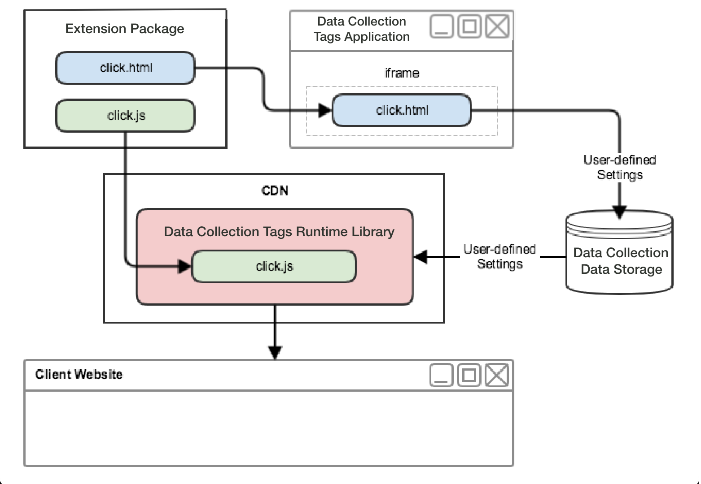

# Web extension flow

In webextensies heeft elk type gebeurtenis, voorwaarde, handeling en gegevenselement zowel een weergave waarmee gebruikers instellingen kunnen wijzigen als een bibliotheekmodule die op deze door de gebruiker gedefinieerde instellingen kan werken.

Zoals het volgende diagram op hoog niveau toont, zal de de gebeurtenistypemening van de uitbreiding binnen iframe binnen de toepassing worden getoond die met Adobe Experience Platform wordt geïntegreerd. Vervolgens gebruikt de gebruiker de weergave om instellingen te wijzigen die vervolgens in Experience Platform worden opgeslagen. Wanneer de tagruntimebibliotheek is gemaakt, worden zowel de gebeurtenisbibliotheekmodule van de extensie als de door de gebruiker gedefinieerde instellingen opgenomen in de runtimebibliotheek. Tijdens runtime injecteert Experience Platform de door de gebruiker gedefinieerde instellingen in de module Bibliotheek.

In het volgende diagram kunt u het verband tussen gebeurtenissen, voorwaarden en acties binnen de stroom van de regelverwerking zien.

De stroom van de regelverwerking bevat de volgende fasen:

1. De methoden `settings` en `trigger` worden bij het opstarten aan de gebeurtenisbibliotheekmodule geleverd.
1. Wanneer de gebeurtenisbibliotheekmodule bepaalt dat de gebeurtenis heeft plaatsgevonden, roept de gebeurtenisbibliotheekmodule `trigger` aan.
1. De markeringen gaat `settings` in de modules van de voorwaardenbibliotheek van de regel over waar de voorwaarden worden geëvalueerd.
1. Elke module van de voorwaardenbibliotheek keert terug of een voorwaarde aan waar evalueert.
1. Als alle voorwaarden overgaan, worden de acties van de regel uitgevoerd.
