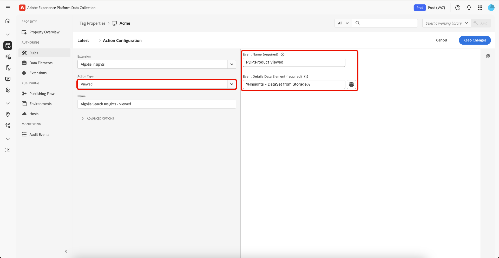

# [!DNL Algolia] Overzicht van de extensie Codes

Met de extensie [!DNL Algolia] Tags kunnen marketers eenvoudig regels instellen die gebruikersinteractiegegevens naar [!DNL Algolia] verzenden, zodat u meer persoonlijke AI-zoekervaringen kunt bieden.

Deze extensie wordt aangedreven door een sleutelfunctie:

* **[!DNL Algolia]Inzichten**: legt automatisch gebruikersinteractiegebeurtenissen vast en verzendt naar [!DNL Algolia] , wat krachtige analyses, gepersonaliseerde ervaringen en betere onderzoeksrelevantie toelaat.

## Vereisten {#prerequisites}

U moet een geldige [!DNL Algolia] -account hebben om deze extensie te kunnen gebruiken. Ga naar [[!DNL Algolia]  onderteken omhoog pagina &#x200B;](https://dashboard.algolia.com/users/sign_up) om een rekening tot stand te brengen als u niet reeds hebt.

### Verzamel vereiste configuratiedetails {#configuration-details}

Als u [!DNL Algolia] wilt verbinden met Adobe Experience Platform, hebt u de volgende informatie nodig:

| Credentials | Beschrijving | Voorbeeld |
| --- | --- | --- |
| Toepassings-id | Uw identiteitskaart van de Toepassing kan in de [&#x200B; API Sleutels &#x200B;](https://www.algolia.com/account/api-keys/all) sectie van uw [!DNL Algolia] dashboard worden gevonden. | 0ABCDEFG12 |
| API-sleutel zoeken | Uw Sleutel van Onderzoek API kan in de [&#x200B; API Sleutels &#x200B;](https://www.algolia.com/account/api-keys/all) sectie van uw [!DNL Algolia] dashboard worden gevonden. | 1234a12345678901b1234567890c1 |

## De extensie [!DNL Algolia] Insights installeren en configureren {#install-configure}

Als u de extensie [!DNL Algolia] Insights wilt installeren, navigeert u naar [!UICONTROL Data Collection UI] en selecteert u **[!UICONTROL Tags]** in de linkernavigatie. Selecteer van hieruit een eigenschap waaraan u de extensie wilt toevoegen of maak een nieuwe eigenschap.

Wanneer u de gewenste eigenschap hebt geselecteerd of gemaakt, selecteert u **[!UICONTROL Extensions]** in de linkernavigatie en selecteert u vervolgens de tab **[!UICONTROL Catalog]** . Zoek naar de [!DNL Algolia] Inzichten kaart, dan uitgezocht **[!UICONTROL Install]**.


In de configuratieweergave die wordt weergegeven, moet u de volgende details opgeven:

| Eigenschap | Beschrijving |
| --- | --- |
| [!UICONTROL Application ID] | Ga [!UICONTROL Application Id] in u eerder in de [&#x200B; configuratiedetails &#x200B;](#configuration-details) sectie vergaarde. |
| [!UICONTROL Search API Key] | Ga [!UICONTROL Search API Key] in u eerder in de [&#x200B; configuratiedetails &#x200B;](#configuration-details) sectie vergaarde. |
| [!UICONTROL Index Name] | [!UICONTROL Index Name] bevat de producten of inhoud.  Deze index wordt als standaard gebruikt. |
| [!UICONTROL User Token Data Element] | Het gegevenselement dat het gebruikerstoken zal terugkeren. |
| [!UICONTROL Authenticated User Token Data Element] | Stel het gegevenselement in dat het geverifieerde gebruikerstoken retourneert. |
| [!UICONTROL Currency Code] | Voer de valutacode in ISO-4217-notatie in, zoals USD of EUR. Dit veld ondersteunt gegevenselementen. |


## [!DNL Algolia] Typen handelingen voor extensies voor inzichten {#action-types}

[!DNL Algolia] ondersteunt een set vooraf gedefinieerde standaardgebeurtenissen, elk met specifieke contexten en eigenschappen. De acties die beschikbaar zijn in de extensie [!DNL Algolia], worden uitgelijnd op deze gebeurtenistypen, waardoor het eenvoudig is om de gebeurtenissen die u naar [!DNL Algolia] verzendt, te categoriseren en te configureren op basis van het type.

### Inzichten laden {#load-insights}

>[!NOTE]
>
>In de meeste gevallen is het raadzaam [!DNL Algolia] Inzichten te laden op elke pagina van uw site.

Voeg de handeling **[!UICONTROL Load Insights]** toe aan de labelregel waar dit het meest zinvol is voor het laden van [!DNL Algolia] -inzichten op basis van de context van uw regel. Met deze handeling wordt de `search-insights.js` -bibliotheek op de pagina geladen.

Maak een nieuwe labelregel of open een bestaande regel. Definieer de voorwaarden volgens uw vereisten en selecteer vervolgens **[!UICONTROL Algolia]** als de [!UICONTROL Extension] en selecteer **[!UICONTROL Load Insights]** als de [!UICONTROL Action Type] .

| Eigenschap | Beschrijving |
| --- | --- |
| [!UICONTROL Insight Library Version] | De versie van [!DNL Algolia] Insights. De standaardwaarde is `2.17.3` . |
| [!UICONTROL User Opt Out Data Element] | Het gegevenselement dat de voorkeur van de gebruiker het volgen vangt. |
| [!UICONTROL Use User Token Cookie] | Schakel dit selectievakje in als u wilt dat [!DNL Algolia] een gebruikerstoken-cookie genereert. Deze optie is standaard ingesteld op `true` . |


### Geklikt {#clicked}

Voeg de handeling **[!UICONTROL Click]** toe aan de tagregel om aangeklikte gebeurtenissen naar [!DNL Algolia] te verzenden. Maak een nieuwe labelregel of open een bestaande regel. Definieer de voorwaarden volgens uw vereisten en selecteer vervolgens **[!UICONTROL Algolia]** als de [!UICONTROL Extension] en selecteer **[!UICONTROL Clicked]** als de [!UICONTROL Action Type] .

| Eigenschap | Beschrijving |
| --- | --- |
| [!UICONTROL Event Name] | De naam van de gebeurtenis die kan worden gebruikt om deze klikgebeurtenis verder te verfijnen. |
| [!UICONTROL Event Details Data Element] | Het gegevenselement retourneert gebeurtenisdetails in JSON-indeling, waaronder: <ul><li>`indexName`</li><li>`objectIDs`</li><li>`queryID` (optioneel)</li><li>`positions` (optioneel)</li><li>`price` (optioneel)</li><li>`quantity` (optioneel)</li><li>`discount` (optioneel)</li><li>`objectData` (optioneel)</li><li>`currency` (optioneel)</li></ul> |


>[!NOTE]
>
>Als zowel `queryID` als `positions` inbegrepen zijn, wordt de gebeurtenis geclassificeerd als **Gepliceerde voorwerp IDs na Onderzoek**. Anders, is het geclassificeerd als a **Geklikte voorwerp IDs** gebeurtenis.
><br>
>Als het Element van Gegevens geen `indexName` verstrekt, zal de **Naam Standaard van de Index** worden gebruikt wanneer de gebeurtenis wordt verzonden.


Voor meer informatie over de gebeurteniscategorieën, zie [&#x200B; Gecliceerde objecten IDs na onderzoek &#x200B;](https://www.algolia.com/doc/api-reference/api-methods/clicked-object-ids-after-search/)
en [&#x200B; klikte objecten IDs &#x200B;](https://www.algolia.com/doc/api-reference/api-methods/clicked-object-ids/) gidsen.

### Omgezet {#converted}

Voeg de handeling **[!UICONTROL Converted]** toe aan de labelregel om geconverteerde gebeurtenissen naar [!DNL Algolia] te verzenden. Maak een nieuwe labelregel of open een bestaande regel. Definieer de voorwaarden volgens uw vereisten en selecteer vervolgens **[!UICONTROL Algolia]** als de [!UICONTROL Extension] en selecteer **[!UICONTROL Converted]** als de [!UICONTROL Action Type] .

| Eigenschap | Beschrijving |
| --- | --- |
| [!UICONTROL Event Name] | De Naam van de Gebeurtenis die zal worden gebruikt om deze **te verfijnen zet** gebeurtenis om. |
| [!UICONTROL Event Details Data Element] | Het gegevenselement retourneert gebeurtenisdetails, waaronder: <ul><li>`indexName`</li><li>`objectIDs`</li><li>`queryID` (optioneel)</li><li>`recordID` (optioneel)</li></ul> |

>[!NOTE]
>
>Als het Element van Gegevens `queryId` bevat, wordt de gebeurtenis geclassificeerd als **na Onderzoek** wordt omgezet. Anders, zal het als a **Omgezette** gebeurtenis worden geclassificeerd.
><br>
>Als het Element van Gegevens geen `indexName` verstrekt, zal de **Naam Standaard van de Index** worden gebruikt wanneer de gebeurtenis wordt verzonden.


Voor meer informatie over de gebeurteniscategorieën, zie [&#x200B; Omgezette objecten IDs na onderzoek &#x200B;](https://www.algolia.com/doc/api-reference/api-methods/converted-object-ids-after-search/) en [&#x200B; Omgezette objecten IDs &#x200B;](https://www.algolia.com/doc/api-reference/api-methods/converted-object-ids/) gidsen.

### Toegevoegd aan winkelwagentje {#added-to-cart}

Voeg de handeling **[!UICONTROL Added to Cart]** toe aan de labelregel om toegevoegd aan tekengebeurtenissen naar [!DNL Algolia] te verzenden. Maak een nieuwe labelregel of open een bestaande regel. Definieer de voorwaarden volgens uw vereisten en selecteer vervolgens **[!UICONTROL Algolia]** als de [!UICONTROL Extension] en selecteer **[!UICONTROL Added to cart]** als de [!UICONTROL Action Type] .

| Eigenschap | Beschrijving |
| --- | --- |
| [!UICONTROL Event Name] | De Naam van de Gebeurtenis die zal worden gebruikt om dit **verder te verfijnen voegt aan kart** gebeurtenis toe. |
| [!UICONTROL Event Details Data Element] | Het gegevenselement retourneert gebeurtenisdetails in JSON-indeling, waaronder: <ul><li>`indexName`</li><li>`objectIDs`</li><li>`objectData`</li><li>`price`</li><li>`quantity`</li><li>`discount` (optioneel)</li><li>`queryID` (optioneel)</li><li>`currency` (optioneel)</li></ul>. |

>[!NOTE]
>
>Als het Element van Gegevens `queryId` bevat, zal de gebeurtenis als **worden geclassificeerd die aan kart voorwerp IDs na Onderzoek** wordt toegevoegd. Anders, zal het als a **worden geclassificeerd Toegevoegd aan de gebeurtenis van identiteitskaarts van het wortelvoorwerp**.
><br>
>Als het Element van Gegevens geen `indexName` verstrekt, zal de **Naam Standaard van de Index** worden gebruikt wanneer de gebeurtenis wordt verzonden.
><br>
>Als de standaardgegevenselementen niet aan uw vereisten voldoen, kan een aangepast gegevenselement worden gemaakt om de gewenste gebeurtenisdetails te retourneren.


Voor meer informatie over de gebeurteniscategorieën, zie [&#x200B; Toegevoegd aan kart voorwerp IDs na onderzoek &#x200B;](https://www.algolia.com/doc/api-reference/api-methods/added-to-cart-object-ids-after-search/) en [&#x200B; Toegevoegd aan de gidsen van identiteitskaarts van het wortelvoorwerp &#x200B;](https://www.algolia.com/doc/api-reference/api-methods/added-to-cart-object-ids/).

### Aangeschaft {#purchased}

Voeg de handeling **[!UICONTROL Purchased]** toe aan de tagregel om aangeschafte gebeurtenissen naar [!DNL Algolia] te verzenden. Maak een nieuwe labelregel of open een bestaande regel. Definieer de voorwaarden volgens uw vereisten en selecteer vervolgens **[!UICONTROL Algolia]** als de [!UICONTROL Extension] en selecteer **[!UICONTROL Purchased]** als de [!UICONTROL Action Type] .

| Eigenschap | Beschrijving |
| --- | --- |
| [!UICONTROL Event Name] | De Naam van de Gebeurtenis die zal worden gebruikt om deze **aankoop** gebeurtenis verder te verfijnen. |
| [!UICONTROL Event Details Data Element] | Het gegevenselement retourneert gebeurtenisdetails in JSON-indeling, waaronder: <ul><li>`indexName`</li><li>`objectIDs`</li><li>`objectData`</li><li>`price`</li><li>`quantity`</li><li>`discount` (optioneel)</li><li>`queryID` (optioneel)</li><li>`currency` (optioneel)</li></ul>. |

>[!NOTE]
>
>Met de actie Aangeschaft haalt u gebeurtenisgegevens op van de browseropslag op basis van de id&#39;s van het aangeschafte item. Als om het even welke gekochte punten a `queryID` in hun opgeslagen gegevens bevatten, zal de gebeurtenis als **Aangeschafte voorwerp IDs na Onderzoek** worden geclassificeerd. Anders, zal het als a **Aangeschafte voorwerp IDs** gebeurtenis worden geclassificeerd.
><br>
>Op deze manier kan de aankoopgebeurtenis automatisch alle relevante context (query-id, indexnaam, prijs, hoeveelheid, korting) van de eerdere interactie van de gebruiker met de items opnemen.


Voor meer informatie over de gebeurteniscategorieën, zie [&#x200B; Aangeschafte objecten IDs na onderzoek &#x200B;](https://www.algolia.com/doc/api-reference/api-methods/purchased-object-ids-after-search/)
en [&#x200B; Gekochte objecten IDs &#x200B;](https://www.algolia.com/doc/api-reference/api-methods/purchased-object-ids/) gidsen.

### Weergegeven {#viewed}

Voeg de handeling **[!UICONTROL Viewed]** toe aan de tagregel om aangeschafte gebeurtenissen naar [!DNL Algolia] te verzenden. Maak een nieuwe labelregel of open een bestaande regel. Definieer de voorwaarden volgens uw vereisten en selecteer vervolgens **[!UICONTROL Algolia]** als de [!UICONTROL Extension] en selecteer **[!UICONTROL Viewed]** als de [!UICONTROL Action Type] .

| Eigenschap | Beschrijving |
| --- | --- |
| [!UICONTROL Event Name] | De Naam van de Gebeurtenis die zal worden gebruikt om deze **mening** gebeurtenis verder te verfijnen. |
| [!UICONTROL Event Details Data Element] | Het gegevenselement retourneert gebeurtenisdetails in JSON-indeling, waaronder: <ul><li>`indexName`</li><li>`objectIDs`</li></ul> |

>[!NOTE]
>
>Als het Element van Gegevens geen `indexName` verstrekt, zal de **Naam Standaard van de Index** worden gebruikt wanneer het verzenden van de gebeurtenis.



Voor meer informatie over de meningsgebeurtenis, zie [&#x200B; Bekeken voorwerp IDs &#x200B;](https://www.algolia.com/doc/api-reference/api-methods/viewed-object-ids/) gids.

## [!DNL Algolia] Insights-gegevenselementen voor extensies {#data-elements}

[!DNL Algolia] ondersteunt een set vooraf gedefinieerde gegevenselementen, elk met specifieke contexten en eigenschappen. In de volgende secties worden de gegevenselementen beschreven die beschikbaar zijn in de extensie [!DNL Algolia] Insights.

### DataSet {#dataset}

Het gegevenselement DataSet haalt gegevens op die zijn gekoppeld aan HTML-elementen, die vervolgens worden gebruikt in [!DNL Algolia] -handelingen. In dit gegevenselement worden de opgehaalde gebeurtenisgegevens automatisch opgeslagen in de browseropslag voor later gebruik (bijvoorbeeld bij conversie- of aankoopgebeurtenissen).

**Algemene Configuratie:**

| Eigenschap | Beschrijving |
| --- | --- |
| [!UICONTROL Hit Element Div/Class Name] | De HTML Element Name en/of CSS Class Name die de gegevenssetkenmerken bevat, inclusief `data-insights-object-id` en optioneel `data-insights-query-id` en `data-insights-position` op het HTML Element. |
| [!UICONTROL Index Name Element Div/Class Name] | De HTML-elementnaam en/of CSS-klassenaam die de gegevenssetkenmerken (`data-indexname`) heeft op het HTML-element. |

**Configuratie van Commerce (Facultatief):**

| Eigenschap | Beschrijving |
| --- | --- |
| [!UICONTROL Price Data Element] | Het Element van gegevens dat de prijs voor het punt terugkeert. Indien verstrekt, zal dit in de opgeslagen gebeurtenisgegevens voor handelsgebeurtenissen worden omvat. |
| [!UICONTROL Quantity Data Element] | Gegevenselement dat de hoeveelheid voor het item retourneert. De standaardwaarde is 1 als deze niet is opgegeven. |
| [!UICONTROL Discount Data Element] | Het Element van gegevens dat de korting decimale waarde voor het punt terugkeert. |
| [!UICONTROL Currency Code] | De valutacode in ISO-4217-formaat. Als er geen valutacode is opgegeven, wordt de standaardvaluta van de extensieconfiguratie gebruikt. |

**treedt (Facultatieve) met voeten:**

Met deze velden kunt u het standaardgedrag negeren van het ophalen van gegevens uit HTML-gegevenssetkenmerken.

| Eigenschap | Beschrijving |
| --- | --- |
| [!UICONTROL Record ID Data Element] | Overschrijf de standaardbenadering om pagina-URL als record-id te gebruiken. De record-id wordt gebruikt om gegevens op te slaan en op te zoeken die naar [!DNL Algolia] moeten worden verzonden voor dit product/deze pagina. |
| [!UICONTROL Query ID Data Element] | Identiteitskaart van de Vraag wordt teruggewonnen van de dataset op het element van HTML. Om dit gedrag met voeten te treden, gebruik dit bezit om een gegevenselement te verstrekken dat identiteitskaart van de Vraag als koord terugkeert. |
| [!UICONTROL Object IDs Data Element] | De object-id&#39;s worden opgehaald uit de gegevensset in het HTML-element. Als u dit gedrag wilt overschrijven, gebruikt u deze eigenschap om een gegevenselement op te geven dat de object-id&#39;s als een array retourneert. |
| [!UICONTROL Positions Data Element] | De posities worden opgehaald uit de dataset op het element HTML. Als u dit gedrag wilt overschrijven, gebruikt u deze eigenschap om een gegevenselement op te geven dat de posities als een array retourneert. |
| [!UICONTROL Index Name Data Element] | De naam van de Index wordt teruggewonnen uit de dataset op het element van HTML. Als u dit gedrag wilt overschrijven, gebruikt u deze eigenschap om een gegevenselement op te geven dat de indexnaam als een tekenreeks retourneert. |


Dit gegevenselement retourneert:

```javascript
{
  timestamp,
  queryID,
  indexName,
  objectIDs,
  positions,
  objectData,  // Optional: commerce data if price is provided
  currency,    // Optional: if provided
  recordID
}
```

Een voorbeeld van HTML dat dataset bevat:

```html
<div data-indexname="acme_master_default_products" class="instant-search-comp__hits">
  <div class="hit-card"
    data-insights-object-id="${hit.objectID}"
    data-insights-position="${hit.__position}"
    data-insights-query-id="${hit.__queryID}">
    <h4 class="hit-name">...</h4>   
  </div>
</div>
```

### Tekenreeks query {#query-string}

Het gegevenselement Tekenreeks extraheert gegevens uit de URL-queryreeks die moet worden gebruikt in [!DNL Algolia] -handelingen.

| Eigenschap | Beschrijving |
| --- | --- |
| [!UICONTROL Object ID Param Name] | De naam van het vraagparam die identiteitskaart van Objecten bevat. |
| [!UICONTROL Index Name Param Name] | De naam van het vraagparam die de Naam van de Index bevat. |
| [!UICONTROL Query ID Param Name] | De naam van het vraagparam die identiteitskaart van de Vraag bevat. |
| [!UICONTROL Position Param Name] | De naam van het vraagparam die de Positie bevat. |


Dit gegevenselement retourneert:

```javascript
{
  timestamp,
  queryID,
  indexName,
  objectIDs,
  positions
}
```

Een voorbeeld van HTML dat queryparameters bevat:

```html
<a href="product.html?objectID=${hit.objectID}&queryID=${hit.__queryID}&indexName=${indexName}&position=${hit.position}">Read More</a>
```

### Opslag {#storage}

Het Storage Data Element haalt gegevens op uit de browsersessieopslag voor gebruik in [!DNL Algolia] -handelingen. Dit gegevenselement kan ook worden gebruikt om de opgeslagen gegevens met extra handelsinformatie te verhogen.

Dit gegevenselement wint gebeurtenisdetails terug die eerder in zittingsopslag (typisch door het gegevenselement DataSet tijdens klikgebeurtenissen) werden opgeslagen. De gegevens worden automatisch verwijderd tijdens conversiegebeurtenissen, tenzij het verwijderen expliciet wordt uitgeschakeld.

**treedt (Facultatieve) met voeten:**

| Eigenschap | Beschrijving |
| --- | --- |
| [!UICONTROL Record ID Data Element] | De record-id wordt gebruikt als sleutel om de gebeurtenisgegevens op te zoeken die in de browseropslag zijn opgeslagen. De pagina-URL is de standaard-record-id. Gebruik deze eigenschap om dit gedrag te negeren en een gegevenselement op te geven dat de record-id als een tekenreeks retourneert. |
| [!UICONTROL Price Data Element] | Het Element van gegevens dat de prijs voor het punt terugkeert. Als deze optie wordt opgegeven, worden de opgeslagen gebeurtenisgegevens bijgewerkt met prijsinformatie. |
| [!UICONTROL Quantity Data Element] | Gegevenselement dat de hoeveelheid voor het item retourneert. Als deze optie wordt opgegeven, worden de opgeslagen gebeurtenisgegevens bijgewerkt met informatie over de hoeveelheid. |
| [!UICONTROL Discount Data Element] | Het Element van gegevens dat de korting decimale waarde voor het punt terugkeert. Als deze optie wordt opgegeven, worden de opgeslagen gebeurtenisgegevens bijgewerkt met kortingsinformatie. |
| [!UICONTROL Currency Code] | Voer de valutacode in ISO-4217-indeling in. Als deze optie wordt opgegeven, worden de opgeslagen gebeurtenisgegevens bijgewerkt met valutagegevens. |


Dit Element van Gegevens keert wat in de Opslag van de Zitting, met inbegrip van om het even welke verhoogde handelsgegevens terug wordt opgeslagen:

```javascript
{
  timestamp,
  queryID,
  indexName,
  objectIDs,
  positions,      // If available from original event
  objectData,     // Optional: commerce data if price is provided
  currency,       // Optional: if provided
  recordID
}
```

## Na zoeken op klikken of Omgezet {#clicked-converted-after-search}

*klikte na Onderzoek* of *na Onderzoek* gebeurtenissen vereist a `queryID`, en `positions` wordt ook vereist voor *geklikt na Onderzoek*. Deze eigenschappen zijn beschikbaar wanneer de markering `insights` is ingeschakeld in zoekparameters van InstantSearch en/of AutoComplete. Raadpleeg de volgende bronnen voor informatie over het configureren van inzichten voor uw site:

* [&#x200B; Vestiging Inzichten op Autocomplete &#x200B;](https://www.algolia.com/doc/ui-libraries/autocomplete/api-reference/autocomplete-js/autocomplete/#param-insights)
* [&#x200B; VestigingsInzichten op InstantSearch.js &#x200B;](https://www.algolia.com/doc/guides/building-search-ui/events/js/#set-the-insights-option-to-true)
* [&#x200B; krijgen begonnen met klik en omzettingsgebeurtenissen &#x200B;](https://www.algolia.com/doc/guides/sending-events/implementing/how-to/sending-events-backend/)
* [&#x200B; Verzendend  [!DNL Algolia]  gebeurtenissen van Inzichten &#x200B;](https://www.algolia.com/doc/ui-libraries/autocomplete/guides/sending-algolia-insights-events/)
* [[!DNL Algolia]  Opslagplaats van de Bewaarplaats van de Uitbreiding GitHub van de Lancering &#x200B;](https://github.com/algolia/algolia-launch-extension)
* [&#x200B; Documentatie InstantSearch.js &#x200B;](https://www.algolia.com/doc/guides/building-search-ui/what-is-instantsearch/js/)
* [[!DNL Algolia]  Inzichten API Documentatie &#x200B;](https://www.algolia.com/doc/rest-api/insights/)
* [&#x200B; Algolië de Reparatie van de Code van de Uitbreiding van de Lancering &#x200B;](https://github.com/algolia/algolia-launch-extension)

## Volgende stappen {#next-steps}

In deze handleiding wordt beschreven hoe u gegevens naar [!DNL Algolia] kunt verzenden met de tagextensie [!DNL Algolia Insights] . Als u op het verzenden van server-zijgebeurtenissen aan [!DNL Algolia] ook van plan bent, kunt u nu te werk gaan om de [[!DNL Conversions API]  gebeurtenis te installeren en te vormen door:sturen uitbreiding &#x200B;](../../server/algolia/overview.md).

Voor meer informatie over markeringen in Experience Platform, verwijs naar het [&#x200B; overzicht van markeringen &#x200B;](../../../home.md).
