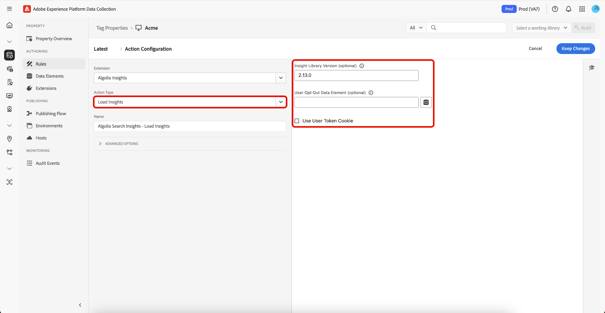

# [!DNL Algolia] Overzicht van de extensie Codes

Met de extensie [!DNL Algolia] Tags kunnen marketers eenvoudig regels instellen die gebruikersinteractiegegevens naar [!DNL Algolia] verzenden, zodat u meer persoonlijke AI-zoekervaringen kunt bieden.

Deze extensie wordt aangedreven door een sleutelfunctie:

* **[!DNL Algolia]Inzichten**: legt automatisch gebruikersinteractiegebeurtenissen vast en verzendt naar [!DNL Algolia] , wat krachtige analyses, gepersonaliseerde ervaringen en betere onderzoeksrelevantie toelaat.

## Vereisten {#prerequisites}

U moet een geldige [!DNL Algolia] -account hebben om deze extensie te kunnen gebruiken. Ga naar [[!DNL Algolia]  onderteken omhoog pagina ](https://dashboard.algolia.com/users/sign_up) om een rekening tot stand te brengen als u niet reeds hebt.

### Verzamel vereiste configuratiedetails {#configuration-details}

Als u [!DNL Algolia] wilt verbinden met Adobe Experience Platform, hebt u de volgende informatie nodig:

| Credentials | Beschrijving | Voorbeeld |
| --- | --- | --- |
| Toepassings-id | Uw identiteitskaart van de Toepassing kan in de [ API Sleutels ](https://www.algolia.com/account/api-keys/all) sectie van uw [!DNL Algolia] dashboard worden gevonden. | 0ABCDEFG12 |
| API-sleutel zoeken | Uw Sleutel van Onderzoek API kan in de [ API Sleutels ](https://www.algolia.com/account/api-keys/all) sectie van uw [!DNL Algolia] dashboard worden gevonden. | 1234a12345678901b1234567890c1 |

## De extensie [!DNL Algolia] Insights installeren en configureren {#install-configure}

Als u de extensie [!DNL Algolia] Insights wilt installeren, navigeert u naar [!UICONTROL Data Collection UI] en selecteert u **[!UICONTROL Tags]** in de linkernavigatie. Selecteer van hieruit een eigenschap waaraan u de extensie wilt toevoegen of maak een nieuwe eigenschap.

Wanneer u de gewenste eigenschap hebt geselecteerd of gemaakt, selecteert u **[!UICONTROL Extensions]** in de linkernavigatie en selecteert u vervolgens de tab **[!UICONTROL Catalog]** . Zoek naar de [!DNL Algolia] Inzichten kaart, dan uitgezocht **[!UICONTROL Install]**.


In de configuratieweergave die wordt weergegeven, moet u de volgende details opgeven:

| Eigenschap | Beschrijving |
| --- | --- |
| Toepassings-id | Ga [!UICONTROL Application Id] in u eerder in de [ configuratiedetails ](#configuration-details) sectie vergaarde. |
| API-sleutel zoeken | Ga [!UICONTROL Search API Key] in u eerder in de [ configuratiedetails ](#configuration-details) sectie vergaarde. |
| Indexnaam | [!UICONTROL Index Name] bevat de producten of inhoud.  Deze index wordt als standaard gebruikt. |
| Gegevenselement gebruikerstoken | Het gegevenselement dat het gebruikerstoken zal terugkeren. |
| Geverifieerd gegevenselement voor gebruikerstoken | Stel het gegevenselement in dat het geverifieerde gebruikerstoken retourneert. |
| Valuta | Selecteer een valutatype.  De standaardwaarde wordt ingesteld op `USD` . |


## [!DNL Algolia] Typen handelingen voor extensies voor inzichten {#action-types}

[!DNL Algolia] ondersteunt een set vooraf gedefinieerde standaardgebeurtenissen, elk met specifieke contexten en eigenschappen. De acties die beschikbaar zijn in de extensie [!DNL Algolia], worden uitgelijnd op deze gebeurtenistypen, waardoor het eenvoudig is om de gebeurtenissen die u naar [!DNL Algolia] verzendt, te categoriseren en te configureren op basis van het type.

### Inzichten laden {#load-insights}

>[!NOTE]
>
>In de meeste gevallen is het raadzaam [!DNL Algolia] Inzichten te laden op elke pagina van uw site.

Voeg de handeling **[!UICONTROL Load Insights]** toe aan de labelregel waar dit het meest zinvol is voor het laden van [!DNL Algolia] -inzichten op basis van de context van uw regel. Met deze handeling wordt de `search-insights.js` -bibliotheek op de pagina geladen.

Maak een nieuwe labelregel of open een bestaande regel. Definieer de voorwaarden volgens uw vereisten en selecteer vervolgens **[!UICONTROL Algolia]** als de [!UICONTROL Extension] en selecteer **[!UICONTROL Load Insights]** als de [!UICONTROL Action Type] .

| Eigenschap | Beschrijving |
| --- | --- |
| [!UICONTROL Insight Library Version] | De versie van [!DNL Algolia] Insights. De standaardwaarde is `2.13.0` . |
| [!UICONTROL User Opt Out Data Element] | Het gegevenselement dat de voorkeur van de gebruiker het volgen vangt. |
| [!UICONTROL Use User Token Cookie] | Schakel dit selectievakje in als u wilt dat [!DNL Algolia] een gebruikerstoken-cookie genereert. Deze optie is standaard ingesteld op `false` . |



### Geklikt {#clicked}

Voeg de handeling **[!UICONTROL Click]** toe aan de tagregel om aangeklikte gebeurtenissen naar [!DNL Algolia] te verzenden. Maak een nieuwe labelregel of open een bestaande regel. Definieer de voorwaarden volgens uw vereisten en selecteer vervolgens **[!UICONTROL Algolia]** als de [!UICONTROL Extension] en selecteer **[!UICONTROL Clicked]** als de [!UICONTROL Action Type] .

| Eigenschap | Beschrijving |
| --- | --- |
| [!UICONTROL Event Name] | De naam van de gebeurtenis die kan worden gebruikt om deze klikgebeurtenis verder te verfijnen. |
| Gegevenselement voor gebeurtenisdetails | Het gegevenselement retourneert gebeurtenisdetails, waaronder: <ul><li>`indexName`</li><li>`objectIDs`</li><li>`queryID` (optioneel)</li><li>`position` (optioneel)</li></ul> |

>[!NOTE]
>
>Als zowel `queryID` als `position` inbegrepen zijn, wordt de gebeurtenis geclassificeerd als **Gepliceerde voorwerp IDs na Onderzoek**. Anders, is het geclassificeerd als a **Geklikte voorwerp IDs** gebeurtenis.
>><br><br>
>>Als het Element van Gegevens geen `indexName` verstrekt, zal de **Naam Standaard van de Index** worden gebruikt wanneer de gebeurtenis wordt verzonden.


Voor meer informatie over de gebeurteniscategorieën, zie [ Gecliceerde objecten IDs na onderzoek ](https://www.algolia.com/doc/api-reference/api-methods/clicked-object-ids-after-search/)
en [ klikte objecten IDs ](https://www.algolia.com/doc/api-reference/api-methods/clicked-object-ids/) gidsen.

### Omgezet {#converted}

Voeg de handeling **[!UICONTROL Converted]** toe aan de labelregel om geconverteerde gebeurtenissen naar [!DNL Algolia] te verzenden. Maak een nieuwe labelregel of open een bestaande regel. Definieer de voorwaarden volgens uw vereisten en selecteer vervolgens **[!UICONTROL Algolia]** als de [!UICONTROL Extension] en selecteer **[!UICONTROL Converted]** als de [!UICONTROL Action Type] .

| Eigenschap | Beschrijving |
| --- | --- |
| Gebeurtenisnaam | De Naam van de Gebeurtenis die zal worden gebruikt om deze **te verfijnen zet** gebeurtenis om. |
| Gegevenselement voor gebeurtenisdetails | Het gegevenselement retourneert gebeurtenisdetails, waaronder: <ul><li>`indexName`</li><li>`objectIDs`</li><li>`queryID` (optioneel)</li></ul> |

>[!NOTE]
>
>Als het Element van Gegevens `queryId` bevat, wordt de gebeurtenis geclassificeerd als **na Onderzoek** wordt omgezet. Anders, zal het als a **Omgezette** gebeurtenis worden geclassificeerd.
>><br><br>
>>Als het Element van Gegevens geen `indexName` verstrekt, zal de **Naam Standaard van de Index** worden gebruikt wanneer de gebeurtenis wordt verzonden.


Voor meer informatie over de gebeurteniscategorieën, zie [ Omgezette objecten IDs na onderzoek ](https://www.algolia.com/doc/api-reference/api-methods/converted-object-ids-after-search/) en [ Omgezette objecten IDs ](https://www.algolia.com/doc/api-reference/api-methods/converted-object-ids/) gidsen.

### Toegevoegd aan winkelwagentje {#added-to-cart}

Voeg de handeling **[!UICONTROL Added to Cart]** toe aan de labelregel om toegevoegd aan tekengebeurtenissen naar [!DNL Algolia] te verzenden. Maak een nieuwe labelregel of open een bestaande regel. Definieer de voorwaarden volgens uw vereisten en selecteer vervolgens **[!UICONTROL Algolia]** als de [!UICONTROL Extension] en selecteer **[!UICONTROL Added to cart]** als de [!UICONTROL Action Type] .

| Eigenschap | Beschrijving |
| --- | --- |
| Gebeurtenisnaam | De Naam van de Gebeurtenis die zal worden gebruikt om deze **te verfijnen zet** gebeurtenis om. |
| Gegevenselement voor gebeurtenisdetails | Het gegevenselement retourneert gebeurtenisdetails, waaronder: <ul><li>`indexName`</li><li>`objectIDs`</li><li>`objectData`<ul><li>`queryID` (optioneel)</li><li>`price`</li><li>`quantity`</li><li>`discount`</li></ul></li><li>`queryID` (optioneel)</li></ul>. |
| Valuta | Geeft het type valuta aan, bijvoorbeeld `USD` . |

>[!NOTE]
>
>Als het Element van Gegevens `queryId` bevat, zal de gebeurtenis als **worden geclassificeerd die aan kart voorwerp IDs na Onderzoek** wordt toegevoegd. Anders, zal het als a **worden geclassificeerd Toegevoegd aan de gebeurtenis van identiteitskaarts van het wortelvoorwerp**.
>><br><br>
>>Als het Element van Gegevens geen `indexName` verstrekt, zal de **Naam Standaard van de Index** worden gebruikt wanneer de gebeurtenis wordt verzonden.
>><br><br>
>>Als de standaardgegevenselementen niet aan uw vereisten voldoen, kan een aangepast gegevenselement worden gemaakt om de gewenste gebeurtenisdetails te retourneren.


Voor meer informatie over de gebeurteniscategorieën, zie [ Toegevoegd aan kart voorwerp IDs na onderzoek ](https://www.algolia.com/doc/api-reference/api-methods/added-to-cart-object-ids-after-search/) en [ Toegevoegd aan de gidsen van identiteitskaarts van het wortelvoorwerp ](https://www.algolia.com/doc/api-reference/api-methods/added-to-cart-object-ids/).

### Aangeschaft {#purchased}

Voeg de handeling **[!UICONTROL Purchased]** toe aan de tagregel om aangeschafte gebeurtenissen naar [!DNL Algolia] te verzenden. Maak een nieuwe labelregel of open een bestaande regel. Definieer de voorwaarden volgens uw vereisten en selecteer vervolgens **[!UICONTROL Algolia]** als de [!UICONTROL Extension] en selecteer **[!UICONTROL Purchased]** als de [!UICONTROL Action Type] .

| Eigenschap | Beschrijving |
| --- | --- |
| Gebeurtenisnaam | De Naam van de Gebeurtenis die zal worden gebruikt om deze **aankoop** gebeurtenis verder te verfijnen. |
| Gegevenselement voor gebeurtenisdetails | Het gegevenselement retourneert gebeurtenisdetails, waaronder: <ul><li>`indexName`</li><li>`objectIDs`</li><li>`objectData`<ul><li>`queryID` (optioneel)</li><li>`price`</li><li>`quantity`</li><li>`discount`</li></ul></li><li>`queryID` (optioneel)</li></ul>. |
| Valuta | Geeft het type valuta aan, bijvoorbeeld `USD` . |

>[!NOTE]
>
>Als het Element van Gegevens `queryId` bevat, zal de gebeurtenis als **Aangeschafte voorwerp IDs na Onderzoek** worden geclassificeerd. Anders zal het als a **Aangeschafte voorwerp IDs** gebeurtenis worden geclassificeerd.
>><br><br>
>>Als het Element van Gegevens geen `indexName` verstrekt, zal de **Naam Standaard van de Index** worden gebruikt wanneer de gebeurtenis wordt verzonden.
>><br><br>
>>Als de standaardgegevenselementen niet aan uw vereisten voldoen, kan een aangepast gegevenselement worden gemaakt om de gewenste gebeurtenisdetails te retourneren.


Voor meer informatie over de gebeurteniscategorieën, zie [ Aangeschafte objecten IDs na onderzoek ](https://www.algolia.com/doc/api-reference/api-methods/purchased-object-ids-after-search/)
en [ Gekochte objecten IDs ](https://www.algolia.com/doc/api-reference/api-methods/purchased-object-ids/) gidsen.

### Weergegeven {#viewed}

Voeg de handeling **[!UICONTROL Viewed]** toe aan de tagregel om aangeschafte gebeurtenissen naar [!DNL Algolia] te verzenden. Maak een nieuwe labelregel of open een bestaande regel. Definieer de voorwaarden volgens uw vereisten en selecteer vervolgens **[!UICONTROL Algolia]** als de [!UICONTROL Extension] en selecteer **[!UICONTROL Viewed]** als de [!UICONTROL Action Type] .

| Eigenschap | Beschrijving |
| --- | --- |
| Gebeurtenisnaam | De Naam van de Gebeurtenis die zal worden gebruikt om deze **mening** gebeurtenis verder te verfijnen. |
| Gegevenselement voor gebeurtenisdetails | Het gegevenselement retourneert gebeurtenisdetails, waaronder: <ul><li>`indexName`</li><li>`objectIDs`</li></ul> |

>[!NOTE]
>
>Als het Element van Gegevens geen `indexName` verstrekt, zal de **Naam Standaard van de Index** worden gebruikt wanneer het verzenden van de gebeurtenis.


Voor meer informatie over de meningsgebeurtenis, zie [ Bekeken voorwerp IDs ](https://www.algolia.com/doc/api-reference/api-methods/viewed-object-ids/) gids.

## [!DNL Algolia] Insights-gegevenselementen voor extensies {#data-elements}

[!DNL Algolia] ondersteunt een set vooraf gedefinieerde gegevenselementen, elk met specifieke contexten en eigenschappen. In de volgende secties worden de gegevenselementen beschreven die beschikbaar zijn in de extensie [!DNL Algolia] Insights.

### DataSet {#dataset}

Het gegevenselement DataSet haalt gegevens op die zijn gekoppeld aan HTML-elementen, die vervolgens worden gebruikt in [!DNL Algolia] -handelingen.

| Eigenschap | Beschrijving |
| --- | --- |
| Div/klassenaam voor element aanpassen | De HTML-elementnaam en/of CSS-klassenaam die de gegevenssetkenmerken bevat, inclusief `data-insights-object-id` en optioneel `data-insights-query-id` en `data-insights-position` op het HTML-element. |
| Index Name Element Div/Class Name | De HTML-elementnaam en/of CSS-klassenaam die de gegevenssetkenmerken (`data-indexname`) heeft op het HTML-element. |


Dit gegevenselement retourneert:

```javascript
{
  timestamp,
  queryID,
  indexName,
  objectIDs,
  positions
}
```

Een voorbeeld van HTML dat dataset bevat:

```html
<div data-indexname="acme_master_default_products" class="instant-search-comp__hits">
  <div class="hit-card"
    data-insights-object-id="${hit.objectID}"
    data-insights-position="${hit.__position}"
    data-insights-query-id="${hit.__queryID}">
    <h4 class="hit-name">...</h4>   
  </div>
</div>
```

### Tekenreeks query {#query-string}

Het gegevenselement Tekenreeks extraheert gegevens uit de URL-queryreeks die moet worden gebruikt in [!DNL Algolia] -handelingen.

| Eigenschap | Beschrijving |
| --- | --- |
| Paraatheidsnaam van object-id | De naam van het vraagparam die Voorwerp ID bevat. |
| Naam indexnaam parameternaam (optioneel) | De naam van het vraagparam die de Naam van de Index bevat. |
| Naam van parameternaam voor query-id (optioneel) | De naam van het vraagparam die Vraag ID bevat. |
| Paramanaam plaatsen (optioneel) | De naam van het vraagparam die de Positie bevat. |


Dit gegevenselement retourneert:

```javascript
{
  timestamp,
  queryID,
  indexName,
  objectIDs
}
```

Een voorbeeld van HTML dat queryparameters bevat.

```
<a href="product.html?objectID=${hit.objectID}&queryID=${hit.__queryID}&indexName=${indexName}&position=${hit.position}">Read More</a>
```

### Opslag {#storage}

Het Storage Data Element haalt gegevens op van Session Storage voor gebruik in [!DNL Algolia] -handelingen.

Dit gegevenselement haalt gebeurtenisdetails van de Opslag van de Zitting op. Er is geen configuratie vereist. Het gegeven wordt automatisch toegevoegd tijdens de *klik* gebeurtenisactie en verwijderd tijdens *zet* gebeurtenisactie om.


Dit gegevenselement retourneert wat is opgeslagen in de Session Storage.

```javascript
{
  timestamp,
  queryID,
  indexName,
  objectIDs
}
```

## Na zoeken op klikken of Omgezet {#clicked-converted-after-search}

*klikte na Onderzoek* of *na Onderzoek* gebeurtenissen vereist a `queryId`, en `position` wordt ook vereist voor *geklikt na Onderzoek*. Deze eigenschappen zijn beschikbaar wanneer de markering `insights` is ingeschakeld in zoekparameters van InstantSearch en/of AutoComplete. Raadpleeg de volgende bronnen voor informatie over het configureren van inzichten voor uw site:

* [ Vestiging Inzichten op Autocomplete ](https://www.algolia.com/doc/ui-libraries/autocomplete/api-reference/autocomplete-js/autocomplete/#param-insights)
* [ VestigingsInzichten op InstantSearch.js ](https://www.algolia.com/doc/guides/building-search-ui/events/js/#set-the-insights-option-to-true)
* [ krijgen begonnen met klik en omzettingsgebeurtenissen ](https://www.algolia.com/doc/guides/sending-events/implementing/how-to/sending-events-backend/)
* [ Verzendend  [!DNL Algolia]  gebeurtenissen van Inzichten ](https://www.algolia.com/doc/ui-libraries/autocomplete/guides/sending-algolia-insights-events/)
* [[!DNL Algolia]  Opslagplaats van de Bewaarplaats van de Uitbreiding GitHub van de Lancering ](https://github.com/algolia/algolia-launch-extension)
* [ Documentatie InstantSearch.js ](https://www.algolia.com/doc/guides/building-search-ui/what-is-instantsearch/js/)
* [[!DNL Algolia]  Inzichten API Documentatie ](https://www.algolia.com/doc/rest-api/insights/)
* [ Algolië de Reparatie van de Code van de Uitbreiding van de Lancering ](https://github.com/algolia/algolia-launch-extension)

## Volgende stappen {#next-steps}

In deze handleiding wordt beschreven hoe u gegevens naar [!DNL Algolia] kunt verzenden met de tagextensie [!DNL Algolia Insights] . Als u op het verzenden van server-zijgebeurtenissen aan [!DNL Algolia] ook van plan bent, kunt u nu te werk gaan om de [[!DNL Conversions API]  gebeurtenis te installeren en te vormen door:sturen uitbreiding ](../../server/algolia/overview.md).

Voor meer informatie over markeringen in Experience Platform, verwijs naar het [ overzicht van markeringen ](../../../home.md).
