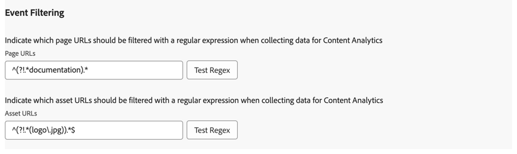

# Overzicht van de extensie Adobe Content Analytics

Met de tagextensie [!DNL Adobe Content Analytics] kunt u gebeurtenissen met betrekking tot inhoud op een website bijhouden. De extensie verzendt inhoudsgegevens (ervaringen en elementen) vanuit wegeigenschappen naar een gegevensstroom in Adobe Experience Cloud via de Experience Platform Edge Network.

Met de extensie kunt u specifieke gebeurtenisgegevens die door de inhoud worden vrijgegeven, streamen naar Experience Platform, zodat u die gegevens kunt gebruiken in rapporten voor inhoudsanalyse in Customer Journey Analytics.

In dit document wordt uitgelegd hoe u de tagextensie configureert in de gebruikersinterface voor tags.

## De Adobe Content Analytics-tagextensie installeren {#install}

>[!NOTE]
>
>De de markeringsuitbreiding van Adobe Content Analytics wordt automatisch geïnstalleerd als deel van het markeringsbezit dat automatisch wordt gecreeerd wanneer het gebruiken van de [ Content Analytics geleide configuratietovenaar ](https://experienceleague.adobe.com/en/docs/analytics-platform/using/content-analytics/configuration/guided){target="_blank"} .

### Handmatige installatie

In het geval van een handmatige configuratie moet voor de extensie van de Adobe Content Analytics-tag een eigenschap worden geïnstalleerd. Als u dit niet reeds hebt gedaan, zie de documentatie bij [ het creëren van een markeringsbezit ](https://experienceleague.adobe.com/en/docs/platform-learn/implement-in-websites/configure-tags/create-a-property).

Nadat u een bezit hebt gecreeerd of wanneer u het bezit dat gebruikend de [ Content Analytics geleide configuratietovenaar ](https://experienceleague.adobe.com/en/docs/analytics-platform/using/content-analytics/configuration/guided) wordt gecreeerd selecteert, open het bezit en selecteer het **[!UICONTROL Extensions]** lusje op de linkerzijbar.

Selecteer het tabblad **[!UICONTROL Catalog]**. Zoek in de lijst met beschikbare extensies naar de extensie **[!DNL Adobe Content Analytics]** en selecteer **[!UICONTROL Install]** .

Nadat u **[!UICONTROL Install]** hebt geselecteerd, moet u de extensie van de Adobe Content Analytics-tag configureren en de configuratie opslaan.

<!--
## Configure schema

The [Content Analytics guided configuration wizard](https://experienceleague.adobe.com/en/docs/analytics-platform/using/content-analytics/configuration/guided) automatically populates the proper value for the **[!UICONTROL Tenant Schema Name]**. 

>[!WARNING]
>
>Do not modify the value for **[!UICONTROL Tenant Schema Name]**.

-->

## Gegevensstromen configureren

De [ Content Analytics geleide configuratietovenaar ](https://experienceleague.adobe.com/en/docs/analytics-platform/using/content-analytics/configuration/guided) selecteert automatisch de juiste waarde voor **[!UICONTROL Sandbox]** en **[!UICONTROL Production Datastream]**. U kunt desgewenst een extra **[!UICONTROL Staging Datastream]** en **[!UICONTROL Development Datastream]** configureren.

 toont

U kunt de automatische geselecteerde waarden voor **[!UICONTROL Sandbox]** en **[!UICONTROL Production Datastream]** overschrijven voor het geval u Content Analytics wilt gebruiken voor een andere sandbox en met verschillende gegevensstreams. Als u dit doet, kunt u een sandbox en gegevensstreams selecteren in de beschikbare vervolgkeuzemenu&#39;s of **[!UICONTROL Enter values]** selecteren en een aangepaste gegevensstroom-id invoeren voor elke omgeving.

>[!IMPORTANT]
>
>Wanneer u een andere zandbak en gegevensstromen vormt, zorg ervoor dat
>
>* de geselecteerde sandbox is nog niet gekoppeld aan een andere Content Analytics-configuratie, en
>* Voor elke geselecteerde gegevensstroom is de Experience Platform-service geconfigureerd met een ingeschakelde gegevensset voor de ervaring van Content Analytics.

Zie de gids op [ gegevensstromen ](../../../../datastreams/overview.md) leren hoe te om een gegevensstroom te vormen.

## Vastleggen en definiëren van ervaring configureren

In de sectie **[!UICONTROL Experience Capture & Definition]** kunt u **[!UICONTROL Include Experiences]** de mogelijkheid bieden ervaringen op te nemen bij het verzamelen van gegevens voor Content Analytics.

1. Schakel **[!UICONTROL Include experiences]** in.
1. Optioneel. Geef de parameters op voor de weergave van inhoud op uw website. De parameters zijn nul of meer combinaties van a **[!UICONTROL Domain regular expression]** en **[!UICONTROL Query parameters]**.
   1. Voer een **[!UICONTROL Domain regular expression]** in, bijvoorbeeld `^(?!.*\b(store|help|admin)\b)` .
   1. Geef bijvoorbeeld een door komma&#39;s gescheiden lijst op van **[!UICONTROL Query parameters]** . `outdoors, patio, kitchen`
Gebruik  om individuele parameters te schrappen, of **[!UICONTROL Clear all]** om alle parameters te schrappen.
1. Selecteer **[!UICONTROL Remove]** als u een combinatie van de reguliere expressie van het domein en queryparameters wilt verwijderen.
1. Selecteer **[!UICONTROL Add Regex]** als u een andere combinatie van een reguliere expressie en queryparameters wilt toevoegen.

## Gebeurtenisfiltering configureren

In de sectie **[!UICONTROL Event Filtering]** kunt u de reguliere expressies wijzigen om te filteren **[!UICONTROL Page URLs]** en **[!UICONTROL Assets URLs]** wanneer u gegevens voor Content Analytics verzamelt. De regelmatige uitdrukkingen die u in de [ Content Analytics geleide configuratietovenaar ](https://experienceleague.adobe.com/en/docs/analytics-platform/using/content-analytics/configuration/guided) hebt bepaald worden automatisch bevolkt.

### Voorbeelden

* U wilt alle documentatiepagina&#39;s uitsluiten van Content Analytics.  Gebruik de volgende reguliere expressie: `^(?!.*documentation).*`
* U wilt alle JPEG- en SVG-afbeeldingen met logo&#39;s uitsluiten van Content Analytics.  Gebruik de volgende reguliere expressie: `^(?!.*(logo\.jpg|\.svg)).*$`

Met **[!UICONTROL Test Regex]** kunt u de reguliere expressie testen in de **[!UICONTROL Regular Expression Tester]** .

