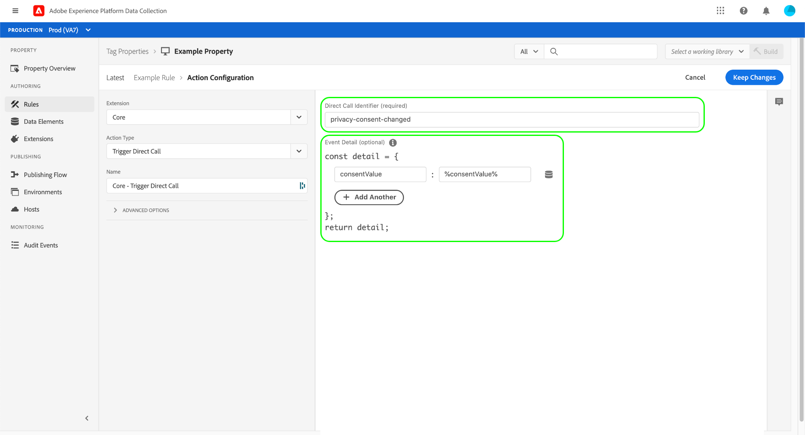

# Overzicht van kernextensies

De extensie van de tag Core is de standaardextensie die wordt vrijgegeven met Adobe Experience Platform.

Dit document bevat informatie over de beschikbare opties wanneer u de extensie Core gebruikt om een regel te maken.

## Gebeurtenistypen van de kernextensie {#core-extension-event-types}

Dit onderwerp beschrijft de gebeurtenistypen beschikbaar in de uitbreiding van de Kern. Voor informatie over de opties die voor verscheidene verschillende gebeurtenistypen kunnen worden geplaatst, zie de [ sectie van Opties ](#options).

### Gebeurtenissen op basis van browser

#### Tab vervagen

De gebeurtenis tab-blur activeert de handeling wanneer een tab de focus verliest. Er zijn geen instellingen voor dit gebeurtenistype.

#### Tabfocus

De gebeurtenis tab-focus activeert de actie wanneer een tab de focus krijgt. Er zijn geen instellingen voor dit gebeurtenistype.

### Formulier

#### Vervagen

De gebeurtenis blur activeert de actie wanneer een formulier de focus verliest. Zie de [ sectie van Opties ](#options) voor meer informatie over klantgerichte gebeurtenismontages.

#### Focus

De focusgebeurtenis activeert de actie wanneer een formulier de focus krijgt. Zie de [ sectie van Opties ](#options) voor meer informatie over klantgerichte gebeurtenismontages.

#### Verzenden

De verzendgebeurtenis activeert de actie wanneer een formulier wordt verzonden. Zie de [ sectie van Opties ](#options) voor meer informatie over klantgerichte gebeurtenismontages.

### Keyboard-gebeurtenissen

#### Toetsdruk

De gebeurtenis wordt geactiveerd wanneer op een toets wordt gedrukt. Zie de [ sectie van Opties ](#options) voor meer informatie over klantgerichte gebeurtenismontages.

### Gebeurtenissen op basis van media

#### Media beëindigd

De gebeurtenis wordt geactiveerd wanneer het medium wordt beëindigd. Zie de [ sectie van Opties ](#options) voor meer informatie over klantgerichte gebeurtenismontages.

#### Gegevens die met media zijn geladen

De gebeurtenis wordt geactiveerd wanneer de media gegevens laden. Zie de [ sectie van Opties ](#options) voor meer informatie over klantgerichte gebeurtenismontages.

#### Media pauzeren

De gebeurtenis wordt geactiveerd wanneer het medium wordt gepauzeerd. Zie de [ sectie van Opties ](#options) voor meer informatie over klantgerichte gebeurtenismontages.

#### Media afspelen

De gebeurtenis wordt geactiveerd wanneer de media wordt afgespeeld. Zie de [ sectie van Opties ](#options) voor meer informatie over klantgerichte gebeurtenismontages.

#### Media geïnstalleerd

De gebeurtenis wordt geactiveerd wanneer de media stagneren. Zie de [ sectie van Opties ](#options) voor meer informatie over klantgerichte gebeurtenismontages.

#### Media-tijd afgespeeld

De gebeurtenis wordt geactiveerd wanneer de media gedurende een bepaalde periode wordt afgespeeld. U moet de duur opgeven waarvoor de media moeten worden afgespeeld om de gebeurtenis te activeren. Zie de [ sectie van Opties ](#options) voor meer informatie over klantgerichte gebeurtenismontages.


#### Gewijzigd media-volume

De gebeurtenis wordt geactiveerd als het volume wordt verhoogd of verlaagd. Zie de [ sectie van Opties ](#options) voor meer informatie over klantgerichte gebeurtenismontages.

### Mobiel-apparaatgeoriënteerde gebeurtenissen

#### Wijziging van richting

De gebeurtenis wordt geactiveerd als de oriëntatie van het apparaat verandert. U moet de duur opgeven waarvoor de oriëntatie moet worden gewijzigd om de gebeurtenis te activeren. Er zijn geen instellingen voor dit gebeurtenistype.

#### Zoomwijziging

De gebeurtenis wordt geactiveerd wanneer de gebruiker in- of uitzoomt. Er zijn geen instellingen voor dit gebeurtenistype.

### Gebeurtenissen met muisbediening

#### Klikken

De gebeurtenis wordt geactiveerd als het opgegeven element is geselecteerd (erop geklikt). U kunt ook eigenschapswaarden opgeven die waar moeten zijn voor het element voordat de gebeurtenis wordt geactiveerd.

Als het element een ankermarkering (`<a>`) aan verbonden inhoud is, kunt u ook specificeren of om navigatie voor een periode te vertragen. Dit kan handig zijn als uw regel extra tijd nodig heeft om uit te voeren en normaal gesproken niet zou zijn voltooid voordat paginanavigatie plaatsvindt.

>[!WARNING]
>
>Deze optie moet uiterst voorzichtig worden gebruikt vanwege de mogelijke negatieve gevolgen voor de gebruikerservaring indien deze onjuist wordt gebruikt.

Wanneer u koppelingsvertraging gebruikt, voorkomt Experience Platform eigenlijk dat de browser van de pagina af navigeert. Vervolgens wordt een JavaScript omgeleid naar de oorspronkelijke bestemming na de opgegeven time-out. Dit is vooral gevaarlijk wanneer uw paginamarkering `<a>` markeringen heeft waar de voorgenomen functionaliteit niet de gebruiker weg van de pagina eigenlijk navigeert. Als u uw probleem niet op een andere manier kunt oplossen, zou u met uw selecteursdefinitie uiterst nauwkeurig moeten zijn zodat deze gebeurtenis precies teweegbrengt waar u het nodig hebt en nergens anders.

De standaardwaarde voor de vertraging van de koppeling is 100 milliseconden. Tags wachten altijd op de opgegeven tijd en houden op geen enkele manier verband met de uitvoering van de handelingen van de regel. Het is mogelijk dat de vertraging de gebruiker zal dwingen langer te wachten dan noodzakelijk is, en ook dat de vertraging niet lang genoeg zal zijn voor alle acties van de regel met succes te voltooien. Langere vertragingen verstrekken meer tijd voor regeluitvoering maar ook verslechteren de gebruikerservaring.

Om de vertraging in te voeren is het nodig om zowel het geselecteerde element te verstrekken dat de gebeurtenis teweegbrengt, als de specifieke hoeveelheid tijd alvorens de gebeurtenis wordt teweeggebracht.

Voor de geavanceerde opties zie de [ sectie van Opties ](#options) voor meer informatie.

#### Hover

De gebeurtenis wordt geactiveerd wanneer de gebruiker de muisaanwijzer op een opgegeven element plaatst. U moet ook vormen of de regel onmiddellijk of na een gespecificeerd aantal milliseconden wordt teweeggebracht. Zie de [ sectie van Opties ](#options) voor meer informatie over klantgerichte gebeurtenismontages.

### Andere gebeurtenissen

#### Aangepaste gebeurtenis

De gebeurtenis wordt geactiveerd als een aangepast gebeurtenistype optreedt. Benoemde JavaScript-functies die elders in de codebase zijn gedefinieerd, kunnen worden gebruikt als een aangepast gebeurtenistype. U moet de naam van het type van douanegebeurtenis specificeren en om het even welke andere montages vormen zoals die in [ hieronder sectie van Opties ](#options) worden beschreven.

#### Gegevenselement gewijzigd

De gebeurtenis wordt geactiveerd wanneer een opgegeven gegevenselement verandert. U moet een naam opgeven voor het gegevenselement. U kunt het gegevenselement selecteren door de naam ervan in het tekstveld te typen of door het pictogram voor het gegevenselement rechts van het tekstveld te selecteren en een keuze te maken in een lijst in het dialoogvenster dat verschijnt.

#### Directe oproep {#direct-call-event}

Een directe vraaggebeurtenis mijdt gebeurtenisopsporing en raadplegingssystemen. De directe vraagregels zijn ideaal voor situaties waar u het systeem precies wilt vertellen wat gebeurt. Bovendien zijn deze ideaal wanneer het systeem geen gebeurtenis in het DOM kan detecteren.

Wanneer u een directe aanroepgebeurtenis definieert, moet u een tekenreeks opgeven die als id van deze gebeurtenis fungeert. Als a [ directe vraagactie van de trekker ](#direct-call-action) die het zelfde herkenningsteken bevat in brand wordt gestoken, dan zullen om het even welke directe regels van de vraaggebeurtenis die op dat herkenningsteken letten lopen.


#### Element bestaat

De gebeurtenis activeert of een opgegeven element bestaat. Zie de [ sectie van Opties ](#options) voor meer informatie over klantgerichte gebeurtenismontages.

#### Viewport invoeren

De gebeurtenis wordt geactiveerd als de gebruiker een opgegeven viewport invoert. U moet een CSS-kiezer opgeven als criteria om overeenkomende elementen als doel in te stellen. U moet ook vormen of de regel onmiddellijk of na een gespecificeerd aantal milliseconden wordt teweeggebracht, en of de gebeurtenis zou moeten teweegbrengen telkens als de gebeurtenis of slechts de eerste keer voorkomt.

Zie de [ sectie van Opties ](#options) voor meer informatie over klantgerichte gebeurtenismontages.

#### Geschiedeniswijziging

De gebeurtenis wordt geactiveerd als een pushState- of hashchange-gebeurtenis plaatsvindt. Er zijn geen instellingen voor dit gebeurtenistype.

#### Tijd besteed op pagina

De gebeurtenis wordt geactiveerd wanneer de gebruiker gedurende een opgegeven aantal seconden op de pagina blijft. U moet het aantal seconden opgeven dat moet worden doorgegeven voordat de gebeurtenis wordt geactiveerd.

### Gebeurtenissen bij laden van pagina

#### gereed voor DOM

De gebeurtenis wordt geactiveerd wanneer het DOM gereed is en de gebruiker kan communiceren met de pagina. Er zijn geen instellingen voor dit gebeurtenistype.

#### Bibliotheek geladen (pagina boven) {#library-loaded-page-top}

De gebeurtenis wordt gestart zodra de tagbibliotheek is geladen. Er zijn geen instellingen voor dit gebeurtenistype.

#### Pagina onder {#page-bottom}

De gebeurtenis wordt geactiveerd zodra `_satellite.pageBottom();` is aangeroepen. Wanneer de tagbibliotheek asynchroon wordt geladen, mag dit gebeurtenistype niet worden gebruikt. Er zijn geen instellingen voor dit gebeurtenistype.

#### Venster geladen

De gebeurtenis wordt geactiveerd wanneer onLoad wordt aangeroepen door de browser en de pagina klaar is met laden. Er zijn geen instellingen voor dit gebeurtenistype.

### Opties {#options}

Voor elk type formuliergebeurtenis worden de volgende instellingen gebruikt:

#### Specifieke elementen \| Willekeurig element

* Als u **[!UICONTROL Specific Elements]** kiest, worden de opties voor het selecteren van de elementen en eigenschapswaarden weergegeven.
* Als u **[!UICONTROL Any Element]** kiest, zijn er geen verdere opties vereist om de elementen te beperken.

#### Elementen die overeenkomen met de CSS-kiezer

Voer de CSS-kiezer in die de elementen identificeert die de gebeurtenis activeren.

#### En met bepaalde eigenschapswaarden

Als u deze optie selecteert, worden de volgende parameters beschikbaar:

* `property=value`

  Geef de waarde voor de eigenschap op

* Regex

  Schakel deze optie in als de `property=value` een reguliere expressie is.

* Toevoegen

  Voeg nog een `property=value` paar toe.

#### Geavanceerde opties (bloggen)

* Deze regel zelfs uitvoeren wanneer de gebeurtenis van een afstammend element afkomstig is
* Laat deze regel lopen zelfs als de gebeurtenis reeds een regel teweegbracht die een afstammend element richt
* Nadat de regel is uitgevoerd, voorkomt u dat de gebeurtenis regels activeert die gericht zijn op bovenliggende elementen

## Voorkeurstypen van kernextensie

In deze sectie worden de voorwaardetypen beschreven die beschikbaar zijn in de extensie Core. Deze voorwaardetypes kunnen met of het regelmatige of type van uitzonderingslogica worden gebruikt.

### Gegevens

#### Cookie

Geef de naam en waarde van het cookie op die moeten bestaan voordat een gebeurtenis een handeling activeert.

1. Geef een cookienaam op.
1. Voer de waarde in die in het cookie moet bestaan als de gebeurtenis een handeling moet activeren.
1. (Optioneel) Schakel Regex in als dit een reguliere expressie is.

#### Aangepaste code

Geef aangepaste code op die als voorwaarde voor de gebeurtenis moet bestaan.

>[!NOTE]
>
>ES6+ JavaScript wordt nu ondersteund in aangepaste code. Houd er rekening mee dat sommige oudere browsers ES6+ niet ondersteunen. Om inzicht te krijgen in de gevolgen van het gebruik van ES6+-functies, moet u testen op alle webbrowsers die worden ondersteund.

Gebruik de ingebouwde code-editor om de aangepaste code in te voeren:

1. Selecteer **[!UICONTROL Open Editor]**.
1. Typ de aangepaste code.
1. Selecteer **[!UICONTROL Save]**.

Er wordt automatisch een variabele met de naam `event` beschikbaar, waarnaar u in uw aangepaste code kunt verwijzen. Het `event` -object bevat nuttige informatie over de gebeurtenis die de regel heeft geactiveerd. De eenvoudigste manier om te bepalen welke gebeurtenisgegevens beschikbaar zijn, is om `event` vanuit uw aangepaste code aan de console te melden:

```javascript
console.log(event);
return true;
```

Voer de regel in een browser uit en inspecteer het geregistreerde gebeurtenisobject in de browserconsole. Zodra u begrijpt welke informatie beschikbaar is, kunt u het voor programmatic beslissing binnen uw douanecode gebruiken.

*Voorwaarde die* plaatst

Wanneer de optie &quot;Regelcomponenten in volgorde uitvoeren&quot; van eigenschapinstellingen is ingeschakeld, kunt u volgende regelcomponenten laten wachten terwijl uw voorwaarde een asynchrone taak uitvoert.

Wanneer de voorwaarde a [ Beloften ](https://developer.mozilla.org/en-US/docs/Web/JavaScript/Reference/Global_Objects/Promise) terugkeert, zal de volgende voorwaarde in de regel niet uitvoeren tot de teruggekeerde belofte wordt opgelost. Als de belofte wordt verworpen, zijn de markeringen van mening dat de voorwaarde ontbroken en geen verdere voorwaarden of acties van die regel zullen worden uitgevoerd.

Een voorbeeld van een voorwaarde die een belofte terugkeert:

```javascript
return new Promise(function(resolve, reject) {
  setTimeout(function() {
    if (new Date().getDay() === 5) {
      resolve();
    } else {
      reject();
    }
  }, 1000);
});
```

#### Waardevergelijking {#value-comparison}

Vergelijkt twee waarden om te bepalen of deze voorwaarde waar terugkeert.

Als u een regel met veelvoudige voorwaarden hebt, is het mogelijk dat deze voorwaarde waar zal terugkeren, maar de regel zal nog niet in brand steken omdat de andere voorwaarden als vals evalueren of één van de uitzonderingen als waar evalueert.

1. Geef een waarde op.
1. Selecteer de operator. Raadpleeg de lijst met vergelijkingsoperatoren voor waarden hieronder voor meer informatie.
1. (Indien vereist) Geef aan of de vergelijking niet hoofdlettergevoelig moet zijn.
1. Geef een andere waarde op voor de vergelijking.

De volgende vergelijkingsoperatoren voor waarden zijn beschikbaar:

**Gelijk:** de voorwaarde keert waar terug als de twee waarden gelijk gebruikend een niet-strikte vergelijking (in JavaScript, == exploitant) zijn. De waarden kunnen van elk type zijn. Wanneer het typen van een woord als _waar_, _vals_, _ongeldig_, of _niet gedefiniëerd_ in een waardegebied, wordt het woord vergeleken als koord en niet in zijn equivalent van JavaScript omgezet.

**GEEFT niet Gelijk:** de voorwaarde keert waar terug als de twee waarden niet gelijk het gebruiken van een niet-strikte vergelijking (in JavaScript, != operator). De waarden kunnen van elk type zijn. Wanneer het typen van een woord als _waar_, _vals_, _ongeldig_, of _niet gedefiniëerd_ in een waardegebied, wordt het woord vergeleken als koord en niet in zijn equivalent van JavaScript omgezet.

**bevat:** de voorwaarde keert waar terug als de eerste waarde de tweede waarde bevat. Getallen worden omgezet in tekenreeksen. Elke andere waarde dan een getal of tekenreeks resulteert in de voorwaarde die false retourneert.

**bevat niet:** de voorwaarde keert waar terug als de eerste waarde niet de tweede waarde bevat. Getallen worden omgezet in tekenreeksen. Elke andere waarde dan een getal of tekenreeks resulteert in de voorwaarde die true retourneert.

**begint met:** de voorwaarde keert waar terug als de eerste waarde met de tweede waarde begint. Getallen worden omgezet in tekenreeksen. Elke andere waarde dan een getal of tekenreeks resulteert in de voorwaarde die false retourneert.

**begint niet met:** de voorwaarde keert waar terug als de eerste waarde niet met de tweede waarde begint. Getallen worden omgezet in tekenreeksen. Elke andere waarde dan een getal of tekenreeks resulteert in de voorwaarde die true retourneert.

**eindigt met:** de voorwaarde keert waar terug als de eerste waarde met de tweede waarde beëindigt. Getallen worden omgezet in tekenreeksen. Elke andere waarde dan een getal of tekenreeks resulteert in de voorwaarde die false retourneert.

**beëindigt niet met:** de voorwaarde keert waar terug als de eerste waarde niet met de tweede waarde beëindigt. Getallen worden omgezet in tekenreeksen. Elke andere waarde dan een getal of tekenreeks resulteert in de voorwaarde die true retourneert.

**past Regex aan:** de voorwaarde keert waar terug als de eerste waarde de regelmatige uitdrukking aanpast. Getallen worden omgezet in tekenreeksen. Elke andere waarde dan een getal of tekenreeks resulteert in de voorwaarde die false retourneert.

**komt niet Regex overeen:** de voorwaarde keert waar terug als de eerste waarde niet de regelmatige uitdrukking aanpast. Getallen worden omgezet in tekenreeksen. Elke andere waarde dan een getal of tekenreeks resulteert in de voorwaarde die true retourneert.

**is minder dan:** de voorwaarde keert waar terug als de eerste waarde minder dan de tweede waarde is. Tekenreeksen die getallen vertegenwoordigen, worden omgezet in getallen. Een andere waarde dan een getal of een convertibele tekenreeks resulteert in de voorwaarde die false retourneert.

**is minder dan of gelijk aan:** de voorwaarde keert waar terug als de eerste waarde minder dan of gelijk aan de tweede waarde is. Tekenreeksen die getallen vertegenwoordigen, worden omgezet in getallen. Een andere waarde dan een getal of een convertibele tekenreeks resulteert in de voorwaarde die false retourneert.

**is Groter dan:** de voorwaarde keert waar terug als de eerste waarde groter is dan de tweede waarde. Tekenreeksen die getallen vertegenwoordigen, worden omgezet in getallen. Een andere waarde dan een getal of een convertibele tekenreeks resulteert in de voorwaarde die false retourneert.

**is groter dan of gelijk aan:** de voorwaarde keert waar terug als de eerste waarde groter dan of gelijk aan de tweede waarde is. Tekenreeksen die getallen vertegenwoordigen, worden omgezet in getallen. Een andere waarde dan een getal of een convertibele tekenreeks resulteert in de voorwaarde die false retourneert.

**is Waar:** de voorwaarde keert waar terug als de waarde boolean met de waarde waar is. De waarde die u opgeeft, wordt niet omgezet in een Booleaanse waarde als het een ander type betreft. Elke andere waarde dan een booleaanse waarde met de waarde true resulteert in de voorwaarde die false retourneert.

**is Waarheid:** de voorwaarde keert waar terug als de waarde na wordt omgezet in boolean waar is. Zie [ van de Vertrouwelijke documentatie van 0} MDN voor voorbeelden van waarheidswaarden.](https://developer.mozilla.org/en-US/docs/Glossary/Truthy)

**is Vals:** de voorwaarde keert waar terug als de waarde boolean met de waarde van vals is. De waarde die u opgeeft, wordt niet omgezet in een Booleaanse waarde als het een ander type betreft. Elke andere waarde dan een booleaanse waarde met de waarde false resulteert in de voorwaarde die false retourneert.

**is vals:** de voorwaarde keert waar terug als de waarde na wordt omgezet in boolean vals is. Zie {de documentatie van het Falsy van 0} MDN [ voor voorbeelden van valse waarden.](https://developer.mozilla.org/en-US/docs/Glossary/Falsy)

#### Variabele

Geef de naam en waarde van de JavaScript-variabele op die moeten bestaan voordat een gebeurtenis een handeling activeert.

1. Geef de naam van de variabele JavaScript op.
1. Geef de waarde op van de variabele die als voorwaarde voor de gebeurtenis moet bestaan.
1. (Optioneel) Schakel Regex in als dit een reguliere expressie is.

### Betrokkenheid

#### Openingspagina

Geef de pagina op waarop de gebruiker moet landen om de gebeurtenis te activeren.

1. Geef de bestemmingspagina op.
1. (Optioneel) Schakel Regex in als dit een reguliere expressie is.

#### Nieuwe/Terugkerende bezoeker

Geef op of de bezoeker een nieuwe bezoeker of een terugkerende bezoeker moet zijn voor een gebeurtenis om een actie te activeren.

Selecteer een van de volgende opties:

* Nieuwe bezoeker
* Bezoeker terugsturen

#### Paginaweergaven

Configureer het aantal keren dat de bezoeker de pagina moet weergeven voordat de actie wordt geactiveerd.

1. Selecteer of het aantal paginaweergaven groter dan, gelijk aan of kleiner dan de opgegeven waarde moet zijn.
1. Geef het aantal paginaweergaven op dat bepaalt of aan de voorwaarde wordt voldaan.
1. Configureer wanneer de paginaweergaven worden geteld door een van de volgende opties te selecteren:
   * Levensduur
   * Huidige sessie

#### Sessies

Trigger de actie als het aantal zittingen van de gebruiker aan de gespecificeerde criteria voldoet.

1. Selecteer of het aantal sessies groter dan, gelijk aan of kleiner dan de opgegeven waarde moet zijn.
1. Geef het aantal sessies op dat bepaalt of aan de voorwaarde wordt voldaan.

#### Tijd op de site

Trigger de actie als het aantal zittingen van de gebruiker aan de gespecificeerde criteria voldoet.

Configureer hoe lang de bezoeker op de site moet zijn voordat de handeling wordt gestart.

1. Geef op of het aantal minuten dat de bezoeker op de site heeft, groter moet zijn dan, gelijk aan of kleiner dan de opgegeven waarde.
1. Geef het aantal minuten op dat bepaalt of aan de voorwaarde wordt voldaan.

#### Traffic Source

Trigger de actie als het aantal zittingen van de gebruiker aan de gespecificeerde criteria voldoet.

Geef de bron van het verkeer van de bezoeker op die waar moet zijn om de actie te activeren.

1. Specificeer de verkeersbron.
1. (Optioneel) Schakel Regex in als dit een reguliere expressie is.

### Technologie

#### Browser

Selecteer de browser die de bezoeker moet gebruiken om de actie te activeren.

Selecteer een of meer van de volgende browsers:

* Chrome
* Firefox
* Internet Explorer/Edge
* Internet Explorer Mobile
* Mobile Safari
* UniverseelWeb
* Opera
* Opera Mini
* Opera Mobile
* Safari

#### Apparaattype

Selecteer het apparaattype dat de bezoeker moet gebruiken om de actie te activeren.

Selecteer een of meer van de volgende apparaattypen:

* Android
* Blackberry
* Desktop
* iPad
* iPhone
* iPod
* Nokia
* Windows-telefoon

#### Besturingssysteem

Selecteer het besturingssysteem dat de bezoeker moet gebruiken om de actie te activeren.

Selecteer een of meer van de volgende besturingssystemen:

* Android
* Blackberry
* iOS
* Linux
* MacOS
* Maemo
* Symbian OS
* Unix
* Windows

#### Schermresolutie

Selecteer de schermresolutie die bezoekers op hun apparaten moeten gebruiken om de actie te activeren.

1. Selecteer of de breedte van de schermresolutie van het apparaat van de bezoeker groter moet zijn dan, gelijk aan of kleiner dan de opgegeven waarde.
1. Geef het aantal pixels op dat nodig is voor de breedte van de schermresolutie.
1. Selecteer of de schermresolutiehoogte van het apparaat van de bezoeker groter moet zijn dan, gelijk aan of kleiner dan de opgegeven waarde.
1. Geef het aantal pixels op dat nodig is voor de hoogte van de schermresolutie.

#### Venstergrootte

Selecteer de venstergrootte die bezoekers op hun apparaten moeten gebruiken om de actie te activeren.

1. Selecteer of de breedte van het vensterformaat van het apparaat van de bezoeker groter moet zijn dan, gelijk aan of kleiner dan de opgegeven waarde.
1. Geef het aantal pixels op dat nodig is voor de breedte van het vensterformaat.
1. Selecteer of de hoogte van het vensterformaat van het apparaat van de bezoeker groter moet zijn dan, gelijk aan of kleiner dan de opgegeven waarde.
1. Geef het aantal pixels op dat nodig is voor de hoogte van het vensterformaat.

### URL

#### Domein

Geef het domein van de bezoeker op.

#### Hash

Geef een of meer hashpatronen op die in de URL moeten voorkomen.

>[!NOTE]
>
>Meerdere hashpatronen worden samengevoegd door een OR.

1. Geef het hashpatroon op.
1. (Optioneel) Schakel Regex in als dit een reguliere expressie is.
1. Voeg andere hashpatronen toe.

#### Pad- en queryreeks

Geef een of meer paden op die in de URL moeten voorkomen.  Dit omvat de weg en het vraagkoord.

>[!NOTE]
>
>Meerdere paden worden verbonden door een OR.

1. Geef het pad op.
1. (Optioneel) Schakel Regex in als dit een reguliere expressie is.
1. Voeg andere paden toe.

#### Pad zonder queryreeks

Geef een of meer paden op die in de URL moeten voorkomen.  Dit omvat de weg, maar omvat niet het vraagkoord.

>[!NOTE]
>
>Meerdere paden worden verbonden door een OR.

1. Geef het pad op.
1. (Optioneel) Schakel Regex in als dit een reguliere expressie is.
1. Voeg andere paden toe.

#### Protocol

Geef het protocol op dat in de URL wordt gebruikt.

Selecteer een van de volgende opties:

* HTTP
* HTTPS

#### Parameter querytekenreeks

Geef de URL-parameter op die in de URL wordt gebruikt.

1. Geef een naam voor een URL-parameter op.
1. Geef de waarde op die voor de URL-parameter wordt gebruikt.
1. (Optioneel) Schakel Regex in als dit een reguliere expressie is.

#### Subdomein

Geef een of meer subdomeinen op die in de URL moeten voorkomen.

>[!NOTE]
>
>De veelvoudige subdomeinen worden aangesloten bij door OF.

1. Geef het subdomein op.
1. (Optioneel) Schakel Regex in als dit een reguliere expressie is.
1. Voeg andere subdomeinen toe.

### Overige

#### Datumbereik

Geef een datumbereik op. Kies de datum en het tijdstip waarop de gebeurtenis zich na, de datum vóór en de tijdzone voordoet.

#### Max. frequentie

Geef het maximale aantal keren op dat de voorwaarde true retourneert. U kunt uit de volgende opties selecteren:

* Paginaweergave
* Sessies
* Bezoeker
* Seconden
* Minuten
* Dagen
* Weken
* Maanden

Voor de voorwaarde geldt dat de maximale frequentie 1 per sessie, deze twee `localStorage` -items worden vergeleken. Als de waarde van `visitorTracking.sessionCount` groter is dan die van `maxFrequency.session` , is de samplingvoorwaarde true. Als ze gelijk zijn, is de voorwaarde onwaar.

`sessionCount` is een `visitorTracking` -item, dus de bezoeker-API moet zijn ingeschakeld om de samplingvoorwaarde te laten werken.

#### Bemonstering

Geef het percentage op van de tijd waarop de voorwaarde true retourneert.

## Typen handelingen voor kernextensies

Deze sectie beschrijft de actietypes beschikbaar in de uitbreiding van de Kern.

### Aangepaste code

>[!NOTE]
>
>ES6+ JavaScript wordt nu ondersteund in aangepaste code. Houd er rekening mee dat sommige oudere browsers ES6+ niet ondersteunen. Om inzicht te krijgen in de gevolgen van het gebruik van ES6+-functies, moet u testen op alle webbrowsers die worden ondersteund.

Geef de code op die wordt uitgevoerd nadat de gebeurtenis is geactiveerd en de voorwaarden zijn geëvalueerd.

1. Geef de actiecode een naam.
1. Selecteer de taal die wordt gebruikt om de handeling te definiëren:
   * JavaScript
   * HTML
1. Selecteer of de actiecode globaal moet worden uitgevoerd.
1. Selecteer **[!UICONTROL Open Editor]**.
1. Bewerk de code en selecteer vervolgens **[!UICONTROL Save]** .

Wanneer JavaScript is geselecteerd als de taal, wordt automatisch een variabele met de naam `event` beschikbaar, waarnaar u in uw aangepaste code kunt verwijzen. Het `event` -object bevat nuttige informatie over de gebeurtenis die de regel heeft geactiveerd. De eenvoudigste manier om te bepalen welke gebeurtenisgegevens beschikbaar zijn, is om `event` vanuit uw aangepaste code aan de console te melden:

```javascript
console.log(event);
```

Voer de regel in een browser uit en inspecteer het geregistreerde gebeurtenisobject in de browserconsole. Nadat u begrijpt welke informatie beschikbaar is, kunt u het voor programmatic besluiten binnen uw douanecode gebruiken, een deel van het `event` voorwerp verzenden naar een server, etc.

### Verwerking van aangepaste code

De Core-extensie, die beschikbaar is voor alle Adobe Experience Platform-gebruikers, bevat een aangepaste code voor het uitvoeren van door de gebruiker opgegeven JavaScript of HTML. Het is vaak nuttig voor gebruikers om te begrijpen hoe de regels met de acties van de Code van de Douane worden verwerkt.

#### Regels die gebeurtenissen boven of onder op de pagina gebruiken

Code uit aangepaste handelingen wordt ingesloten in de hoofdtagbibliotheek. De code wordt naar het document geschreven met document.write. Als een regel veelvoudige acties van de Code van de Douane heeft, wordt de code geschreven in de orde die in de regel wordt gevormd.

#### Regels voor elke andere gebeurtenis dan de boven- of onderzijde van de pagina

De code van douaneacties wordt geladen van de server en aan het document geschreven gebruikend [ Postscript ](https://github.com/krux/postscribe). Als een regel veelvoudige acties van de Code van de Douane heeft, wordt de code geladen parallel van de server, maar in de orde geschreven die in de regel wordt gevormd.

Tijdens het gebruik van document.write nadat een pagina is geladen, zouden er doorgaans problemen optreden. Dit is echter geen probleem voor code die via aangepaste code-handelingen wordt geleverd. U kunt document.write binnen acties van de Code van de Douane ongeacht gebruiken wanneer de code zal worden uitgevoerd.

#### Aangepaste codevalidatie

De validator die in de tagcode-editor wordt gebruikt, is ontworpen om problemen met door ontwikkelaars geschreven code te identificeren. Code die door een minificatieproces is gegaan—zoals de code AppMeasurement.js die van de Manager van de Code wordt gedownload—zou verkeerd kunnen worden gemarkeerd zoals hebbend kwesties door validator, die gewoonlijk kan worden genegeerd.

#### Handelingvolgorde

Wanneer de optie &quot;Regelcomponenten in volgorde uitvoeren&quot; van eigenschapinstellingen is ingeschakeld, kunt u volgende regelcomponenten laten wachten terwijl uw handeling een asynchrone taak uitvoert.  Dit werkt anders voor de aangepaste code van JavaScript en HTML.

*JavaScript*

Wanneer het creëren van een actie van de douanecode van JavaScript, kunt u a [ Beloften ](https://developer.mozilla.org/en-US/docs/Web/JavaScript/Reference/Global_Objects/Promise) van uw actie terugkeren. De volgende actie in de regel zal slechts worden uitgevoerd wanneer de teruggekeerde belofte wordt opgelost. Als de belofte wordt verworpen, zullen de volgende acties van de regel niet worden uitgevoerd.

>[!NOTE]
>
>Dit werkt alleen als je JavaScript niet is ingesteld op wereldwijd uitvoeren. Als u uw actie van de douanecode in het globale werkingsgebied uitvoert, zullen de markeringen de belofte behandelen zoals onmiddellijk opgelost en zich op het volgende punt in de verwerkingsrij bewegen.

Een voorbeeld van een aangepaste code van JavaScript die een promise retourneert:

```javascript
return new Promise(function(resolve, reject) {
  setTimeout(function() {
    if (new Date().getDay() === 5) {
      resolve();
    } else {
      reject();
    }
  }, 1000);
});
```

*HTML*

Wanneer u een aangepaste code van HTML maakt, is een functie met de naam `onCustomCodeSuccess()` beschikbaar voor gebruik in uw aangepaste code. U kunt deze functie aanroepen om aan te geven dat de aangepaste code is voltooid en dat tags kunnen worden toegepast bij het uitvoeren van volgende handelingen. Als uw aangepaste code op een of andere manier is mislukt, kunt u `onCustomCodeFailure()` aanroepen. Hiermee wordt aangegeven dat tags de volgende handelingen uit die regel niet mogen uitvoeren.

Een voorbeeld van een aangepaste code van HTML die de nieuwe callbacks gebruikt:

```html
<script>
setTimeout(function() {
  if (new Date().getDay() === 5) {
    onCustomCodeSuccess();
  } else {
    onCustomCodeFailure();
  }
}, 1000);
</script>
```

### Rechtstreekse oproep activeren {#direct-call-action}

Deze actie brengt alle regels in werking die een specifieke [ directe vraaggebeurtenis ](#direct-call-event) gebruiken. Wanneer het vormen van de actie, moet u het herkenningstekenkoord voor de directe vraaggebeurtenis verstrekken u wilt teweegbrengen. U kunt ook gegevens doorgeven aan de directe aanroepgebeurtenis via een `detail` -object, dat een aangepaste set sleutelwaardeparen kan bevatten.



Deze handeling wordt rechtstreeks toegewezen aan [`_satellite.track()`](/help/collection/tags/track.md) .

## Gegevenstelelementtypen van de kernextensie

Gegevenselementen worden bepaald door de extensie. Er is geen limiet aan de typen die kunnen worden gemaakt.

De volgende secties beschrijven de types van gegevenselementen beschikbaar in de uitbreiding van de Kern. Andere extensies gebruiken andere typen gegevenselementen.

### Cookie

In het veld cookie naam kan naar een beschikbaar domeincookie worden verwezen.

#### Voorbeeld:

`cookieName`

### Constante

Elke constante tekenreekswaarde waarnaar vervolgens in handelingen of voorwaarden kan worden verwezen.

#### Voorbeeld:

`string`

### Aangepaste code

>[!NOTE]
>
>ES6+ JavaScript wordt nu ondersteund in aangepaste code. Houd er rekening mee dat sommige oudere browsers ES6+ niet ondersteunen. Om inzicht te krijgen in de gevolgen van het gebruik van ES6+-functies, moet u testen op alle webbrowsers die worden ondersteund.

Aangepaste JavaScript kan in de gebruikersinterface worden ingevoerd door Editor openen te selecteren en code in te voegen in het editorvenster.

Een terugkeerverklaring is noodzakelijk in het redacteursvenster om erop te wijzen welke waarde als waarde van het gegevenselement zou moeten worden gebruikt. Als een retourinstructie niet wordt opgenomen of als de waarde `null` of `undefined` wordt geretourneerd, wordt de standaardwaarde van het gegevenselement gebruikt als de waarde van het gegevenselement.

**Voorbeeld:**

```javascript
var pageType = $('div.page-wrapper').attr('class').split('')[1];
if (window.location.pathname == '/') {
  return 'homepage';
} else {
  return pageType;
}
```

Als het gegevenselement van de douanecode als deel van een regeluitvoering wordt teruggewonnen, wordt een variabele genoemd `event` automatisch beschikbaar, die u van binnen uw douanecode kunt van verwijzingen voorzien. Het `event` -object bevat nuttige informatie over de gebeurtenis die de regel heeft geactiveerd. De eenvoudigste manier om te bepalen welke gebeurtenisgegevens beschikbaar zijn, is om `event` vanuit uw aangepaste code aan de console te melden:

```javascript
console.log(event);
return true;
```

Voer de regel in een browser uit en inspecteer het geregistreerde gebeurtenisobject in de browserconsole. Zodra u begrijpt welke informatie onder de diverse regels beschikbaar is die uw gegevenselement kunnen gebruiken, kunt u het voor programmatic besluitvorming binnen uw douanecode gebruiken of een deel van het `event` voorwerp als waarde van het gegevenselement terugkeren.

### DOM-kenmerk

Elke elementwaarde kan worden opgehaald, zoals een div- of H1-tag.

#### Voorbeeld:

CSS-selectieketen:

`id#dc logo img`

Hiermee wordt de waarde opgehaald van:

`src`

### JavaScript-variabele

Met behulp van het padveld kan naar elk beschikbaar JavaScript-object of -variabele worden verwezen.

Taggegevenselementen kunnen worden gebruikt om uw opmaak van JavaScript-variabelen of objecteigenschappen vast te leggen. Deze waarden kunnen vervolgens worden gebruikt binnen uw extensies of aangepaste regels door te verwijzen naar de elementen met taggegevens. Als de bron van de gegevens verandert, is het alleen nodig om de verwijzing naar de bron bij te werken.

In het onderstaande voorbeeld bevat de markering een JavaScript-variabele met de naam `Page_Name` .

```markup
<script>
  //data layer
  var Page_Name = "Homepage"
</script>
```

Wanneer u het gegevenselement maakt, geeft u gewoon het pad naar die variabele op.

Als u een gegevensverzamelingsobject gebruikt als onderdeel van uw gegevenslaag, gebruikt u puntnotatie in het pad om te verwijzen naar het object en de eigenschap die u in het gegevenselement wilt vastleggen, zoals `_myData.pageName` of `digitalData.pageName` , enzovoort.

#### Voorbeeld:

`window.document.title`

### Lokale opslag

Geef de naam van uw lokale opslagitem op in het veld Itemnaam lokale opslag.

De lokale opslag geeft browsers een manier om informatie van pagina aan pagina ([ https://www.w3schools.com/html/html5\_webstorage.asp ](https://www.w3schools.com/html/html5_webstorage.asp)) op te slaan. Lokale opslag werkt veel zoals cookies, maar is veel groter en flexibeler.

Gebruik het opgegeven veld om de waarde op te geven die u voor een lokaal opslagitem hebt gemaakt, zoals `lastProductViewed.`

### Samengevoegde objecten

Selecteer meerdere gegevenselementen die elk een object leveren. Deze objecten worden diep (recursief) samengevoegd om een nieuw object te maken. De bronobjecten worden niet gewijzigd. Als een eigenschap op dezelfde locatie op meerdere bronobjecten wordt gevonden, wordt de waarde van het laatste object gebruikt. Als de waarde van een broneigenschap `undefined` is, wordt de waarde van een eerder bronobject niet overschreven. Als arrays op dezelfde locatie op meerdere bronobjecten worden gevonden, worden de arrays samengevoegd.

Stel bijvoorbeeld dat u een gegevenselement selecteert dat het volgende object biedt:

```
{
  "sport": {
    "name": "tennis"
  },
  "dessert": "ice cream",
  "fruits": [
    "apple",
    "banana"
  ]
}
```

Stel dat u ook een ander gegevenselement selecteert dat het volgende object biedt:

```
{
  "sport": {
    "name": "volleyball"
  },
  "dessert": undefined,
  "pet": "dog",
  "instrument": undefined,
  "fruits": [
    "cherry",
    "duku"
  ]
}
```

Het resultaat van het gegevenselement Samengevoegde objecten is het volgende object:

```
{
  "sport": {
    "name": "volleyball"
  },
  "dessert": "ice cream",
  "pet": "dog",
  "instrument": undefined,
  "fruits": [
    "apple",
    "banana",
    "cherry",
    "duku"
  ]
}
```

### Pagina-info

Gebruik deze gegevenspunten om pagina-info vast te leggen voor gebruik in uw regellogica of om informatie te verzenden naar Analytics of externe volgsystemen.

U kunt een van de volgende paginakenmerken selecteren voor gebruik in het gegevenselement:

* URL
* Hostnaam
* Pathname
* Protocol
* Referenter
* Titel

### Tekenreeksparameter van query

Geef één URL-parameter op in het veld URL-parameter.

Alleen de naamsectie is nodig en speciale aanduidingen zoals &quot;?&quot; of &quot;=&quot; moet worden weggelaten

#### Voorbeeld:

`contentType`

### Willekeurig getal

Gebruik dit gegevenselement om een willekeurig getal te genereren. Deze wordt vaak gebruikt voor het nemen van monsters van gegevens of het maken van id&#39;s, zoals een Actief-id. Het willekeurige getal kan ook worden gebruikt om vertrouwelijke of salt-gevoelige gegevens te verkrijgen. Voorbeelden hiervan zijn:

* Een hoogte-id genereren
* Plaats het nummer samen met een gebruikerstoken of tijdstempel om ervoor te zorgen dat het uniek is
* Voer een unidirectionele knoeiboel op PII gegevens uit
* Willekeurig beslissen wanneer een enquêteverzoek op de plaats moet tonen

Geef de minimum- en maximumwaarden voor het willekeurige getal op.

**Gebreken:**

Minimaal: 0

Maximaal: 1000000000

### Sessieopslag

Geef de naam van het opslagitem voor de sessie op in het veld Naam opslagitem voor sessie.

Sessieopslag is vergelijkbaar met lokale opslag, behalve dat de gegevens worden verwijderd nadat de sessie is beëindigd, terwijl lokale opslag of een cookie de gegevens kan behouden.

### Bezoekergedrag

Net als Pagina-info gebruikt dit gegevenselement gangbare gedragstypen om logica binnen regels en andere Experience Platform-oplossingen te verrijken.

Selecteer een van de volgende kenmerken voor bezoekersgedrag:

* Openingspagina
* verkeersbron
* Minuten op site
* Aantal sessies
* Aantal sessiepagina&#39;s
* Aantal LiveTime-paginaweergaven
* Is nieuwe bezoeker

Enkele gangbare gebruiksgevallen zijn:

* Een enquête weergeven nadat een bezoeker vijf minuten op de site is geweest
* Als dit de landingspagina voor het bezoek is, vult u een metrische analyse in
* Nieuwe aanbieding weergeven aan bezoeker na X-aantal aantal aantal sessies
* Een nieuwsbrief weergeven als dit een eerste bezoeker is

### Voorwaardelijke waarde

Een omslag voor de [ Vergelijking van de Waarde ](#value-comparison-value-comparison) voorwaarde. Op basis van het resultaat van de vergelijking wordt een van de twee beschikbare waarden in het formulier geretourneerd. Kan hiermee &quot;if... Dan... Anders...&quot; scenario&#39;s zonder de behoefte aan extra regels.

### Runtimeomgeving

Hiermee kunt u een van de volgende variabelen selecteren:

* Het stadium van het milieu - Keert `_satellite.environment.stage` terug om tussen ontwikkelings/het opvoeren/productiemilieu&#39;s te onderscheiden.
* Bouwdatum van bibliotheek - Retourneert `turbine.buildInfo.buildDate` die dezelfde waarde bevat als `_satellite.buildInfo.buildDate` .
* Eigenschapnaam - Retourneert `_satellite.property.name` om de naam van de eigenschap Launch op te halen.
* Eigenschap-id - retourneert `_satellite.property.id` om de id van de eigenschap Launch op te halen
* Naam van regel - Retourneert `event.$rule.name` met de naam van de uitgevoerde regel.
* Regel-id - Retourneert `event.$rule.id` met de id van de uitgevoerde regel.
* Gebeurtenistype - Retourneert `event.$type` met het type gebeurtenis dat de regel heeft geactiveerd.
* De het detailnuttige lading van de gebeurtenis - keert `event.detail` terug die de lading van een Gebeurtenis van de Douane of de Directe Regel van de Vraag bevatten.
* Directe vraag herkenningsteken - keert `event.identifier` terug die herkenningsteken van een Directe Regel van de Vraag bevatten.

### Apparaatkenmerken

Retourneert een van de volgende kenmerken van het bezoekersapparaat:

* Grootte browservenster
* Schermgrootte

### JavaScript Tools

Het is een omslag voor gemeenschappelijke verrichtingen van JavaScript. Het ontvangt een gegevenselement als input. Het keert het resultaat van één van de volgende transformaties van de waarde van het gegevenselement terug:

* Basisbewerkingen voor tekenreeksen (vervangen, subtekenreeks, regex overeenkomst, eerste en laatste index, splitsen, segment)
* Elementaire array-bewerkingen (segment, verbinding, pop, shift)
* Algemene universele bewerkingen (segment, lengte)