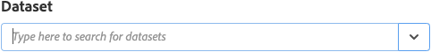
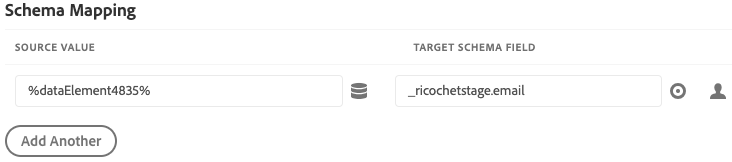
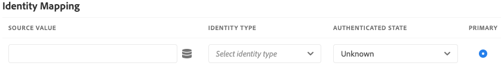

# Adobe Experience Platform Demo-extensie

>[!NOTE]
>
>Adobe Experience Platform Launch is omgedoopt tot een reeks technologieën voor gegevensverzameling in Adobe Experience Platform. Diverse terminologische wijzigingen zijn als gevolg hiervan in de productdocumentatie doorgevoerd. Raadpleeg het volgende [document](../../../term-updates.md) voor een geconsolideerde referentie van de terminologische wijzigingen.

>[!NOTE]
>
>Deze verlenging is vervangen door [Adobe Experience Platform Web SDK](../sdk/overview.md).

De functies van deze extensie worden overgebracht naar een nieuwe extensie. Hier volgt een snelle vergelijking van de huidige functies.

| Demo-extensie Platform | Platform Web SDK |
| ------------------ | ----------- |
| Ondersteuning voor aangepaste klant-id&#39;s | Ondersteuning voor aangepaste gebruikers-id&#39;s |
| Interface voor clienttoewijzing voor XDM | Ingebouwde ECID (geen bezoeker.js nodig) |
| Mogelijkheid om een streamingverbinding te maken | Ondersteuning voor aanmelding |
|  | XDM-ondersteuning als gegevenselement |
|  | Domeinondersteuning van eerste partij |
|  | Ingebouwde foutopsporingsgereedschappen |
|  | Automatisch verzamelt browsercontext |
|  | Volledige open bron |

## De Adobe Experience Platform-extensie configureren

Deze sectie bevat een verwijzing naar de opties die beschikbaar zijn bij het configureren van de Adobe Experience Platform-extensie.

Als de extensie Adobe Experience Platform nog niet is geïnstalleerd, opent u de eigenschap en selecteert u **[!UICONTROL Extensions > Catalog]**, plaatst u de aanwijzer boven de Adobe Experience Platform-extensie en selecteert u **[!UICONTROL Install]**.

Als u de extensie wilt configureren, opent u de [!UICONTROL Extensions] , plaatst u de cursor boven de extensie en selecteert u vervolgens **[!UICONTROL Configure]**.

### Streaming verbinding

Als u een streamingverbinding kiest, begint u met het streamen van gegevens naar Adobe Experience Platform. U kunt er een selecteren in de keuzelijst met streamingverbindingen. Streaming verbinding is een verplicht veld. Als u geen streamingverbinding hebt gemaakt, kunt u een verbinding maken door de optie **[!UICONTROL Create a streaming connection]** knop.

Als u **[!UICONTROL Create a streaming connection]** er verschijnt een modaal venster.

Het modaal bevat velden met vooraf ingevulde waarden die naar wens kunnen worden gewijzigd. Als u meerdere streamingverbindingen wilt maken, moet u er rekening mee houden dat de **[!UICONTROL Data Source]** veld moet uniek zijn. Een andere streamingverbinding maken met een **[!UICONTROL Data Source]** al gebruikt voor een andere verbinding zal mislukken.

Wanneer u een streamingeindpunt hebt geselecteerd, gebruikt u de URL en de bron van het streamingeindpunt.

## Handelingstypen voor Adobe Experience Platform-extensies

In deze sectie worden de actietypen beschreven die beschikbaar zijn in de Adobe Experience Platform-extensie.

### Band verzenden {#send-beacon}

Dit is het handelingstype dat u gebruikt om gegevens naar de Adobe Experience Platform te verzenden.

U moet eerst de dataset selecteren waar de gegevens zullen worden opgeslagen. Over het algemeen, vertegenwoordigen de datasets een lijst die de gegevens zal opslaan die via de het stromen verbinding worden verzonden. U moet de datasets binnen Adobe Experience Platform creëren alvorens dit actietype te gebruiken.

Nadat u de dataset selecteert waar de gegevens zullen worden opgeslagen, zult u details over het schema zien dat met de geselecteerde dataset verbonden is.

### Schema toewijzen

Na het selecteren van de dataset kunt u uw schemaafbeelding bepalen.

Het veld Bronwaarde accepteert een waarde of een gegevenselement. U kunt een gegevenselement toevoegen door de knoop van het gegevenselement te selecteren die naast het gebied van de bronwaarde wordt gevestigd.

Het veld Doelschema bevat het pad van een XDM-veld dat in het schema van de gegevensset is gedefinieerd. Voor velden die dieper in de schemahiërarchie zijn gedefinieerd, kunt u de punt gebruiken als scheidingsteken tussen de padonderdelen (bijvoorbeeld timeSeriesEvents.eventType).

### Selector schemaveld

De extensie biedt ook de mogelijkheid om een doelschemaveld te selecteren met behulp van een visuele kiezer. Als u de doelknoop selecteert die naast de het gebiedsinput van het doelschema zit, zal een modaal worden getoond waar u de het schemaboom van de dataset zult zien. U kunt een veld kiezen en vervolgens de **Selecteren** en de invoer van het doelschemaveld wordt bijgewerkt met het juiste XDM-pad.

### Identiteitsvelden in de Adobe Experience Platform

De schema&#39;s van de gegevens van het verslag en de reeksen gegevensschema&#39;s kunnen één of meerdere identiteitsgebieden bevatten. Identiteitsvelden worden aan elkaar gekoppeld om één identiteitsrepresentatie van een onderwerp te vormen en bevatten informatie zoals een CRM-id, Experience Cloud-id (ECID), browsercookie, advertentie-id of andere id&#39;s in verschillende domeinen.

Identiteitsvelden kunnen op twee manieren binnen het schema worden gedefinieerd:

1. De schema&#39;s van het verslag en van de Reeks van de Tijd bevatten allebei een speciaal gebied genoemd `xdm:identityMap` die een kaart van identiteiten kunnen bevatten.
1. De zeer belangrijke gebieden kunnen als gebieden van de Identiteit binnen het schema worden gemerkt.

### Identiteitsvelden in de Adobe Experience Platform-extensie

Voor elk schemagebied dat als identiteitsgebied wordt bepaald, zal een rij aan de sectie van de schemaafbeelding worden toegevoegd. Elke toegevoegde rij bevat het doelschemaveld dat al is ingevuld met het bijbehorende XDM-schemapad. U kunt zien of een schemaveld ook een identiteitsveld is als u een profielpictogram bij het veld ziet.

De primaire identiteitsgebieden worden altijd vereist, zodat kunt u niet de rijen schrappen die hen uit de sectie van de schemaafbeelding bevatten.

Een schemagebied dat als niet-primair identiteitsgebied wordt bepaald, zal automatisch aan de sectie van de schemaafbeelding worden toegevoegd, maar de bronwaardeinput kan leeg blijven. Dat veld kan worden verwijderd. Het veld wordt verwijderd als de bijbehorende bronwaarde leeg is.

Er wordt een waarschuwingspictogram weergegeven bij elk niet-primair identiteitsveld dat geen waarde bevat.

Een identiteitssectie zal zichtbaar zijn als uw schema een `xdm:identityMap` veld. U kunt deze sectie gebruiken als u liever gegevens met betrekking tot identiteiten verzendt met de opdracht `xdm:identityMap`.

De sectie voor identiteitstoewijzing kan meerdere rijen bevatten. Elke rij kan een bepaald identiteitstype bepalen. U kunt de volgende kenmerken definiëren voor een identiteit: type, authenticated state, primary en value.

Als u meerdere identiteiten hebt binnen de sectie voor identiteitstoewijzing, kan slechts één identiteit als primair worden gemarkeerd.

Als u een schema hebt dat een `xdm:identityMap` en tegelijkertijd een ander veld is gemarkeerd als een primair identiteitsveld, is de primaire kolom in het gedeelte voor identiteitstoewijzing niet zichtbaar.

### Vereiste velden

Sommige schema&#39;s hebben verplichte velden op hoofdniveau. De meest voorkomende zijn `timestamp` en `_id`. Zonder deze gebieden te bepalen, zal het baken ontbreken. U kunt ze definiëren in de sectie voor schematoewijzing.

Als uw sectie voor schematoewijzing niet bevat `timestamp` of `_id`, maar het datasetschema vereist hen, zal de uitbreiding van Adobe Experience Platform een baken verzenden die automatisch geproduceerde waarden bevat zodat het baken niet zal ontbreken. De automatisch geproduceerde waarden zullen aan de bakengegevens slechts worden toegevoegd als u die gebieden binnen de sectie van de schemaafbeelding niet hebt bepaald.
