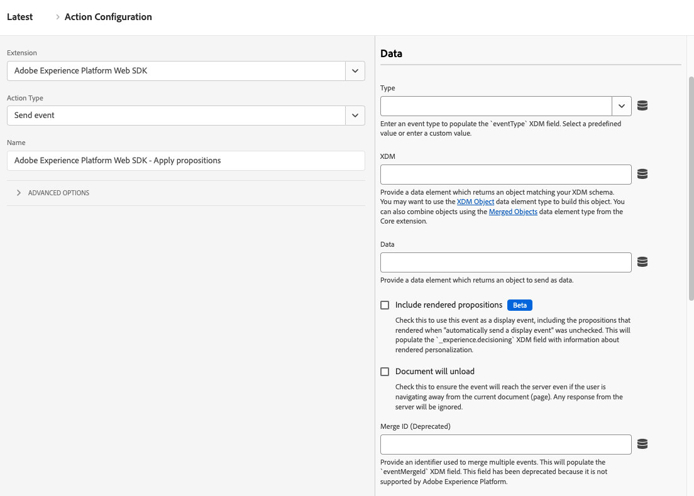

# Gebeurtenis Send

Met de handeling **[!UICONTROL Send event]** wordt een lading verzonden naar een gegevensstroom op de Adobe Experience Platform Edge Network. Het is een kernkenmerk van gegevensverzameling en personalisatie; bijna alle organisaties gebruiken deze actie als onderdeel van hun Web SDK-implementatie.

1. Login aan [&#x200B; experience.adobe.com &#x200B;](https://experience.adobe.com) gebruikend uw geloofsbrieven van Adobe ID.
1. Ga naar **[!UICONTROL Data Collection]** > **[!UICONTROL Tags]**.
1. Selecteer de gewenste eigenschap tag.
1. Navigeer naar **[!UICONTROL Rules]** en selecteer vervolgens de gewenste regel.
1. Selecteer onder [!UICONTROL Actions] een bestaande actie of maak een actie.
1. Stel het vervolgkeuzeveld [!UICONTROL Extension] in op **[!UICONTROL Adobe Experience Platform Web SDK]** en stel vervolgens de waarde [!UICONTROL Action type] in op **[!UICONTROL Send event]** .

## Algemene velden

* **[!UICONTROL Instance]**: De SDK-instantie waarop de handeling van toepassing is. Dit vervolgkeuzemenu is uitgeschakeld als uw implementatie één SDK-exemplaar gebruikt.
* **[!UICONTROL Use guided events]**: Schakel deze optie in om bepaalde velden automatisch in te vullen of te verbergen om een bepaald geval van gebruik in te schakelen. Dit plaatsen kan helpen lawaai van beschikbare opties verminderen wanneer vestiging de actie voor elk respectieve doel, en volgt Adobe beste praktijken van [&#x200B; Hoogste/onderste paginagebeurtenissen &#x200B;](/help/collection/use-cases/personalization/top-bottom-page-events.md) volgen. Als u dit selectievakje inschakelt, worden de volgende keuzerondjes weergegeven:
   * **[!UICONTROL Request personalization]**: Haal de nieuwste beslissingen over personalisatie op zonder een Adobe Analytics-gebeurtenis op te nemen. Deze wordt meestal boven aan de pagina weergegeven. Als deze optie is geselecteerd, worden de volgende velden ingesteld:
      * [!UICONTROL Type] is vergrendeld op [!UICONTROL Decisioning Proposition Fetch]
      * [!UICONTROL Render visual personalization decisions] is vergrendeld om te worden ingeschakeld
      * [!UICONTROL Automatically send a display event] is vergrendeld voor uitgeschakeld
   * **[!UICONTROL Collect analytics]**: neem een gebeurtenis op zonder personalisatiebeslissingen. Deze wordt meestal onder aan de pagina weergegeven. Als deze optie is geselecteerd, worden de volgende velden ingesteld:
      * [!UICONTROL Include rendered propositions] is vergrendeld om te worden ingeschakeld

## Gegevensvelden

* **[!UICONTROL Type]**: Het gebeurtenistype. U kunt een vooraf gedefinieerde set waarden selecteren of uw eigen waarde definiëren. Zie [&#x200B; Toegelaten waarden voor `eventType`](/help/xdm/classes/experienceevent.md#accepted-values-for-eventtype) voor meer informatie. Het JavaScript-bibliotheekequivalent voor dit veld is [`eventType`](/help/collection/js/commands/sendevent/eventtype.md) .
* **[!UICONTROL XDM]**: De XDM-lading die u naar Adobe wilt verzenden. U kunt of een [&#x200B; voorwerp XDM &#x200B;](../data-element-types.md#xdm-object) of [&#x200B; Variabele &#x200B;](../data-element-types.md#variable) op dit gebied gebruiken. Als u regels hebt die veelvoudige voorwerpen XDM bevolken, kunt u [&#x200B; Verenigde voorwerpen &#x200B;](../../core/overview.md#merged-objects) gebruiken om hen te combineren.
* **[!UICONTROL Data]**: De gegevenslading die u naar Adobe wilt verzenden. Voor sommige toepassingen en services hoeft u zich niet aan een XDM-schema te houden, zoals Adobe Analytics of Adobe Target. Gebruik het type van a [&#x200B; veranderlijk &#x200B;](../data-element-types.md#variable) gegevenselement voor dit gebied.
* **[!UICONTROL Include rendered propositions]**: Schakel dit selectievakje in om deze gebeurtenis als een weergavegebeurtenis te gebruiken, inclusief de voorstellingen die zijn weergegeven wanneer &quot;automatisch een weergavegebeurtenis verzenden&quot; was uitgeschakeld. In het XDM-veld `_experience.decisioning` wordt informatie over gerenderde personalisatie weergegeven.
* **[!UICONTROL Document will unload]**: Schakel dit selectievakje in om ervoor te zorgen dat de gebeurtenis de server bereikt, zelfs als de gebruiker bij de pagina vandaan navigeert. Met deze instelling kunnen gebeurtenissen de server bereiken, maar reacties van de Edge Network worden genegeerd.
* **[!UICONTROL Merge ID]** _(Afgekeurd)_: bevolkt het `eventMergeId` XDM gebied.

## Personalisatievelden

* **[!UICONTROL Scopes]**: Een array van bereiken die u expliciet wilt aanvragen vanuit een personalisatie. U kunt het bereik handmatig invoeren of een gegevenselement opgeven. Wanneer u handmatig bereik invoert, vertegenwoordigt elk veld één bereik. Selecteer **[!UICONTROL Add scope]** om meer bereik aan de handeling toe te voegen.
* **[!UICONTROL Surfaces]**: Een array met oppervlakken die moeten worden opgevraagd met de gebeurtenis. Zie [&#x200B; Webervaringen &#x200B;](https://experienceleague.adobe.com/docs/journey-optimizer/using/web/create-web.html?lang=nl-NL) in de documentatie van Adobe Journey Optimizer voor meer informatie creëren. Wanneer u handmatig oppervlakken invoert, vertegenwoordigt elk veld één oppervlak. Selecteer **[!UICONTROL Add surface]** om meer oppervlakken aan de actie toe te voegen.
* **geeft visuele verpersoonlijkingsbesluiten terug:** checkbox A die, wanneer toegelaten, u gepersonaliseerde inhoud op de pagina laat teruggeven. Zie [&#x200B; DOM acties automatisch teruggeven &#x200B;](/help/collection/use-cases/personalization/render-auto-pers-content.md) voor meer informatie.
* **[!UICONTROL Request default personalization]**: hiermee wordt bepaald of het bereik en het standaardoppervlak voor de hele pagina moeten worden ingesteld. Standaard wordt deze automatisch opgevraagd tijdens de eerste `sendEvent` oproep van het laden van de pagina. De JavaScript-bibliotheek die equivalent is aan deze keuzerondjes is [`requestDefaultPersonalization`](/help/collection/js/commands/sendevent/personalization.md) . U kunt uit de volgende opties kiezen:
   * **[!UICONTROL Automatic]**: het standaardgedrag. Vraag slechts standaardverpersoonlijking aan wanneer het nog niet gevraagd is.
   * **[!UICONTROL Enabled]**: vraag expliciet om het paginabereik en het standaardoppervlak. Dit werkt het de meningsgeheime voorgeheugen van het KUUROORD bij.
   * **[!UICONTROL Disabled]**: Hiermee onderdrukt u expliciet de aanvraag voor het paginabereik en het standaardoppervlak.
* **[!UICONTROL Decision context]**: Een sleutel-waardekaart die wordt gebruikt wanneer het evalueren van de Adobe Journey Optimizer-regels voor het op-apparaat beslissen. U kunt de besluitvormingscontext manueel of door een gegevenselement verstrekken.

## Advertising-velden

* **[!UICONTROL Request default advertising data]**: hiermee wordt bepaald wanneer (of als) de bibliotheek advertentiegegevens toevoegt aan de XDM-payload. U kunt uit de volgende opties kiezen:
   * **[!UICONTROL Automatic]**: alle advertentiegegevens die beschikbaar zijn op het moment van de gebeurtenis, worden toegevoegd aan de gebeurtenislading.
   * **[!UICONTROL Wait]**: Vertraging bij het verzenden van de gebeurtenis totdat advertentiegegevens zijn ontvangen.
   * **[!UICONTROL Disabled]**: voeg geen advertentiegegevens toe aan de gebeurtenislading. Selecteer deze optie als uw implementatie Adobe Analytics of Customer Journey Analytics niet gebruikt.

## DataStream-configuratieoverschrijvingen

Deze opdracht ondersteunt de configuratieoverschrijvingen van de gegevensstroom, zodat u zelf kunt bepalen welke apps en services deze gegevens ontvangen. Wanneer u een gegevensstroomconfiguratieopheffing in zowel een individueel bevel als binnen de de configuratiemontages van de markeringsuitbreiding plaatst, neemt het individuele bevel belangrijkheid. Zie [&#x200B; de configuratiemet voeten treedt van de Gegevensstroom &#x200B;](../configure/configuration-overrides.md) voor meer informatie.
