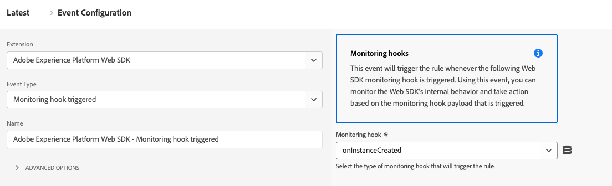
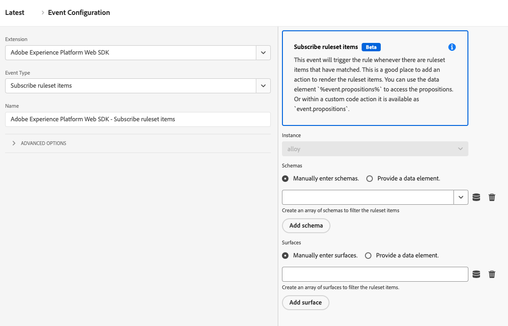

# Gebeurtenistypen

Op deze pagina worden de Adobe Experience Platform-gebeurtenistypen beschreven die worden geleverd door de tagextensie Adobe Experience Platform Web SDK. Deze worden gebruikt aan [&#x200B; bouwt regels &#x200B;](https://experienceleague.adobe.com/docs/platform-learn/data-collection/tags/build-rules.html?lang=nl-NL) en zou niet met het `eventType` gebied in het [`xdm` voorwerp &#x200B;](/help/collection/js/commands/sendevent/xdm.md) moeten worden verward.

## Monitoringhaak geactiveerd {#monitoring-hook-triggered}

De Adobe Experience Platform Web SDK bevat controleluks die u kunt gebruiken om verschillende systeemgebeurtenissen te controleren. Deze hulpmiddelen zijn nuttig om uw eigen het zuiveren hulpmiddelen te ontwikkelen en de logboeken van SDK van het Web te vangen.

Voor volledige details over welke parameters elke controlehaakgebeurtenis bevat, zie het [&#x200B; Web SDK controlehaks documentatie &#x200B;](/help/collection/js/monitoring-hooks.md).



De Web SDK-tagextensie ondersteunt de volgende controleluks:

* **[!UICONTROL onInstanceCreated]**: Deze haakgebeurtenis voor controle wordt geactiveerd wanneer u een nieuwe Web SDK-instantie hebt gemaakt.
* **[!UICONTROL onInstanceConfigured]**: deze haakgebeurtenis voor controle wordt geactiveerd door de Web SDK wanneer de opdracht [`configure`](/help/collection/js/commands/configure/overview.md) correct is omgezet
* **[!UICONTROL onBeforeCommand]**: Deze gebeurtenis van de controlehaak wordt teweeggebracht door Web SDK alvorens een ander bevel wordt uitgevoerd. U kunt deze controlehaak gebruiken om de configuratieopties van een specifiek bevel terug te winnen.
* **[!UICONTROL onCommandResolved]**: Deze haakgebeurtenis voor controle wordt geactiveerd voordat de opdrachtpromise wordt opgelost. U kunt deze functie gebruiken om de bevelopties en het resultaat te zien.
* **[!UICONTROL onCommandRejected]**: Deze gebeurtenis van de controlehaak wordt teweeggebracht wanneer een bevelbelofte wordt verworpen en het bevat informatie over de oorzaak van de fout.
* **[!UICONTROL onBeforeNetworkRequest]**: Deze haakgebeurtenis voor controle wordt geactiveerd voordat een netwerkaanvraag wordt uitgevoerd.
* **[!UICONTROL onNetworkResponse]**: Deze haakgebeurtenis voor controle wordt geactiveerd wanneer de browser een reactie ontvangt.
* **[!UICONTROL onNetworkError]**: Deze haakgebeurtenis voor controle wordt geactiveerd wanneer de netwerkaanvraag is mislukt.
* **[!UICONTROL onBeforeLog]**: Deze gebeurtenis van de controlehaak wordt teweeggebracht alvorens het Web SDK om het even wat aan de console registreert.
* **[!UICONTROL onContentRendering]**: Deze gebeurtenis van de controlehaak wordt teweeggebracht door de `personalization` component en het helpt u het teruggeven van de verpersoonlijkingsinhoud zuiveren. Deze gebeurtenis kan verschillende statussen hebben:
   * `rendering-started`: Geeft aan dat de Web SDK op het punt staat voorstellingen te renderen. Voordat de Web SDK een beslissingsbereik of een weergave begint te renderen, kunt u in het `data` -object de voorstellingen zien die door de `personalization` -component en de bereiknaam worden gerenderd.
   * `no-offers`: Geeft aan dat er geen payload is ontvangen voor de aangevraagde parameters.
   * `rendering-failed`: geeft aan dat Web SDK geen voorstel heeft weergegeven.
   * `rendering-succeeded`: geeft aan dat rendering is voltooid voor een beslissingsbereik.
   * `rendering-redirect`: Geeft aan dat Web SDK een omleidingsvoorstel uitvoert.
* **[!UICONTROL onContentHiding]**: Deze haakgebeurtenis voor controle wordt geactiveerd wanneer een vooraf verborgen stijl wordt toegepast of verwijderd.


## [!UICONTROL Send event complete]

De eigenschap heeft doorgaans een of meer regels die de handeling [[!UICONTROL Send event]](actions/send-event.md) gebruiken om gebeurtenissen naar Adobe Experience Platform Edge Network te verzenden. Elke keer dat een gebeurtenis naar Edge Network wordt verzonden, wordt een reactie met nuttige gegevens geretourneerd naar de browser. Zonder het gebeurtenistype [!UICONTROL Send event complete] hebt u geen toegang tot deze geretourneerde gegevens.

Als u toegang wilt krijgen tot de geretourneerde gegevens, maakt u een aparte regel en voegt u vervolgens een [!UICONTROL Send event complete] -gebeurtenis aan de regel toe. Deze regel wordt geactiveerd telkens wanneer een geslaagde reactie van de server wordt ontvangen als gevolg van een [!UICONTROL Send event] -actie.

Wanneer een [!UICONTROL Send event complete] -gebeurtenis een regel activeert, levert deze gegevens die door de server worden geretourneerd, die nuttig kunnen zijn om bepaalde taken uit te voeren. Meestal voegt u een [!UICONTROL Custom code] -actie (van de [!UICONTROL Core] -extensie) toe aan dezelfde regel die de [!UICONTROL Send event complete] -gebeurtenis bevat. In de handeling [!UICONTROL Custom code] heeft uw aangepaste code toegang tot een variabele met de naam `event` . Deze `event` -variabele bevat de gegevens die door de server worden geretourneerd.

Uw regel voor het verwerken van gegevens die door Edge Network worden geretourneerd, ziet er ongeveer als volgt uit:


Hieronder volgen enkele voorbeelden van het uitvoeren van bepaalde taken met behulp van de handeling [!UICONTROL Custom code] in deze regel.

### Persoonlijke inhoud handmatig renderen

In de actie van de Code van de Douane, die in de regel voor de behandeling van reactiegegevens is, kunt u tot verpersoonlijkingsvoorstellen toegang hebben die van de server zijn teruggekeerd. Hiervoor typt u de volgende aangepaste code:

```javascript
var propositions = event.propositions;
```

Als `event.propositions` bestaat, is het een array die objecten voor een verpersoonlijkingsvoorstel bevat. De voorstellingen die in de array zijn opgenomen, worden grotendeels bepaald door de manier waarop de gebeurtenis naar de server is verzonden.

Voor dit eerste scenario gaat u ervan uit dat u het selectievakje [!UICONTROL Render decisions] niet hebt ingeschakeld en geen [!UICONTROL decision scopes] in de [!UICONTROL Send event] -actie hebt opgegeven die verantwoordelijk is voor het verzenden van de gebeurtenis.


In dit voorbeeld bevat de array `propositions` alleen voorstellingen met betrekking tot de gebeurtenis die in aanmerking komen voor automatische rendering.

De array `propositions` kan er ongeveer als volgt uitzien:

```json
[
  {
    "id": "AT:eyJhY3Rpdml0eUlkIjoiMTI3MDE5IiwiZXhwZXJpZW5jZUlkIjoiMCJ9",
    "scope": "__view__",
    "items": [
      {
        "id": "11223344",
        "schema": "https://ns.adobe.com/personalization/dom-action",
        "data": {
          "content": "<h2 style=\"color: yellow\">An HTML proposition.</h2>",
          "selector": "#hero",
          "type": "setHtml"
        },
        "meta": {}
      }
    ],
    "renderAttempted": false
  },
  {
    "id": "AT:PyJhY3Rpdml0eUlkIjoiMTI3MDE5IiwiZXhwZXJpZW5jZUlkIjoiMCJ8",
    "scope": "__view__",
    "items": [
      {
        "id": "11223345",
        "schema": "https://ns.adobe.com/personalization/dom-action",
        "data": {
          "content": "<h2 style=\"color: yellow\">Another HTML proposition.</h2>",
          "selector": "#sidebar",
          "type": "setHtml"
        },
        "meta": {}
      }
    ],
    "renderAttempted": false
  }
]
```

Tijdens het verzenden van de gebeurtenis is het selectievakje [!UICONTROL Render decisions] niet ingeschakeld. De SDK heeft dus niet geprobeerd om automatisch inhoud te renderen. De SDK heeft echter nog steeds automatisch de inhoud opgehaald die in aanmerking komt voor automatische rendering en heeft deze aan u doorgegeven om de inhoud handmatig te renderen als u dat wilt. Voor elk propositieobject is de eigenschap `renderAttempted` ingesteld op `false` .

Als u in plaats daarvan het selectievakje [!UICONTROL Render decisions] zou hebben ingeschakeld bij het verzenden van de gebeurtenis, zou de SDK hebben geprobeerd alle profielen te renderen die in aanmerking komen voor automatische rendering. Als gevolg hiervan zou de eigenschap `renderAttempted` van elk propositieobject zijn ingesteld op `true` . In dit geval is het niet nodig deze voorstellen handmatig weer te geven.

Tot dusver, hebt u slechts tot verpersoonlijkingsinhoud gekeken die voor automatische teruggeven (bijvoorbeeld, om het even welke inhoud die in Adobe Target Visual Experience Composer wordt gecreeerd) verkiest. Om om het even welke verpersoonlijkingsinhoud terug te winnen _niet_ geschikt voor automatische teruggeven, verzoek de inhoud door besluitvormingswerkingsgebied te verstrekken gebruikend het [!UICONTROL Decision scopes] gebied in de [!UICONTROL Send event] actie. Een werkingsgebied is een koord dat een bepaald voorstel identificeert u van de server zou willen terugwinnen.

De handeling [!UICONTROL Send event] ziet er als volgt uit:


Als in dit voorbeeld proposities worden gevonden op de server die overeenkomt met het bereik `salutation` of `discount` , worden deze geretourneerd en opgenomen in de array `propositions` . Houd er rekening mee dat proposities die in aanmerking komen voor automatische rendering, ook in de toekomst in de array `propositions` worden opgenomen, ongeacht hoe u de velden [!UICONTROL Render decisions] of [!UICONTROL Decision scopes] in de handeling [!UICONTROL Send event] configureert. De array `propositions` ziet er in dit geval ongeveer als volgt uit:

```json
[
  {
    "id": "AT:cZJhY3Rpdml0eUlkIjoiMTI3MDE5IiwiZXhwZXJpZW5jZUlkIjoiMCJ2",
    "scope": "salutation",
    "items": [
      {
        "schema": "https://ns.adobe.com/personalization/json-content-item",
        "data": {
          "id": "4433221",
          "content": {
            "salutation": "Welcome, esteemed visitor!"
          }
        },
        "meta": {}
      }
    ],
    "renderAttempted": false
  },
  {
    "id": "AT:FZJhY3Rpdml0eUlkIjoiMTI3MDE5IiwiZXhwZXJpZW5jZUlkIjoiMCJ0",
    "scope": "discount",
    "items": [
      {
        "schema": "https://ns.adobe.com/personalization/html-content-item",
        "data": {
          "id": "4433222",
          "content": "<div>50% off your order!</div>",
          "format": "text/html"
        },
        "meta": {}
      }
    ],
    "renderAttempted": false
  },
  {
    "id": "AT:eyJhY3Rpdml0eUlkIjoiMTI3MDE5IiwiZXhwZXJpZW5jZUlkIjoiMCJ9",
    "scope": "__view__",
    "items": [
      {
        "id": "11223344",
        "schema": "https://ns.adobe.com/personalization/dom-action",
        "data": {
          "content": "<h2 style=\"color: yellow\">An HTML proposition.</h2>",
          "selector": "#hero",
          "type": "setHtml"
        },
        "meta": {}
      }
    ],
    "renderAttempted": false
  },
  {
    "id": "AT:PyJhY3Rpdml0eUlkIjoiMTI3MDE5IiwiZXhwZXJpZW5jZUlkIjoiMCJ8",
    "scope": "__view__",
    "items": [
      {
        "id": "11223345",
        "schema": "https://ns.adobe.com/personalization/dom-action",
        "data": {
          "content": "<h2 style=\"color: yellow\">Another HTML proposition.</h2>",
          "selector": "#sidebar",
          "type": "setHtml"
        },
        "meta": {}
      }
    ],
    "renderAttempted": false
  }
]
```

Op dit punt kunt u propositie-inhoud naar eigen inzicht renderen. In dit voorbeeld is het voorstel dat overeenkomt met het bereik van `discount` een HTML-voorstel dat is gemaakt met behulp van Adobe Target Form-based Experience Composer. Stel dat u een element op de pagina hebt met de id `daily-special` en de inhoud van het `discount` proposition wilt weergeven in het `daily-special` -element. Ga als volgt te werk:

1. Extraheer voorstellen uit het `event` -object.
1. Doorloop elk voorstel en zoek het voorstel met een bereik van `discount` .
1. Als u een voorstel vindt, doorloopt u elk item in het voorstel en zoekt u het item dat HTML-inhoud is. (Het is beter om te controleren dan om te veronderstellen.)
1. Als u een item vindt dat HTML-inhoud bevat, zoekt u het `daily-special` -element op de pagina en vervangt u de HTML door de gepersonaliseerde inhoud.

De aangepaste code in de handeling [!UICONTROL Custom code] kan er als volgt uitzien:

```javascript
var propositions = event.propositions;

var discountProposition;
if (propositions) {
  // Find the discount proposition, if it exists.
  for (var i = 0; i < propositions.length; i++) {
    var proposition = propositions[i]; 
    if (proposition.scope === "discount") {
      discountProposition = proposition;
      break;
    }
  }
}

var discountHtml;
if (discountProposition) {
  // Find the item from proposition that should be rendered.
  // Rather than assuming there a single item that has HTML
  // content, find the first item whose schema indicates
  // it contains HTML content.
  for (var j = 0; j < discountProposition.items.length; j++) {
    var discountPropositionItem = discountProposition.items[i]; 
    if (discountPropositionItem.schema === "https://ns.adobe.com/personalization/html-content-item") {
      discountHtml = discountPropositionItem.data.content;
      break;
    }
  }
}

if (discountHtml) {
  // Discount HTML exists. Time to render it.
  var dailySpecialElement = document.getElementById("daily-special");
  dailySpecialElement.innerHTML = discountHtml;
}
```

### Adobe Target-respontokens openen

De inhoud van Personalization die van Adobe Target is teruggekeerd omvat [&#x200B; reactietokens &#x200B;](https://experienceleague.adobe.com/docs/target/using/administer/response-tokens.html?lang=nl-NL), die details over de activiteit, de aanbieding, de ervaring, het gebruikersprofiel, geo informatie, en meer zijn. Deze details kunnen met derdehulpmiddelen worden gedeeld of voor het zuiveren worden gebruikt. De tokens van de reactie kunnen in het gebruikersinterface van Adobe Target worden gevormd.

In de actie van de Code van de Douane, die in de regel voor de behandeling van reactiegegevens is, kunt u tot verpersoonlijkingsvoorstellen toegang hebben die van de server zijn teruggekeerd. Voer hiertoe de volgende aangepaste code in:

```javascript
var propositions = event.propositions;
```

Als `event.propositions` bestaat, is het een array die objecten voor een verpersoonlijkingsvoorstel bevat. Zie [&#x200B; manueel gepersonaliseerde inhoud &#x200B;](#manually-render-personalized-content) voor meer informatie over de inhoud van `result.propositions` teruggeven.

Stel dat u alle activiteitnamen wilt verzamelen van alle voorstellingen die automatisch door het web-SDK zijn gerenderd en deze in één array wilt plaatsen. Vervolgens kunt u de ene array naar een derde verzenden. In dit geval schrijft u aangepaste code binnen de handeling [!UICONTROL Custom code] naar:

1. Extraheer voorstellen uit het `event` -object.
1. Lijn door elk voorstel.
1. Bepaal of de SDK het voorstel heeft weergegeven.
1. Als zo, lijn door elk punt in het voorstel.
1. Haal de naam van de activiteit op uit de eigenschap `meta` . Dit is een object dat responstokens bevat.
1. Zet de naam van de activiteit in een array.
1. Verzend de namen van de activiteiten naar een derde.

```javascript
var propositions = event.propositions;
if (propositions) {
  var activityNames = [];
  propositions.forEach(function(proposition) {
    if (proposition.renderAttempted) {
      proposition.items.forEach(function(item) {
        if (item.meta) {
          // item.meta contains the response tokens.
          var activityName = item.meta["activity.name"];
          // Ignore duplicates
          if (activityNames.indexOf(activityName) === -1) {
            activityNames.push(activityName);  
          }
        }
      });
    }
  });
  // Now that activity names are in an array,
  // you can send them to a third party or use
  // them in some other way.
}
```

## [!UICONTROL Subscribe ruleset items] {#subscribe-ruleset-items}

Met het gebeurtenistype **[!UICONTROL Subscribe ruleset items]** kunt u zich abonneren op Adobe Journey Optimizer-inhoudskaarten voor een oppervlak. Telkens wanneer de regels worden geëvalueerd, ontvangt de callback die aan dit bevel wordt verstrekt een resultaatvoorwerp met voorstellen die de gegevens van de inhoudskaart houden.



Dit gebeurtenistype ondersteunt de volgende configureerbare eigenschappen:

* **[!UICONTROL Schemas]**: Een array van schema&#39;s waarvoor u zich op inhoudskaarten wilt abonneren. U kunt de schema&#39;s manueel ingaan of door een gegevenselement te verstrekken.
* **[!UICONTROL Surfaces]**: een array met oppervlakken waarvoor u zich wilt abonneren op inhoudskaarten. U kunt de oppervlakken handmatig invoeren of een gegevenselement opgeven.
