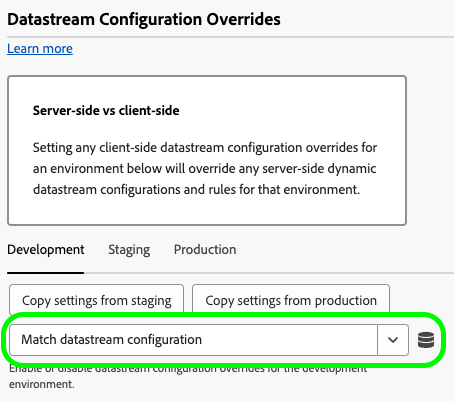
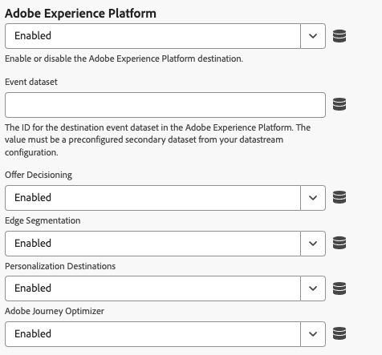

# De Web SDK-tagextensie configureren

Met de tagextensie [!DNL Web SDK] worden gegevens vanuit wegeigenschappen via de Experience Platform Edge Network naar Adobe Experience Cloud verzonden.

Met de extensie kunt u gegevens streamen naar Experience Platform, identiteiten synchroniseren, toestemmingssignalen van klanten verwerken en automatisch contextgegevens verzamelen.

In dit document wordt uitgelegd hoe u de tagextensie configureert in de gebruikersinterface voor tags.

## De extensie van de Web SDK-tag installeren {#install}

Voor de extensie van de SDK-tag Web moet een eigenschap zijn geïnstalleerd. Als u dit niet reeds hebt gedaan, zie de documentatie bij [ het creëren van een markeringsbezit ](https://experienceleague.adobe.com/docs/platform-learn/implement-in-websites/configure-tags/create-a-property.html).

Nadat u een eigenschap hebt gemaakt, opent u de eigenschap en selecteert u de tab **[!UICONTROL Extensions]** op de linkerzijbalk.

Selecteer het tabblad **[!UICONTROL Catalog]**. Zoek in de lijst met beschikbare extensies naar de extensie [!DNL Web SDK] en selecteer **[!UICONTROL Install]** .

Nadat u **[!UICONTROL Install]** hebt geselecteerd, moet u de Web SDK-tagextensie configureren en de configuratie opslaan.

>[!NOTE]
>
>De tagextensie wordt alleen geïnstalleerd nadat de configuratie is opgeslagen. Zie de volgende secties om te leren hoe te om de markeringsuitbreiding te vormen.

## Een aangepaste Web SDK-build maken {#custom-build}

De bibliotheek van SDK van het Web omvat veelvoudige modules voor diverse eigenschappen zoals verpersoonlijking, identiteit, verbinding het volgen, en meer. Afhankelijk van uw gebruiksgevallen hebt u wellicht alleen specifieke functies nodig in plaats van de volledige bibliotheek. Door een aangepaste Web SDK-build te maken, kunt u alleen de modules selecteren die u nodig hebt, de bibliotheekgrootte reduceren en de prestaties verbeteren.

Wanneer u een de bouwstijl van het douaneWeb SDK creeert, wordt de bouwstijl gebruikt door al uw instanties van SDK van het Web.

>[!IMPORTANT]
>
>Als u SDK-componenten van het web uitschakelt, kan dit de bestaande implementatie onderbreken. Elke keer dat u een component uitschakelt, moet u de implementatie grondig testen om ervoor te zorgen dat alle functies die u nodig hebt, naar behoren werken.
>Wanneer u een component uitschakelt, kunt u de instellingen van die component niet meer bewerken.

Als u een aangepaste Web SDK-build wilt maken met de Web SDK-tagextensie, volgt u de onderstaande stappen.

1. Vouw de sectie **[!UICONTROL Custom build components]** uit op de configuratiepagina voor de tagextensie.
1. Schakel de componenten in of uit op basis van uw behoeften. U kunt uit de volgende componenten selecteren:
   * **[!UICONTROL Activity collector]**: deze component schakelt automatische koppelingenverzameling en het bijhouden van activiteitenoverzichten in.
   * **[!UICONTROL Audiences]**: deze componenten maken Audience Manager-integratie mogelijk, inclusief URL- en op cookies gebaseerde doelen, en ID-syncs.
   * **[!UICONTROL Consent]**: deze component maakt integratie van toestemming mogelijk. Als u deze component uitschakelt, worden de volgende elementen uitgeschakeld:
      * [ plaats toestemmings ](action-types.md#set-consent) actietype
   * **[!UICONTROL Context]**: deze component maakt het automatisch verzamelen van contextgegevens mogelijk.
   * **[!UICONTROL Event merge]**: _Afgekeurd_. Als u deze component uitschakelt, worden de volgende elementen uitgeschakeld:
      * [&#128279;](action-types.md#data) gegevenselement van identiteitskaart van de Fusie van de Gebeurtenis
      * **[!UICONTROL Reset event merge ID]** actietype
   * **[!UICONTROL Media analytics bridge]**: deze component schakelt Edge Network Streaming Media in via de Media Analytics-interface. Als u deze component uitschakelt, worden de volgende elementen uitgeschakeld:
      * [ krijgt de Traceur van de Analyse van Media ](action-types.md#get-media-analytics-tracker) actietype
   * **[!UICONTROL Personalization]**: deze component maakt de integratie van Adobe Target en Adobe Journey Optimizer mogelijk. Als u deze component uitschakelt, worden de volgende elementen uitgeschakeld:
      * [ pas voorstellingenactie ](action-types.md) type toe
   * **[!UICONTROL Rules engine]**: deze component schakelt de Adobe Journey Optimizer op het apparaat in. Als u deze component uitschakelt, worden de volgende elementen uitgeschakeld:
      * [ evalueert heersers ](action-types.md#evaluate-rulesets) actietype
      * [ Abonneren heersenet punten ](event-types.md#subscribe-ruleset-items) gebeurtenistype
   * **[!UICONTROL Streaming media]**: deze component schakelt Edge Network Streaming Media in. Als u deze component uitschakelt, worden de volgende elementen uitgeschakeld:
      * [ verzendt media gebeurtenis ](action-types.md#send-media-event) actietype

## Instantie-instellingen configureren {#general}

De configuratieopties boven aan de pagina vertellen Adobe Experience Platform waar de gegevens moeten worden gerouteerd en welke configuraties op de server moeten worden gebruikt.

* **[!UICONTROL Name]**: De extensie Adobe Experience Platform Web SDK ondersteunt meerdere exemplaren op de pagina. De naam wordt gebruikt om gegevens naar veelvoudige organisaties met een markeringsconfiguratie te verzenden. De instantienaam is standaard ingesteld op `alloy` . U kunt de instantienaam echter wijzigen in elke geldige JavaScript-objectnaam.
* **[!UICONTROL IMS organization ID]**: De id van de organisatie waarnaar u de gegevens op Adobe wilt verzenden. Meestal gebruikt u de standaardwaarde die automatisch wordt ingevuld. Wanneer u meerdere exemplaren op de pagina hebt, vult u dit veld met de waarde van de tweede organisatie waarnaar u gegevens wilt verzenden.
* **[!UICONTROL Edge domain]**: Het domein waarvan de extensie gegevens verzendt en ontvangt. Adobe raadt u aan een 1st-party-domein (CNAME) te gebruiken voor deze extensie. Het standaard domein van derden werkt voor ontwikkelomgevingen, maar is niet geschikt voor productieomgevingen. De instructies op hoe te opstelling zijn een eerste-partij CNAME vermeld [ hier ](https://experienceleague.adobe.com/docs/core-services/interface/ec-cookies/cookies-first-party.html).

## Gegevensstroominstellingen configureren {#datastreams}

Deze sectie staat u toe om de gegevensstromen te selecteren die voor elk van de drie beschikbare milieu&#39;s (productie, het opvoeren, en ontwikkeling) zouden moeten worden gebruikt.

Wanneer een aanvraag naar de Edge Network wordt verzonden, wordt een gegevensstroom-id gebruikt om naar de server-zijconfiguratie te verwijzen. U kunt de configuratie bijwerken zonder dat u codewijzigingen op uw website hoeft aan te brengen.

Zie de gids op [ gegevensstromen ](../../../../datastreams/overview.md) leren hoe te om een gegevensstroom te vormen.

U kunt een gegevensstroom kiezen in de beschikbare vervolgkeuzemenu&#39;s of **[!UICONTROL Enter values]** selecteren en een aangepaste gegevensstroom-id invoeren voor elke omgeving.

## Privacy-instellingen configureren {#privacy}

Deze sectie staat u toe om te vormen hoe Web SDK de signalen van de gebruikersgoedkeuring van uw website behandelt. Met name kunt u het standaardniveau van toestemming selecteren dat wordt aangenomen door een gebruiker als er geen andere voorkeur voor expliciete toestemming is opgegeven.

Het standaard toestemmingsniveau wordt niet bewaard aan het gebruikersprofiel.

| [!UICONTROL Default consent level] | Beschrijving |
| --- | --- |
| [!UICONTROL In] | Verzamel gebeurtenissen die plaatsvinden voordat de gebruiker voorkeuren voor toestemming geeft. |
| [!UICONTROL Out] | Gebeurtenissen negeren die plaatsvinden voordat de gebruiker voorkeuren voor toestemming geeft. |
| [!UICONTROL Pending] | Wachtrij-gebeurtenissen die plaatsvinden voordat de gebruiker voorkeuren voor toestemming geeft. Als er voorkeuren voor toestemming zijn opgegeven, worden de gebeurtenissen verzameld of genegeerd, afhankelijk van de opgegeven voorkeuren. |
| [!UICONTROL Provided by data element] | Het standaard toestemmingsniveau wordt bepaald door een afzonderlijk gegevenselement dat u bepaalt. Wanneer u deze optie gebruikt, moet u het gegevenselement opgeven met behulp van het opgegeven vervolgkeuzemenu. |

>[!TIP]
>
>Gebruik **[!UICONTROL Out]** of **[!UICONTROL Pending]** als u expliciete toestemming van de gebruiker voor uw bedrijfsactiviteiten nodig hebt.

## Identiteitsinstellingen configureren {#identity}

Deze sectie staat u toe om het gedrag van het Web SDK te bepalen wanneer het over de behandeling van gebruikersidentificatie komt.

* **[!UICONTROL Migrate ECID from VisitorAPI]**: Deze optie is standaard ingeschakeld. Wanneer deze functie is ingeschakeld, kan de SDK de `AMCV` - en `s_ecid` -cookies lezen en de `AMCV` -cookie instellen die door [!DNL Visitor.js] wordt gebruikt. Deze functie is belangrijk wanneer u naar Web SDK migreert, omdat sommige pagina&#39;s wellicht nog steeds [!DNL Visitor.js] gebruiken. Met deze optie kan de SDK hetzelfde [!DNL ECID] blijven gebruiken, zodat gebruikers niet worden geïdentificeerd als twee aparte gebruikers.
* **[!UICONTROL Use third-party cookies]**: Wanneer deze optie is ingeschakeld, probeert Web SDK een gebruikers-id op te slaan in een cookie van een andere fabrikant. Als dit gelukt is, wordt de gebruiker geïdentificeerd als één gebruiker terwijl deze in meerdere domeinen navigeert en niet als een afzonderlijke gebruiker op elk domein wordt geïdentificeerd. Als deze optie is ingeschakeld, kan de SDK de gebruikersnaam nog steeds niet opslaan in een cookie van een andere fabrikant als de browser cookies van derden niet ondersteunt of door de gebruiker is geconfigureerd om cookies van derden niet toe te staan. In dit geval slaat de SDK de id alleen op in het domein van de eerste partij.

  >[!IMPORTANT]
  >&#x200B;>De koekjes van de derde zijn niet compatibel met de &rbrack;(../../../../web-sdk/identity/first-party-device-ids.md) functionaliteit 1&rbrace; van identiteitskaart van het eerste apparaat in SDK van het Web.

&lbrack;
U kunt apparaat-id&#39;s van andere leveranciers gebruiken of cookies van andere leveranciers, maar u kunt beide functies niet tegelijkertijd gebruiken.
  >

## Aanpassingsinstellingen configureren {#personalization}

In deze sectie kunt u configureren hoe u bepaalde delen van een pagina wilt verbergen terwijl gepersonaliseerde inhoud wordt geladen. Zo weet u zeker dat uw bezoekers alleen de gepersonaliseerde pagina zien.

* **[!UICONTROL Migrate Target from at.js to the Web SDK]**: Gebruik deze optie om [!DNL Web SDK] in te schakelen om de verouderde `mbox` - en `mboxEdgeCluster` -cookies die door at.js `1.x` - of `2.x` -bibliotheken worden gebruikt, te lezen en te schrijven. Zo kunt u het profiel van de bezoeker behouden terwijl u overschakelt van een pagina waarop de Web SDK wordt gebruikt naar een pagina die op .js `1.x` of `2.x` bibliotheken en andersom gebruikt.

### Stijl vooraf verbergen {#prehiding-style}

Met de preHide style editor kunt u aangepaste CSS-regels definiëren om specifieke secties van een pagina te verbergen. Wanneer de pagina wordt geladen, gebruikt SDK van het Web deze stijl om de secties te verbergen die moeten worden gepersonaliseerd, wint de verpersoonlijking terug, dan unhides de gepersonaliseerde paginagedeelten. Op deze manier zien uw bezoekers de reeds gepersonaliseerde pagina&#39;s, zonder het proces van de personalisatieherwinning te zien.

### Fragment vooraf verbergen {#prehiding-snippet}

Het voorbeeldfragment is handig wanneer de Web SDK-bibliotheek asynchroon wordt geladen. In dit geval raden we u aan de inhoud te verbergen voordat de Web SDK-bibliotheek wordt geladen om flikkering te voorkomen.

Als u het voorverborgen fragment wilt gebruiken, kopieert en plakt u het in het `<head>` -element van de pagina.

>[!IMPORTANT]
>
>Wanneer het gebruiken van het prehide fragment, adviseert Adobe om de zelfde [!DNL CSS] regel te gebruiken zoals die door [ wordt gebruikt prehide stijl ](#prehiding-style).

## Instellingen voor gegevensverzameling configureren {#data-collection}

Configuratieinstellingen voor gegevensverzameling beheren. Vergelijkbare instellingen in de JavaScript-bibliotheek zijn beschikbaar via de opdracht [`configure`](/help/web-sdk/commands/configure/overview.md) .

* **[!UICONTROL On before event send callback]**: Een callback-functie voor het evalueren en wijzigen van de lading die naar Adobe wordt verzonden. Gebruik de `content` variabele binnen de callback functie om de nuttige lading te wijzigen. Deze callback is gelijk aan de tag [`onBeforeEventSend`](/help/web-sdk/commands/configure/onbeforeeventsend.md) in de JavaScript-bibliotheek.
* **[!UICONTROL Collect internal link clicks]**: Een selectievakje waarmee de verzameling van gegevens voor het bijhouden van koppelingen binnen uw site of eigenschap wordt ingeschakeld. Wanneer u dit selectievakje inschakelt, worden opties voor gebeurtenisgroepering weergegeven:
   * **[!UICONTROL No event grouping]**: Gegevens voor het bijhouden van koppelingen worden in afzonderlijke gebeurtenissen naar Adobe verzonden. Koppelingsklikken die in afzonderlijke gebeurtenissen worden verzonden, kunnen het contractuele gebruik van gegevens die naar Adobe Experience Platform worden verzonden verhogen.
   * **[!UICONTROL Event grouping using session storage]**: Gegevens voor het bijhouden van koppelingen opslaan in sessieopslag tot de volgende paginagebeurtenis. Op de volgende pagina worden de opgeslagen gegevens voor het bijhouden van koppelingen en de paginaweergave tegelijkertijd naar Adobe verzonden. Adobe raadt u aan deze instelling in te schakelen bij het bijhouden van interne koppelingen.
   * **[!UICONTROL Event grouping using local object]**: Sla koppelingsvolggegevens in een lokaal object op tot de volgende paginagebeurtenis. Als een bezoeker naar een nieuwe pagina navigeert, gaan de gegevens voor het bijhouden van koppelingen verloren. Deze instelling is het meest geschikt voor toepassingen van één pagina.
* **[!UICONTROL Collect external link clicks]**: Een selectievakje waarmee externe koppelingen kunnen worden verzameld.
* **[!UICONTROL Collect download link clicks]**: Een selectievakje waarmee downloadkoppelingen kunnen worden verzameld.
* **[!UICONTROL Download link qualifier]**: Een reguliere expressie die een link-URL kwalificeert als een downloadkoppeling.
* **[!UICONTROL Filter click properties]**: Een callback-functie voor het evalueren en wijzigen van klikgerelateerde eigenschappen vóór de verzameling. Deze functie wordt uitgevoerd vóór de [!UICONTROL On before event send callback] .
* **montages van de Context**: Verzamel automatisch bezoekersinformatie, die specifieke gebieden XDM voor u bevolkt. U kunt **[!UICONTROL All default context information]** of **[!UICONTROL Specific context information]** kiezen. De tag komt overeen met [`context`](/help/web-sdk/commands/configure/context.md) in de JavaScript-bibliotheek.
   * **[!UICONTROL Web]**: verzamelt informatie over de huidige pagina.
   * **[!UICONTROL Device]**: verzamelt informatie over het apparaat van de gebruiker.
   * **[!UICONTROL Environment]**: verzamelt informatie over de browser van de gebruiker.
   * **[!UICONTROL Place context]**: verzamelt informatie over de locatie van de gebruiker.
   * **[!UICONTROL High entropy user-agent hints]**: verzamelt meer gedetailleerde informatie over het apparaat van de gebruiker.

>[!TIP]
>
>Het veld **[!UICONTROL On before link click send]** is een afgekeurde callback die alleen zichtbaar is voor eigenschappen waarvoor deze al is geconfigureerd. De tag komt overeen met [`onBeforeLinkClickSend`](/help/web-sdk/commands/configure/onbeforelinkclicksend.md) in de JavaScript-bibliotheek. Gebruik de callback van **[!UICONTROL Filter click properties]** om klikgegevens te filteren of aan te passen, of **[!UICONTROL On before event send callback]** te gebruiken om de algemene lading te filtreren of aan te passen die naar Adobe wordt verzonden. Wanneer zowel de callback als de callback **[!UICONTROL On before link click send]** zijn ingesteld, wordt alleen de callback **[!UICONTROL Filter click properties]** uitgevoerd.**[!UICONTROL Filter click properties]**

## Instellingen voor mediaverzamelingen configureren {#media-collection}

Met de functie voor het verzamelen van media kunt u gegevens verzamelen die betrekking hebben op mediasessies op uw website.

De verzamelde gegevens kunnen informatie over media playbacks, pauzes, voltooiing, en andere verwante gebeurtenissen omvatten. Nadat deze gegevens zijn verzameld, kunt u deze naar Adobe Experience Platform en/of Adobe Analytics verzenden om rapporten te genereren. Deze functie biedt een uitgebreide oplossing voor het bijhouden en begrijpen van het gedrag van het mediaconsumptie op uw website.

* **[!UICONTROL Channel]**: De naam van het kanaal waar de media inzameling voorkomt. Voorbeeld: `Video channel` .
* **[!UICONTROL Player Name]**: De naam van de mediaspeler.
* **[!UICONTROL Application Version]**: De versie van de mediaspeltoepassing.
* **[!UICONTROL Main ping interval]**: Frequentie van pings voor hoofdinhoud, in seconden. De standaardwaarde is `10` . Waarden kunnen variëren van `10` tot `50` seconden.  Als geen waarde wordt gespecificeerd, wordt de standaardwaarde gebruikt wanneer het gebruiken van [ automatisch-gevolgde zittingen ](../../../../web-sdk/commands/createmediasession.md#automatic).
* **[!UICONTROL Ad ping interval]**: Frequentie van pings voor advertentie-inhoud, in seconden. De standaardwaarde is `10` . Waarden kunnen variëren van `1` tot `10` seconden. Als geen waarde wordt gespecificeerd, wordt de standaardwaarde gebruikt wanneer het gebruiken van [ automatisch-gevolgd zittingen ](../../../../web-sdk/commands/createmediasession.md#automatic)

## Gegevensstroomoverschrijvingen configureren {#datastream-overrides}

Met DataStream-overschrijvingen kunt u aanvullende configuraties voor uw gegevensstreams definiëren. Deze configuraties worden via de Web SDK aan de Edge Network doorgegeven.

Dit helpt u verschillend gegevensstroomgedrag dan de standaarddegenen teweegbrengen, zonder het creëren van een nieuwe gegevensstroom of het wijzigen van uw bestaande montages.

De configuratieopheffing van gegevensstroom is een proces in twee stappen:

1. Eerst, moet u uw configuratie van de gegevensstroom met voeten treden in de [ gegevenstream configuratiepagina ](/help/datastreams/configure.md).
2. Vervolgens moet u de overschrijvingen naar de Edge Network verzenden via de opdracht Web SDK of met de extensie van de SDK-tag Web.

Zie de datastream [ configuratie met voeten treedt documentatie ](/help/datastreams/overrides.md) voor gedetailleerde instructies op hoe te om configuraties van de gegevensstroom met voeten te treden.

Als alternatief voor het overgaan van de met voeten treedt door een bevel van SDK van het Web, kunt u de met voeten treedt in het scherm van de markeringsuitbreiding vormen hieronder wordt getoond die.

>[!IMPORTANT]
>
>DataStream-overschrijvingen moeten per omgeving worden geconfigureerd. De ontwikkelings-, staging- en productieomgevingen hebben allemaal verschillende overschrijvingen. U kunt de instellingen tussen de instellingen kopiëren met behulp van de speciale opties die in het onderstaande scherm worden weergegeven.

Standaard is de configuratieoverschrijving van de gegevensstroom uitgeschakeld. De optie **[!UICONTROL Match datastream configuration]** is standaard geselecteerd.

Als u gegevensstroomoverschrijvingen wilt inschakelen in de tagextensie, selecteert u **[!UICONTROL Enabled]** in het keuzemenu.

Nadat u de gegevensstroomconfiguratie met voeten treedt, kunt u de overschrijvingen voor elke hieronder beschreven dienst vormen.

De onderstaande gegevensstroomoverschrijvingsinstellingen overschrijven alle configuraties en regels van de gegevensstroom aan de serverzijde voor de geselecteerde omgeving.

### Adobe Analytics {#analytics}

Gebruik de montages in deze sectie om gegevens met voeten te treden die aan de dienst van Adobe Analytics verpletteren.

{het beeld van de de marktextensie UI van SDK van het 0} Web die de montages van de de gegevensstroom van Adobe Analytics met voeten treedt.

* **[!UICONTROL Enabled]** / **[!UICONTROL Disabled]**: gebruik dit vervolgkeuzemenu om gegevensroutering naar de Adobe Analytics-service in of uit te schakelen.
* **[!UICONTROL Report suites]**: De id&#39;s voor de bestemmingsrapportsuites in Adobe Analytics. De waarde moet een vooraf geconfigureerde rapportsuite (of een door komma&#39;s gescheiden lijst met rapportsuites) van uw gegevensstroomconfiguratie zijn. Deze instelling overschrijft de primaire rapportsuites.
* **[!UICONTROL Add Report Suite]**: selecteer deze optie om extra rapportsuites toe te voegen.

### Adobe Audience Manager {#audience-manager}

Gebruik de montages in deze sectie om gegevens met voeten te treden die aan de dienst van Adobe Audience Manager verpletteren.

{het beeld van de de marktextensie UI van SDK van het 0} Web die de montages van de de gegevensstroom van Adobe Audience Manager met voeten treedt.

* **[!UICONTROL Enabled]** / **[!UICONTROL Disabled]**: gebruik dit vervolgkeuzemenu om gegevensroutering naar de Adobe Audience Manager-service in of uit te schakelen.
* **[!UICONTROL Third-party ID sync container]**: De id voor de synchronisatiecontainer van de doel-id van derden in Audience Manager. De waarde moet een preconfigured secundaire container van uw gegevensstroomconfiguratie zijn en treedt de primaire container met voeten.

### Adobe Experience Platform {#experience-platform}

Gebruik de montages in deze sectie om gegevens met voeten te treden die aan de dienst van Adobe Experience Platform verpletteren.

{het beeld van de de marktextensie UI van SDK van het 0} Web die de montages van de de gegevensstroom van Adobe Experience Platform met voeten treedt.

* **[!UICONTROL Enabled]** / **[!UICONTROL Disabled]**: gebruik dit vervolgkeuzemenu om gegevensroutering naar de Adobe Experience Platform-service in of uit te schakelen.
* **[!UICONTROL Event dataset]**: De id voor de gegevensset met doelgebeurtenissen in de Adobe Experience Platform. De waarde moet een preconfigured secundaire dataset van uw configuratie van de gegevensstroom zijn.
* **[!UICONTROL Offer Decisioning]**: gebruik dit vervolgkeuzemenu om gegevensroutering naar de [!DNL Offer Decisioning] -service in of uit te schakelen.
* **[!UICONTROL Edge Segmentation]**: gebruik dit vervolgkeuzemenu om gegevensroutering naar de [!DNL Edge Segmentation] -service in of uit te schakelen.
* **[!UICONTROL Personalization Destinations]**: Gebruik dit drop-down menu om gegevens toe te laten of onbruikbaar te maken die aan verpersoonlijkingsbestemmingen verpletteren.
* **[!UICONTROL Adobe Journey Optimizer]**: gebruik dit vervolgkeuzemenu om gegevensroutering naar de [!DNL Adobe Journey Optimizer] -service in of uit te schakelen.

### Adobe Server-Side Event Forwarding {#ssf}

Gebruik de montages in deze sectie om gegevens met voeten te treden die aan de server-zij gebeurtenis door:sturen dienst van Adobe verpletteren.

{het beeld van de de markeringsuitbreiding UI van SDK van het 0} Web die de Server-zij Gebeurtenis toont die van Adobe gegevensstroom met voeten treedt montages.

* **[!UICONTROL Enabled]** / **[!UICONTROL Disabled]**: gebruik dit vervolgkeuzemenu om het verzenden van gegevens naar de Adobe Server-Side Event Forwarding-service in of uit te schakelen.

### Adobe Target {#target}

Gebruik de montages in deze sectie om gegevens met voeten te treden die aan de dienst van Adobe Target verpletteren.

{het beeld van de de marktextensie UI van SDK van het 0} Web die de montages van de de gegevensstroom van Adobe Target met voeten treedt.

* **[!UICONTROL Enabled]** / **[!UICONTROL Disabled]**: gebruik dit vervolgkeuzemenu om gegevensroutering naar de Adobe Target-service in of uit te schakelen.

## Geavanceerde instellingen configureren

Gebruik het veld **[!UICONTROL Edge base path]** als u het basispad moet wijzigen dat wordt gebruikt voor interactie met de Edge Network. Dit zou niet het bijwerken moeten vereisen, maar in het geval dat u aan bèta of alpha deelneemt, zou Adobe u kunnen vragen om dit gebied te veranderen.

