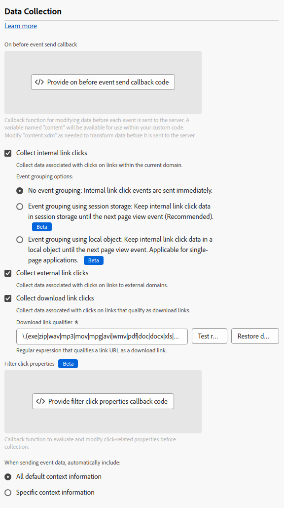

# De webSDK-tagextensie configureren

De [!DNL Web SDK] de markeringsuitbreiding verzendt gegevens naar Adobe Experience Cloud van Web-eigenschappen door het Netwerk van de Rand van het Experience Platform.

Met de extensie kunt u gegevens streamen naar Platform, identiteiten synchroniseren, de toestemmingssignalen van de klant verwerken en automatisch contextgegevens verzamelen.

In dit document wordt uitgelegd hoe u de tagextensie configureert in de gebruikersinterface voor tags.

## De extensie van de Web SDK-tag installeren {#install}

De de markeringsuitbreiding van SDK van het Web moet een bezit worden geïnstalleerd. Als u dit nog niet hebt gedaan, raadpleegt u de documentatie op [een tag-eigenschap maken](https://experienceleague.adobe.com/docs/platform-learn/implement-in-websites/configure-tags/create-a-property.html).

Nadat u een eigenschap hebt gemaakt, opent u de eigenschap en selecteert u de **[!UICONTROL Extensions]** op de linkerzijbalk.

Selecteer het tabblad **[!UICONTROL Catalog]**. Zoek in de lijst met beschikbare extensies naar de [!DNL Web SDK] en selecteert u **[!UICONTROL Install]**.

Na het selecteren **[!UICONTROL Install]**, moet u de de markeringsuitbreiding van SDK van het Web vormen en de configuratie opslaan.

>[!NOTE]
>
>De tagextensie wordt alleen geïnstalleerd nadat de configuratie is opgeslagen. Zie de volgende secties om te leren hoe te om de markeringsuitbreiding te vormen.

## Instantie-instellingen configureren {#general}

De configuratieopties boven aan de pagina vertellen Adobe Experience Platform waar de gegevens moeten worden gerouteerd en welke configuraties op de server moeten worden gebruikt.

* **[!UICONTROL Name]**: De extensie Adobe Experience Platform Web SDK ondersteunt meerdere exemplaren op de pagina. De naam wordt gebruikt om gegevens naar veelvoudige organisaties met een markeringsconfiguratie te verzenden. De instantienaam is standaard ingesteld op `alloy`. U kunt de instantienaam echter wijzigen in elke geldige naam voor een JavaScript-object.
* **[!UICONTROL IMS organization ID]**: De id van de organisatie waarnaar u de gegevens bij Adobe wilt verzenden. Meestal gebruikt u de standaardwaarde die automatisch wordt ingevuld. Wanneer u meerdere exemplaren op de pagina hebt, vult u dit veld met de waarde van de tweede organisatie waarnaar u gegevens wilt verzenden.
* **[!UICONTROL Edge domain]**: Het domein waarvan de extensie gegevens verzendt en ontvangt. De Adobe adviseert gebruikend een 1st-partijdomein (CNAME) voor deze uitbreiding. Het standaard domein van derden werkt voor ontwikkelomgevingen, maar is niet geschikt voor productieomgevingen. Instructies over hoe te opstelling een eerste-partij CNAME zijn vermeld [hier](https://experienceleague.adobe.com/docs/core-services/interface/ec-cookies/cookies-first-party.html).

## Gegevensstroominstellingen configureren {#datastreams}

Deze sectie staat u toe om de gegevensstromen te selecteren die voor elk van de drie beschikbare milieu&#39;s (productie, het opvoeren, en ontwikkeling) zouden moeten worden gebruikt.

Wanneer een verzoek naar het Netwerk van de Rand wordt verzonden, wordt een gegevensstroom identiteitskaart gebruikt om de server-zijconfiguratie van verwijzingen te voorzien. U kunt de configuratie bijwerken zonder dat u codewijzigingen op uw website hoeft aan te brengen.

Zie de handleiding op [datastreams](../../../../datastreams/overview.md) leren hoe u een gegevensstroom kunt configureren.

U kunt een gegevensstroom kiezen in de beschikbare vervolgkeuzemenu&#39;s of **[!UICONTROL Enter values]** en voer een aangepaste gegevensstroom-id in voor elke omgeving.

## Privacy-instellingen configureren {#privacy}

Deze sectie staat u toe om te vormen hoe de SDK van het Web de signalen van de gebruikerstoestemming van uw website behandelt. Met name kunt u het standaardniveau van toestemming selecteren dat wordt aangenomen door een gebruiker als er geen andere voorkeur voor expliciete toestemming is opgegeven.

Het standaard toestemmingsniveau wordt niet bewaard aan het gebruikersprofiel.

| [!UICONTROL Default consent level] | Beschrijving |
| --- | --- |
| [!UICONTROL In] | Verzamel gebeurtenissen die plaatsvinden voordat de gebruiker voorkeuren voor toestemming geeft. |
| [!UICONTROL Out] | Gebeurtenissen negeren die plaatsvinden voordat de gebruiker voorkeuren voor toestemming geeft. |
| [!UICONTROL Pending] | Wachtrij-gebeurtenissen die plaatsvinden voordat de gebruiker voorkeuren voor toestemming geeft. Als er voorkeuren voor toestemming zijn opgegeven, worden de gebeurtenissen verzameld of genegeerd, afhankelijk van de opgegeven voorkeuren. |
| [!UICONTROL Provided by data element] | Het standaard toestemmingsniveau wordt bepaald door een afzonderlijk gegevenselement dat u bepaalt. Wanneer u deze optie gebruikt, moet u het gegevenselement opgeven met behulp van het opgegeven vervolgkeuzemenu. |

>[!TIP]
>
>Gebruiken **[!UICONTROL Out]** of **[!UICONTROL Pending]** als u expliciete gebruikerstoestemming voor uw bedrijfsverrichtingen vereist.

## Identiteitsinstellingen configureren {#identity}

Deze sectie staat u toe om het gedrag van SDK van het Web te bepalen wanneer het over de behandeling van gebruikersidentificatie komt.

* **[!UICONTROL Migrate ECID from VisitorAPI]**: Deze optie is standaard ingeschakeld. Wanneer deze functie is ingeschakeld, kan de SDK de `AMCV` en `s_ecid` cookies en stel de `AMCV` cookie gebruikt door [!DNL Visitor.js]. Deze eigenschap is belangrijk wanneer het migreren aan Web SDK, aangezien sommige pagina&#39;s nog kunnen gebruiken [!DNL Visitor.js]. Met deze optie kan de SDK hetzelfde blijven gebruiken [!DNL ECID] zodat gebruikers niet als twee afzonderlijke gebruikers worden geïdentificeerd.
* **[!UICONTROL Use third-party cookies]**: Wanneer deze optie wordt toegelaten, probeert SDK van het Web om een gebruikersherkenningsteken in een derdekoekje op te slaan. Als dit gelukt is, wordt de gebruiker geïdentificeerd als één gebruiker terwijl deze in meerdere domeinen navigeert en niet als een afzonderlijke gebruiker op elk domein wordt geïdentificeerd. Als deze optie is ingeschakeld, kan de SDK de gebruikersnaam nog steeds niet opslaan in een cookie van een andere fabrikant als de browser cookies van derden niet ondersteunt of door de gebruiker is geconfigureerd om cookies van derden niet toe te staan. In dit geval slaat de SDK alleen de id op in het domein van de eerste partij.

## Aanpassingsinstellingen configureren {#personalization}

In deze sectie kunt u configureren hoe u bepaalde delen van een pagina wilt verbergen terwijl gepersonaliseerde inhoud wordt geladen.

U kunt de elementen die u wilt verbergen, opgeven in de voorverborgen stijleditor. Vervolgens kunt u het standaard voorverborgen fragment dat u wordt aangeboden, kopiëren en in het deelvenster `<head>` element van de site [!DNL HTML] code.

* **[!UICONTROL Migrate Target from at.js to the Web SDK]**: Gebruik deze optie om in te schakelen [!DNL Web SDK] lezen en schrijven van de nalatenschap `mbox` en `mboxEdgeCluster` cookies die worden gebruikt door at.js `1.x` of `2.x` bibliotheken. Dit helpt u het bezoekersprofiel te houden terwijl het bewegen van een pagina die SDK van het Web aan een pagina gebruikt die at.js gebruikt `1.x` of `2.x` en omgekeerd.

## Instellingen voor gegevensverzameling configureren {#data-collection}

* **[!UICONTROL Callback function]**: De callback-functie die in de extensie wordt opgegeven, wordt ook wel de [`onBeforeEventSend` function](https://experienceleague.adobe.com/docs/experience-platform/edge/fundamentals/configuring-the-sdk.html) in de bibliotheek. Deze functie staat u toe om gebeurtenissen globaal te wijzigen alvorens zij naar het Netwerk van de Rand worden verzonden. Meer gedetailleerde informatie over het gebruik van deze functie vindt u [hier](../../../../edge/fundamentals/tracking-events.md#modifying-events-globally).
* **[!UICONTROL Enable click data collection]**: De SDK van het Web kan verbindingsklikinformatie voor u automatisch verzamelen. Deze functie is standaard ingeschakeld, maar kan met deze optie worden uitgeschakeld. Koppelingen worden ook gemarkeerd als downloadkoppelingen als ze een van de downloadexpressies bevatten die in het dialoogvenster [!UICONTROL Download Link Qualifier] textbox. Adobe voorziet u van sommige standaardbepalende eigenschappen van de downloadverbinding. U kunt deze naar wens bewerken.
* **[!UICONTROL Automatically collected context data]**: Door gebrek, verzamelt het Web SDK bepaalde contextgegevens betreffende apparaat, Web, milieu, en plaatcontext. Als u een lijst van de informatie wilt zien Adobe verzamelt, kunt u het vinden [hier](../../../../edge/data-collection/automatic-information.md). Als u deze gegevens niet wilt verzamelen of alleen bepaalde categorieën gegevens wilt verzamelen, selecteert u **[!UICONTROL Specific context information]** en selecteer de gegevens die u wilt verzamelen.

## Gegevensstroomoverschrijvingen configureren {#datastream-overrides}

Met de gegevensstroom overschrijft kunt u aanvullende configuraties voor uw gegevensstromen definiëren. Deze configuraties worden via de SDK van het Web doorgegeven aan het Edge-netwerk.

Dit helpt u verschillend gegevensstroomgedrag dan de standaarddegenen teweegbrengen, zonder het creëren van een nieuwe gegevensstroom of het wijzigen van uw bestaande montages.

De configuratieopheffing van gegevensstroom is een proces in twee stappen:

1. Eerst moet u de configuratie van uw gegevensstroom overschrijven in het dialoogvenster [configuratiepagina gegevensstroom](../../../../datastreams/configure.md).
2. Dan, moet u de met voeten treden naar het Netwerk van de Rand of via een bevel van SDK van het Web, of door de de markeringsuitbreiding van SDK van het Web te gebruiken.

Zie de gegevensstroom [documentatie bij overschrijvingen van configuratie](../../../../datastreams/overrides.md) voor gedetailleerde instructies op hoe te om configuraties met betrekking tot gegevensstroom met voeten te treden.

Als alternatief voor het overgaan van de met voeten treedt door een bevel van SDK van het Web, kunt u de met voeten treden in het scherm van de markeringsuitbreiding vormen hieronder wordt getoond die.

>[!IMPORTANT]
>
> DataStream-overschrijvingen moeten per omgeving worden geconfigureerd. De ontwikkelings-, staging- en productieomgevingen hebben allemaal verschillende overschrijvingen. U kunt de instellingen tussen de instellingen kopiëren met behulp van de speciale opties die in het onderstaande scherm worden weergegeven.

## Geavanceerde instellingen configureren

Gebruik de **[!UICONTROL Edge base path]** veld als u het basispad moet wijzigen dat wordt gebruikt voor interactie met het Edge-netwerk. Dit zou niet het bijwerken moeten vereisen, maar in het geval dat u aan bèta of alpha deelneemt, zou de Adobe u kunnen vragen om dit gebied te veranderen.

