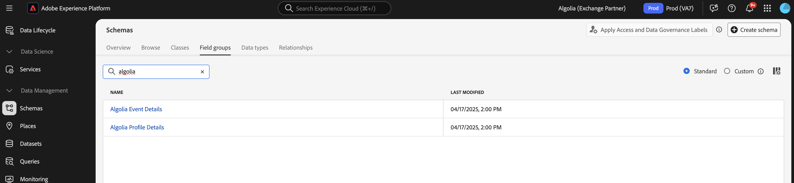

# [!DNL Algolia] overzicht van de extensie voor het doorsturen van gebeurtenissen {#overview}

Gebruik [!DNL Algolia] om snelle, relevante en persoonlijke zoekervaringen te bieden. Dankzij de AI-optimalisatie kunt u de zoekresultaten en aanbevelingen verbeteren, zodat gebruikers snel de producten, inhoud of informatie kunnen vinden die ze nodig hebben.

Gebruik de [!DNL Algolia] -gebeurtenis voor het doorsturen van extensies om gebruikersgedragsgebeurtenissen naar [!DNL Algolia] via [!DNL Insights API] te verzenden. Deze gedragsgegevens maken door AI aangedreven aanbevelingen, gepersonaliseerde ervaringen en intelligente zoekmogelijkheden mogelijk.

## Vereisten {#prerequisites}

Voordat u de extensie installeert, moet u ervoor zorgen dat u een [!DNL Algolia] -account hebt met toegang tot [!DNL Insights API] . Als u geen rekening hebt, [&#x200B; teken omhoog &#x200B;](https://dashboard.algolia.com/users/sign_up) en laat toegang tot API toe.

Zorg er ook voor dat u begrijpt hoe u de [!DNL Algolia] [!DNL Insights API] gebruikt. Voor een overzicht van hoe te om gebeurtenissen te verzenden, zie [&#x200B; verzendend gebeurtenissen met de Inzichten API &#x200B;](https://www.algolia.com/doc/guides/sending-events/getting-started/).

Verzamel de volgende waarden van het dashboard van uw [!DNL Algolia] account:
- **[!UICONTROL Application ID]**
- **[!UICONTROL Search API Key]**
- **[!UICONTROL Index Name]**

## De extensie installeren {#install}

Voer de volgende stappen uit om de extensie [!DNL Algolia] te installeren:

Navigeer naar **[!UICONTROL Data Collection]** in [!DNL Adobe Experience Platform] . Selecteer het tabblad **[!UICONTROL Extensions]**. 

Open de extensie **[!UICONTROL Catalog]** , zoek de extensie **[!UICONTROL Algolia Event Forwarding]** en selecteer **[!UICONTROL Install]** .

### De extensie configureren {#configure-extension}

Als u de extensie [!DNL Algolia] voor het doorsturen van gebeurtenissen wilt configureren, navigeert u naar het tabblad **[!UICONTROL Extensions]** en selecteert u de extensie **[!UICONTROL Algolia]** . Selecteer vervolgens **[!UICONTROL Configure]** .

| Eigenschap | Beschrijving |
|----------|-------------|
| **[!UICONTROL Application ID]** | Ga [!UICONTROL Application ID] in het Algoliaanse dashboard onder de [&#x200B; wordt gevonden API Sleutels &#x200B;](https://www.algolia.com/account/api-keys/all) sectie die. |
| **[!UICONTROL Search API Key]** | Ga [!UICONTROL Search API Key] in het Algoliaanse dashboard onder de [&#x200B; wordt gevonden API Sleutels &#x200B;](https://www.algolia.com/account/api-keys/all) sectie die. |
| **[!UICONTROL Index Name]** | Voer de [!UICONTROL Index Name] in die uw producten of inhoud bevat. Deze index wordt gebruikt als standaardwaarde. |

{style="table-layout:auto"}

## [!DNL Algolia] type handeling voor het doorsturen van gebeurtenissen {#action-types}

De [!DNL Algolia] -gebeurtenis die extensie doorstuurt, biedt één actietype dat in de **[!UICONTROL Then]** -sectie van een regel kan worden gebruikt:

### Gebeurtenis Send {#send-event}

Configureer de handeling **[!UICONTROL Send event]** om gebeurtenissen door te sturen naar [!DNL Algolia] :

Selecteer **[!UICONTROL Rules]** > **[!UICONTROL Add Rule]** of selecteer een bestaande regel. Voeg in het gedeelte **[!UICONTROL Then]** van de regel een handeling toe en selecteer **[!UICONTROL Extension]**: [!DNL Algolia] Event Forwarding > **[!UICONTROL Action Type]**: **[!UICONTROL Send Events]** .

## De gebeurtenisveldgroep [!DNL Algolia] implementeren {#algolia-field-group}

Voeg de gebeurtenisveldgroep [!DNL Algolia] toe aan uw schema voordat u de extensie [!DNL Algolia] -gebeurtenis voor doorsturen gebruikt. Het is een van de standaardveldgroepen die via Experience Platform worden aangeboden.

### Voeg de groep met gebeurtenisvelden [!DNL Algolia] toe aan uw schema {#add-algolia-field-group}

U voegt als volgt de gebeurtenisveldgroep [!DNL Algolia] toe:

Ga naar **[!UICONTROL Schemas]** en selecteer **[!UICONTROL Browse]** .

Voeg een nieuw schema toe of werk een bestaand schema bij dat u gebruikt om webgebeurtenissen te verzenden en de muisaanwijzer boven het pictogram **[!UICONTROL Add]** te houden. Typ *[!DNL Algolia]* in het zoekvak om de resultaten te beperken.

Selecteer de knop **[!DNL Algolia]Gebeurtenisdetails** veldgroep > **[!UICONTROL Add field group]** > **[!UICONTROL Save]** .

### Gegevens toewijzen en verzenden met de tag [!UICONTROL Data Collection]

De extensie [!DNL Algolia] voor het doorsturen van gebeurtenissen kan met **[!DNL Adobe Experience Platform Web SDK]** worden gebruikt om gegevens van uw website naar [!DNL Algolia] te verzenden. Dit gebeurt door een eigenschap tag te maken, gegevens toe te wijzen aan het [!DNL XDM] -object en regels te configureren voor het verzenden van gebeurtenissen.

#### Stap 1: Een tag-eigenschap maken met het web-SDK

1. Maak een tag-eigenschap.
2. Installeer de extensie [!DNL Adobe Experience Platform Web SDK] .
3. Gebruik deze extensie om gegevens van HTML toe te wijzen aan de veldgroep **[!DNL Algolia]Event** .

 wordt in kaart gebracht

#### Stap 2: Een gegevenselement maken voor [!DNL XDM] -toewijzing

1. Maak een [!UICONTROL Data Element] met de **[!DNL Adobe Experience Platform Web SDK]** .
2. Selecteer **[!UICONTROL XDM object]** als het gegevenstype van het gegevenselement.
3. Wijs uw gegevens toe aan de juiste [!DNL XDM] -velden, zodat de [!DNL Algolia] -specifieke velden worden ingevuld.

#### Stap 3: Maak een regel om gebeurtenissen te verzenden

1. Maak een nieuwe regel in de eigenschap tag.
2. Voeg de vereiste gebeurtenistriggers zoals het laden van de pagina toe of klik op gebeurtenissen.
3. Voeg een handeling toe met **[!DNL Adobe Experience Platform Web SDK]** .
4. Selecteer **[!UICONTROL Send event]** als actietype.
5. Configureer de actie voor het gebruik van het gegevenselement [!DNL XDM] .

#### Stap 4: Publiceren en testen

1. Publiceer de regels en de uitbreidingsveranderingen in uw doelmilieu.
2. Gebruik [!DNL Adobe Experience Platform Debugger] om te controleren of de gegevens naar Adobe Experience Platform zijn verzonden en naar [!DNL Algolia] zijn doorgestuurd.

### Gebeurtenissen verifiëren in [!DNL Algolia]

Nadat u de [!DNL Algolia] -gebeurtenis hebt geconfigureerd voor het doorsturen van extensies, kunt u controleren of gebeurtenissen correct worden verzonden en ontvangen door de volgende stappen uit te voeren:

Navigeer naar het dashboard van [!DNL Algolia] en ga naar **[!UICONTROL Data Sources > Events > Debugger]** .

Selecteer de gebeurtenis die overeenkomt met de gebeurtenis die van de gebeurtenis van [!DNL Algolia] wordt verzonden door:sturen uitbreiding en controleer of de verwachte gegevens aanwezig zijn in de gebeurtenis.

## Gemeenschappelijke uitvoeringsscenario&#39;s

Gebruik de [!DNL Algolia] -gebeurtenis voor het doorsturen van extensies om gebruikersinteractiegegevens voor verschillende gebruiksgevallen vast te leggen en te verzenden, zodat de relevantie en personalisatie van zoekopdrachten worden verbeterd.

### Product- of inhoudsweergaven bijhouden

Met de extensie kunt u bijhouden wanneer gebruikers product- of inhoudspagina&#39;s weergeven, zodat [!DNL Algolia] beter inzicht krijgt in gebruikersbelangen.

### Conversiegebeurtenissen bijhouden

Houd gebeurtenissen, aankopen en andere conversiegebeurtenissen voor invoegtoepassingen bij om de door AI aangedreven aanbevelingen van [!DNL Algolia] te optimaliseren.

## Problemen oplossen

Als u problemen tegenkomt tijdens het implementeren van de [!DNL Algolia] -gebeurtenis die extensie doorstuurt, kunt u de volgende stappen voor het oplossen van problemen overwegen:

### Gebeurtenissen worden niet weergegeven in [!DNL Algolia]

Controleer het volgende als gebeurtenissen niet worden weergegeven in [!DNL Algolia] :

- **verifieer API Geloofsbrieven**: Zorg ervoor dat **[!UICONTROL Application ID]** en **[!UICONTROL API Key]** de waarden in uw [!DNL Algolia] dashboard aanpassen.
- **Debugger van de Gebeurtenis van de Controle**: Gebruik [!DNL Algolia] Debugger van de Gebeurtenis om te bevestigen of de gebeurtenissen worden ontvangen. Als niet, verifieer de gebeurtenis die regelconfiguratie door:sturen.
- **controleer XDM Afbeelding**: Zorg ervoor dat alle vereiste gebieden in het [!DNL Algolia] schema correct in kaart worden gebracht in het [!DNL XDM] voorwerp.

### Onjuiste gebeurtenisgegevens

- Zorg ervoor dat het element met objectgegevens van [!DNL XDM] correct wordt toegewezen aan het [!DNL Algolia] -schema, met alle vereiste velden.
- Controleer of de parameters van de gebeurtenis overeenkomen met de verwachte indeling en structuur die worden beschreven in de documentatie van de [!DNL Algolia] Insights API.

## Volgende stappen

In deze handleiding wordt beschreven hoe u gegevens naar [!DNL Algolia] kunt verzenden met de [!DNL Algolia Event Forwarding Extension] . Voor meer informatie over gebeurtenis die mogelijkheden in [!DNL Adobe Experience Platform] door:sturen, lees de [&#x200B; gebeurtenis die overzicht &#x200B;](../../../ui/event-forwarding/overview.md) door:sturen.

Voor details op hoe te om uw implementatie te zuiveren gebruikend het Debugger van Experience Platform en het Door:sturen van de Gebeurtenis hulpmiddel van de Controle, lees het [&#x200B; overzicht van Adobe Experience Platform Debugger &#x200B;](../../../../debugger/home.md) en [&#x200B; de activiteiten van de Monitor in gebeurtenis door:sturen &#x200B;](../../../ui/event-forwarding/monitoring.md).

## Aanvullende bronnen

- [[!DNL Algolia]  Inzichten API Documentatie &#x200B;](https://www.algolia.com/doc/rest-api/insights/)
- [[!DNL Algolia]  Documentatie van Gebeurtenissen &#x200B;](https://www.algolia.com/doc/guides/sending-events/getting-started/)
- [[!DNL Adobe Experience Platform]  Gebeurtenis door:sturen Documentatie &#x200B;](https://experienceleague.adobe.com/docs/experience-platform/tags/event-forwarding/overview.html)
- [[!DNL Algolia]  AI het Overzicht van Eigenschappen &#x200B;](https://www.algolia.com/products/ai-search/)
