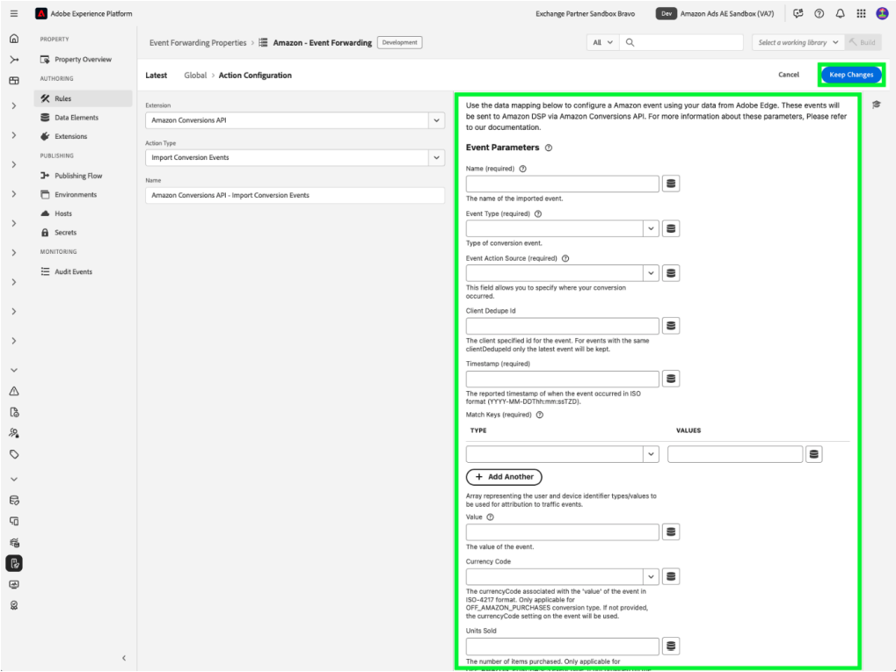

# [!DNL Amazon] API-extensieoverzicht van webgebeurtenissen

De API-extensie [!DNL Amazon] Conversies maakt een directe verbinding tussen marketinggegevens van de server van een adverteerder en [!DNL Amazon] . Het stelt adverteerders in staat de doeltreffendheid van de campagne te evalueren, ongeacht de locatie van de conversie, en campagnes dienovereenkomstig te optimaliseren. Deze extensie biedt volledige toewijzing, betrouwbaarheid van gegevens en geoptimaliseerde levering.

## [!DNL Amazon] voorwaarden {#prerequisites}

Voordat u de API-extensie [!DNL Amazon] Conversies installeert en configureert, moet u de volgende stappen uitvoeren om te zorgen dat verificatie en gegevenstoegang correct zijn:

### Een geheim en gegevenselement maken {#secret}

Creeer een nieuwe [!DNL Amazon] [ gebeurtenis door:sturen geheim ](../../../ui/event-forwarding/secrets.md) en verstrek het van een unieke naam die het voor authentiek verklaren lid aanduidt. Dit wordt gebruikt om de verbinding met uw account te verifiëren en de waarde veilig te houden.

Daarna, [ creeer een gegevenselement ](../../../ui/managing-resources/data-elements.md#create-a-data-element) gebruikend de [!UICONTROL Core] uitbreiding en een [!UICONTROL Secret] type van gegevenselement om naar het `Amazon` geheim te verwijzen u enkel creeerde.

### Verzamel vereiste configuratiedetails {#configuration-details}

Voer de volgende gegevens in als u Experience Platform wilt verbinden met [!DNL Amazon] :

| Type toets | Beschrijving |
| --- | --- |
| Account-id | De unieke account-id voor uw [!DNL Amazon] -account. |
| Entiteit-id | De id van een profiel dat aan het adverteerderaccount is gekoppeld. U vindt deze informatie in de URL van de portal Campagne Manager, vooraf ingesteld door `entity` . |
| Toegangstoken | Het niet-verouderde toegangstoken van uw app, die wordt gebruikt voor verificatie met de [!DNL Amazon] -API via OAuth. Verwijs naar de [ Amazon API documentatie op authentificatie ](https://developer.amazon.com/docs/app-porting/device-messaging-fit-obtain-api-key.html) voor begeleiding. |

## De extensie [!DNL Amazon] installeren en configureren {#install-configure}

Voer de volgende stappen uit om de API-extensie [!DNL Amazon] Conversies te installeren en te configureren:

1. Maak of bewerk een eigenschap voor het doorsturen van gebeurtenissen.
2. Navigeer aan **Uitbreidingen** in het linkernavigatievenster, dan selecteer de [!DNL Amazon] uitbreiding in de Catalogus tabel.
3. Selecteer **installeer**.

   

4. Configureer de extensie met de volgende details:
   - **Token van de Toegang**: Uw geheim van het gegevenselement dat het teken OAuth 2 bevat.

     

   - **identiteitskaart van de Entiteit**: Uw Identiteitskaart (die in het portaal URL van de Manager van de Campagne met de &quot;entiteit&quot;prefix wordt gevonden).

     

5. Selecteer **sparen** om de configuratie te voltooien.

## Vorm een gebeurtenis door:sturen regel {#config-rule}

Zodra al uw gegevenselementen opstelling zijn, creeer gebeurtenis door:sturen regels om te bepalen wanneer en hoe uw gebeurtenissen worden verzonden naar [!DNL Amazon].

1. Navigeer aan **Regels** en creeer een nieuwe gebeurtenis door:sturen regel.
2. Onder **Acties**, uitgezochte **Conversies API van Amazon Uitbreiding**.
3. Plaats het **Type van Actie** aan **de Gebeurtenissen van de Omzetting van de Invoer**.

   

### Conversie-gebeurtenisgegevens configureren {#conversion-event-data}

Conversiegebeurtenisgegevens zijn essentieel voor het bijhouden van gebruikersinteracties en het meten van de doeltreffendheid van uw campagnes. Door deze gegevens door te sturen naar [!DNL Amazon], kunt u inzicht krijgen in gebruikersgedrag, uw campagnes optimaliseren en nauwkeurige attributie voor omzettingen verzekeren.

In de onderstaande tabel worden de belangrijkste eigenschappen beschreven die vereist zijn voor het configureren en doorsturen van conversiegebeurtenisgegevens:

| Invoer | Beschrijving | Vereist | Voorbeeld |
| --- | --- | --- | --- |
| `name` | De naam van de geïmporteerde gebeurtenis. | Ja | `My Event Name` |
| `eventType` | Het standaard Amazon-gebeurtenistype dat aan de gebeurtenis is gekoppeld en wordt gebruikt voor rapportage. | Ja | `Add to Shopping Cart` |
| `eventActionSource` | Het platform van waaruit de gebeurtenis afkomstig was. | Ja | `WEBSITE` |
| `clientDedupeId` | De door de adverteerder opgegeven `id` voor de conversiegebeurtenis. Voor gebeurtenissen met dezelfde `clientDedupeId` blijft alleen de eerste gebeurtenis behouden en worden alle volgende gebeurtenissen verwijderd. | Optioneel | `3234A398932` |
| `timestamp` | De gerapporteerde tijdstempel van wanneer de gebeurtenis heeft plaatsgevonden. De tijdstempel kan maximaal 7 dagen duren voordat u een gebeurtenis verzendt. Gegevens ouder dan 7 dagen worden niet verwerkt. | Ja | `2023-05-08T14:04:28Z` |
| `matchKeys` | Array die de type(n)/waarden van de klant en apparaat-id vertegenwoordigt die moeten worden gebruikt voor toewijzing aan verkeersgebeurtenissen. | Ja | — |
| `matchKeys > type` | Het id-type dat wordt gebruikt voor attributie. | Ja | — |
| `matchKeys > value` | De id-waarde die wordt gebruikt voor attributie. | Ja | Lijst met hashed-id-waarden van SHA-256 van de klant die de gebeurtenis heeft uitgevoerd. |
| `value` | De waarde van de gebeurtenis. | Optioneel | `5` of `0.99` |
| `currencyCode` | De valutacode die is gekoppeld aan de `value` van de gebeurtenis in ISO-4217-indeling. Alleen van toepassing op het gebeurtenistype Off Amazon Purchases. Indien niet opgegeven, wordt de instelling van de valutacode in de omrekeningsdefinitie gebruikt. | Optioneel | `USD` , `EUR` , `GBP` , enzovoort. |
| `unitsSold` | Het aantal gekochte objecten. Alleen van toepassing op het gebeurtenistype Off Amazon Purchases. Als deze optie niet wordt opgegeven bij de conversiegebeurtenis, wordt de standaardwaarde `1` toegepast. | Optioneel | — |
| `countryCode` | Deze waarde is gebaseerd op ISO 3166-1 alpha-2, tweeletterige landcodes zoals gedefinieerd in ISO 3166-1, een onderdeel van de ISO 3166-norm die door de Internationale Organisatie voor Normalisatie (ISO) is gepubliceerd, om landen, afhankelijke gebieden en speciale gebieden van geografisch belang te vertegenwoordigen. | Ja | — |
| `dataProcessingOptions` | Hiermee geeft u gebruikerstoestemming voor het gebruik van advertentiegegevens aan. | Optioneel | LIMITED_DATA_USE |

- Selecteer **[!UICONTROL Keep Changes]** om de regel op te slaan.

## Gebeurtenisdeduplicatie {#deduplication}

Deduplicatie is van essentieel belang voor een nauwkeurige rapportage en om te voorkomen dat er grote aantallen conversies optreden wanneer u zowel de [!DNL Amazon] Advertising-tag (AAT) als de [!DNL Amazon] Conversions API-extensie gebruikt om dezelfde gebeurtenissen te volgen.

### Wanneer is deduplicatie vereist?

- **Vereist**: Als de zelfde gebeurtenis van zowel de cliënt (AAT) als de server (Conversies API) wordt verzonden.
- **niet vereist**: Als de verschillende gebeurtenistypen van de cliënt en de server zonder enige overlapping worden verzonden.

### Hoe deduplicatie mogelijk maken

Als u deduplicatie wilt inschakelen, neemt u het veld `clientDedupeId` op in elke gedeelde gebeurtenis. Met deze unieke id kan [!DNL Amazon] onderscheid maken tussen client-side en server-side gebeurtenissen en dubbele vermeldingen voorkomen.

Door deduplicatie correct te configureren, kunt u ervoor zorgen dat de optimalisatiegegevens correct blijven en dat de rapportage geen negatieve gevolgen heeft.

Voor meer details, verwijs naar de [ Gids van de Deduplicatie van de Gebeurtenis van Amazon ](https://advertising.amazon.com/).

## Volgende stappen {#next-steps}

In deze handleiding wordt beschreven hoe conversiegebeurtenissen met de API-extensie [!DNL Amazon] Conversies kunnen worden geconfigureerd en verzonden naar [!DNL Amazon] . Voor meer informatie over gebeurtenis die mogelijkheden in [!DNL Adobe Experience Platform] door:sturen, verwijs naar de [ gebeurtenis die overzicht ](../../../ui/event-forwarding/overview.md) door:sturen.

Voor meer details op hoe te om uw implementatie te zuiveren gebruikend het Debugger van Experience Platform en het Door:sturen van de Gebeurtenis hulpmiddel van de Controle, lees het [ overzicht van Adobe Experience Platform Debugger ](/help/debugger/home.md) en [ activiteiten van de Monitor ](../../../ui/event-forwarding/monitoring.md) in gebeurtenis door:sturen.
