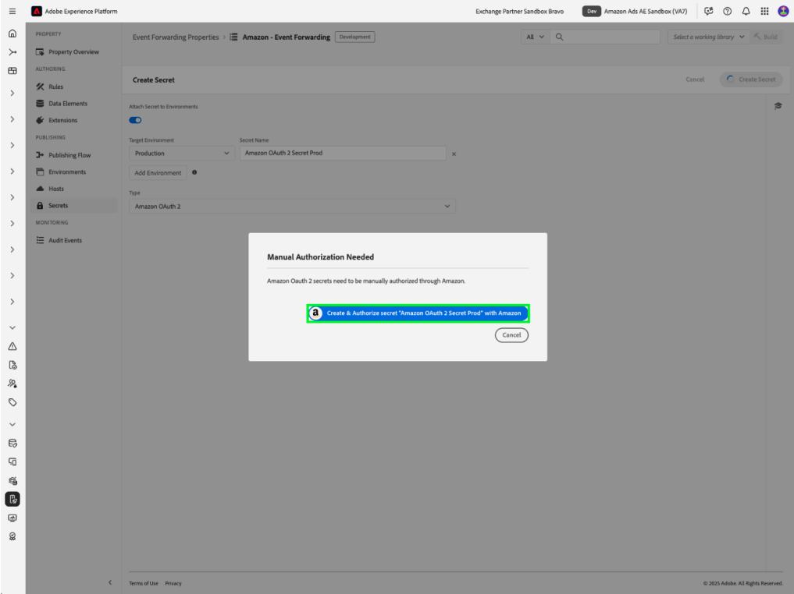

# [!DNL Amazon] API-extensieoverzicht van webgebeurtenissen

De API-extensie [!DNL Amazon] Conversies maakt een directe verbinding tussen marketinggegevens van de server van een adverteerder en [!DNL Amazon] . Hierdoor kunnen adverteerders de doeltreffendheid van de campagne evalueren, ongeacht de locatie van de conversie, en campagnes dienovereenkomstig optimaliseren. De extensie biedt een vollediger toewijzing, verbeterde betrouwbaarheid van de gegevens en een beter geoptimaliseerde levering.

## [!DNL Amazon] voorwaarden {#prerequisites}

Voordat u de API-extensie voor conversie van [!DNL Amazon] installeert en configureert, moet u een aantal stappen uitvoeren die aan de voorwaarde voldoen om een correcte verificatie en gegevenstoegang te garanderen.

### Een geheim en gegevenselement maken {#secret}

Verificatie met [!DNL Amazon] vereist een beveiligingstoken dat correct moet worden opgeslagen en waarnaar moet worden verwezen:

1. Maak een nieuwe [!DNL Amazon] -gebeurtenis die een geheim doorstuurt met een unieke naam voor verificatie.
2. Creeer een gegevenselement gebruikend de **uitbreiding van de Kern** met het type van het a **Geheime** gegevenselement om naar uw [!DNL Amazon] geheim te verwijzen.

Dit proces zorgt ervoor dat uw verificatiereferenties veilig blijven terwijl u desgewenst nog steeds toegang hebt tot de extensie.

## De extensie [!DNL Amazon] installeren en configureren

Als u de extensie wilt installeren, hebt u toegang tot uw eigenschap voor het doorsturen van gebeurtenissen in Experience Platform nodig:

- Maak of bewerk een eigenschap voor het doorsturen van gebeurtenissen.
- Selecteer **Uitbreidingen** in de linkernavigatie, dan uitgezochte [!DNL Amazon] uitbreiding in de Catalogus tabel.
- Selecteer **installeer**.

![[!DNL Amazon] -extensie die samen met de installatieknop in de catalogus met extensies is geselecteerd. ](../../../images/extensions/server/amazon/amazon-extension.png)

- Configureren met:

- **Token van de Toegang**: Uw geheim van het gegevenselement dat het teken OAuth 2 bevat

- **Identiteitskaart van de Entiteit**: Uw Identiteitskaart (die in het portaal URL van de Manager van de Campagne met &quot;entiteit&quot;prefix wordt gevonden)

- Selecteer **sparen**.

Deze configuratiewaarden leggen de verbinding tussen Platform en uw [!DNL Amazon] account vast.

### [!DNL Amazon] OAuth 2 {#oauth}

Een [!DNL Amazon] OAuth 2-geheim maken:

- Selecteer [!DNL Amazon] OAuth 2 van **Type** dropdown en uitgezocht **creeer Geheime**.

- Selecteer **creeer &amp; geef geheim met Amazon** op popover toe om het geheim manueel toe te staan en verder te gaan.

- Voer uw [!DNL Amazon] -referenties in in het dialoogvenster dat wordt weergegeven. Volg de herinneringen om gebeurtenis door:sturen toegang tot uw gegevens te verlenen.

Na voltooiing, zult u uw geheim met zijn status en vervaldatum in de **Geheimen** tabel zien.

## Vorm een gebeurtenis door:sturen regel {#config-rule}

Zodra al uw gegevenselementen opstelling zijn, kunt u gebeurtenis tot stand brengen die regels bepaalt wanneer en hoe uw gebeurtenissen naar Amazon zullen worden verzonden.

- Navigeer aan **Regels** en creeer een nieuwe gebeurtenis door:sturen regel.
- Onder **Acties**, uitgezochte **Conversies API van Amazon Uitbreiding**.
- Plaats het **Type van Actie** aan **de Gebeurtenissen van de Omzetting van de Invoer**.

- Configureer de eigenschappen van de gebeurtenis zoals hieronder beschreven:

| Invoer | Beschrijving |
| --- | --- |
| **Naam van de Gebeurtenis** | De naam van de conversiegebeurtenis. |
| **Type van Gebeurtenis** | Definieert het type gebeurtenis dat wordt bijgehouden (bijv. aankopen, carttoevoegingen). |
| **Tijdstempel** | Tijd van gebeurtenis in ISO-indeling. |
| **identiteitskaart van de Dedupe van de Cliënt** | Een unieke id voor deduplicatie. |
| **Sleutels van de Gelijke** | Gebruiker- en apparaat-id&#39;s voor attributie. |
| **Value** | Monetaire waarde van de gebeurtenis. |
| **Code van de Valuta** | Valuta in ISO-4217-notatie. |
| **Verkochte Eenheden** | Aantal aangekochte objecten. |
| **Code van het Land** | Land waar de gebeurtenis heeft plaatsgevonden. |
| **Opties van de Verwerking van Gegevens** | Vlaggen voor beperkt gegevensgebruik. |
| **Toestemming** | Hiermee geeft u gebruikerstoestemming voor het gebruik van advertentiegegevens aan. |

- Selecteer **houden Veranderingen** om de regel te bewaren.

&lbrace;de parameters van de gebeurtenis in actieconfiguratie die samen met de knoop van de lusjeveranderingen wordt benadrukt.

## Gebeurtenisdeduplicatie {#deduplication}

Als u zowel de [!DNL Amazon] Advertising-tag (AAT) als de [!DNL Amazon] Conversies API-extensie voor dezelfde gebeurtenissen gebruikt, moet u deduplicatie instellen. Neem `clientDedupeId` op in elke gedeelde gebeurtenis om deduplicatie te garanderen.
Deduplicatie is niet nodig als client- en servergebeurtenissen elkaar niet overlappen.

De juiste deduplicatie voorkomt een opgeblazen omzettingstelling en zorgt ervoor dat de optimalisatiegegevens accuraat blijven.

Verwijs naar de [ Gids van de Deduplicatie van de Gebeurtenis van Amazon ](https://advertising.amazon.com/) voor meer details.

## Volgende stappen

In deze handleiding wordt beschreven hoe conversiegebeurtenissen met de API-extensie [!DNL Amazon] Conversies kunnen worden geconfigureerd en verzonden naar [!DNL Amazon] . Voor meer informatie over gebeurtenis die mogelijkheden in [!DNL Adobe Experience Platform] door:sturen, verwijs naar de [ gebeurtenis die overzicht ](../../../ui/event-forwarding/overview.md) door:sturen

Voor meer details op hoe te om uw implementatie te zuiveren gebruikend het Debugger van Experience Platform en het Door:sturen van de Gebeurtenis hulpmiddel van de Controle, lees het [ overzicht van Adobe Experience Platform Debugger ](https://experienceleague.adobe.com/en/docs/experience-platform/debugger/home) en [ activiteiten van de Monitor ](https://experienceleague.adobe.com/en/docs/experience-platform/tags/event-forwarding/monitoring) in gebeurtenis door:sturen.