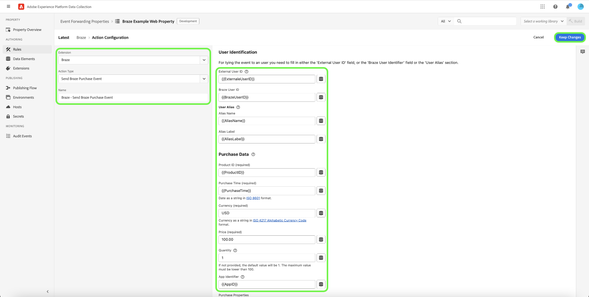

# [!DNL Braze Track Events API] extensie voor doorsturen van gebeurtenissen

[[!DNL Braze]](https://www.braze.com) is een platform van de klantenovereenkomst dat klant-gerichte interactie tussen consumenten en merken in real time drijft. Gebruiken [!DNL Braze]kunt u het volgende doen:

- Gegevens (zoals marketingberichten) leveren aan doelgebruikers op basis van hun taalvoorkeur, voorkeur voor locaties en meer, om de conversietarieven te verhogen en belangrijke bedrijfsdoelstellingen te ondersteunen.
- Verzend klanten gepersonaliseerde berichten over veelvoudige kanalen, met inbegrip van e-mail, dupberichten, en in-app berichten, op enkel de juiste tijd en in hun aangewezen talen.
- Doelspecifieke gebruikers voor marketing- en promotiecampagnes om het aantal herhaalde klanten te vergroten.
- Het gebruikersgedrag en de patronen van de studie om specifieke doelgroepen met aangepaste berichten te richten, die zouden kunnen helpen opbrengst verhogen.

De [!DNL Braze Track Events API] [gebeurtenis doorsturen](../../../ui/event-forwarding/overview.md) kunt u gegevens die zijn vastgelegd in het Adobe Experience Platform Edge Network gebruiken en verzenden naar [!DNL Braze] in de vorm van server-side-gebeurtenissen die de [[!DNL Braze User Track]](https://www.braze.com/docs/api/endpoints/user_data/post_user_track) API.

Dit document behandelt de gebruiksgevallen van de uitbreiding, hoe te om het in uw gebeurtenis te installeren die bibliotheken door:sturen, en hoe te om zijn mogelijkheden in een gebeurtenis aan te wenden die door:sturen [regel](../../../ui/managing-resources/rules.md).

## Gebruiksscenario’s

Deze extensie moet worden gebruikt als u gegevens van het Edge-netwerk wilt gebruiken in [!DNL Braze] om voordeel te halen uit zijn klantenanalyses en gerichte mogelijkheden.

Neem bijvoorbeeld een detailhandelsorganisatie die een multikanaalaanwezigheid (website en mobiel) heeft en die transactie- of gespreksinvoer vastlegt als gebeurtenisgegevens van hun website en mobiele platforms. Diverse gebruiken [tag](../../../home.md) regels, worden deze gegevens verzonden naar het Netwerk van de Rand in echt - tijd. Van hier, [!DNL Braze] gebeurtenis die uitbreiding door:sturen verzendt automatisch relevante gebeurtenissen naar [!DNL Braze] aan de serverzijde.

Zodra de gegevens zijn verzonden, kunnen de analyseteams van de organisatie vervolgens gebruikmaken van [!DNL Braze's] mogelijkheden om de datasets te verwerken en bedrijfsinzichten af te leiden om grafieken, dashboards, of andere visualisaties te produceren om bedrijfsbelanghebbenden te informeren. Zie de [[!DNL Braze] klanten](https://www.braze.com/customers) pagina voor meer informatie over de verschillende gebruiksgevallen van het platform.

## [!DNL Braze] voorwaarden en waarborgen {#prerequisites}

U moet beschikken over een [!DNL Braze] rekening te houden met haar technologieën. Als u geen account hebt, navigeert u naar de [Aan de slag-pagina](https://www.braze.com/get-started/) op [!DNL Braze] om verbinding te maken met [!DNL Braze Sales] en start het accountaanmaakproces.

### API-handleidingen

De extensie gebruikt twee van [!DNL Braze]API&#39;s en de bijbehorende beperkingen worden hieronder beschreven:

| API | Snelheidslimieten |
| --- | --- |
| [!DNL User Track] | 50.000 verzoeken per minuut.  Zie de [[!DNL User Track] API-documentatie](https://www.braze.com/docs/api/endpoints/user_data/post_user_track#rate-limit) voor meer informatie. |
| [!DNL User Identify] | 20.000 verzoeken per minuut.  Zie de [[!DNL User Identify] API-documentatie](https://www.braze.com/docs/api/endpoints/user_data/post_user_identify#rate-limit) voor meer informatie. |

>[!NOTE]
>
> Raadpleeg de handleiding op [[!DNL Braze] API-limieten](https://www.braze.com/docs/api/api_limits/) voor nadere bijzonderheden over de beperkingen die zij opleggen .

### Billable data points

Extra aangepaste kenmerken verzenden naar [!DNL Braze] kan uw [!DNL Braze] verbruik van gegevenspunten. Raadpleeg uw [!DNL Braze] accountmanager voordat aanvullende aangepaste kenmerken worden verzonden. Zie de [!DNL Braze] documentatie over [factureerbare gegevenspunten](https://www.braze.com/docs/user_guide/onboarding_with_braze/data_points/#billable-data-points) voor meer informatie .

### Verzamel vereiste configuratiedetails {#configuration-details}

Als u het Edge-netwerk wilt verbinden met [!DNL Braze]zijn de volgende gegevens vereist:

| Type toets | Beschrijving | Voorbeeld |
| --- | --- | --- |
| [!DNL Braze] Instantie | Het REST-eindpunt is gekoppeld aan het [!DNL Braze] account. Zie de [!DNL Braze] documentatie over [instances](https://www.braze.com/docs/user_guide/administrative/access_braze/braze_instances) ter begeleiding. | `https://rest.iad-03.braze.com` |
| API-sleutel | De [!DNL Braze] API-sleutel gekoppeld aan de [!DNL Braze] account.  Zie de [!DNL Braze] documentatie over de [REST API-sleutel](https://www.braze.com/docs/api/basics/#rest-api-key) ter begeleiding. | `YOUR-BRAZE-REST-API-KEY` |

### Een geheim maken

Een nieuwe [gebeurtenis die geheim door:sturen](../../../ui/event-forwarding/secrets.md) en stel de waarde in op uw [[!DNL Braze] API-sleutel](#configuration-details). Hiermee wordt de verbinding met uw account geverifieerd, maar blijft de waarde veilig.

## Installeer en configureer de [!DNL Braze] extension {#install}

Als u de extensie wilt installeren, [een eigenschap voor het doorsturen van gebeurtenissen maken](../../../ui/event-forwarding/overview.md#properties) of kies een bestaande eigenschap die u wilt bewerken.

Selecteren **[!UICONTROL Extensions]** in de linkernavigatie. In de **[!UICONTROL Catalog]** tab, selecteert u **[!UICONTROL Install]** op de kaart voor de [!DNL Braze] extensie.

![Installeer de [!DNL Braze] extensie.](../../../images/extensions/server/braze/install-extension.png)

Voer in het volgende scherm het volgende in [configuratiewaarden](#configuration-details) dat u eerder hebt verzameld van [!DNL Braze]:

- **[!UICONTROL Braze Rest Endpoint URL]**: U kunt de waarde van uw [!DNL Braze] rest eindpunt URL als gewone tekst in de verstrekte input.
- **[!UICONTROL API Key]**: Selecteer [element met geheime gegevens](#create-a-secret) die u eerder hebt gemaakt en die uw [!DNL Braze] API-sleutel.

Selecteren **[!UICONTROL Save]** wanneer gereed.

![De [!DNL Braze] extensieconfiguratiepagina.](../../../images/extensions/server/braze/configure-extension.png)

## Een [!DNL Send Event] regel {#tracking-rule}

Na het installeren van de uitbreiding, creeer een nieuwe gebeurtenis door:sturen [regel](../../../ui/managing-resources/rules.md) en configureer de voorwaarden naar wens. Wanneer het vormen van de acties voor de regel, selecteer **[!UICONTROL Braze]** extensie selecteert u vervolgens **[!UICONTROL Send Event]** voor het actietype.

**[!UICONTROL User Identification]**

| Invoer | Beschrijving |
| --- | --- |
| [!UICONTROL External User ID] | Lang, willekeurig en goed verdeeld UUID of GUID. Als u een andere methode kiest om uw gebruikers-id&#39;s een naam te geven, moeten deze ook lang, willekeurig en goed verdeeld zijn. Meer informatie over [voorgestelde naamgevingsconventie voor gebruikersnaam](https://www.braze.com/docs/developer_guide/platform_integration_guides/web/analytics/setting_user_ids#suggested-user-id-naming-convention). |
| [!UICONTROL Braze User ID] | Gebruikersidentificatie &#39;Braze&#39;. |
| [!UICONTROL User Alias] | Een alias fungeert als alternatieve unieke gebruikersnaam. Gebruik aliassen om gebruikers met verschillende afmetingen te identificeren dan de gebruikers-id die u als hoofdgebruiker gebruikt.    Het alias-object van de gebruiker bestaat uit twee delen: een alias_name voor het herkenningsteken zelf, en een alias_label die op het type van alias wijzen. Gebruikers kunnen meerdere aliassen met verschillende labels hebben, maar slechts één alias_naam per alias_label. |

{style="table-layout:auto"}

>[!NOTE]
>
> Als u de gebeurtenis aan een gebruiker wilt koppelen, moet u een van beide opties invullen [!UICONTROL External User ID] of de [!UICONTROL Braze User Identifier] van de [!UICONTROL User Alias] sectie.

**[!UICONTROL Event Data]**

| Invoer | Beschrijving | Vereist |
| --- | --- | --- |
| [!UICONTROL Event Name &#x200B;] | Naam van de gebeurtenis. | Ja |
| [!UICONTROL Event Time ] | Datum/tijd als tekenreeks in ISO 8601 of in `yyyy-MM-dd'T'HH:mm:ss:SSSZ` gebruiken. | Ja |
| [!UICONTROL App Identifier] | De toepassings-id of <strong>app_id</strong> is een parameter die activiteit associeert met een specifieke app in uw toepassingsgroep. Hiermee wordt aangegeven met welke app in de toepassingsgroep u werkt. Meer informatie over de [Typen API-id](https://www.braze.com/docs/api/identifier_types/). |  |
| [!UICONTROL Event Properties &#x200B;] | Een JSON-object dat aangepaste eigenschappen van de gebeurtenis bevat. |  |

{style="table-layout:auto"}

>[!NOTE]
>
> De **[!UICONTROL Braze Send Event]** actie vereist slechts **[!UICONTROL Event Name]** en **[!UICONTROL Event Time]** op te geven, maar u moet zoveel mogelijk informatie opnemen in het veld met aangepaste eigenschappen. Voor meer informatie over de [!DNL Braze] gebeurtenisobject, verwijzen naar de [officiële documentatie](https://www.braze.com/docs/api/objects_filters/event_object/).

**[!UICONTROL User Attributes]**

Gebruikerskenmerken kunnen een JSON-object zijn dat velden bevat waarmee een kenmerk met de opgegeven naam en waarde in het opgegeven gebruikersprofiel wordt gemaakt of bijgewerkt. De volgende eigenschappen worden ondersteund:

| Gebruikerskenmerk | Beschrijving |
| --- | --- |
| [!UICONTROL First Name] |  |
| [!UICONTROL Last Name] |  |
| [!UICONTROL Phone] |  |
| [!UICONTROL Email] |  |
| [!UICONTROL Gender] | Een van de volgende tekenreeksen: &quot;M&quot;, &quot;F&quot;, &quot;O&quot; (overige), &quot;N&quot; (niet van toepassing), &quot;P&quot; (niet van toepassing). |
| [!UICONTROL City] |  |
| [!UICONTROL Country] | Land als tekenreeks in [ISO-3166-1 alpha-2](https://en.wikipedia.org/wiki/ISO_3166-1_alpha-2) gebruiken. |
| [!UICONTROL Language] | Taal als tekenreeks in [ISO-639-1](https://en.wikipedia.org/wiki/List_of_ISO_639-1_codes) gebruiken. |
| [!UICONTROL Date of Birth] | Tekenreeks in de notatie &quot;YYYY-MM-DD&quot; (bijvoorbeeld 1980-12-21). |
| [!UICONTROL Time Zone] | Naam tijdzone van [IANA Time Zone Database](https://en.wikipedia.org/wiki/List_of_tz_database_time_zones) (bijvoorbeeld ’America/New_York’ of ’Eastern Time (VS en Canada)’). |
| [!UICONTROL Facebook] | Hash met id (string), like (array of strings), num_friends (integer). |
| [!UICONTROL Twitter] | Hash met id (integer), screen_name (string, Twitter handle), followers_count (integer), friends_count (integer), statuses_count(integer). |

{style="table-layout:auto"}

## Een [!DNL Send Purchase Event] regel {#purchase-rule}

Na het installeren van de uitbreiding, creeer een nieuwe gebeurtenis door:sturen [regel](../../../ui/managing-resources/rules.md) en configureer de voorwaarden naar wens. Wanneer het vormen van de acties voor de regel, selecteer **[!UICONTROL Braze]** extensie selecteert u vervolgens **[!UICONTROL Send Purchase Event]** voor het actietype.

**[!UICONTROL User Identification]**

| Invoer | Beschrijving |
| --- | --- |
| [!UICONTROL External User ID] | Lang, willekeurig en goed verdeeld UUID of GUID. Als u een andere methode kiest om uw gebruikers-id&#39;s een naam te geven, moeten deze ook lang, willekeurig en goed verdeeld zijn. Meer informatie over [voorgestelde naamgevingsconventie voor gebruikersnaam](https://www.braze.com/docs/developer_guide/platform_integration_guides/web/analytics/setting_user_ids#suggested-user-id-naming-convention). |
| [!UICONTROL Braze User ID] | Gebruikersidentificatie &#39;Braze&#39;. |
| [!UICONTROL User Alias] | Een alias fungeert als alternatieve unieke gebruikersnaam. Gebruik aliassen om gebruikers met verschillende afmetingen te identificeren dan de gebruikers-id die u als hoofdgebruiker gebruikt.    Het alias-object van de gebruiker bestaat uit twee delen: een alias_name voor het herkenningsteken zelf, en een alias_label die op het type van alias wijzen. Gebruikers kunnen meerdere aliassen met verschillende labels hebben, maar slechts één alias_naam per alias_label. |

{style="table-layout:auto"}

>[!NOTE]
>
> Als u de gebeurtenis aan een gebruiker wilt koppelen, moet u het dialoogvenster [!UICONTROL External User ID] in het veld [!UICONTROL Braze User Identifier] of de [!UICONTROL User Alias] sectie.

**[!UICONTROL Purchase Data]**

| Invoer | Beschrijving | Vereist |
| --- | --- | --- |
| [!UICONTROL Product ID &#x200B;] | Identificatiecode voor de aankoop. (bijvoorbeeld productnaam of productcategorie) | Ja |
| [!UICONTROL Purchase Time ] | Datum/tijd als tekenreeks in ISO 8601 of in `yyyy-MM-dd'T'HH:mm:ss:SSSZ` gebruiken. | Ja |
| [!UICONTROL Currency &#x200B;] | Valuta als tekenreeks in [ISO 4217](https://en.wikipedia.org/wiki/ISO_4217) Alfabetische notatie valutacode. | Ja |
| [!UICONTROL Price &#x200B;] | Prijs. | Ja |
| [!UICONTROL Quantity &#x200B;] | Indien niet opgegeven, is de standaardwaarde 1. De maximumwaarde moet lager zijn dan 100. |  |
| [!UICONTROL App Identifier] | De toepassings-id of <strong>app_id</strong> is een parameter die activiteit associeert met een specifieke app in uw toepassingsgroep. Hiermee wordt aangegeven met welke app in de toepassingsgroep u werkt. Meer informatie over de [Typen API-id](https://www.braze.com/docs/api/identifier_types/). |  |
| [!UICONTROL Purchase Properties &#x200B;] | Een JSON-object dat aangepaste eigenschappen van de aankoop bevat. |  |

{style="table-layout:auto"}

>[!NOTE]
>
> De **[!UICONTROL Braze Send Event]** actie vereist slechts **[!UICONTROL Event Name]** en **[!UICONTROL Event Time]** op te geven, maar u dient zoveel mogelijk informatie op te nemen in het veld met aangepaste eigenschappen. Voor meer informatie over de [!DNL Braze] gebeurtenisobject, verwijzen naar de [officiële documentatie](https://www.braze.com/docs/api/objects_filters/event_object/).

**[!UICONTROL User Attributes]**

Gebruikerskenmerken kunnen een JSON-object zijn dat velden bevat waarmee een kenmerk met de opgegeven naam en waarde in het opgegeven gebruikersprofiel wordt gemaakt of bijgewerkt. De volgende eigenschappen worden ondersteund:

| Gebruikerskenmerk | Beschrijving |
| --- | --- |
| [!UICONTROL First Name] |  |
| [!UICONTROL Last Name] |  |
| [!UICONTROL Phone] |  |
| [!UICONTROL Email] |  |
| [!UICONTROL Gender] | Een van de volgende tekenreeksen: &quot;M&quot;, &quot;F&quot;, &quot;O&quot; (overige), &quot;N&quot; (niet van toepassing), &quot;P&quot; (niet van toepassing). |
| [!UICONTROL City] |  |
| [!UICONTROL Country] | Land als tekenreeks in [ISO-3166-1 alpha-2](https://en.wikipedia.org/wiki/ISO_3166-1_alpha-2) gebruiken. |
| [!UICONTROL Language] | Taal als tekenreeks in [ISO-639-1](https://en.wikipedia.org/wiki/List_of_ISO_639-1_codes) gebruiken. |
| [!UICONTROL Date of Birth] | Tekenreeks in de notatie &quot;YYYY-MM-DD&quot; (bijvoorbeeld 1980-12-21). |
| [!UICONTROL Time Zone] | Naam tijdzone van [IANA Time Zone Database](https://en.wikipedia.org/wiki/List_of_tz_database_time_zones) (bijvoorbeeld ’America/New_York’ of ’Eastern Time (VS en Canada)’). |
| [!UICONTROL Facebook] | Hash met id (string), like (array of strings), num_friends (integer). |
| [!UICONTROL Twitter] | Hash met id (integer), screen_name (string, Twitter handle), followers_count (integer), friends_count (integer), statuses_count(integer). |

{style="table-layout:auto"}

## Gegevens valideren binnen [!DNL Braze] {#validate}

Als de gebeurtenisinzameling en [!DNL Adobe Experience Platform] de integratie is voltooid, u ziet de gebeurtenissen in het [!DNL Braze] console wanneer [gebruikersprofielen weergeven](https://www.braze.com/docs/user_guide/engagement_tools/segments/user_profiles/). De nieuwe gebeurtenisgegevens die worden verzonden naar [!DNL Braze] wordt weerspiegeld in de [!DNL Purchases] van een bepaalde gebruiker [overzicht, tabblad](https://www.braze.com/docs/user_guide/engagement_tools/segments/user_profiles/#overview-tab).

## Volgende stappen

In deze handleiding wordt beschreven hoe conversiegebeurtenissen naar [!DNL Braze] het gebruiken van gebeurtenis door:sturen. Voor meer informatie over downstreamtoepassingen voor gebeurtenisgegevens die worden verzonden naar [!DNL Braze], verwijst u naar de [officiële documentatie](https://www.braze.com/docs).

Voor meer informatie over gebeurtenis die mogelijkheden in Experience Platform door:sturen, verwijs naar [overzicht van gebeurtenissen doorsturen](../../../ui/event-forwarding/overview.md).
