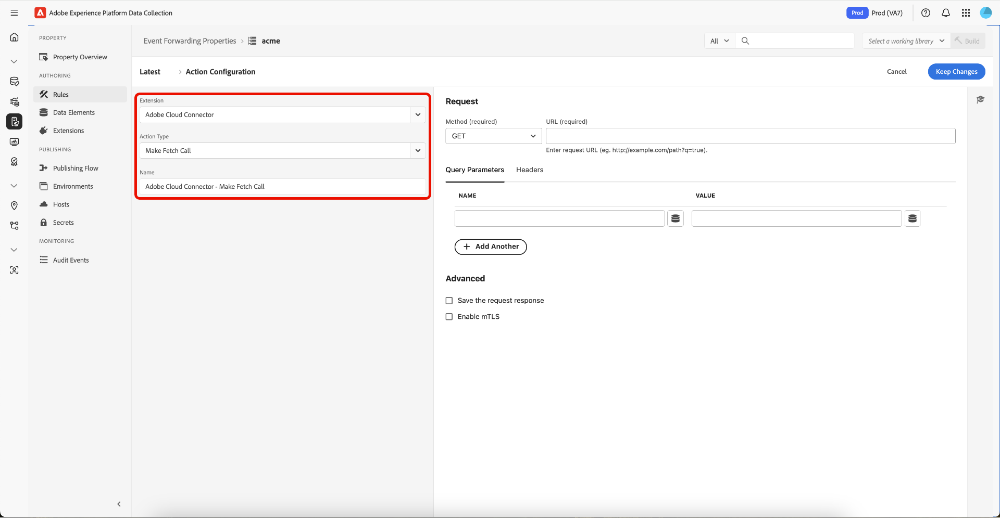

# Overzicht van de extensie Cloud Connector

Met de Cloud Connector-gebeurtenis die extensie doorstuurt, kunt u aangepaste HTTP-aanvragen maken om gegevens naar een bestemming te verzenden of gegevens van een bestemming op te halen. De uitbreiding van de Verbinding van de Wolk is als het hebben van Postman op Adobe Experience Platform Edge Network en kan worden gebruikt om gegevens naar een eindpunt te verzenden dat nog geen specifieke uitbreiding heeft.

Gebruik deze verwijzing voor informatie over de beschikbare opties wanneer het gebruiken van deze uitbreiding om een regel te bouwen.

## Extensietype van Cloud Connector

In deze sectie wordt het actietype Gegevens verzenden beschreven dat beschikbaar is in de extensie Adobe Experience Platform Cloud Connector.

### Type aanvraag

Als u het type aanvraag wilt selecteren dat door het eindpunt wordt vereist, selecteert u het juiste type onder het vervolgkeuzemenu [!UICONTROL Request Type] .

| Methode | Beschrijving |
|---|---|
| [ GET ](https://developer.mozilla.org/en-US/docs/Web/HTTP/Methods/GET) | Vraagt om een vertegenwoordiging van de gespecificeerde bron. Aanvragen met GET mogen alleen gegevens ophalen. |
| [ POST ](https://developer.mozilla.org/en-US/docs/Web/HTTP/Methods/POST) | Verzendt een entiteit naar de opgegeven bron, die vaak een wijziging in status of bijwerkingen op de server veroorzaakt. |
| [ PUT ](https://developer.mozilla.org/en-US/docs/Web/HTTP/Methods/PUT) | Vervangt alle huidige vertegenwoordiging van het doelmiddel met de verzoeklading. |
| [ PATCH ](https://developer.mozilla.org/en-US/docs/Web/HTTP/Methods/PATCH) | Past gedeeltelijke wijzigingen op een middel toe. |
| [ DELETE ](https://developer.mozilla.org/en-US/docs/Web/HTTP/Methods/DELETE) | Verwijdert de opgegeven bron. |

### URL van eindpunt

Voer in het tekstveld naast het vervolgkeuzemenu Request-type de URL in voor het eindpunt waarnaar u gegevens verzendt.

### De params van de vraag, kopballen, en lichaamconfiguratie

Gebruik elk van deze lusjes (de Params van de Vraag, Kopballen, en Elementen van de Gegevens van het Lichaam) om te controleren welke gegevens naar een bepaald eindpunt worden verzonden.

#### Zoekparameters

Definieer een sleutel en waarde voor elk sleutelwaardepaar dat u als parameter voor een querytekenreeks wilt verzenden. Als u handmatig een gegevenselement wilt invoeren, gebruikt u de samenvoeging van het accolade-gegevenselement voor het doorsturen van gebeurtenissen. Voer `{{siteSection}}` in om naar de waarde van een gegevenselement met de naam &quot;siteSection&quot; te verwijzen als een sleutel of waarde. Of selecteer het eerder gemaakte gegevenselement door dit in het vervolgkeuzemenu te selecteren.

Selecteer **[!UICONTROL Add Another]** als u meer queryparameters wilt toevoegen.

#### Kopteksten

Definieer een sleutel en waarde voor elk sleutelwaardepaar dat u als koptekst wilt verzenden. Als u handmatig een gegevenselement wilt invoeren, gebruikt u de samenvoeging van het accolade-gegevenselement voor het doorsturen van gebeurtenissen. Als u wilt verwijzen naar de waarde van een gegevenselement met de naam &quot;pageName&quot; als een sleutel of waarde, typt u `{{pageName}}` . Of selecteer het eerder gemaakte gegevenselement door dit in het vervolgkeuzemenu te selecteren.

Selecteer **[!UICONTROL Add Another]** als u meer kopteksten wilt toevoegen.

In de volgende tabel staan de vooraf gedefinieerde koppen. U bent niet beperkt tot deze kopteksten en kunt uw eigen douanekopballen toevoegen indien nodig, maar zij worden ter beschikking gesteld voor uw gemak.

>[!NOTE]
>
>Voor meer gedetailleerde informatie over deze kopballen, bezoek [ https://developer.mozilla.org/en-US/docs/Web/HTTP/Headers ](https://developer.mozilla.org/en-US/docs/Web/HTTP/Headers).

| Koptekst | Beschrijving |
|---|---|
| [ A-IM ](https://developer.mozilla.org/en-US/docs/Web/HTTP/Headers/Accept) | |
| [ keurt ](https://developer.mozilla.org/en-US/docs/Web/HTTP/Headers/Accept) goed | |
| [ Accepteren-Charset ](https://developer.mozilla.org/en-US/docs/Web/HTTP/Headers/Accept-Charset) | |
| [ goedkeuren-Coderen ](https://developer.mozilla.org/en-US/docs/Web/HTTP/Headers/Accept-Encoding) | |
| [ aanvaarden-Taal ](https://developer.mozilla.org/en-US/docs/Web/HTTP/Headers/Accept-Language) | |
| [ Accepteren-Datetime ](https://developer.mozilla.org/en-US/docs/Web/HTTP/Headers/Accept) | Verzonden door een gebruikersagent om erop te wijzen wil het tot een verleden staat van een originele middel toegang hebben. Daartoe wordt de header `Accept-Datetime` overgebracht in een HTTP-aanvraag die wordt uitgegeven tegen een TimeGate voor een oorspronkelijke bron, en geeft de waarde ervan de datetime aan van de gewenste laatste status van de oorspronkelijke bron. |
| Access-Control-request-headers | Gebruikt door browsers wanneer het uitgeven van a [ Preflight verzoek ](https://developer.mozilla.org/en-US/docs/Glossary/preflight_request), om de server te laten weten welke [ kopballen van HTTP ](https://developer.mozilla.org/en-US/docs/Web/HTTP/Headers) de cliënt zou kunnen verzenden wanneer het daadwerkelijke verzoek wordt gemaakt. |
| Access-Control-request-method | Gebruikt door browsers wanneer het uitgeven van a [ Preflight verzoek ](https://developer.mozilla.org/en-US/docs/Glossary/preflight_request), om de server te laten weten welke [ methode van HTTP ](https://developer.mozilla.org/en-US/docs/Web/HTTP/Methods) zal worden gebruikt wanneer het daadwerkelijke verzoek wordt gemaakt. Deze kopbal is noodzakelijk omdat het Preflight verzoek altijd een [ OPTIE ](https://developer.mozilla.org/en-US/docs/Web/HTTP/Methods/OPTIONS) is en gebruikt niet de zelfde methode zoals het daadwerkelijke verzoek. |
| Toestemming | Bevat de geloofsbrieven om een gebruiker-agent met een server voor authentiek te verklaren. |
| [ geheime voorgeheugen-controle ](https://developer.mozilla.org/en-US/docs/Web/HTTP/Headers/Cache-Control) | Richtlijnen voor caching-mechanismen in zowel verzoeken als antwoorden. |
| [ Verbinding ](https://developer.mozilla.org/en-US/docs/Web/HTTP/Headers/Connection) | Bepaalt of de netwerkverbinding open blijft nadat de huidige transactie is voltooid. |
| [ inhoud-Lengte ](https://developer.mozilla.org/en-US/docs/Web/HTTP/Headers/Content-Length) | De grootte van de bron, in decimaal aantal bytes. |
| [ inhoud-Type ](https://developer.mozilla.org/en-US/docs/Web/HTTP/Headers/Content-Type) | Geeft het mediatype van de bron aan. |
| Cookie | Bevat opgeslagen [ koekjes van HTTP ](https://developer.mozilla.org/en-US/docs/Web/HTTP/Cookies) die eerder door de server met de [`Set-Cookie` ](https://developer.mozilla.org/en-US/docs/Web/HTTP/Headers/Set-Cookie) kopbal worden verzonden. |
| Datum | De algemene HTTP-header bevat de datum en tijd waarop het bericht is gestart. |
| [ DNT ](https://developer.mozilla.org/en-US/docs/Web/HTTP/Headers/DNT) | Drukt de voorkeur van de gebruiker het volgen uit. |
| Verwacht | Geeft aan dat de server aan de verwachtingen moet voldoen om de aanvraag correct af te handelen. |
| Doorgestuurd | Bevat informatie van de [ reverse volmachtsservers ](https://developer.mozilla.org/en-US/docs/Web/HTTP/Proxy_servers_and_tunneling) die wordt veranderd of verloren wanneer een volmacht in de weg van het verzoek wordt betrokken. |
| Van | Bevat een e-mailadres van Internet voor een menselijke gebruiker die de het vragen gebruikersagent controleert. |
| Host | Geeft het host- en poortnummer op van de server waarnaar de aanvraag wordt verzonden. |
| If-Match | |
| If-Modified-Since | |
| [ if-niets-gelijke ](https://developer.mozilla.org/en-US/docs/Web/HTTP/Headers/If-None-Match) | |
| [ if-Waaier ](https://developer.mozilla.org/en-US/docs/Web/HTTP/Headers/If-Range) | |
| [ als-ongewijzigd-sinds ](https://developer.mozilla.org/en-US/docs/Web/HTTP/Headers/If-Unmodified-Since) | |
| [ max-Forwards ](https://developer.mozilla.org/en-US/docs/Web/HTTP/Headers/If-Unmodified-Since) | |
| [ Oorsprong ](https://developer.mozilla.org/en-US/docs/Web/HTTP/Headers/Origin) | |
| [ Pragma ](https://developer.mozilla.org/en-US/docs/Web/HTTP/Headers/Pragma) | Implementation-specific kopbal die diverse gevolgen overal langs verzoek-reactie keten kan hebben. Wordt gebruikt voor achterwaartse compatibiliteit met HTTP/1.0-caches waarbij de header Cache-Control nog niet aanwezig is. |
| [ volmacht-Vergunning ](https://developer.mozilla.org/en-US/docs/Web/HTTP/Headers/Proxy-Authorization) |  |
| [ Waaier ](https://developer.mozilla.org/en-US/docs/Web/HTTP/Headers/Range) | Geeft het deel van een document aan dat de server moet retourneren. |
| [ Referer ](https://developer.mozilla.org/en-US/docs/Web/HTTP/Headers/Referer) | Het adres van de vorige webpagina vanwaar een koppeling naar de momenteel aangevraagde pagina werd gevolgd. |
| TE | Specificeert de overdrachtcoderingen de gebruikersagent bereid is te aanvaarden. (U kunt het informeel `Accept-Transfer-Encoding` noemen, wat intuïtiever zou zijn). |
| Upgrade | Het relevante RFC-document voor het [`Upgrade` headerveld is RFC 7230, sectie 6.7 ](https://tools.ietf.org/html/rfc7230#section-6.7) . De norm bepaalt regels voor bevordering of het veranderen in een verschillend protocol over de huidige cliënt, de server, de verbinding van het vervoerprotocol. Met deze headerstandaard kan een client bijvoorbeeld van HTTP 1.1 naar HTTP 2.0 gaan, ervan uitgaande dat de server besluit het headerveld `Upgrade` te erkennen en te implementeren. Geen van beide partijen is verplicht de voorwaarden te accepteren die in het headerveld `Upgrade` zijn opgegeven. Het kan in zowel cliënt als serverkopballen worden gebruikt. Als het headerveld `Upgrade` is opgegeven, MOET de afzender ook het headerveld `Connection` met de opgegeven optie `upgrade` verzenden. |
| [ gebruiker-Agent ](https://developer.mozilla.org/en-US/docs/Web/HTTP/Headers/User-Agent) | Bevat een kenmerkende tekenreeks waarmee de gelijken van het netwerkprotocol het toepassingstype, het besturingssysteem, de softwareleverancier of de softwareversie van de verzoekende softwaregebruiker kunnen identificeren. |
| [ Via ](https://developer.mozilla.org/en-US/docs/Web/HTTP/Headers/Via) | Toegevoegd door volmachten, zowel voorwaartse als omgekeerde volmachten, en kan in de verzoekkopballen en de antwoordkopballen verschijnen. |
| [ Waarschuwing ](https://developer.mozilla.org/en-US/docs/Web/HTTP/Headers/Warning) | Algemene waarschuwingsinformatie over mogelijke problemen. |
| X-CSRF-token | |
| x-requested-with | |

#### Body as JSON

Definieer een sleutel en waarde voor elk sleutelwaardepaar dat u in de hoofdtekst van de aanvraag wilt verzenden. Als u handmatig een gegevenselement wilt invoeren, gebruikt u de samenvoeging van het accolade-gegevenselement voor het doorsturen van gebeurtenissen. Voer `{{appSection}}` in om naar de waarde van een gegevenselement met de naam &quot;appSection&quot; te verwijzen als een sleutel of waarde. Of selecteer het eerder gemaakte gegevenselement door dit in het vervolgkeuzemenu te selecteren.

Selecteer **[!UICONTROL Add Another]** als u extra sleutelwaardeparen wilt toevoegen.

#### Lichaam als onbewerkt

Definieer een sleutel en waarde voor elk sleutelwaardepaar dat u in de hoofdtekst van de aanvraag wilt verzenden. Als u handmatig een gegevenselement wilt invoeren, gebruikt u de samenvoeging van het accolade-gegevenselement voor het doorsturen van gebeurtenissen. Voer `{{appSection}}` in om naar de waarde van een gegevenselement met de naam &quot;appSection&quot; te verwijzen als een sleutel of waarde. Of selecteer het eerder gemaakte gegevenselement door dit in het vervolgkeuzemenu te selecteren. U kunt een of meer gegevenselementen toevoegen.

### Geavanceerd

Handelingen binnen regels bij het doorsturen van gebeurtenissen worden opeenvolgend uitgevoerd. Er zouden situaties kunnen zijn waar u gegevens van een externe bron wilt terugwinnen die niet op de inkomende gebeurtenis van de cliënt aanwezig is en dan deze reactie nemen en of deze gegevens omzetten of verzenden naar een definitieve bestemming in een verdere actie binnen één enkele regel. Dit wordt mogelijk gemaakt door &quot;De aanvraagreactie opslaan&quot; in de geavanceerde sectie.

Als u de hoofdtekst van de reactie wilt opslaan vanaf een eindpunt, schakelt u het vakje **[!UICONTROL Save the request response]** in en definieert u een antwoordsleutel in het tekstveld.

Als u de antwoordsleutel hebt gedefinieerd als `productDetails` , verwijst u naar deze gegevens in een gegevenselement en verwijst u naar dit gegevenselement in een volgende actie binnen dezelfde regel. Als u een gegevenselement wilt maken waarnaar `productDetail` verwijst, maakt u een gegevenselement van het type `path` en voert u het volgende pad in:

```Json
arc.ruleStash.[EXTENSION-NAME-HERE].responses.[RESPONSE-KEY-HERE] 

arc.ruleStash.adobe-cloud-connector.reponses.productDetails 
```

## Voeg een Wederzijdse van de Veiligheid van de Laag van het Vervoer ([!DNL mTLS]) regel aan uw Gebeurtenis toe die bibliotheek door:sturen {#mtls-rules}

Het [!DNL mTLS] -certificaat is een digitale referentie die de identiteit van een server of client in veilige communicatie aantoont. Wanneer u de service-API van [!DNL mTLS] gebruikt, kunt u met deze certificaten uw interactie met Adobe Experience Platform Event Forwarding verifiëren en coderen. Dit proces beschermt niet alleen uw gegevens maar zorgt er ook voor dat elke verbinding afkomstig is van een vertrouwde partner.

### De extensie Adobe Cloud Connector installeren {#install}

Om de uitbreiding te installeren, [ creeer een gebeurtenis door:sturen bezit ](../../../ui/event-forwarding/overview.md#properties) of selecteer een bestaand bezit in plaats daarvan uit te geven.

Selecteer **[!UICONTROL Extensions]** in het linkerdeelvenster. Selecteer op het tabblad **[!UICONTROL Catalog]** de **[!UICONTROL Adobe Cloud Connector]** -kaart en selecteer vervolgens **[!UICONTROL Install]** .

![ de uitbreidingscatalogus die [!DNL Adobe Cloud Connector] uitbreidingskaart tonen die installeert benadrukt.](../../../images/extensions/server/cloud-connector/install-extension.png)

### Vorm een gebeurtenis door:sturen regel {#rule}

>[!NOTE]
>
>Als u een regel wilt configureren om [!DNL mTLS] te gebruiken, moet u Adobe Cloud Connector versie 1.2.4 of hoger hebben geïnstalleerd.

Nadat u de extensie hebt geïnstalleerd, kunt u een regel voor het doorsturen van gebeurtenissen maken die [!DNL mTLS] gebruikt en deze regel toevoegen aan uw bibliotheek.

Creeer een nieuwe gebeurtenis door:sturen [ regel ](../../../ui/managing-resources/rules.md) in uw gebeurtenis door:sturen bezit. Geef uw regel een naam, en voeg vervolgens onder **[!UICONTROL Actions]** een nieuwe handeling toe en stel de extensie in op **[!UICONTROL Adobe Cloud Connector]** . Selecteer vervolgens **[!UICONTROL Make Fetch Call]** voor **[!UICONTROL Action Type]** .



Nadat u de selectie hebt gemaakt, worden aanvullende besturingselementen weergegeven om de methode en de bestemming voor de [!DNL mTLS] -aanvraag te configureren. Als u het gebruik van actieve certificaten in de omgevingen wilt inschakelen, selecteert u **[!UICONTROL Enable in [!DNL mTLS]]** en selecteert u **[!UICONTROL Keep Changes]** om de regel op te slaan.


Uw nieuwe regel is nu klaar. Selecteer **[!UICONTROL Save to Library]** en selecteer vervolgens **[!UICONTROL Build]** om het te implementeren. De aanvraag [!DNL mTLS] is nu actief en beschikbaar in uw bibliotheek.


## Volgende stappen

Deze gids besprak hoe te opstellings mTLS regels in gebeurtenis het door:sturen. Voor meer details bij vestiging mTLS voor een milieu, verwijs naar de [ Wederzijdse Veiligheid van de Laag van het Vervoer ([!DNL mTLS]) gids ](../cloud-connector/mtls.md).

Voor meer informatie over gebeurtenis die mogelijkheden in Experience Platform door:sturen, verwijs naar de [ gebeurtenis die overzicht ](../../../ui/event-forwarding/overview.md) door:sturen.
