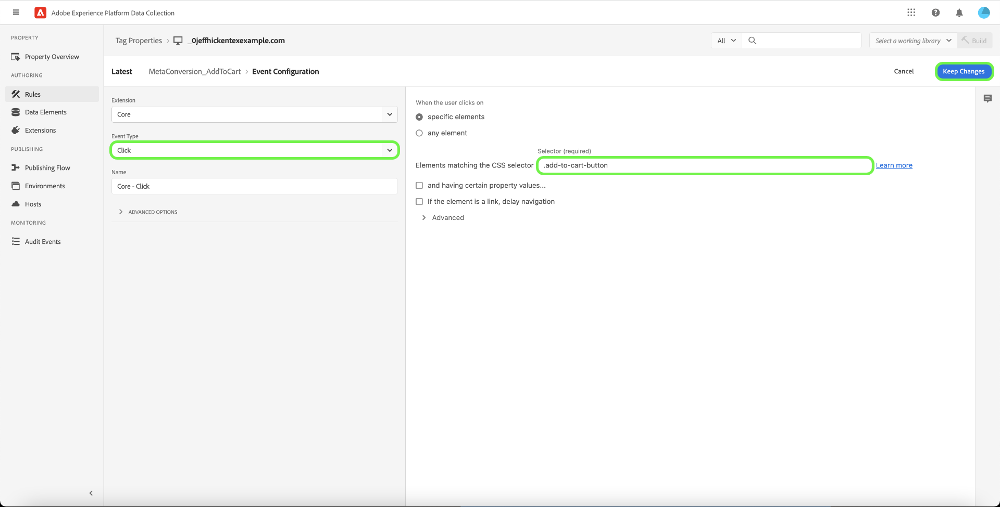
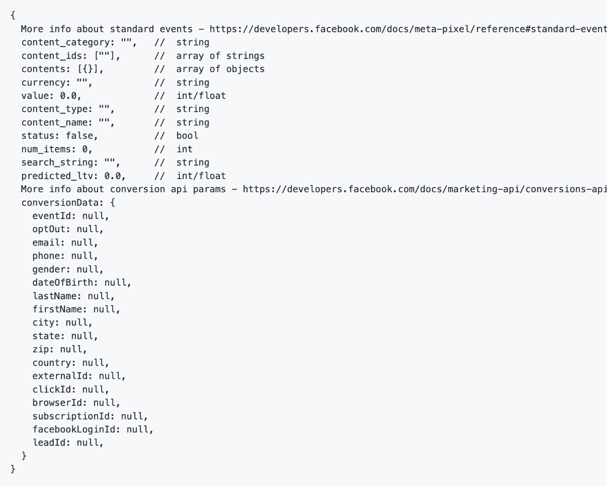

# [!DNL Meta Conversions API] extensieoverzicht

De [[!DNL Meta Conversions API]](https://developers.facebook.com/docs/marketing-api/conversions-api/) staat u toe om uw server-kant marketing gegevens aan te sluiten [!DNL Meta] -technologieën om uw advertentie te optimaliseren, de kosten per actie te verlagen en de resultaten te meten. Gebeurtenissen zijn gekoppeld aan een [[!DNL Meta Pixel]](https://developers.facebook.com/docs/meta-pixel/) ID en worden op dezelfde manier verwerkt als gebeurtenissen aan de clientzijde.

Met de [!DNL Meta Conversions API] kunt u de API-mogelijkheden in uw [gebeurtenis doorsturen](../../../ui/event-forwarding/overview.md) regels voor het verzenden van gegevens naar [!DNL Meta] van het Adobe Experience Platform Edge Network. In dit document wordt beschreven hoe u de extensie installeert en de mogelijkheden van de extensie gebruikt bij het doorsturen van gebeurtenissen [regel](../../../ui/managing-resources/rules.md).

## Vereisten

Het wordt sterk aanbevolen om [!DNL Meta Pixel] en de [!DNL Conversions API] om dezelfde gebeurtenissen te delen en te verzenden van respectievelijk de zijde van de client en de server, aangezien dit kan helpen gebeurtenissen te herstellen die niet zijn opgehaald door [!DNL Meta Pixel]. Voordat u de [!DNL Conversions API] voor meer informatie, raadpleegt u de handleiding op de [[!DNL Meta Pixel] extension](../../client/meta/overview.md) voor stappen over hoe te om het in uw cliënt-zijmarkeringsimplementaties te integreren.

>[!NOTE]
>
>Het gedeelte over [deduplicatie van gebeurtenissen](#deduplication) verderop in dit document worden de stappen beschreven om ervoor te zorgen dat dezelfde gebeurtenis niet tweemaal wordt gebruikt, aangezien deze mogelijk van zowel de browser als de server wordt ontvangen.

Voor het gebruik van de [!DNL Conversions API] uitbreiding, moet u toegang tot gebeurtenis hebben door:sturen en een geldige [!DNL Meta] account met toegang tot [!DNL Ad Manager] en [!DNL Event Manager]. U moet met name de id van een bestaande id kopiëren [[!DNL Meta Pixel]](https://www.facebook.com/business/help/952192354843755?id=1205376682832142) (of [een nieuwe [!DNL Pixel]](https://www.facebook.com/business/help/952192354843755) in plaats daarvan) kan de extensie worden geconfigureerd voor uw account.

>[!INFO]
>
>Als u deze extensie wilt gebruiken met gegevens van mobiele apps of als u ook werkt met gegevens van offlinegebeurtenissen in uw [!DNL Meta] campagnes, zult u uw dataset door een bestaande app moeten creëren en selecteren **Maken met een pixel-id** wanneer hierom wordt gevraagd. Zie het artikel [Bepaal welke optie van de datasetverwezenlijking voor uw zaken juist is](https://www.facebook.com/business/help/5270377362999582?id=490360542427371) voor meer informatie. Zie de [Conversies-API voor toepassingsgebeurtenissen](https://developers.facebook.com/docs/marketing-api/conversions-api/app-events) document voor alle vereiste en optionele parameters voor het bijhouden van apps.

## De extensie installeren

Als u het dialoogvenster [!DNL Meta Conversions API] de extensie, navigeert u naar de gebruikersinterface van de gegevensverzameling of het Experience Platform en selecteert u **[!UICONTROL Event Forwarding]** in de linkernavigatie. Selecteer van hieruit een eigenschap waaraan u de extensie wilt toevoegen of maak een nieuwe eigenschap.

Als u de gewenste eigenschap hebt geselecteerd of gemaakt, selecteert u **[!UICONTROL Extensions]** in de linkernavigatie, dan selecteer **[!UICONTROL Catalog]** tab. Zoeken naar [!UICONTROL Meta Conversions API] kaart, dan selecteren **[!UICONTROL Install]**.

![De [!UICONTROL Install] optie die voor [!UICONTROL Meta Conversions API] in de UI voor gegevensverzameling.](../../../images/extensions/server/meta/install.png)

In de configuratieweergave die wordt weergegeven, moet u de opdracht [!DNL Pixel] ID die u eerder hebt gekopieerd om de extensie te koppelen aan uw account. U kunt de id rechtstreeks in de invoer plakken, maar u kunt ook een gegevenselement gebruiken.

U moet ook een toegangstoken verstrekken om te gebruiken [!DNL Conversions API] specifiek. Zie de [!DNL Conversions API] documentatie over [toegangstoken genereren](https://developers.facebook.com/docs/marketing-api/conversions-api/get-started#access-token) voor stappen voor het verkrijgen van deze waarde.

Selecteer **[!UICONTROL Save]**

![De [!DNL Pixel] ID verstrekt als gegevenselement in de mening van de uitbreidingsconfiguratie.](../../../images/extensions/server/meta/configure.png)

De uitbreiding is geïnstalleerd en u kunt zijn mogelijkheden in uw gebeurtenis nu gebruiken die regels door:sturen.

## Integratie met Meta Business Extension (MBE) {#mbe}

Dankzij de integratie met MBE-uitbreiding (Meta Business Extensions) kunt u uw account snel verifiëren in uw zakelijke account van Meta. Dit vult dan automatisch uw [!UICONTROL Pixel ID] en de Meta Conversions API [!UICONTROL Access Token], waardoor de API voor metaconversies eenvoudiger kan worden geïnstalleerd en geconfigureerd.

Er wordt een dialoogvenster weergegeven met de vraag of verificatie in MBE moet worden uitgevoerd wanneer u de installatie van de [!UICONTROL Meta Conversions API] extensie.

![De [!UICONTROL Meta Conversions API Extension] markering installatiepagina [!UICONTROL Connect to Meta].](../../../images/extensions/server/meta/mbe-extension-install.png)

Een dialoogherinnering om in MBE voor authentiek te verklaren verschijnt ook in het snelle begin werkschema UI binnen gebeurtenis het door:sturen.

![UI-markering voor snelstartworkflow [!UICONTROL Connect to Meta].](../../../images/extensions/server/meta/mbe-extension-quick-start.png)

## Integratie met Event Quality Match Score (EMQ) {#emq}

Dankzij de integratie met de Event Quality Match Score (EMQ) kunt u de doeltreffendheid van uw implementatie eenvoudig bekijken door de EMQ-scores weer te geven. Deze integratie minimaliseert contextomschakeling en helpt u het succes van uw implementaties van Meta Conversions API verbeteren. Deze gebeurtenissencores worden weergegeven in het dialoogvenster [!UICONTROL Meta Conversions API extension] configuratiescherm.

![De [!UICONTROL Meta Conversions API Extension] configuratiepagina markeren [!UICONTROL View EMQ Score].](../../../images/extensions/server/meta/emq-score.png)

## Integratie met LiveRamp (Alpha) {#alpha}

[!DNL LiveRamp] klanten die [!DNL LiveRamp]De voor authentiek verklaarde Oplossing van het Verkeer (ATS) die op hun plaatsen wordt opgesteld kan verkiezen om RampIDs als parameter van de klanteninformatie te delen. Werk met uw [!DNL Meta] accountteam om deel te nemen aan het Alpha-programma voor deze functie.

![Meta-gebeurtenis door:sturen [!UICONTROL Rule] configuratiepagina markeren [!UICONTROL Partner Name (alpha)] en [!UICONTROL Partner ID (alpha)].](../../../images/extensions/server/meta/live-ramp.png)

## Vorm een gebeurtenis door:sturen regel {#rule}

In deze sectie wordt beschreven hoe u de [!DNL Conversions API] uitbreiding in een generische gebeurtenis die regel door:sturen. In de praktijk, zou u verscheidene regels moeten vormen om allen te verzenden toegelaten [standaardgebeurtenissen](https://developers.facebook.com/docs/meta-pixel/reference) via [!DNL Meta Pixel] en [!DNL Conversions API]. Voor mobiele toepassingsgegevens raadpleegt u de vereiste velden, toepassingsgegevensvelden, parameters voor klantgegevens en aangepaste gegevens [hier](https://developers.facebook.com/docs/marketing-api/conversions-api/app-events).

>[!NOTE]
>
>Gebeurtenissen moeten [verzonden in real time](https://www.facebook.com/business/help/379226453470947?id=818859032317965) of zo dicht mogelijk bij real time voor betere optimalisering van de advertentiecampagne.

Begin creërend een nieuwe gebeurtenis door:sturen regel en vorm zijn voorwaarden zoals gewenst. Selecteer bij het selecteren van de handelingen voor de regel de optie **[!UICONTROL Meta Conversions API Extension]** voor de extensie selecteert u vervolgens **[!UICONTROL Send Conversions API Event]** voor het actietype.

![De [!UICONTROL Send Page View] actietype dat voor een regel in de Inzameling UI van Gegevens wordt geselecteerd.](../../../images/extensions/server/meta/select-action.png)

De controles verschijnen die u toestaan om de gebeurtenisgegevens te vormen die zullen worden verzonden naar [!DNL Meta] via de [!DNL Conversions API]. Deze opties kunnen rechtstreeks in de verstrekte input worden ingevoerd, of u kunt bestaande gegevenselementen selecteren om de waarden te vertegenwoordigen. De configuratieopties worden verdeeld in vier hoofdsecties, zoals hieronder beschreven.

| Config-sectie | Beschrijving |
| --- | --- |
| [!UICONTROL Server Event Parameters] | Algemene informatie over de gebeurtenis, waaronder de tijd dat deze heeft plaatsgevonden en de bronactie die deze heeft geactiveerd. Zie de [!DNL Meta] ontwikkelaarsdocumentatie voor meer informatie over de [standaardparameters voor gebeurtenissen](https://developers.facebook.com/docs/marketing-api/conversions-api/parameters/server-event) door de [!DNL Conversions API].  Als u beide gebruikt [!DNL Meta Pixel] en de [!DNL Conversions API] om gebeurtenissen te verzenden, zorg ervoor zowel als omvat **[!UICONTROL Event Name]** (`event_name`) en **[!UICONTROL Event ID]** (`event_id`) bij elke gebeurtenis, aangezien deze waarden worden gebruikt voor [deduplicatie van gebeurtenissen](#deduplication).  U kunt ook **[!UICONTROL Enable Limited Data Use]** om te helpen voldoen aan de opt-outs van klanten. Zie de [!DNL Conversions API] documentatie over [gegevensverwerkingsopties](https://developers.facebook.com/docs/marketing-apis/data-processing-options/) voor meer informatie over deze functie. |
| [!UICONTROL Customer Information Parameters] | De identiteitsgegevens van de gebruiker die worden gebruikt om de gebeurtenis aan een klant toe te schrijven. Sommige van deze waarden moeten worden gehasht voordat ze naar de API kunnen worden verzonden.  Voor een goede algemene API-verbinding en een hoge evenementkwaliteit (EMQ) is het raadzaam alle [geaccepteerde parameters voor klantinformatie](https://developers.facebook.com/docs/marketing-api/conversions-api/parameters/customer-information-parameters) naast servergebeurtenissen. Deze parameters moeten ook [prioriteit op basis van hun belang en impact op het EMQ](https://www.facebook.com/business/help/765081237991954?id=818859032317965). |
| [!UICONTROL Custom Data] | Aanvullende gegevens die moeten worden gebruikt voor optimalisatie van levering voor advertenties, opgegeven in de vorm van een JSON-object. Zie de [[!DNL Conversions API] documentatie](https://developers.facebook.com/docs/marketing-api/conversions-api/parameters/custom-data) voor meer informatie over de geaccepteerde eigenschappen voor dit object.  Als u een aankoopgebeurtenis verzendt, moet u deze sectie gebruiken om de vereiste kenmerken op te geven `currency` en `value`. |
| [!UICONTROL Test Event] | Deze optie wordt gebruikt om te verifiëren of uw configuratie servergebeurtenissen om veroorzaakt te ontvangen door [!DNL Meta] zoals verwacht. Selecteer de optie **[!UICONTROL Send as Test Event]** Schakel het selectievakje in en geef een gewenste testgebeurteniscode op in de onderstaande invoer. Zodra de gebeurtenis door:sturen regel wordt opgesteld, als u de uitbreiding en de actie correct vormde zou u activiteiten zien die binnen het **[!DNL Test Events]** weergeven in [!DNL Meta Events Manager]. |

{style="table-layout:auto"}

Selecteer **[!UICONTROL Keep Changes]** om de actie aan de regelconfiguratie toe te voegen.

![[!UICONTROL Keep Changes] geselecteerd voor de actieconfiguratie.](../../../images/extensions/server/meta/keep-changes.png)

Als u tevreden bent met de regel, selecteert u **[!UICONTROL Save to Library]**. Ten slotte publiceert u een nieuwe gebeurtenis die wordt doorgestuurd [build](../../../ui/publishing/builds.md) om de wijzigingen in de bibliotheek mogelijk te maken.

## Gebeurtenisdeduplicatie {#deduplication}

Zoals vermeld in het [sectie voorwaarden](#prerequisites)wordt aangeraden beide [!DNL Meta Pixel] de extensie van de tag en de [!DNL Conversions API] gebeurtenis die uitbreiding door:sturen om de zelfde gebeurtenissen van de cliënt en de server in een overtollige opstelling te verzenden. Dit kan helpen gebeurtenissen herstellen die niet door één of andere uitbreiding werden opgepikt.

Als u verschillende gebeurtenistypen verzendt van de client en de server zonder overlapping tussen beide, is deduplicatie niet nodig. Als echter één gebeurtenis wordt gedeeld door beide [!DNL Meta Pixel] en de [!DNL Conversions API], moet u ervoor zorgen dat deze overtollige gebeurtenissen worden gededupliceerd zodat uw rapport niet negatief wordt beïnvloed.

Wanneer u gedeelde gebeurtenissen verzendt, moet u een gebeurtenis-id en een naam opnemen voor elke gebeurtenis die u verzendt van zowel de client als de server. Wanneer meerdere gebeurtenissen met dezelfde id en naam worden ontvangen, [!DNL Meta] maakt automatisch gebruik van verschillende strategieën om deze te dedupliceren en de meest relevante gegevens te bewaren. Zie de [!DNL Meta] documentatie over [deduplicatie voor [!DNL Meta Pixel] en [!DNL Conversions API] gebeurtenissen](https://www.facebook.com/business/help/823677331451951?id=1205376682832142) voor meer informatie over dit proces.

## Snelle startworkflow: extensie voor metaconversie-API (bèta) {#quick-start}

>[!IMPORTANT]
>
>* De functie Snel starten is beschikbaar voor klanten die het Real-Time CDP-pakket Premier en Ultimate hebben aangeschaft. Neem contact op met uw Adobe voor meer informatie.
>* Deze eigenschap is voor netto nieuwe implementaties en steunt momenteel niet auto installerende uitbreidingen en configuraties op bestaande markeringen en gebeurtenis die eigenschappen door:sturen.

>[!NOTE]
>
>Om het even welke bestaande cliënt kan de snelstartwerkschema&#39;s gebruiken om een verwijzings implementatie tot stand te brengen die voor het volgende kan worden gebruikt:
>* Gebruik dit als het begin van een gloednieuwe implementatie.
>* Haal voordeel uit het als verwijzingsimplementatie die u kunt onderzoeken om te zien hoe het is gevormd en dan in uw huidige productieimplementaties repliceert.

Met de functie Snel starten kunt u eenvoudig en efficiënt werken met de API voor metaconversie en de Pixel-extensies Meta. Dit hulpmiddel automatiseert veelvoudige stappen die in Adobe markeringen en gebeurtenis door:sturen worden uitgevoerd, beduidend verminderend de opstellingstijd.

Deze functie installeert en configureert automatisch de API voor metaconversie en de Pixel-extensies van Meta op nieuwe automatisch gegenereerde tags en de eigenschap voor het doorsturen van gebeurtenissen met de vereiste regels en gegevenselementen. Bovendien, installeert het ook auto en vormt het Web SDK van het Experience Platform en de Datstream. Ten slotte publiceert de functie Snel starten de bibliotheek automatisch naar de aangewezen URL in een ontwikkelomgeving, die gegevensverzameling aan de clientzijde en gebeurtenisdoorsturen aan de serverzijde in real time via Event Forwarding en Experience Platform Edge Network mogelijk maakt.

In de volgende video wordt een inleiding gegeven op de functie Snel starten.

>[!VIDEO](https://video.tv.adobe.com/v/3416939?quality=12&learn=on)

### Snelstartfunctie installeren

>[!NOTE]
>
>Deze eigenschap wordt ontworpen om u te helpen begonnen met een gebeurtenis door:sturen implementatie. Het zal geen eind-aan-eind, volledig functionele implementatie leveren die alle gebruiksgevallen aanpast.

Deze setup wordt automatisch uitgevoerd om zowel de API voor metaconversie als de Pixel-extensies van Meta te installeren. Deze hybride implementatie wordt aanbevolen door Meta voor het verzamelen en doorsturen van de serverzijde van de conversie van gebeurtenissen.
De snelle opstellingseigenschap wordt ontworpen om klanten te helpen met een gebeurtenis beginnen die implementatie door:sturen en is niet bedoeld om een eind aan eind te leveren, volledig functionele implementatie die alle gebruiksgevallen aanpast.

Selecteer **[!UICONTROL Get Started]** for **[!DNL Send Conversions Data to Meta]** over de Adobe Experience Platform-gegevensverzameling **[!UICONTROL Home]** pagina.

Voer uw **[!UICONTROL Domain]** selecteert u vervolgens **[!UICONTROL Next]**. Dit domein zal als noemende overeenkomst voor uw auto geproduceerde Markeringen en Gebeurtenis worden gebruikt die eigenschappen, regels, gegevenselementen, gegevensstromen, etc. door:sturen.

In de **[!UICONTROL Initial Setup]** dialoogvenster voert uw **[!UICONTROL Meta Pixel ID]**, **[!UICONTROL Meta Conversion API Access Token]**, en **[!UICONTROL Data Layer Path]** selecteert u vervolgens **[!UICONTROL Next]**.

Wacht enkele minuten tot het initiële installatieproces is voltooid en selecteer vervolgens **[!UICONTROL Next]**.

Van de **[!UICONTROL Add Code on Your Site]** dialoogvenster de code kopiëren die is opgegeven met behulp van de kopie  functie en plak deze in de `<head>` van uw bronwebsite. Na implementatie selecteert u **[!UICONTROL Start Validation]**

De [!UICONTROL Validation Results] geeft de resultaten van de implementatie van de extensie Meta weer. Selecteer **[!UICONTROL Next]**. U kunt ook aanvullende validatieresultaten zien door de optie **[!UICONTROL Assurance]** koppeling.

De **[!UICONTROL Next Steps]** schermweergave bevestigt de voltooiing van de installatie. Van hieruit hebt u de optie om uw implementatie te optimaliseren door nieuwe gebeurtenissen toe te voegen, die in de volgende sectie worden getoond.

Als u geen extra gebeurtenissen wilt toevoegen, selecteert u **[!UICONTROL Close]**.

#### Extra gebeurtenissen toevoegen

Selecteer **[!UICONTROL Edit Your Tags Web Property]**.

Selecteer de regel die overeenkomt met de meta-gebeurtenis die u wilt bewerken. Bijvoorbeeld: **MetaConversion_AddToCart**.

>[!NOTE]
>
>Als er geen gebeurtenis is, zal deze regel niet lopen. Dit geldt voor alle regels, met de **MetaConversion_PageView** regel is de uitzondering.

Om een gebeurtenis toe te voegen selecteer **[!UICONTROL Add]** onder de [!UICONTROL Events] kop.

Selecteer het [!UICONTROL Event Type]. In dit voorbeeld hebben we de [!UICONTROL Click] gebeurtenis en geconfigureerd om te activeren wanneer de **.add-to-cart-button** is geselecteerd. Selecteer **[!UICONTROL Keep Changes]**.

De nieuwe gebeurtenis is opgeslagen. Selecteren **[!UICONTROL Select a working library]** en selecteer de bibliotheek die u wilt maken.

Selecteer de vervolgkeuzelijst naast **[!UICONTROL Save to Library]** en selecteert u **[!UICONTROL Save to Library and Build]**. Hiermee wordt de wijziging in de bibliotheek gepubliceerd.

Herhaal deze stappen voor elke andere meta-omzettingsgebeurtenis u zou willen vormen.

#### Configuratie van gegevenslaag {#configuration}

>[!IMPORTANT]
>
>De manier waarop u deze algemene gegevenslaag bijwerkt, is afhankelijk van uw websitearchitectuur. Een toepassing op één pagina verschilt van een renderingtoepassing op de server. Het is ook mogelijk dat u volledig verantwoordelijk bent voor het maken en bijwerken van deze gegevens in het product Tags. In alle gevallen moet de gegevenslaag worden bijgewerkt tussen het uitvoeren van de `MetaConversion_* rules`. Als u de gegevens niet tussen regels bijwerkt, kunt u ook in een geval lopen waar u stapelgegevens van het laatste verzendt `MetaConversion_* rule` in de huidige `MetaConversion_* rule`.

Tijdens de configuratie, werd u gevraagd waar uw gegevenslaag leeft. Standaard is dit `window.dataLayer.meta`en binnen de `meta` -object, worden uw gegevens verwacht zoals hieronder wordt weergegeven.

Dit is belangrijk om te begrijpen zoals elke `MetaConversion_*` regel gebruikt deze gegevensstructuur om de relevante gegevens door te geven aan de [!DNL Meta Pixel] en de [!DNL Meta Conversions API]. Raadpleeg de documentatie bij [standaardgebeurtenissen](https://developers.facebook.com/docs/meta-pixel/reference#standard-events) voor meer informatie over welke gegevens verschillende meta - gebeurtenissen vereisen.

Als u bijvoorbeeld de opdracht `MetaConversion_Subscribe` regel, u zou moeten bijwerken `window.dataLayer.meta.currency`, `window.dataLayer.meta.predicted_ltv`, en `window.dataLayer.meta.value` zoals beschreven in de documentatie over de objecteigenschappen [standaardgebeurtenissen](https://developers.facebook.com/docs/meta-pixel/reference#standard-events).

Hieronder ziet u een voorbeeld van wat er op een website moet worden uitgevoerd om de gegevenslaag bij te werken voordat de regel wordt uitgevoerd.

Standaard worden de `<datalayerpath>.conversionData.eventId` wordt willekeurig gegenereerd door de actie &quot;Nieuwe gebeurtenis-id genereren&quot; op een van de `MetaConversion_* rules`.

Voor een lokale verwijzing naar hoe de gegevenslaag zou moeten kijken, kunt u de redacteur van de douanecode op `MetaConversion_DataLayer` data element on your property.

## Volgende stappen

In deze handleiding wordt beschreven hoe u gebeurtenisgegevens op de server kunt verzenden naar [!DNL Meta] met de [!DNL Meta Conversions API] extensie. Het wordt aanbevolen om vanaf hier uw integratie uit te breiden door meer verbinding te maken [!DNL Pixels] en delen van meer gebeurtenissen, indien van toepassing. Voer een van de volgende twee handelingen uit om uw advertentieprestaties verder te verbeteren:

* Andere verbindingen maken [!DNL Pixels] die nog niet met een [!DNL Conversions API] integratie.
* Als u bepaalde gebeurtenissen uitsluitend via [!DNL Meta Pixel] op de client, stuur dezelfde gebeurtenissen naar de [!DNL Conversions API] ook aan de serverzijde.

Zie de [!DNL Meta] documentatie over [beste praktijken voor [!DNL Conversions API]](https://www.facebook.com/business/help/308855623839366?id=818859032317965) voor meer begeleiding over hoe te om uw integratie effectief uit te voeren. Raadpleeg voor meer algemene informatie over tags en het doorsturen van gebeurtenissen in Adobe Experience Cloud de [overzicht van tags](../../../home.md).
