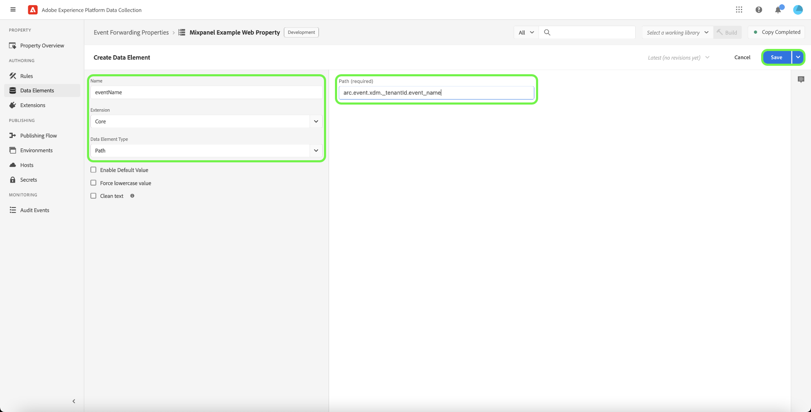

# [!DNL Mixpanel Track Events] API-extensie voor doorsturen van gebeurtenissen

[[!DNL Mixpanel]](https://www.mixpanel.com) is een hulpprogramma voor productanalyse waarmee u gegevens kunt vastleggen over de manier waarop gebruikers met een digitaal product werken. U kunt productgegevens analyseren met eenvoudige, interactieve rapporten die u de gegevens laten vragen en visualiseren met slechts een paar klikken. [!DNL Mixpanel] ontworpen om teams efficiënter te maken door iedereen toe te staan om gebruikersgegevens in echt te analyseren - tijd om tendensen te identificeren, gebruikersgedrag te begrijpen, en besluiten over uw product te nemen.

[!DNL Mixpanel] Gebruikt een op gebeurtenis-gebaseerd, gebruiker-centric model dat elke interactie met één enkele gebruiker verbindt. De [!DNL Mixpanel] het gegevensmodel wordt voortgebouwd op de concepten gebruikers, gebeurtenissen, en eigenschappen.

>[!NOTE]
>
>Zie de [!DNL Mixpanel] documentatie over [identiteitsbeheer](https://help.mixpanel.com/hc/en-us/articles/360041039771-Getting-Started-with-Identity-Management) om te begrijpen hoe [!DNL Mixpanel] Voegt gebeurtenissen samen om identiteitsclusters te maken. U wordt ook aangeraden het document te controleren op [afzonderlijke id&#39;s](https://help.mixpanel.com/hc/en-us/articles/115004509426-Distinct-ID-Creation-JavaScript-iOS-Android-) om te begrijpen hoe ze worden gebruikt om gebruikers in gebeurtenisgegevens te identificeren.

De [!DNL Mixpanel Track Events] Met de API-extensie kunt u beide toepassingen benutten [gebeurtenis doorsturen](../../../ui/event-forwarding/overview.md) en [tags](../../../home.md) om gebeurtenisinformatie vast te leggen in Adobe Experience Platform Edge Network en deze naar te sturen [!DNL Mixpanel] met de [[!DNL Track Events] API](https://developer.mixpanel.com/reference/track-event). Dit document behandelt de gebruiksgevallen van de extensie, de manier waarop de extensie moet worden geïnstalleerd en de manier waarop de mogelijkheden van de extensie moeten worden geïntegreerd in het doorsturen van de gebeurtenis [regels](../../../ui/managing-resources/rules.md).

## Gebruiksscenario’s

Deze extensie moet worden gebruikt als u gegevens van het Edge-netwerk wilt gebruiken in [!DNL Mixpanel] om te profiteren van de mogelijkheden voor productanalyse.

Neem bijvoorbeeld een detailhandelsorganisatie met meerdere kanalen (website en mobiel). De organisatie vangt transactie of gespreksinvoer als gebeurtenisgegevens van hun platforms en laadt het in [!DNL Mixpanel] het gebruiken van de gebeurtenis die uitbreiding door:sturen.

De analyseteams kunnen vervolgens gebruikmaken van [!DNL Mixpanel's] mogelijkheden om de datasets te verwerken en bedrijfsinzichten af te leiden, die kunnen worden gebruikt om grafieken, dashboards, of andere visualisaties te produceren om bedrijfsbelanghebbenden te informeren.

Voor meer informatie over gebruiksgevallen die specifiek zijn voor [!DNL Mixpanel]Raadpleeg de volgende documentatie:

* [Nieuw bij [!DNL Mixpanel]](https://help.mixpanel.com/hc/en-us/sections/360008533532-New-to-Mixpanel)
* [Wat is [!DNL Mixpanel]?](https://developer.mixpanel.com/docs)
* [12 moet-try [!DNL Mixpanel] functies](https://mixpanel.com/blog/12-things-you-probably-didnt-know-you-could-do-with-mixpanel/)

## [!DNL Mixpanel] voorwaarden {#prerequisites-mixpanel}

U moet een geldige [!DNL Mixpanel] om deze extensie te gebruiken. Ga naar de [[!DNL Mixpanel] registratiepagina](https://mixpanel.com/register/) als u nog geen account hebt, kunt u zich registreren en een account maken.

Zorg ervoor dat de [[!DNL Identity Merge]](https://help.mixpanel.com/hc/en-us/articles/9648680824852-ID-Merge-Implementation-Best-Practices) het plaatsen wordt toegelaten voor uw project. Navigeren naar **[!DNL Settings]** > **[!DNL Project Setting]** > **[!DNL Identity Merge]** en schakelt u de instelling in.

<!-- (If these don't apply, do we need to include here at all?)
### API guardrails {#guardrails}

Refer to the [[!DNL Mixpanel] documentation](https://developer.mixpanel.com/reference/import-events#rate-limits) for limits and response codes. As [!DNL Mixpanel] only sends live events these limits should not apply.
-->

### Verzamel vereiste configuratiedetails {#configuration-details}

Om Experience Platform met te verbinden [!DNL Mixpanel] u moet de volgende input hebben:

| Type toets | Beschrijving | Voorbeeld |
| --- | --- | --- |
| Projecttoken | Het projecttoken dat aan uw [!DNL Mixpanel] account. Zie de [!DNL Mixpanel] documentatie over [zoeken, projecttoken](https://help.mixpanel.com/hc/en-us/articles/115004502806-Find-Project-Token-) ter begeleiding. | `25470xxxxxxxxxxxxxxxxxxx1289` |

## Experience Cloud-voorwaarden

In deze sectie worden de vereiste stappen in Experience Cloud voor alle implementaties beschreven. Afhankelijk van uw individuele implementatiebehoeften kan het nuttig zijn om de volgende constructies in te stellen voordat u de extensie configureert:

1. A [schema](../../../../xdm/schema/composition.md) om de structuur van de gegevens te beschrijven die u in Experience Cloud invoert
1. A [datastream](https://experienceleague.adobe.com/docs/platform-learn/data-collection/event-forwarding/set-up-a-datastream.html) om inkomende gegevens naar aangewezen toepassingen van Adobe Experience Cloud te leiden
1. A [gegevensset](https://experienceleague.adobe.com/docs/platform-learn/tutorials/data-ingestion/create-datasets-and-ingest-data.html) om de verzamelde gegevens op te slaan

Voor alle implementaties is het volgende vereist aan de zijde Experience Cloud:

1. [Een geheim maken](#create-a-secret)
1. [Tageigenschappen instellen](#set-up-tag-properties)
1. [Gegevenselementen toevoegen binnen tag-eigenschappen](#add-data-elements-within-tag-properties)
1. [Regels toevoegen binnen eigenschappen van tags](#add-rules-within-tag-properties)

### Een geheim maken

Een nieuwe [gebeurtenis die geheim door:sturen](../../../ui/event-forwarding/secrets.md) en stel de waarde in op uw [[!DNL Mixpanel] projecttoken](#configuration-details). Hiermee wordt de verbinding met uw account geverifieerd, maar blijft de waarde veilig.

### Tageigenschappen instellen

[Een tag-eigenschap maken](https://experienceleague.adobe.com/docs/platform-learn/implement-in-websites/configure-tags/create-a-property.html?lang=en) of kies een bestaande eigenschap die u wilt bewerken. Dit bezit zal worden gevormd om de noodzakelijke gegevensstructuren voor te verzamelen [!DNL Mixpanel] aangezien zij in het Netwerk van de Rand worden gebracht alvorens wordt verzonden gebruikend gebeurtenis door:sturen.

### Gegevenselementen toevoegen binnen tag-eigenschappen

Als uw website de [[!DNL Mixpanel] SDK](https://developer.mixpanel.com/docs/nodejs)moet u [een gegevenselement maken](../../../ui/managing-resources/data-elements.md) die het **[!UICONTROL Cookie]** type (verstrekt door [[!UICONTROL Core] tagextensie](../../client/core/overview.md)) zodat de [!DNL Mixpanel] `distinct_id` kan uit het cookie worden gelezen.

De **[!UICONTROL Cookie Name]** waarde moet overeenkomen met [!DNL Mixpanel] naam van cookie voor de website. De naam moet een notatie hebben die vergelijkbaar is met `mp_{MIXPANEL_PROJECT_TOKEN_FOR_WEBSITE}_mixpanel`. Selecteren **[!UICONTROL Save]** wanneer gereed.

>[!IMPORTANT]
>
>De naam van het bovenstaande gegevenselement (`distinctId` in dit voorbeeld) moet overeenkomen met de naam die voor hetzelfde veld in uw schema wordt gebruikt. Dit is ook van toepassing op de gebeurtenis die gegevenselement door:sturen u later zult creëren.

Stel voor het tweede gegevenselement het type in op **[!UICONTROL XDM Object]** (van de [Adobe Experience Platform Web SDK-extensie](../../client/sdk/overview.md)) en deze toewijzen aan het eerder gemaakte schema. Terwijl u de gegevens toewijst, moet u ervoor zorgen dat de waarde van de `distinct_id` gegevenselement (dat de [!DNL Mixpanel] `distinct_id` De waarde van het cookie) wordt als een waarde in een van uw schemavelden vermeld.

>[!NOTE]
>
>Als uw website niet wordt uitgevoerd, [!DNL Mixpanel] SDK, een Adobe Experience Cloud-id (ECID) wordt gebruikt als fallback `distinct_id` waarde die moet worden doorgegeven met de gebeurtenis die wordt verzonden naar [!DNL Mixpanel].

Afhankelijk van uw scenario, kunt u een ander gegevenselement moeten tot stand brengen dat aan de gebeurtenisnaam in het schema kan worden gebruikt in kaart te brengen. Dit kan worden gedaan gebruikend **[!UICONTROL DOM Attribute]** door de [!UICONTROL Core] extensie.

### Regels toevoegen binnen eigenschappen van tags

Zodra uw gegevenselementen opstelling zijn, kunt u beginnen regels tot stand te brengen die bepalen welke gebeurtenissen in gegevens zullen resulteren worden verzonden naar [!DNL Mixpanel].

Begin door een regel te creëren die voor de gebeurtenis van de gebruikersidentificatie teweeggebracht wordt. Dit kan logins, sign-ups, registraties, of een andere gebeurtenis vertegenwoordigen die u voor gebruikersidentificatie wilt gebruiken.

Onder **[!UICONTROL Events]** voegt u een voorwaarde (die specifiek is voor uw website) toe die de identificatiegebeurtenis activeert. Hieronder ziet u een voorbeeld van het activeren van de aanmeldingsregel bij een klik door de gebruiker:

Selecteren **[!UICONTROL Keep Changes]** om de gebeurtenis aan de regel toe te voegen.

Volgende, onder **[!UICONTROL Actions]** voegt u de resulterende handelingen toe die u wilt toepassen wanneer de regel wordt geactiveerd. Deze acties moeten **[!UICONTROL Send event]** verstrekt door de uitbreiding van SDK van het Web van het Platform, die de gebeurtenis naar het Netwerk van de Rand verzendt, waar het door:sturen van gebeurtenissen uitbreidingen zoals kan worden opgenomen [!DNL Mixpanel].

Bij het configureren van de handeling, onder **[!UICONTROL XDM data]** Selecteer de [gegevenselement dat u eerder hebt gemaakt](#add-data-elements-within-tag-properties) die de `distinct_id` waarde.

Selecteren **[!UICONTROL Keep Changes]** om de gebeurtenis aan de regel toe te voegen, dan selecteren **[!UICONTROL Save]** om de regel toe te voegen aan de tagbibliotheek. Vanaf hier kunt u [een nieuwe build maken en deze implementeren op uw website](../../../ui/publishing/overview.md).

## Installeer en configureer de [!DNL Mixpanel] extension {#install}

Als u de extensie wilt installeren, [een eigenschap voor het doorsturen van gebeurtenissen maken](../../../ui/event-forwarding/overview.md#properties) of kies een bestaande eigenschap die u wilt bewerken.

Selecteren **[!UICONTROL Extensions]** in de linkernavigatie. In de **[!UICONTROL Catalog]** tab, selecteert u **[!UICONTROL Install]** op de kaart voor de [!DNL Mixpanel] extensie.

![De installatie van de [!DNL Mixpanel] extensie.](../../../images/extensions/server/mixpanel/install-extension.png)

## Gebeurtenis instellen die gegevenselementen doorstuurt

Na het installeren van de uitbreiding, moet de volgende stap gebeurtenis tot stand brengen die gegevenselementen door:sturen die de noodzakelijke gegevensconstructies zullen vangen die zullen worden verzonden naar [!DNL Mixpanel].

### Een `distinctId` gegevenselement

Voeg gegevenselementen toe onder gebeurtenis die door:sturen. Als de site is geconfigureerd met de [[!DNL Mixpanel] SDK](https://developer.mixpanel.com/docs/nodejs) de [element met eigenschappen tag](#setup-tag-properties-data-element) zou zijn gedefinieerd. Voor de gebeurtenis die gegevenselement door:sturen, zult u nu verstrekken **[!UICONTROL Path]** in plaats daarvan.

### Een `event_type` gegevenselement

Hieronder ziet u een voorbeeld van een gegevenselement dat is gedefinieerd voor een gebeurtenistype:

### Extra gegevenselemakafbeeldingen maken

De `distinctId` en `event_type` gegevenselementen zijn beide vereist voor het verzenden van gegevens naar [!DNL Mixpanel], maar het wordt ook aanbevolen voor elke gebeurtenis een bekende gebruiker-id en een aangepast gegevensobject op te nemen, indien beschikbaar. Zie de handleiding op de [[!DNL Mixpanel Track Events] REST API](https://developer.mixpanel.com/reference/track-event) voor aanvullende richtsnoeren.

De aanbevolen toewijzingen van gegevenselementen worden hieronder beschreven.

>[!IMPORTANT]
>
>Alle hieronder vermelde gegevenselementen moeten de **[!UICONTROL Path]** typen zodat zij zich kunnen toewijzen aan specifieke velden in uw schema zoals aangegeven in het dialoogvenster **Schemapad** kolom.
>
>Voor de schemapaden moet u de `{TENANT_ID}` plaatsaanduiding met uw unieke [huurder-id](../../../../xdm/api/getting-started.md#know-your-tenant_id), die fungeert als een naamruimte voor aangepaste velden die door uw organisatie zijn gedefinieerd.

| [!DNL Mixpanel] key | Schemapad | Beschrijving | Verplicht |
| --- | --- | --- | --- |
| [!DNL Mixpanel Distinct ID] | `arc.event.xdm._{TENANT_ID}.distinct_id` | `distinct_id` identificeert de gebruiker die de gebeurtenis heeft uitgevoerd. `distinct_id` moeten op elk evenement worden gespecificeerd, aangezien het van cruciaal belang is voor [!DNL Mixpanel] om gedragsanalyse correct en efficiënt uit te voeren, met inbegrip van unieke gebruikers, trechters, behoud, cohorts, en meer. | Ja |
| [!DNL Event Type] | `arc.event.xdm._{TENANT_ID}.event_type` | Dit is de naam van de gebeurtenis. [!DNL Mixpanel] Het wordt aangeraden het aantal unieke gebeurtenisnamen relatief klein te houden en eigenschappen te gebruiken voor elke variabelecontext die aan de gebeurtenis is gekoppeld.  In plaats van bijvoorbeeld gebeurtenissen te volgen met namen als &quot;Betaalde aanmelding&quot; en &quot;Vrije aanmelding&quot;, wordt aanbevolen een gebeurtenis met de naam &quot;Aanmelding&quot; bij te houden en een eigenschap met de naam &quot;Accounttype&quot; te hebben met mogelijke waarden &quot;betaald&quot; en &quot;gratis&quot;. | Ja |
| [!DNL Known User ID] | `arc.event.xdm._{TENANT_ID}.LoginID` | De e-mail- of aanmeldings-id van de gebruiker, indien beschikbaar. | Nee |
| [!DNL Data] | `arc.event.xdm._{TENANT_ID}.properties` | Een JSON-object dat alle eigenschappen van de gebeurtenis vertegenwoordigt. Gegevens worden ingekort tot 255 tekens. | Nee |

{style="table-layout:auto"}

## Regels voor het doorsturen van gebeurtenissen instellen

Zodra al uw gegevenselementen opstelling zijn, kunt u gebeurtenis beginnen tot stand te brengen door:sturen regels die bepalen wanneer en hoe uw gebeurtenissen zullen worden verzonden naar [!DNL Mixpanel]. Nochtans, alvorens uw regels te vormen, is het belangrijk om te begrijpen hoe de identiteitsclusters in werken [!DNL Mixpanel] zodat de gebeurtenissen die u verzendt correct worden toegewezen aan individuele gebruikers.

### Identiteitsclusters begrijpen in [!DNL Mixpanel]

In [!DNL Mixpanel], bevat een identiteitscluster een verzameling van `distinct_id` waarden die verbinding maken met een individuele gebruiker. [!DNL Mixpanel] behandelt het groeperen van identiteiten voor elke gebruiker, die één enkel canonicaal oplost `distinct_id` van elke cluster die bij de rapportage moet worden gebruikt. U kunt ook uw eigen id (ook wel een lokale id genoemd) opnemen `distinct_id`) voor anonieme gebeurtenissen die vóór een gebruikersidentificatie plaatsvinden.

[!DNL Mixpanel] Hiermee worden identiteitsclusters op twee manieren opgelost:

* **Identificeren** : [!DNL Mixpanel] verbindt uw gekozen herkenningsteken met anoniem `distinct_id`. Als de [!DNL Mixpanel] SDK is geconfigureerd op uw website. Platform gebruikt de `distinct_id` toegewezen aan de momenteel aangemelde gebruiker.
* **Alias**: [!DNL Mixpanel] twee niet-anonieme samenvoegen `distinct_id`s samen als andere fusiecriteria worden overgegaan.

>[!NOTE]
>
>Zie de [!DNL Mixpanel] document op [identiteitsbeheer](https://help.mixpanel.com/hc/en-us/articles/360041039771-Getting-Started-with-Identity-Management#user-identification) voor meer informatie over deze methoden .
>
>Bevestig dat u de [[!DNL Mixpanel] samenvoegfunctie](#prerequisites-mixpanel) ervoor te zorgen dat identiteitsclusters op passende wijze worden opgelost.

Bijgevolg [!DNL Mixpanel] de gebeurtenis door:sturen uitbreiding steunt **[!UICONTROL Track Event]** actietype voor uw regelconfiguratie.

>[!IMPORTANT]
>
>Voor elke regel, ongeacht de gebruikte methode voor het oplossen van identiteitsclusters, moet een van de handelingen de **[!UICONTROL Track Event]** type. Zonder dit actietype, zal de regel geen gebeurtenissen van het Netwerk van de Ervaring van Adobe verzenden naar [!DNL Mixpanel].

### Een regel voor het bijhouden van gebeurtenissen maken

Begin creërend een nieuwe regel in uw gebeurtenis door:sturen bezit. Onder **[!UICONTROL Actions]** voegt u een nieuwe handeling toe en stelt u de extensie in op **[!UICONTROL Mixpanel]**. Stel vervolgens het handelingstype in op **[!UICONTROL Track Event]** om Adobe Experience Edge Network-gebeurtenissen naar [!DNL Mixpanel].

| Invoer | Beschrijving |
| --- | --- |
| [!UICONTROL Project Token] | Dit gebied zou aan het projectteken verbonden aan uw moeten in kaart worden gebracht [!DNL Mixpanel] account. |
| [!UICONTROL Event Type] | De naam van de gebeurtenis. |
| [!UICONTROL Event Time] | De tijd van de gebeurtenis. |
| [!UICONTROL Mixpanel Distinct ID] | Dit veld moet worden toegewezen aan de `distinctId` gegevenselement dat u eerder hebt gemaakt. |
| [!UICONTROL Insert ID] | Dit veld moet worden toegewezen aan de `insertId` gegevenselement. |
| [!UICONTROL Event Properties] | Maak een keuze uit het opgeven van onbewerkte JSON of uit het gebruik van een vereenvoudigde set toetsinvoer. |

>[!NOTE]
>
>Voor meer informatie over de standaardvelden voor een [!DNL Mixpanel] gebeurtenis, raadpleegt u de [officiële documentatie](https://developer.mixpanel.com/reference/import-events#event).

Wanneer de [!UICONTROL Track Event] de actie wordt toegevoegd aan de regel, kunt u de voorwaarden van de regel vormen zodat het slechts voor bepaalde gebeurtenissen brandt, of u kunt de voorwaardesectie leeg verlaten om de regelbrand voor alle gebeurtenissen te maken.

>[!IMPORTANT]
>
>Als uw website de [!DNL Mixpanel] SDK, kunt u aan de volgende stap van verdergaan [valideren, uw gegevens binnen [!DNL Mixpanel]](#validate). Als u het [!DNL Mixpanel] SDK, u moet [een afzonderlijke regel voor het bijhouden van identiteiten maken](#create-an-identity-tracking-rule) ervoor te zorgen dat passende gebeurtenissen en `distinct_id` waarden worden verzonden naar [!DNL Mixpanel] wanneer een gebruikersidentificatie-gebeurtenis plaatsvindt.

### Een regel voor het bijhouden van identiteiten maken

Als u het [!DNL Mixpanel SDK]De volgende stap is het maken van een andere regel. Deze regel zorgt ervoor dat telkens wanneer een gebruikersidentificatiegebeurtenis op de website (zoals login, login, registratie, etc.) voorkomt, de aangewezen gebeurtenissen en `distinct_id` waarden worden verzonden naar [!DNL Mixpanel].

Start het proces voor het maken van een nieuwe regel. Voor de [!UICONTROL Conditions] toevoegen, voegt u een voorwaarde toe die controleert of de gebeurtenis een gebruikersidentificatiegebeurtenis is. In het onderstaande voorbeeld gebruikt de voorwaarde een [!UICONTROL Value Comparison] (van de [!UICONTROL Core] extensie) om te controleren of de inkomende gebeurtenis een gebeurtenisnaam heeft die gelijk is aan `signin`, die een aanmeldgebeurtenis van de gebruiker aangeeft.

![De configuratie van de handeling tonen voor [!DNL Mixpanel] actietypen Alias en Identify.](../../../images/extensions/server/mixpanel/ef-rule-condition.png)

Zodra u de aangewezen voorwaarden aan de regel hebt toegevoegd, moet u tot een [!UICONTROL Send Event] om Adobe Experience Edge Network-gebeurtenissen naar [!DNL Mixpanel].

>[!NOTE]
>
>Voor meer informatie over identiteiten in [!DNL Mixpanel], verwijst u naar de [officiële documentatie](https://developer.mixpanel.com/reference/create-identity).

Nadat de handeling aan de regel is toegevoegd, selecteert u **[!UICONTROL Save]** om de regel aan uw gebeurtenis toe te voegen die bibliotheek door:sturen. Vanaf hier kunt u [een nieuwe build maken en uw wijzigingen activeren](../../../ui/publishing/overview.md).

![Voeg een gebeurtenis toe door:sturen regel voor [!DNL Mixpanel] actietypen Alias en Identify.](../../../images/extensions/server/mixpanel/ef-rule-complete.png)

## Gegevens valideren binnen [!DNL Mixpanel] {#validate}

Als uw implementatie succesvol is en gebeurtenissen worden verzameld, ziet u gebeurtenissen in het dialoogvenster [[!DNL Mixpanel] console](https://help.mixpanel.com/hc/en-us/articles/4402837164948).

Controleren of [!DNL Mixpanel] heeft de gebeurtenissen voor na aanmelding samengevoegd met e-mailwaarden en de gebeurtenissen die bij het gebruik zijn gemaakt **[!UICONTROL Send Event]**. Indien correct geïmplementeerd, [!DNL Mixpanel] zal hen met één enkele associëren [gebruikersprofiel](https://help.mixpanel.com/hc/en-us/articles/115004501966).

## Volgende stappen

In deze handleiding wordt beschreven hoe conversiegebeurtenissen naar [!DNL Mixpanel] het gebruiken van gebeurtenis door:sturen. Deze gebeurtenis die uitbreiding door:sturen hefboomwerkingen [!DNL Mixpanel] SDK en JavaScript API. Raadpleeg de officiële documentatie voor meer informatie over deze onderliggende technologieën:

* [[!DNL Mixpanel] SDK](https://developer.mixpanel.com/docs/nodejs)
* [[!DNL Mixpanel] JavaScript-API](https://developer.mixpanel.com/docs/javascript-full-api-reference#mixpanelidentify)

Voor meer informatie over gebeurtenis die mogelijkheden in Experience Platform door:sturen, verwijs naar [overzicht van gebeurtenissen doorsturen](../../../ui/event-forwarding/overview.md).
