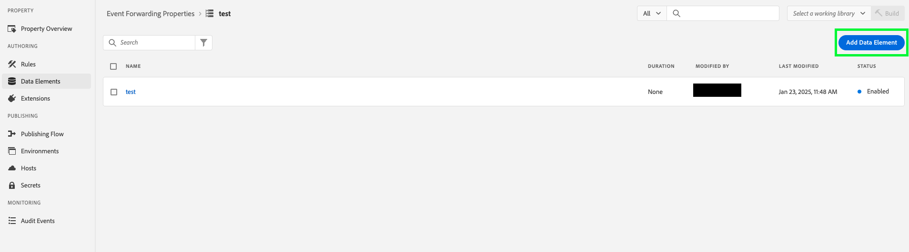

# [!DNL Snapchat] Overzicht van conversie-API

De [!DNL Snap] Uitbreiding van de Omzetting API is een veilige [&#x200B; Edge Network API &#x200B;](https://developer.adobe.com/data-collection-apis/docs/) interface die u toestaat om informatie met [!DNL Snapchat] direct over gebruikersacties op uw websites te delen. U kunt de regels voor het doorsturen van gebeurtenissen gebruiken om gegevens van **[!DNL Adobe Experience Platform Edge Network]** naar **[!DNL Snapchat]** te verzenden met de API-extensie **[!DNL Snap]** Conversion.

## [!DNL Snapchat] voorwaarden {#prerequisites}

De API voor conversies van [!DNL Snapchat] gebruiken:

* U moet een [&#x200B; Gebeurtenis hebben door:sturen bezit &#x200B;](/help/tags/ui/event-forwarding/getting-started.md) opstelling in Adobe Experience Platform.
* U moet ook de [&#x200B; vereiste toestemmingen &#x200B;](/help/collection/permissions.md) hebben om het bezit uit te geven.

Creeer a [&#x200B; Datastream &#x200B;](/help/tags/ui/event-forwarding/getting-started.md) en voeg de [&#x200B; Gebeurtenis toe die dienst &#x200B;](/help/tags/ui/event-forwarding/getting-started.md#enable-event-forwarding) door:sturen aan het.

Een **[!DNL Snapchat]** [&#x200B; BedrijfsManager &#x200B;](https://business.snapchat.com/) rekening wordt vereist om Conversies API te gebruiken. Met Business Manager kunnen adverteerders de marketinginspanningen van **[!DNL Snapchat]** integreren in hun hele bedrijf en met externe partners. Zie **[!DNL Snapchat]** [&#x200B; hulp centreert artikel &#x200B;](https://businesshelp.snapchat.com/s/article/get-started?language=en_US) bij het creëren van een rekening van BedrijfsManager als u geen hebt.

Er moet een [[!DNL [Snap Pixel]]](https://businesshelp.snapchat.com/s/article/pixel-website-install?language=en_US) zijn ingesteld in Snapchat Ads Manager en u moet toegang hebben om `Pixel ID` te kunnen bekijken. `Pixel ID` vindt u in de sectie [[!UICONTROL [Events Manager]]](https://businesshelp.snapchat.com/s/article/events-manager?language=en_US) .

U hebt een statisch, langdurig API-token nodig. Zie [[!DNL Snapchat]  Conversies API documentatie &#x200B;](https://developers.snap.com/api/marketing-api/Conversions-API/GetStarted#access-token) om dit teken te verkrijgen.

## De API-extensie voor [!DNL Snapchat] webgebeurtenissen installeren en configureren {#install}

Om de uitbreiding te installeren, navigeer aan **[!UICONTROL Data Collection]**> **[!UICONTROL Event Forwarding]**. Selecteer de eigenschap waar u de extensie wilt installeren.

Voer de volgende stappen uit als de gewenste eigenschap is geselecteerd:

1. Selecteer **[!UICONTROL Extensions]** in het navigatievenster aan de linkerkant.
2. Zoek naar **[!UICONTROL Snap Conversion API Extension]** en selecteer **[!UICONTROL Install]**.

   

3. Voer in het configuratiescherm de volgende waarden in:

* **[!UICONTROL Pixel Id]**
* **[!UICONTROL API Token]**

Selecteer **[!UICONTROL Save]** als u klaar bent.


<!-- 
![[!DNL Snap] configuration screen for the [!DNL Snap] conversion API extension.](../../../images/extensions/server/snap/configure.png) -->

## Gegevenselementen maken {#create-data-elements}

Om gegevens naar de [!DNL Snapchat] API uitbreiding van Conversies te verzenden, creeer [&#x200B; gegevenselementen &#x200B;](https://experienceleague.adobe.com/nl/docs/platform-learn/implement-web-sdk/event-forwarding/setup-event-forwarding#create-an-event-forwarding-data-element) voor elke gegevensparameter. Voer de volgende stappen uit:

1. Navigeer aan **[!UICONTROL Authoring]**> **[!UICONTROL Data Elements]** in het scherm van uw bezit **[!UICONTROL Property Info]**, en selecteer dan **[!UICONTROL Add Data Element]**.

    toont

2. Voer een naam in voor het gegevenselement.

3. Selecteer **[!UICONTROL Core]** als de extensie en **[!UICONTROL Path]** als het gegevenstype van het gegevenselement.

4. Selecteer in het keuzemenu het juiste item en vul het veld [!UICONTROL Path] in het rechterdeelvenster in om naar de gewenste gegevens in het schema te verwijzen.

   

Als u bijvoorbeeld een gegevenselement maakt dat verwijst naar `snapClickId` in het hieronder weergegeven schema:


U moet het gegevenselement configureren, omdat `snapClickId` zich onder `_snap.inc.exchange` in het XDM-schema bevindt.

 toont

Zie de [&#x200B; Gebeurtenis door:sturen eigenschappen documentatie &#x200B;](/help/tags/ui/event-forwarding/overview.md#data-elements) voor meer details bij het creëren van gegevenselementen.

## Regels maken om conversiegebeurtenissen naar Magnetisch te verzenden {#create-snap-rules}

[&#x200B; Regels &#x200B;](https://experienceleague.adobe.com/nl/docs/platform-learn/implement-web-sdk/event-forwarding/setup-event-forwarding#create-an-event-forwarding-rule) worden gebruikt om uitbreidingen in Experience Platform teweeg te brengen. Deze sectie schetst hoe te om regels binnen uw gebeurtenis tot stand te brengen die bezit door:sturen om omzettingsgebeurtenissen naar Breuk te verzenden gebruikend de uitbreiding van Conversies API.

### Een nieuwe regel maken

1. Navigeer naar uw eigenschap voor het doorsturen van gebeurtenissen en selecteer **[!UICONTROL Rules]** in het menu Ontwerpen. Klik vervolgens op **[!UICONTROL Create New Rule]** .

   

2. Geef de regel een naam en configureer een voorwaarde voor het activeren van de gebeurtenis Snap. Als u bijvoorbeeld een gebeurtenis `PURCHASE` wilt verzenden wanneer een gebeurtenis een ordernummer bevat, stelt u een voorwaarde in om te controleren of de gebruikersinteractie een geldig inkoopordernummer bevat.

   

3. Nadat u de voorwaarde hebt opgeslagen, voegt u een handeling toe waarmee de magnetische conversie-API wordt geactiveerd. In het linkerpaneel:

   * Stel de vervolgkeuzelijst [!UICONTROL Extension] in op [!UICONTROL Snap Conversions API Extension] .

   * Stel de vervolgkeuzelijst [!UICONTROL Action Type] in op [!UICONTROL Report Web Conversions] .

   * Geef de regel dienovereenkomstig een naam.

    toont

4. Vorm de [&#x200B; de parameterwaarden van CAPI &#x200B;](https://developers.snap.com/api/marketing-api/Conversions-API/Parameters) u voor de gebeurtenis in de **[!UICONTROL Data Bindings]** sectie op het rechterpaneel wilt verzenden. De velden in de extensie worden toegewezen aan CAPI-parameters, zoals hieronder wordt weergegeven. Zie de [&#x200B; documentatie van de Conversies API van de Snapchat &#x200B;](https://developers.snap.com/api/marketing-api/Conversions-API/Parameters) voor meer informatie over elke parameter.

| Veld voor gegevensbinding | Magnetische CAPI-parameter |
| --- | --- |
| Type gebeurtenis (vereist) | `event_name` |
| Email | `em` |
| Telefoonnummer | `ph` |
| Gebruikersagent | `client_user_agent` |
| IP-adres | `client_ip_address` |
| Klik op ID | `sc_click_id` |
| Cookie1 | `so_cookie1` |
| Voornaam | `fn` |
| Achternaam | `ln` |
| Geslacht | `ge` |
| Plaats | `ph` |
| Staat | `st` |
| Postcode | `zp` |
| Land | `country` |
| Externe id | `external_id` |
| Partner-id | `partner_id` |
| Abonnement-id | `subscription_id` |
| ID lead | `lead_id` |
| Object of rubriek | `content_category` |
| Inhoudsnaam | `content_ids` |
| Inhoudstype | `content_name` |
| Inhoud | `contents` |
| Beschrijving | `description` |
| Gebeurtenistag | `event_tag` |
| Aantal objecten | `num_items` |
| Prijs | `value` |
| Valuta | `currency` |
| Transactie-id | `order_id` (wordt ook verzonden voor `event_id` in plaats van `client dedup idD` ) |
| Voorspelde LTV | `predicted_ltv` |
| Zoektekenreeks | `search_string` |
| Aanmeldingsmethode | `sign_up_method` |
| Id van Client-deduplicatie | `event_id` |
| Beperkt gegevensgebruik | `data_processing_options` |
| URL pagina | `event_source_url` |

{style="table-layout:auto"}

### Vereiste en optionele velden

Voor elke gebeurtenis is `event_source` vereist, die altijd is ingesteld op `WEB.` Voor overeenkomende gebeurtenissen is ook ten minste een van de volgende velden of combinaties vereist:

* E-mail
* Telefoonnummer
* IP-adres en gebruikersagent

**Extra nota&#39;s:**

* Voor `Purchase` -gebeurtenissen zijn de velden `Currency` en `Price` vereist.

* Als u het selectievakje **[!UICONTROL Test Mode]** inschakelt, worden gebeurtenissen verzonden als testgebeurtenissen, die in het testgebeurtenisgereedschap worden weergegeven in plaats van als standaardrapportage. Zie dit [&#x200B; artikel van het bedrijfsHulp centrum &#x200B;](https://businesshelp.snapchat.com/s/article/capi-event-testing?language=en_US#:~:text=Snap&#39;s%20Conversions%20API%20(CAPI)%20Test,being%20processed%20as%20production%20results.) voor meer details.

* De parameter `contents` moet een JSON-tekenreeks zijn die ten minste een van de volgende velden bevat:

   * `id`
   * `item_category`
   * `brand`
   * `delivery_category`
   * `item_price`
   * `quantity`

Voorbeeld:

```json
{
  "id": "id1",
  "brand": "brand1",
  "delivery_category": "c1",
  "item_price": 2.00,
  "quantity": 2
}
```

Om [&#x200B; waarde van douaneomzettingen en ROAS te gebruiken die &#x200B;](https://businesshelp.snapchat.com/s/article/custom-conversions-value-roas?language=en_US) melden, omvat relevante parameters op het `contents` gebied. Een voorbeeldconfiguratie voor een aankoopgebeurtenis kan er als volgt uitzien: `brand`, `item_price`, `id` .

Voorbeeldconfiguratie voor een `Purchase` -gebeurtenis:


De optionele velden kunnen worden ingesteld als weergegeven:


Zodra u de naam, de voorwaarde en de actie van de regel zoals hierboven beschreven plaatst, sparen de regel en zorg ervoor het wordt toegelaten.


U kunt deze wijzigingen nu publiceren naar uw eigenschap. Zie de documentatie bij [&#x200B; het publiceren stroom &#x200B;](/help/tags/ui/publishing/overview.md) voor meer informatie.

## Problemen oplossen {#troubleshoot}

Voor het oplossen van problemen en het optimaliseren van uw opstelling, herzie de [&#x200B; aanbevelingen van de Score van de Kwaliteit van de Gebeurtenis &#x200B;](https://businesshelp.snapchat.com/s/article/event-quality-score) om uw gebeurtenissen te verzekeren de hoogst mogelijke gelijke tarieven en prestatiesresultaten bereiken.

Als u kwesties met uw **Score van de Kwaliteit van de Gebeurtenis** ervaart, leer meer over onze aanbevelingen om het [&#x200B; hier &#x200B;](https://businesshelp.snapchat.com/s/article/esq-issues-recommendations?language=en_US) te verbeteren.

## Volgende stappen {#next-steps}

In deze handleiding wordt beschreven hoe u gebeurtenisgegevens aan de serverzijde naar **[!DNL Snap]** kunt verzenden met de extensie **[!DNL Snap Conversions API]** . Voor meer informatie over gebeurtenis door:sturen mogelijkheden in Experience Platform, verwijs naar de [&#x200B; Gebeurtenis door:sturen overzicht &#x200B;](../../../ui/event-forwarding/overview.md).
