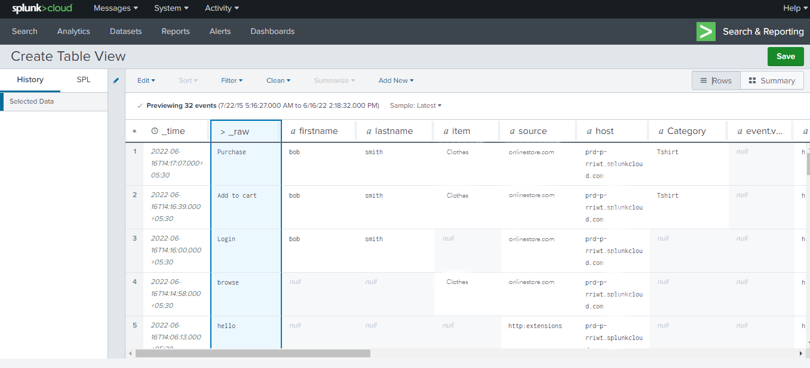

# Overzicht van splitsingsextensie

[&#x200B; Splunk &#x200B;](https://www.splunk.com) is een observiteitsplatform dat onderzoek, analyse, en visualisatie voor actionable inzichten op uw gegevens verstrekt. De Splunk [&#x200B; gebeurtenis die &#x200B;](../../../ui/event-forwarding/overview.md) uitbreidingshefboomwerkingen [&#x200B; de Inzameling van de Gebeurtenis van HTTP van de Splunk &#x200B;](https://docs.splunk.com/Documentation/Splunk/8.2.5/Data/HECRESTendpoints) door:sturen gebeurtenissen van Adobe Experience Platform Edge Network naar de [&#x200B; Verzameling van de Gebeurtenis van HTTP van de Splunk &#x200B;](https://docs.splunk.com/Documentation/Splunk/8.2.5/Data/UsetheHTTPEventCollector).

Splunk gebruikt dragertokens als authentificatiemechanisme om met de Verzameling API van de Gebeurtenis van de Splunk te communiceren.

## Gebruiksscenario’s {#use-cases}

Marketing teams kunnen de extensie voor de volgende gebruiksgevallen gebruiken:

| Gebruiksscenario | Beschrijving |
| --- | --- |
| Analyse van klantgedrag | Organisaties kunnen gegevens over klantinteractiegebeurtenissen vastleggen vanaf hun website en relevante gebeurtenissen doorsturen naar Splunk. Marketing- en analyseteams kunnen vervolgens binnen het Splunk-platform een analyse uitvoeren om inzicht te krijgen in de interactie en het gedrag van belangrijke gebruikers. Het platform Splunk kan worden gebruikt om grafieken, dashboards, of andere visualisaties te produceren om bedrijfsbelanghebbenden te informeren. |
| Schaalbaar zoeken op grote gegevenssets | Organisaties kunnen transactie- of gespreksinvoer vastleggen als gebeurtenisgegevens van de website en gebeurtenissen doorsturen naar Splunk. De teams van Analytics kunnen dan hefboomwerking Splunk&#39;s scalable indexatievermogen om grote datasets te filtreren en te verwerken om het even welke bedrijfsinzichten af te leiden en geïnformeerde besluiten te nemen. |

{style="table-layout:auto"}

## Vereisten {#prerequisites}

U moet een Splunk-account hebben om deze extensie te kunnen gebruiken. U kunt voor een rekening van de Splunk op de [&#x200B; Splunk homepage &#x200B;](https://www.splunk.com/page/sign_up) registreren.

>[!NOTE]
>
> De uitbreiding Splunk steunt zowel de Instanties van de Cloud van de Splunk als van de Onderneming van Splunk. Deze gids documenteert een implementatie gebruikend [&#x200B; de Wolk van de Splunk &#x200B;](https://www.splunk.com/en_us/products/splunk-cloud-platform.html) als verwijzing. Het configuratieproces voor [&#x200B; SplunkOnderneming &#x200B;](https://www.splunk.com/en_us/products/splunk-enterprise.html) is gelijkaardig, maar vereist specifieke begeleiding van uw Splunkbeheerder van de Onderneming.

U moet ook de volgende technische waarden hebben om de extensie te configureren:

* Een [&#x200B; teken van de Collector van de Gebeurtenis &#x200B;](https://docs.splunk.com/Documentation/Splunk/8.2.5/Data/UsetheHTTPEventCollector#Create_an_Event_Collector_token_on_Splunk_Cloud_Platform). Tokens hebben doorgaans de volgende UUIDv4-indeling: `12345678-1234-1234-1234-1234567890AB`.
* Het adres en de haven van de de platforminstantie van Splunk voor uw organisatie. Het adres en de poort van een platforminstantie hebben doorgaans de volgende indeling: `mysplunkserver.example.com:443`.

  >[!IMPORTANT]
  >
  > Splunk-eindpunten waarnaar wordt verwezen in het doorsturen van gebeurtenissen, mogen alleen poort `443` gebruiken. Niet-standaard havens worden momenteel niet gesteund in gebeurtenis die implementaties door:sturen.

## De extensie Splunk installeren {#install}

Om de uitbreiding van de Collector van de Gebeurtenis van de Splunk in UI te installeren, navigeer aan **Gebeurtenis door:sturen** en selecteer een bezit om de uitbreiding aan toe te voegen, of een nieuw bezit in plaats daarvan tot stand te brengen.

Zodra u hebt geselecteerd of het gewenste bezit gecreeerd, navigeer aan **Uitbreidingen** > **Catalogus**. Zoek naar &quot;[!DNL Splunk]&quot;, en selecteer dan **[!DNL Install]** op de Splunk Uitbreiding.

## De extensie Splunk configureren {#configure_extension}

>[!IMPORTANT]
>
>Afhankelijk van uw implementatiebehoeften, kunt u een schema, gegevenselementen, en een dataset tot stand moeten brengen alvorens de uitbreiding te vormen. Controleer alle configuratiestappen voordat u begint om te bepalen welke entiteiten u moet instellen voor uw geval van gebruik.

Selecteer **Uitbreidingen** in de linkernavigatie. Onder **Geïnstalleerde**, uitgezochte **vormt** op de uitbreiding van de Splunk.

Voer bij **[!UICONTROL HTTP Event Collector URL]** het adres en de poort van de instantie van het platform Splunk in. Voer onder **[!UICONTROL Access Token]** uw [!DNL Event Collector Token] -waarde in. Selecteer **[!UICONTROL Save]** als u klaar bent.

 worden gevuld

## Vorm een gebeurtenis door:sturen regel {#config_rule}

Begin creërend een nieuwe gebeurtenis door:sturen regel [&#x200B; regel &#x200B;](../../../ui/managing-resources/rules.md) en vorm zijn voorwaarden zoals gewenst. Wanneer u de handelingen voor de regel selecteert, selecteert u de extensie [!UICONTROL Splunk] en vervolgens het actietype [!UICONTROL Create Event] . De extra controles lijken om de Gebeurtenis van de Splunk verder te vormen.

De volgende stap bestaat uit het toewijzen van de Splunk-gebeurteniseigenschappen aan gegevenselementen die u eerder hebt gemaakt. De ondersteunde optionele toewijzingen op basis van de invoergebeurtenisgegevens die kunnen worden ingesteld, worden hieronder weergegeven. Verwijs naar de [&#x200B; documentatie van het Splunk &#x200B;](https://docs.splunk.com/Documentation/Splunk/8.2.5/Data/FormateventsforHTTPEventCollector#Event_metadata) voor verdere details.

| Veldnaam | Beschrijving |
| --- | --- |
| [!UICONTROL Event]  **(VEREIST)** | Geef aan hoe u de gebeurtenisgegevens wilt opgeven. Gebeurtenisgegevens kunnen worden toegewezen aan de `event` -toets in het JSON-object in de HTTP-aanvraag, maar dit kan ook onbewerkte tekst zijn. De `event` -toets bevindt zich op hetzelfde niveau in het JSON-gebeurtenispakket als de metagegevenstoetsen. Binnen de accolades van de `event` -toets kunnen de gegevens elke gewenste vorm hebben (zoals een tekenreeks, een getal, een ander JSON-object, enzovoort). |
| [!UICONTROL Host] | De hostnaam van de client waarvan u gegevens verzendt. |
| [!UICONTROL Source Type] | Het brontype dat aan de gebeurtenisgegevens moet worden toegewezen. |
| [!UICONTROL Source] | De bronwaarde die aan de gebeurtenisgegevens moet worden toegewezen. Als u bijvoorbeeld gegevens verzendt vanuit een toepassing die u ontwikkelt, stelt u deze sleutel in op de naam van de app. |
| [!UICONTROL Index] | De naam van de index van de gebeurtenisgegevens. De index die u hier opgeeft, moet zich binnen de lijst met toegestane indexen bevinden als voor het token de parameter indexes is ingesteld. |
| [!UICONTROL Time] | De gebeurtenistijd. De standaardtijdnotatie is UNIX-tijd (in de notatie `<sec>.<ms>` ) en is afhankelijk van uw lokale tijdzone. Bijvoorbeeld, `1433188255.500` wijst op 1433188255 seconden en 500 milliseconden na epoche, of Maandag, 1 Juni, 2015, bij 7 :50: 55 PM GMT. |
| [!UICONTROL Fields] | Geef een onbewerkt JSON-object of een set sleutelwaardeparen op die expliciete aangepaste velden bevatten die tijdens de indextijd moeten worden gedefinieerd.  De sleutel `fields` is niet van toepassing op onbewerkte gegevens.   Verzoeken die het `fields` bezit bevatten moeten naar het `/collector/event` eindpunt worden verzonden, anders zullen zij niet worden geïndexeerd. Voor meer informatie, zie de documentatie van het Splunk over [&#x200B; geïndexeerde gebiedsextracties &#x200B;](https://docs.splunk.com/Documentation/Splunk/8.2.5/Data/IFXandHEC). |

### Gegevens valideren in Splunk {#validate}

Nadat het creëren van en het uitvoeren van de gebeurtenis door:sturen regel, bevestig of de gebeurtenis die naar Splunk API wordt verzonden zoals verwacht in Splunk UI wordt getoond. Als de gebeurtenisinzameling en de integratie van Experience Platform succesvol waren, zult u gebeurtenissen binnen de console van de Splunk als zo zien:

## Volgende stappen

Dit document behandelde om de Splunk gebeurtenis te installeren en te vormen die uitbreiding door:sturen in UI. Raadpleeg de officiële documentatie voor meer informatie over het verzamelen van gebeurtenisgegevens in Splunk:

* [&#x200B; opstelling en de Collector van de Gebeurtenis van gebruiksHTTP in het Web van de Splunk &#x200B;](https://docs.splunk.com/Documentation/Splunk/8.2.5/Data/UsetheHTTPEventCollector)
* [&#x200B; de authentificatie van de opstelling met tokens &#x200B;](https://docs.splunk.com/Documentation/Splunk/8.2.5/Security/Setupauthenticationwithtokens#Prerequisites_for_activating_tokens)
* [&#x200B; lost de Collector van de Gebeurtenis van HTTP &#x200B;](https://docs.splunk.com/Documentation/Splunk/8.2.5/Data/TroubleshootHTTPEventCollector) problemen op (maakt ook een lijst van een overzicht van [&#x200B; mogelijke foutencodes &#x200B;](https://docs.splunk.com/Documentation/Splunk/8.2.5/Data/TroubleshootHTTPEventCollector#Possible_error_codes))
