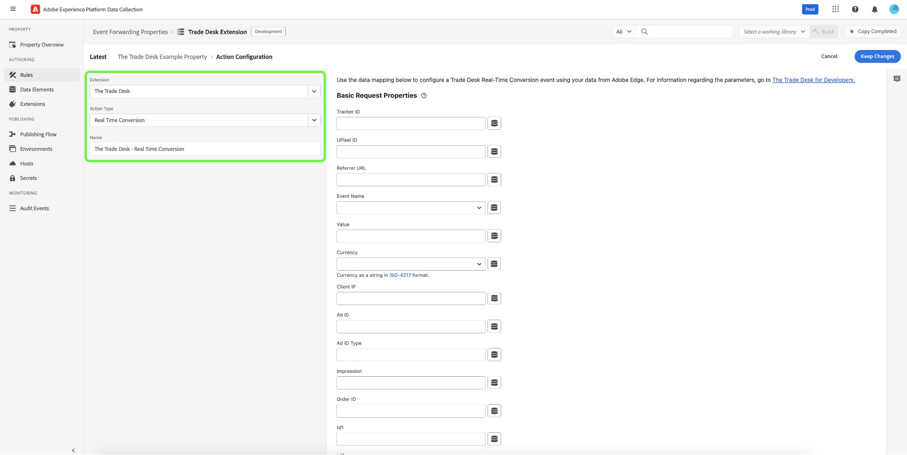

# [!DNL The Trade Desk Real-Time Conversions API] overzicht van extensies

U kunt de [[!DNL The Trade Desk Real-Time Conversions API] gebruiken ](https://partner.thetradedesk.com/v3/portal/data/doc/DataConversionEventsApi) uitbreiding om gegevens van de Edge Network van Adobe Experience Platform naar [!DNL The Trade Desk] te verzenden door de mogelijkheden van API in uw [ gebeurtenis te gebruiken door:sturen ](../../../ui/event-forwarding/overview.md) regels.

Gebruikend [!DNL The Trade Desk Real-Time Conversions API] uitbreiding, kunt u hefboomwerking de mogelijkheden van API in uw [ gebeurtenis door:sturen ](../../../ui/event-forwarding/overview.md) regels om gegevens naar [!DNL The Trade Desk] van de Edge Network van Adobe Experience Platform te verzenden.

Lees dit document om te leren hoe te om de uitbreiding te installeren en zijn mogelijkheden in een gebeurtenis te gebruiken die [ regel ](../../../ui/managing-resources/rules.md) door:sturen.

>[!NOTE]
>
>Deze extensie- en documentatiepagina wordt bijgehouden door het team van [!DNL The Trade Desk] . Neem voor alle vragen of verzoeken om een update rechtstreeks contact op met hen.

## Vereisten {#prerequisites}

U moet een relevante Advertiser identiteitskaart, identiteitskaart van UPixel, en identiteitskaart van de Tracker van binnen uw [!DNL The Trade Desk] rekening hebben worden vereist om [[!DNL The Trade Desk Real-Time Conversions API] te vormen ](https://partner.thetradedesk.com/v3/portal/data/doc/DataConversionEventsApi).

>[!INFO]
>
>Als je een handelaar bent, moet je ook je bedrijfs-id opvragen.

## De API voor [!DNL The Trade Desk] Real-Time Conversies installeren en configureren {#install}

Om de uitbreiding te installeren, [ creeer een gebeurtenis door:sturen bezit ](../../../ui/event-forwarding/overview.md#properties) of selecteer een bestaand bezit in plaats daarvan uit te geven.

Selecteer **[!UICONTROL Extensions]** in de linkernavigatie. Selecteer op het tabblad **[!UICONTROL Catalog]** de **[!UICONTROL The Trade Desk]** Real-Time Conversions API-kaart en selecteer vervolgens **[!UICONTROL Install]** .

![ de uitbreidingscatalogus die [!DNL The Trade Desk] uitbreidingskaart tonen die installeert benadrukt.](../../../images/extensions/server/tradedesk/install-extension.png)

Voer in het volgende scherm de [!UICONTROL Advertiser ID] en eventueel een [!UICONTROL Merchant ID] in. U kunt de id&#39;s rechtstreeks in deze invoer plakken of u kunt een gegevenselement gebruiken. Deze worden gebruikt als standaardwaarden bij het aanroepen van een gebeurtenis naar de [!DNL The Trade Desk] Real-Time Conversions API. Selecteer **[!UICONTROL Save]** wanneer u klaar bent.

Leren hoe u gegevenselementen kunt tot stand brengen en hen ter beschikking stellen van uitbreidingen in uw markeringsbezit, [ volg gegevenselementen ](https://experienceleague.adobe.com/en/docs/platform-learn/data-collection/tags/create-data-elements) leerprogramma creëren.

![ de [!DNL The Trade Desk] pagina van de uitbreidingsconfiguratie met [!UICONTROL Advertiser ID] en [!UICONTROL Merchant ID] benadrukte gebieden.](../../../images/extensions/server/tradedesk/configure-extension.png)

De uitbreiding is geïnstalleerd en u kunt zijn mogelijkheden in uw gebeurtenis nu gebruiken die regels door:sturen.

## Vorm een gebeurtenis door:sturen regel {#rule}

Nadat u de extensie hebt geïnstalleerd en geconfigureerd, kunt u regels voor het doorsturen van gebeurtenissen maken die bepalen hoe en wanneer u gebeurtenissen wilt verzenden naar [!DNL The Trade Desk] .

U zou moeten nadenken vormend verscheidene regels om alle toegelaten [ verzoekeigenschappen ](https://partner.thetradedesk.com/v3/portal/data/doc/DataConversionEventsApi#properties) via [!DNL The Trade Desk] en [!DNL The Trade Desk] Real-Time Conversies API te verzenden.

>[!NOTE]
>
>Gebeurtenissen moeten in real-time of zo dicht mogelijk bij real-time worden verzonden.

Creeer een nieuwe gebeurtenis door:sturen [ regel ](../../../ui/managing-resources/rules.md) in uw gebeurtenis door:sturen bezit. Voeg onder **[!UICONTROL Actions]** een nieuwe handeling toe en stel de extensie in op **[!UICONTROL The Trade Desk]** . Selecteer vervolgens **[!UICONTROL Real Time Conversion]** voor **[!UICONTROL Action Type]** .

Na de selectie lijken extra besturingselementen aanwezig te zijn om de gebeurtenisgegevens verder te configureren waarnaar [!DNL The Trade Desk] wordt verzonden. Selecteer **[!UICONTROL Keep Changes]** om de regel op te slaan.

De configuratieopties worden verdeeld in drie hoofdsecties, zoals hieronder beschreven:

**[!UICONTROL Basic Request Properties]**

| Invoer | Beschrijving |
| --- | --- |
| Beheer-id | De platform-id van de gebeurtenissencontrole. |
| UPixel ID | De universele pixel-id voor de gebeurtenis. |
| Referrer-URL | De URL van de website vanaf waar de gebeurtenis heeft plaatsgevonden, indien aanwezig. |
| Gebeurtenisnaam | Het type van gebeurtenis die door het partnerplatform wordt bepaald. |
| Waarde | De waarde voor het bijhouden van de omzet in een decimale tekenreeks (bijvoorbeeld &#39;19.98&#39;). |
| Valuta | Valutacode in ISO-indeling. |
| Client IP | Het client IPv4- of IPv6-adres. |
| ID advertentie | De unieke advertentie-id voor de gebeurtenis. |
| Type advertentie-id | Het type advertentie-id, gespecificeerd in de AD-ID-eigenschap: TDID, IDFA, AID, DAID, NAID, IDL, EUID of UID2. |
| Impressie | Een tekenreeks van 36 tekens (inclusief streepjes) die fungeert als unieke id voor de indruk waaraan de gebeurtenis wordt toegewezen. |
| Order-id | De bijbehorende orde-id van de gebeurtenis. |
| td1-td10 | Tien opeenvolgend genummerde aangepaste dynamische eigenschappen die kunnen worden gebruikt om extra omzettingsmeta-gegevens te verstrekken. |

{style="table-layout:auto"}

![ de [!DNL Basic Request Properties] sectie die voorbeeldgegevensinput in de gebieden toont.](../../../images/extensions/server/tradedesk/configure-extension-basic-request-properties.png)

Verwijs naar de [!DNL The Trade Desk] ontwikkelaarsdocumentatie voor meer informatie over de [ verzoekeigenschappen ](https://partner.thetradedesk.com/v3/portal/data/doc/DataConversionEventsApi#properties) die door [!DNL The Trade Desk] Real-Time Conversies API worden goedgekeurd.

**[!UICONTROL Object Request Parameters]**

Een JSON-object dat meer informatie bevat. U kunt kiezen of u een beperkte set toetsinvoer wilt gebruiken of onbewerkte JSON wilt leveren. Bovendien, kunt u dynamische gegevens van een gegevenselement terugwinnen door de schijven () op het recht te selecteren.

![ de [!DNL Object Request Parameters] sectie die beschikbare gebieden tonen.](../../../images/extensions/server/tradedesk/configure-object-request-params.png)

Verwijs naar de ](https://partner.thetradedesk.com/v3/portal/data/doc/DataConversionEventsApi#properties-items) documentatie van de Gebeurtenis van de Conversies in real time [ voor meer informatie over [!UICONTROL Object Request Parameters] en hun eigenschappen.

**[!UICONTROL Configuration Overrides]**

>[!NOTE]
>
>Met de velden [!UICONTROL Configuration Overrides] kunt u op elke regel een andere instelling voor [!DNL Advertiser ID] en/of [!DNL Merchant ID] opgeven.

| Invoer | Beschrijving |
| --- | --- |
| Adverteerder-id | Unieke id voor de adverteerder waaraan deze gebeurtenis is gekoppeld. U kunt een andere Advertiser-id opgeven om de id te overschrijven die u in de extensieconfiguratie hebt opgegeven. |
| Merchant ID | De unieke id die elke handelaar gedurende de instapprocedure door [!DNL The Trade Desk] krijgt. Een verschillende Merchant ID kan worden verstrekt om identiteitskaart met voeten te treden u in de uitbreidingsconfiguratie verstrekte. |

![ de [!DNL Configuration Overrides] sectie die beschikbare gebieden tonen.](../../../images/extensions/server/tradedesk/configure-overrides.png)

Selecteer **[!UICONTROL Save to Library]** als u tevreden bent met de regel. Tot slot publiceer een nieuwe gebeurtenis door:sturen [ bouwt ](../../../ui/publishing/builds.md) om de veranderingen toe te laten die aan de bibliotheek worden aangebracht.

## Volgende stappen

In deze handleiding wordt beschreven hoe u gebeurtenisgegevens aan de serverzijde naar [!DNL The Trade Desk] kunt verzenden met de API-extensie [!DNL The Trade Desk] Real-Time conversies. Van hier, wordt het geadviseerd om uw integratie uit te breiden door duidelijke regels te creëren die specifieke omzettingsgebeurtenissen verzenden zoals toepasselijk per campagne. Voor meer informatie over gebeurtenis die mogelijkheden in [!DNL Adobe Experience Platform] door:sturen, lees de [ gebeurtenis die overzicht ](../../../ui/event-forwarding/overview.md) door:sturen.

Zie de [!DNL The Trade Desk] documentatie over [ beste praktijken voor  [!DNL The Trade Desk]  in real time Conversies API ](https://www.facebook.com/business/help/308855623839366?id=818859032317965) voor meer begeleiding op hoe te om uw integratie effectief uit te voeren.

Voor details op hoe te om uw implementatie te zuiveren gebruikend het Experience Platform Debugger en het Door:sturen van de Gebeurtenis hulpmiddel van de Controle, lees het [ overzicht van het Adobe Experience Platform Debugger ](../../../../debugger/home.md) en [ de activiteiten van de Monitor in gebeurtenis door:sturen ](../../../ui/event-forwarding/monitoring.md).
