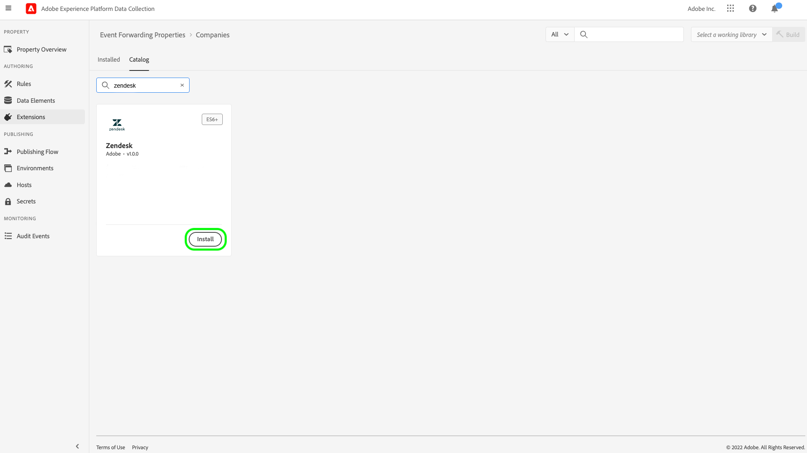

# [!DNL Zendesk] Overzicht van de API-extensie voor gebeurtenissen

[ Zendesk ](https://www.zendesk.com) is een oplossing van de klantendienst en verkoophulpmiddel. De gebeurtenis die van Zendesk  uitbreidingshoofdhefboomwerkingen [[!DNL Zendesk Events API] ](https://developer.zendesk.com/documentation/ticketing/events/about-the-events-api/) door:sturen gebeurtenissen van de Edge Network van Adobe Experience Platform naar Zendesk voor verdere verwerking. U kunt de uitbreiding gebruiken om de interactie van het klantenprofiel voor gebruik in stroomafwaartse analyse en actie te verzamelen.

In dit document wordt beschreven hoe u de extensie in de gebruikersinterface kunt installeren en configureren.

## Vereisten

U moet een Zendesk-account hebben om deze extensie te kunnen gebruiken. U kunt voor een rekening van Zendesk op de [ website van Zendesk ](https://www.zendesk.com/register/) registreren.

U moet ook de volgende gegevens verzamelen voor uw Zendesk-configuratie:

| Type toets | Beschrijving | Voorbeeld |
| --- | --- | --- |
| Subdomein | Tijdens het registratieproces, wordt een uniek **subdomain** gecreeerd specifiek voor de rekening. Verwijs naar de [ documentatie van Zendesk ](https://developer.zendesk.com/documentation/ticketing/working-with-oauth/creating-and-using-oauth-tokens-with-the-api/) voor meer informatie. | `xxxxx.zendesk.com` (waarbij `xxxxx` de waarde is die is opgegeven tijdens het maken van de account) |
| API-token | Zendesk gebruikt tokens aan toonder als verificatiemechanisme om te communiceren met de Zendesk-API. Nadat u zich hebt aangemeld bij de Zendesk-portal, genereert u een API-token. Verwijs naar de [ documentatie van Zendesk ](https://support.zendesk.com/hc/en-us/articles/4408889192858-Generating-a-new-API-token) voor meer informatie. | `cwWyOtHAv12w4dhpiulfe9BdZFTz3OKaTSzn2QvV` |

{style="table-layout:auto"}

Tot slot moet u een gebeurtenis tot stand brengen die geheim voor het API teken door:sturen. Stel het geheime type in op **[!UICONTROL Token]** en stel de waarde in op het API-token dat u hebt opgehaald bij uw Zendesk-configuratie. Verwijs naar de documentatie over [ geheimen in gebeurtenis door:sturen ](../../../ui/event-forwarding/secrets.md) voor meer details bij het vormen van geheimen.

## De extensie installeren {#install}

Om de uitbreiding van Zendesk in UI te installeren, navigeer aan **Gebeurtenis door:sturen** en selecteer een bezit om de uitbreiding aan toe te voegen, of een nieuw bezit in plaats daarvan tot stand te brengen.

Zodra u hebt geselecteerd of het gewenste bezit gecreeerd, navigeer aan **Uitbreidingen** > **Catalogus**. Zoek naar &quot;[!DNL Zendesk]&quot;, en selecteer dan **[!DNL Install]** op de Uitbreiding van Zendesk.

## De extensie configureren {#configure}

>[!IMPORTANT]
>
>Afhankelijk van uw implementatiebehoeften, kunt u een schema, gegevenselementen, en een dataset tot stand moeten brengen alvorens de uitbreiding te vormen. Controleer alle configuratiestappen voordat u begint om te bepalen welke entiteiten u moet instellen voor uw geval van gebruik.

Selecteer **Uitbreidingen** in de linkernavigatie. Onder **Geïnstalleerde**, uitgezochte **vormt** op de uitbreiding van Zendesk.

Voer onder **[!UICONTROL Zendesk Domain]** de waarde in voor uw Zendesk-subdomein. Selecteer onder **[!UICONTROL Zendesk Token]** het geheim dat u eerder hebt gemaakt en dat de API-token bevat.

 worden gevuld

## Vorm een gebeurtenis door:sturen regel

Begin creërend een nieuwe gebeurtenis door:sturen regel [ regel ](../../../ui/managing-resources/rules.md) en vorm zijn voorwaarden zoals gewenst. Wanneer u de handelingen voor de regel selecteert, selecteert u de extensie [!UICONTROL Zendesk] en vervolgens het actietype [!UICONTROL Create Event] .

Wanneer u de actieconfiguratie instelt, wordt u gevraagd gegevenselementen toe te wijzen aan de verschillende eigenschappen die naar Zendesk worden verzonden.

Deze gegevenselementen moeten worden toegewezen zoals hieronder wordt vermeld.

### `event` toetsen

`event` is een JSON-object dat de gebeurtenis vertegenwoordigt die door de gebruiker wordt geactiveerd. Verwijs naar het document van Zendesk op de [ anatomie van een gebeurtenis ](https://developer.zendesk.com/documentation/ticketing/events/anatomy-of-an-event/) voor details over de eigenschappen die door het `event` voorwerp worden gevangen.

Er kan binnen het `event` -object naar de volgende toetsen worden verwezen wanneer deze worden toegewezen aan gegevenselementen:

| `event` -toets | Type | Platformpad | Beschrijving | Verplicht | Limieten |
| --- | --- | --- | --- | --- | --- |
| `source` | String | `arc.event.xdm._extconndev.event_source` | De toepassing die de gebeurtenis heeft verzonden. | Ja | Gebruik `Zendesk` niet als een waarde omdat het een beschermde bronnaam is voor Zendesk-standaardgebeurtenissen. Pogingen om het te gebruiken zullen in een fout resulteren.  de lengte van de Waarde moet 40 karakters niet overschrijden. |
| `type` | String | `arc.event.xdm._extconndev.event_type` | Een naam voor het gebeurtenistype. U kunt dit veld gebruiken om verschillende soorten gebeurtenissen voor een bepaalde bron aan te geven. U kunt bijvoorbeeld een set gebeurtenissen maken voor gebruikersaanmeldingen en een andere set voor winkelwagentjes. | Ja | De waarde mag niet langer zijn dan 40 tekens. |
| `description` | String | `arc.event.xdm._extconndev.description` | Een beschrijving van de gebeurtenis. | Nee | (N.v.t.) |
| `created_at` | String | `arc.event.xdm.timestamp` | Een ISO-8601-tijdstempel die de tijd weergeeft waarop de gebeurtenis is gemaakt. | Nee | (N.v.t.) |
| `properties` | Object | `arc.event.xdm._extconndev.EventProperties` | Een aangepast JSON-object met informatie over de gebeurtenis. | Ja | (N.v.t.) |

{style="table-layout:auto"}

>[!NOTE]
>
>Verwijs naar de [[!DNL Zendesk Events API]  documentatie ](https://developer.zendesk.com/documentation/ticketing/events/about-the-events-api/) voor extra begeleiding op gebeurteniseigenschappen.

### `profile` toetsen

`profile` is een JSON-object dat de gebruiker vertegenwoordigt die de gebeurtenis heeft geactiveerd. Verwijs naar het document van Zendesk op de [ anatomie van een profiel ](https://developer.zendesk.com/documentation/ticketing/profiles/anatomy-of-a-profile/) voor details over de eigenschappen die door het `profile` voorwerp worden gevangen.

Er kan binnen het `profile` -object naar de volgende toetsen worden verwezen wanneer deze worden toegewezen aan gegevenselementen:

| `profile` -toets | Type | Platformpad | Beschrijving | Verplicht | Limieten |
| --- | --- | --- | --- | --- | --- |
| `source` | String | `arc.event.xdm._extconndev.profile_source` | Het product dat of de service die aan het profiel is gekoppeld, zoals `Support` , `CompanyName` of `Chat` . | Ja | (N.v.t.) |
| `type` | String | `arc.event.xdm._extconndev.profile_type` | Een naam voor het profieltype. U kunt dit veld gebruiken om verschillende soorten profielen voor een bepaalde bron te maken. U kunt bijvoorbeeld een set bedrijfsprofielen maken voor klanten en een andere voor werknemers. | Ja | De lengte van het profieltype mag niet langer zijn dan 40 tekens. |
| `name` | String | `arc.event.xdm._extconndev.name` | De naam van de persoon uit het profiel | Nee | (N.v.t.) |
| `user_id` | String | `arc.event.xdm._extconndev.user_id` | De gebruikersnaam van de persoon in Zendesk. | Nee | (N.v.t.) |
| `identifiers` | Array | `arc.event.xdm._extconndev.identifiers` | Een array met ten minste één id. Elke id bestaat uit een type en een waarde. | Ja | Verwijs naar de [ documentatie van Zendesk ](https://developer.zendesk.com/api-reference/ticketing/users/profiles_api/profiles_api/#identifiers-array) voor meer informatie over de `identifiers` serie. Alle velden en waarden moeten uniek zijn. |
| `attributes` | Object | `arc.event.xdm._extconndev.attrbutes` | Een object dat door de gebruiker gedefinieerde eigenschappen over de persoon bevat. | Nee | Verwijs naar de [ documentatie van Zendesk ](https://developer.zendesk.com/documentation/ticketing/profiles/anatomy-of-a-profile/#attributes) voor meer informatie over profielattributen. |

{style="table-layout:auto"}

## Gegevens valideren in Zendesk {#validate}

Als de gebeurtenisverzameling en Adobe Experience Platform-integratie succesvol zijn, worden de gebeurtenissen in de Zendesk-console weergegeven zoals hieronder wordt weergegeven. Dit wijst op een succesvolle integratie.

Profielen:

Gebeurtenissen:

## Aanvraaglimieten {#limits}

Op basis van het accounttype kan Zendesk [!DNL Events API] het volgende aantal aanvragen per minuut afhandelen:

| [!DNL Account Type] | Verzoeken per minuut |
| --- | --- |
| [!DNL Team] | 250 |
| [!DNL Growth] | 250 |
| [!DNL Professional] | 500 |
| [!DNL Enterprise] | 750 |
| [!DNL Enterprise Plus] | 1000 |

{style="table-layout:auto"}

Verwijs naar de [ documentatie van Zendesk ](https://developer.zendesk.com/api-reference/ticketing/account-configuration/usage_limits/#:~:text=API%20requests%20made%20by%20Zendesk%20apps%20are%20subject,sources%20for%20the%20account%2C%20including%20internal%20product%20requests.) voor meer informatie over deze grenzen.

## Fouten en problemen oplossen {#errors-and-troubleshooting}

Tijdens het gebruik of het configureren van de extensie kunnen de onderstaande fouten worden geretourneerd door de Zendesk Events API:

| Foutcode | Beschrijving | Resolutie | Voorbeeld |
|---|---|---|---|
| 400 | **Ongeldige profiellengte:** Deze fout komt voor wanneer de lengte van een profielattribuut meer dan 40 karakters bevat. | Beperk de lengte van de profielkenmerkgegevens tot maximaal 40 tekens. | `{"error": [{"code":"InvalidProfileTypeLength","title": "Profile type length > 40 chars"}]}` |
| 401 | **niet gevonden Route:** Deze fout komt voor wanneer een ongeldig domein is geleverd. | Controleer of een geldig domein in de volgende indeling wordt opgegeven: `{subdomain}.zendesk.com` | `{"error": [{"description": "No route found for host {subdomain}.zendesk.com","title": "RouteNotFound"}]}` |
| 401 | **Ongeldige of Ontbrekende Authentificatie:** Deze fout komt voor wanneer de toegang tot het teken ongeldig is, ontbreekt, of verlopen. | Controleer of het toegangstoken geldig is en niet verlopen is. | `{"error": [{"code":"MissingOrInvalidAuthentication","title": "Invalid or Missing Authentication"}]}` |
| 403 | **Onvoldoende toestemmingen:** Deze fout komt voor wanneer de voldoende toestemmingen om tot het middel toegang te hebben niet worden verstrekt. | Controleer of de vereiste machtigingen zijn opgegeven. | `{"error": [{"code":"PermissionDenied","title": "Insufficient permisssions to perform operation"}]}` |
| 429 | **Te veel Verzoeken:** Deze fout komt voor wanneer de grens van het eindpuntvoorwerp het verslag is overschreden. | Verwijs naar de sectie hierboven op [ verzoekgrenzen ](#limits) voor details op per-grensdrempels. | `{"error": [{"code":"TooManyRequests","title": "Too Many Requests"}]}` |

{style="table-layout:auto"}

## Volgende stappen

In dit document wordt beschreven hoe u de Zendesk-gebeurtenis kunt installeren en configureren voor het doorsturen van de extensie in de gebruikersinterface. Raadpleeg de officiële documentatie voor meer informatie over het verzamelen van gebeurtenisgegevens in Zendesk:

* [ Begonnen het worden met Gebeurtenissen ](https://developer.zendesk.com/documentation/ticketing/events/getting-started-with-events/)
* [ Zendesk Gebeurtenissen API ](https://developer.zendesk.com/api-reference/ticketing/users/events-api/events-api/)
* [ Ongeveer de Gebeurtenissen API ](https://developer.zendesk.com/documentation/ticketing/events/about-the-events-api/)
* [ Anatomie van een gebeurtenis ](https://developer.zendesk.com/documentation/ticketing/events/anatomy-of-an-event/)
* [ Zendesk Profiles API ](https://developer.zendesk.com/api-reference/ticketing/users/events-api/events-api/#profile-object)
* [ Ongeveer API van Profielen ](https://developer.zendesk.com/documentation/ticketing/profiles/about-the-profiles-api/)
* [ Anatomie van een profiel ](https://developer.zendesk.com/documentation/ticketing/profiles/anatomy-of-a-profile/)
