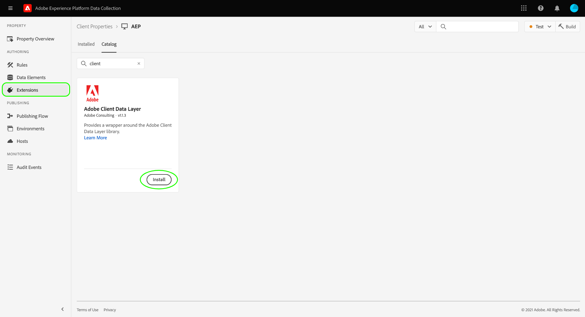

# Adobe Client Data Layer-extensie

Deze documentatie verstrekt voorbeelden en beste praktijken op hoe te om de uitbreiding van de Laag van Gegevens van de Cliënt van Adobe te gebruiken.

<!-- (Missing document?)
If you would like to have more details on development consideration, [please reach this page](./dev.md). -->

## Installatie

Als u de extensie wilt installeren, navigeert u naar de extensiecatalogus in de gebruikersinterface voor gegevensverzameling en selecteert u Gegevenslaag Adobe-client.



<!-- (GitHub link?)
There is also the possibility to fork this project. You can download this github project, realize the change that you deem required for your specific use-case and re-upload it on your Organization as a private extension.
This installation will not be supported on our end.<br>
>[!NOTE]
>
> _Consider renaming the extension name in the extension.json file_ -->

## Extensieweergave

Standaard maakt het ACDL-script een nieuwe gegevenslaag met de naam van de variabele `adobeDataLayer`. In de extensieweergave kunt u deze naam desgewenst wijzigen. De naam die u hebt ingesteld, wordt geïnstantieerd wanneer tags worden geladen.

>[!NOTE]
>
>Wanneer u de objectnaam wijzigt, wordt het origineel `adobeDataLayer` object wordt nog steeds geïnstantieerd en vervolgens gedupliceerd naar de nieuwe variabelenaam die u hebt geselecteerd.

## Gebeurtenissen

De uitbreiding biedt u de mogelijkheid om naar gebeurtenissen op de Laag van Gegevens te luisteren. De volgende gebeurtenissen zijn beschikbaar:

### Alle gegevenswijzigingen beluisteren

Als u deze optie selecteert, luistert uw gebeurtenislistener naar elke wijziging die in de gegevenslaag is aangebracht.

>[!IMPORTANT]
>
>Met gebeurtenissen voor pushing wijzigt u de gegevenslaag zelf niet.

De volgende voorbeeldpushgebeurtenissen worden door de listener bijgehouden:

* ` adobeDataLayer.push({"data":"something"})`
* ` adobeDataLayer.push({"event":"myevent","data":"something"})`

De volgende voorbeeldpushgebeurtenis wordt niet door de listener bijgehouden:

* ` adobeDataLayer.push({"event":"myevent"})`

### Alle gebeurtenissen beluisteren

Als u deze optie selecteert, luistert uw gebeurtenislistener naar elke gebeurtenis die naar de gegevenslaag wordt geduwd.

De volgende voorbeeldpushgebeurtenissen worden door de listener bijgehouden:

* ` adobeDataLayer.push({"event":"myevent"})`
* ` adobeDataLayer.push({"event":"myevent","data":"something"})`

De volgende voorbeeldpushgebeurtenis wordt niet door de listener bijgehouden:

* ` adobeDataLayer.push({"data":"something"}) `

### Luisteren naar specifieke gebeurtenis

Als u een gebeurtenis opgeeft, houdt de gebeurtenislistener alle gebeurtenissen bij die overeenkomen met een bepaalde tekenreeks.

Stel bijvoorbeeld `myEvent` wanneer u deze configuratie gebruikt, wordt in de listener alleen de volgende pushgebeurtenis bijgehouden:

* `adobeDataLayer.push({"event":"myEvent"})`

U kunt ook het bereik van de gebeurtenislistener wijzigen. De verschillende opties worden hieronder samengevat:

* `all`: Dit is de standaardoptie en activeert de regel telkens wanneer aan de hierboven geselecteerde voorwaarde in het verleden is voldaan of in de toekomst wordt geduwd. Dit is de veiligste optie als u een asynchrone implementatie gebruikt.
* `future`: Deze optie activeert de regel alleen wanneer nieuwe pushgebeurtenissen die overeenkomen met uw voorwaarde naar de gegevenslaag worden verzonden.
* `past`: Deze optie activeert de regel alleen voor oude pushgebeurtenissen die overeenkomen met uw voorwaarde. Nieuwe drukkers die overeenkomen met uw voorwaarde worden genegeerd en activeren de regel niet meer.

## Acties

In de volgende secties worden de acties beschreven die door de extensie worden ondersteund.

### Gegevenslaag opnieuw instellen

De extensie biedt u een manier om de lengte van de gegevenslaag opnieuw in te stellen. Hierdoor kunt u een beperkte grootte behouden voor een toepassing van één pagina (SPA).

Er bestaat momenteel echter geen mogelijkheid om de informatie die eerder tijdens de pushmethoden was ingesteld, volledig te verwijderen.

De **Berekende status opnieuw instellen en instellen** De actie kopieert de laatste gegevens verwerkte staat, leegt het voorwerp van de gegevenslaag, en duwt het laatste staat opnieuw.

### Naar gegevenslaag duwen

De extensie biedt u een handeling waarmee u JSON-inhoud naar de gegevenslaag zelf kunt duwen. Met deze handeling kunt u gegevenselementen rechtstreeks in de JSON gebruiken. Binnen de redacteur JSON, gegevenselementen zouden moeten worden van verwijzingen voorzien gebruikend percenten aantekening (bijvoorbeeld `%dataElementName%`).

```json
{
    "page": {
        "url": "%url%",
        "previous_url": "%previous_url%",
        "concatenated_values": "static string %dataElement%"
    }
}
```

## Gegevenselementen

In de onderstaande secties worden de unieke gegevenselementen beschreven die door de extensie worden geleverd.

### Status Berekend

Het gegevenselement van de Gegevens van de Laag Berekende Staat kan één van twee dingen, afhankelijk van terugkeren hoe u het vormt:

* De volledige staat van de Laag van Gegevens: Standaard wordt de volledige status Gegevenslaag berekend geretourneerd.
* Een specifiek pad: U kunt het pad opgeven dat u wilt retourneren in de gegevenslaag. Paden worden opgegeven met puntnotatie (bijvoorbeeld `data.foo`).

### Gegevenslaaggrootte

Dit gegevenselement keert de grootte van de Laag van Gegevens terug. De grootte van de gegevenslaag wordt weergegeven door het aantal elementen dat aan dit object is toegevoegd.

Op basis van de volgende lijst met push-gebeurtenissen retourneert dit gegevenselement het gehele getal `2`:

```js
adobeDataLayer.push({"event":"myEvent"})
adobeDataLayer.push({"data":{"foo":"bar"}})
```
