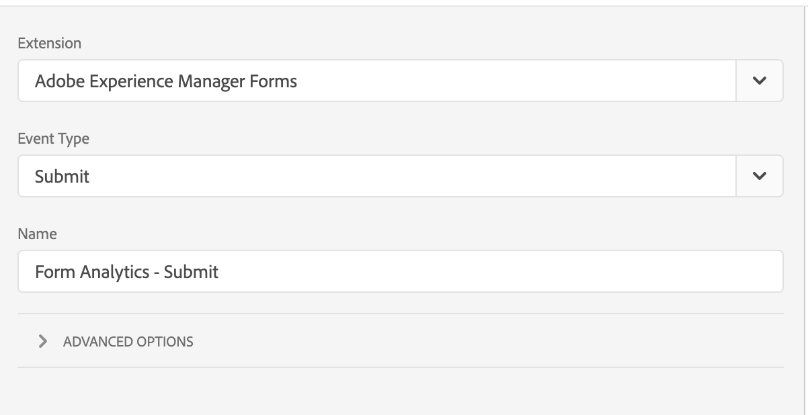

# Overzicht Adobe Experience Manager Forms-extensie

Dit document biedt een overzicht van de Adobe Experience Manager Forms-tagextensie in Adobe Experience Platform.

## Gebeurtenissen

De extensie biedt de volgende gebeurtenistypen:

1. **Renderen**: Triggers wanneer de gebruiker een formulier genereert (opent).
1. **Fout**: Wordt geactiveerd wanneer de gebruiker een validatiefout maakt op een formulier.
1. **Help**: Triggers wanneer de gebruiker op het Help-pictogram van een veld klikt.
1. **Verzenden**: Triggers voor verzenden van formulier.
1. **Veldbezoek**: Triggers wanneer een veld wordt bezocht.
1. **Verlaten**: De gebeurtenis wordt geactiveerd wanneer de gebruiker het tabblad sluit of naar een andere URL navigeert.
1. **Opslaan**: Triggers wanneer een formulier wordt opgeslagen naar een portal.

>[!IMPORTANT]
>
>De gebeurtenis Save is momenteel niet beschikbaar voor formulieren als cloudservice. Aangepaste gebeurtenissen die door de regeleditor in Adaptive Forms worden verzonden, kunnen worden vastgelegd met de kerngebeurtenis &#39;Aangepaste gebeurtenis vastleggen&#39;.

## Gegevenselementen

De extensie biedt verschillende gegevenselementen die kunnen worden gebruikt om eigenschappen in analytische aanroepen te verzenden.

## Aan de slag

Voer de onderstaande stappen uit om aan de slag te gaan met de extensie.

1. Installeer de Adobe Experience Manager Forms-extensie uit de extensiecatalogus. Na de installatie is geen verdere configuratie vereist.
2. Installeer en configureer de [Adobe Analytics-extensie](../analytics/overview.md#Configure-the-Adobe-Analytics-extension).

## Een regel maken

Een regel die de uitbreiding van Forms van de Experience Manager gebruikt zou als het volgende kijken:

Volg de onderstaande stappen om een vergelijkbare regel voor uw implementatie te maken.

### Een gebeurtenis toevoegen

1. Selecteer **Adobe Experience Manager Forms** in het vervolgkeuzemenu voor extensies.
2. Selecteer de gebeurtenis die moet worden vastgelegd.

### Een handeling toevoegen

1. Selecteer &quot;Adobe Analytics&quot; in het vervolgkeuzemenu voor extensies.
2. Selecteer &quot;variabele instellen&quot; in de vervolgkeuzelijst Handelingstype.
3. Kies in de configuratieweergave de eigenschappen en gebeurtenissen die u wilt verzenden.
4. Voeg een &quot;send baken&quot;actie toe om de analysevraag met gebeurtenissen en eigenschappen te verzenden die in stap 3 worden geplaatst
   
5. Voeg een actie &quot;clear variable&quot; toe.

