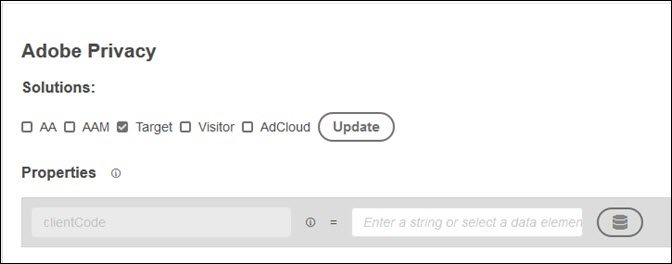

# Adobe Privacy-extensie - overzicht

>[!NOTE]
>
>Adobe Experience Platform Launch wordt omgedoopt tot een reeks technologieën voor gegevensverzameling in Experience Platform. Diverse terminologische wijzigingen zijn als gevolg hiervan in de productdocumentatie doorgevoerd. Raadpleeg het volgende [document](../../../term-updates.md) voor een geconsolideerde referentie van de terminologische wijzigingen.

De extensie Adobe Privacy biedt functionaliteit voor het verzamelen en verwijderen van gebruikers-id&#39;s die aan eindgebruikers zijn toegewezen door Adobe-oplossingen.

## Oplossingen configureren tijdens installatie

Wanneer u de extensie Adobe Privacy installeert in de Extension Catalog, wordt u gevraagd om de oplossingen te selecteren die u wilt bijwerken. Momenteel kunt u de volgende oplossingen bijwerken:

* Analyse (AA)
* Audience Manager (AAM)
* Target
* Bezoekerservice
* AdCloud
* Selecteer een of meer oplossingen en selecteer vervolgens Bijwerken.
* Wanneer u uw oplossingen hebt geselecteerd en gevormd, uitgezocht sparen. De extensie Adobe Privacy wordt toegevoegd aan de lijst met geïnstalleerde extensies.

   De opties voor elke oplossing worden hieronder beschreven.

### Analytics


Standaard moet u de rapportsuite opgeven door een tekenreeks in te voeren of een gegevenselement te selecteren.

Als u andere items wilt configureren, selecteert u **[!UICONTROL Choose an Item]**, selecteert u het item dat u wilt configureren, selecteert u **[!UICONTROL Add]** en voert u de gewenste parameter of een gegevenselement in.

### Audience Manager


Selecteer **[!UICONTROL Choose an Item]**, selecteer het punt u, dan selecteren **[!UICONTROL Add]** en ga de gevraagde parameter of een gegevenselement in. Momenteel kunt u alleen de `aamUUIDCookieName` configureren.

### Doel



Voer de doelclientcode in.

### Bezoekerservice


Voer uw IMS-organisatie-id in.

### AdCloud


Er zijn geen specifieke parameters om te configureren voor AdCloud.

## De extensie Adobe Privacy configureren

Nadat u de extensie hebt geïnstalleerd, kunt u deze uitschakelen of verwijderen. Selecteer **[!UICONTROL Configure]** op de kaart van de Privacy van de Adobe in uw geïnstalleerde uitbreidingen, dan selecteren of **[!UICONTROL Disable]** of **[!UICONTROL Uninstall]**.

## Acties

De volgende acties zijn beschikbaar wanneer u een regel gebruikend de uitbreiding van de Privacy van de Adobe vormt.

### Identiteiten ophalen

Wanneer aan de gebeurtenis en voorwaarden wordt voldaan, wint identiteitsinformatie terug die voor de bezoeker wordt opgeslagen.

Voer de naam in van een JavaScript-functie waaraan u de gegevens wilt doorgeven. Deze functie of methode handelt de opgehaalde identiteiten af. Of u hen opslaat, hen toont, of hen verzendt naar Adobe GDPR API, is binnen uw controle.

### Identiteiten verwijderen

Als aan de gebeurtenis en voorwaarden is voldaan, verwijdert u identiteitsgegevens die voor de bezoeker zijn opgeslagen.

Voer de naam in van een JavaScript-functie waaraan u de gegevens wilt doorgeven. Deze functie of methode handelt de opgehaalde identiteiten af. Of u hen opslaat, hen toont, of hen verzendt naar Adobe GDPR API, is binnen uw controle.

### Ophalen en vervolgens id&#39;s verwijderen

Wanneer aan de gebeurtenis en voorwaarden wordt voldaan, wint identiteitsinformatie terug die voor de bezoeker wordt opgeslagen, dan verwijdert het.

## Zelfstudie: De extensie Privacy configureren

In het volgende voorbeeld ziet u een gestopte voorbeeld van hoe u een gegevenselement instelt en gebruikt met de extensie Privacy.

1. Maak een gegevenselement met de naam `privacyFunc`.

   ```JavaScript
   window.privacyFunc = function(a,b){
       console.log(a,b);
   }
   return window.privacyFunc
   ```

1. Maak een regel die moet worden uitgevoerd bij het laden van de bibliotheek (pagina boven), met een handeling uit de extensie Adobe Privacy.  Selecteer `privacyFunc` als gegevenselement.

   * **extensie:** Adobe Privacy
   * **Type handeling:Identiteiten** ophalen Dit handelingstype geeft identiteiten weer die zijn gemaakt, verwijderd of niet verwijderd.
   * **Naam:** identiteiten ophalen

1. Werk uw ontwikkelingsbibliotheek bij en publiceer en test deze.
