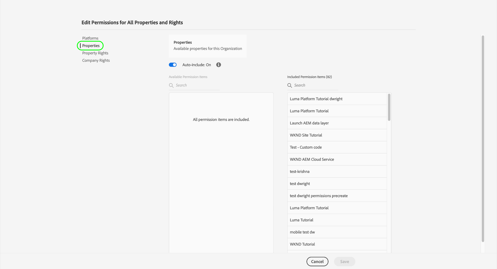

# Machtigingen voor tags beheren

>[!NOTE]
>
>Adobe Experience Platform Launch is omgedoopt tot een reeks technologieën voor gegevensverzameling in Adobe Experience Platform. Diverse terminologische wijzigingen zijn als gevolg hiervan in de productdocumentatie doorgevoerd. Raadpleeg het volgende [document](../../term-updates.md) voor een geconsolideerde referentie van de terminologische wijzigingen.

Als u tags wilt gebruiken in Adobe Experience Platform, moet u via Adobe Admin Console toegang krijgen tot ten minste één Adobe Experience Cloud-product. Bovendien moet u ook toestemmingen voor markeringen op het product-profielniveau worden verleend om bepaalde acties uit te voeren wanneer het programma geopend in UI van de Inzameling van Gegevens.

Deze gids behandelt hoe te om deze toestemmingen aan gebruikers te verlenen die de Admin Console gebruiken.

>[!NOTE]
>
>Raadpleeg het [overzicht van gebruikersmachtigingen](./user-permissions.md) voor gedetailleerde informatie over de verschillende typen beschikbare tagmachtigingen die in deze handleiding worden vermeld.

## Admin-rechten voor ophalen voor een tagproductprofiel

Als u gebruikersmachtigingen voor tags wilt beheren, moet u ten minste een beheerder voor het productprofiel voor tags in Adobe Admin Console zijn. Systeembeheerders en productbeheerders kunnen ook machtigingen voor een tagproductprofiel beheren.

Zie het document van de Admin Console over [administratieve rollen](https://helpx.adobe.com/enterprise/admin-guide.html/enterprise/using/admin-roles.ug.html) voor meer informatie over de verschillende adminniveaus en hoe te om deze rollen binnen uw organisatie te beheren.

## Selecteer een productprofiel voor het beheren van machtigingen voor

Wanneer u beheerdersrechten hebt, meldt u zich aan bij Admin Console en selecteert u **[!UICONTROL Products]** in de bovenste navigatie. Selecteer **[!UICONTROL Adobe Experience Platform Launch]** in de lijst met weergegeven producten.

Er wordt een lijst met productprofielen weergegeven. Een productprofiel is een constructie die een groep toestemmingen aan een groep gebruikers verbindt. Van hier, kunt u een nieuw profiel tot stand brengen om te vormen, of u kunt een bestaand productprofiel van de lijst selecteren om uit te geven (veronderstellend u beheerderrechten voor dat profiel hebt).

### Een productprofiel maken

>[!NOTE]
>
>Als u een bestaand profiel hebt geselecteerd om te bewerken, gaat u verder met de [volgende sectie](#permissions).

Als u een nieuw productprofiel wilt maken, selecteert u **[!UICONTROL New Profile]**.

Er wordt een dialoogvenster weergegeven waarin u een naam en een optionele beschrijving voor het profiel kunt opgeven. U kunt ook bepalen of gebruikers e-mailberichten moeten ontvangen wanneer ze uit dit profiel worden toegevoegd of verwijderd. Selecteer **[!UICONTROL Save]** als u klaar bent.

## Machtigingen configureren voor het productprofiel {#permissions}

De detailpagina voor het productprofiel wordt weergegeven. Met de beschikbare tabbladen kunt u de gebruikers beheren die aan het profiel zijn toegewezen en de specifieke eigenschappen en rechten configureren die door het profiel aan deze gebruikers worden toegekend.

De stappen op hoe te om gebruikers toe te voegen worden verstrekt [later in deze gids](#users). Selecteer momenteel **[!UICONTROL Permissions]**.

In het volgende scherm ziet u een overzicht van het aantal platforms, eigenschappen en rechten dat momenteel aan het profiel is toegewezen. Selecteer **[!UICONTROL Edit]** naast een van de rijen om de machtigingen van het profiel te configureren.

Het [!UICONTROL Edit Permissions] scherm verschijnt, dat u toestaat om toestemmingen toe te voegen en te verwijderen uit het productprofiel. In de sectie **[!UICONTROL Platforms]** ziet u dat alle platforms standaard zijn toegevoegd aan het profiel.

### Eigenschappen toewijzen

Als u eigenschappen aan dit profiel wilt toewijzen, selecteert u **[!UICONTROL Properties]** in de linkernavigatie.

Standaard krijgt een nieuw productprofiel automatisch toegang tot alle eigenschappen die voor uw organisatie beschikbaar zijn. Dit omvat eigenschappen die momenteel beschikbaar zijn en eigenschappen die in de toekomst zijn gemaakt.

Als u de beschikbare eigenschappen wilt beperken, selecteert u de schakeloptie **[!UICONTROL Auto-include]**. Hierdoor kunt u naar wens handmatig eigenschappen voor de eigenschap toevoegen en verwijderen.

Als automatisch opnemen is uitgeschakeld, worden alle momenteel beschikbare eigenschappen aan de linkerkant weergegeven. U kunt eigenschappen toevoegen aan het profiel door de plusknop (**+**) naast de desbetreffende eigenschap in de linkerkolom te selecteren. Als u een eigenschap wilt verwijderen, selecteert u het pictogram **X** naast de desbetreffende eigenschap in de rechterkolom.

>[!IMPORTANT]
>
>Als u de functie auto-include uitschakelt, moeten eigenschappen die in de toekomst worden gemaakt, handmatig aan het productprofiel worden toegevoegd om toegang te krijgen tot deze eigenschappen.

### Rechten toewijzen

Standaard zijn alle rechten uitgeschakeld voor een productprofiel en moeten deze handmatig worden toegevoegd om te kunnen worden ingeschakeld. Als u tot een productprofiel behoort dat auto-omvat eigenschappen maar geen rechten heeft, dan hebt u read-only toegang tot alle eigenschappen.

>[!NOTE]
>
>Een gebruiker kan tot veelvoudige productprofielen in Admin Console behoren, maar de rechten van die profielen worden niet gecombineerd in een master toestemmingsreeks. Die gebruiker heeft nog slechts de rechten die uitdrukkelijk door elke groep worden verleend.
>
>Bijvoorbeeld, als Groep 1 toegang tot Bezit A met het Develop recht verleent, en Groep 2 toegang tot Bezit B met het Publish recht geeft, worden ontwikkelt en publiceren rechten niet gecombineerd voor Bezit A en Bezit B. U kunt alleen ontwikkelen op eigenschap A en publiceren op eigenschap B.

Selecteer **[!UICONTROL Property Rights]** in de linkernavigatie. Net als bij eigenschappen kunt u de plusknop (**+**) naast een eigenschapsrecht selecteren om deze aan het profiel toe te voegen. Als u alle bezitsrechten aan het profiel wilt toevoegen, kunt u **[!UICONTROL Add all]** ook selecteren.

Selecteer vervolgens **[!UICONTROL Company Rights]** in de linkernavigatie. Voeg de gewenste rechten toe of verwijder deze en selecteer **[!UICONTROL Save]** als u klaar bent.

## Gebruikers toewijzen aan het profiel {#users}

Als u gebruikers aan het productprofiel wilt toewijzen, selecteert u de tab [!UICONTROL Users] en vervolgens [!UICONTROL Add User].

Voer in het dialoogvenster dat wordt weergegeven de naam, de gebruikersgroep of het e-mailadres in van de gebruikers die u aan het profiel wilt toevoegen. Als een gebruiker deel uitmaakt van uw organisatie, worden de gegevens weergegeven in een automatisch aangevulde vervolgkeuzelijst, die u kunt selecteren om de details in te vullen. Als zij geen deel van uw organisatie uitmaken, kunt u hun informatie manueel ingaan.

Als u klaar bent, selecteert u **[!UICONTROL Save]** om de opgegeven gebruikers toe te voegen aan het productprofiel.

Nadat gebruikers aan het profiel zijn toegevoegd, ontvangen ze een e-mail met de kennisgeving dat ze nu rechten hebben voor de gebruikersinterface voor gegevensverzameling.

## Volgende stappen

In dit document wordt beschreven hoe u eigenschappen en rechten voor de gebruikersinterface voor gegevensverzameling met Adobe Admin Console kunt beheren. Voor meer informatie over de beschikbare toestemmingen en de functionaliteiten die zij toegang verlenen tot, zie het overzicht op [gebruikerstoestemmingen](./user-permissions.md).
