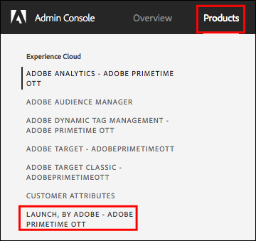
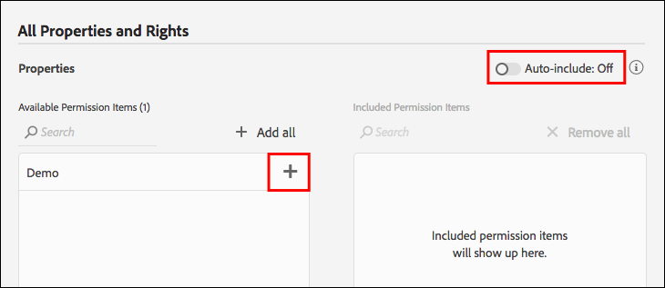
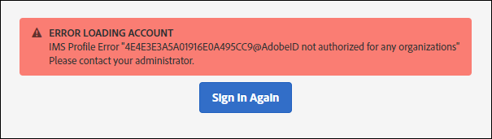

# Gebruikersmachtigingen

>[!NOTE]
>
>Adobe Experience Platform Launch wordt omgedoopt tot een reeks technologieën voor gegevensverzameling in Experience Platform. Diverse terminologische wijzigingen zijn als gevolg hiervan in de productdocumentatie doorgevoerd. Raadpleeg het volgende [document](../../term-updates.md) voor een geconsolideerde referentie van de terminologische wijzigingen.

## Machtigingstypen

Er zijn twee gebruikersmachtigingen voor gebruik met tags in Adobe Experience Platform:

* **Experience Cloud Toestemmingen:** Gevonden in de Admin Console op het bedrijfniveau,  [!DNL Experience Cloud] heersen de toestemmingen wie groepstoestemmingen en groepslidmaatschap voor alle  [!DNL Experience Cloud] producten kunnen controleren.
* **Machtigingen voor tags:** de machtigingen voor tags bevinden zich in de Admin Console op het niveau Productprofiel. Deze toestemmingen bepalen welke gebruikers bepaalde acties kunnen eigenlijk uitvoeren wanneer het programma wordt geopend in UI van de Inzameling van Gegevens.

Dit artikel onderzoekt deze verschillende toestemmingstypes in detail.

### Experience Cloud-machtigingen

Deze sectie bespreekt factoren die belangrijk zijn om te begrijpen wanneer het gebruiken van Platform. Zie [Beheerdersrollen in de gebruikershandleiding voor ondernemingen](https://helpx.adobe.com/au/enterprise/using/admin-roles.html) voor een uitgebreide weergave van [!DNL Experience Cloud]-machtigingen.

#### Organisatiebeheerder

Organisatiebeheerders worden vaak Org Admins genoemd. De hoofdfunctie van een Org Admin is het toewijzen van machtigingen aan andere gebruikers. Zij doen dit door de Profielen van het Product (of groepen) te creëren die een specifieke reeks rechten binnen een specifiek product bevatten en dan gebruikers, bestaand of nieuw, aan dat Profiel van het Product toe te wijzen.

Enterprise Org Admins nemen geen rechten over voor tags in Platform. Zij moeten zich aan een productprofiel toevoegen dat de aangewezen toestemmingen heeft als zij om het even wat in de Inzameling van Gegevens UI willen doen.

#### Productbeheerder

Een productbeheerder (of productbeheerder) is vergelijkbaar met een Org Admin, maar heeft een beperkter bereik. Een productbeheerder heeft alleen toestemming om productprofielen te wijzigen voor een specifiek [!DNL Adobe]-product, in plaats van alle [!DNL Adobe]-producten waartoe het bedrijf toegang heeft.

### Machtigingen voor tags

Binnen [!DNL Experience Cloud], worden geen rechten of toestemmingen toegewezen aan individuele gebruikers. Ze worden toegewezen aan een productprofiel (zie &quot;Experience Cloud-machtigingen&quot; hierboven). Individuele gebruikers worden vervolgens toegewezen aan een of meer productprofielen.

In een productprofiel worden de machtigingen voor labels verdeeld over vier dimensies.

1. Platforms
1. Properties
1. Eigendomsrechten
1. Bedrijfsrechten

#### Platforms

Elke eigenschap heeft een platform. Er zijn momenteel twee platforms die u voor tags kunt gebruiken: *Web* en *Mobiel*. U kunt dit toestemmingstype gebruiken om toegang tot een bepaald type van bezit te beperken of te verlenen. Dit kan handig zijn als het team dat uw mobiele apps beheert, anders is dan het team dat uw websites beheert.

#### Eigenschappen

Dit is een lijst van alle Eigenschappen die binnen uw bedrijf bestaan. U kunt dit toestemmingstype gebruiken om toegang tot specifieke bestaande eigenschappen (door naam) te beperken of te verlenen.

#### Eigendomsrechten

Om het even welke eigenschappen u in UI creeert van de Inzameling van Gegevens worden beschikbaar in de Admin Console voor u om toestemmingen toe te wijzen. Als een bepaald productprofiel geen toegang heeft tot Eigenschap A1, kunnen gebruikers die tot dat profiel behoren geen instellingen in Eigenschap A1 zien of wijzigen.

Ervan uitgaande dat een gebruiker tot een profiel met toegang tot Bezit A1 behoort, wordt wat zij binnen Bezit A1 kunnen doen bepaald door de rechten zij van deze toestemmingsgroep zijn verleend. Gebruikers met machtigingen voor Eigenschap A1, maar zonder toegewezen rechten, hebben alleen-lezen toegang.

De rechten in deze groep zijn:

* **Ontwikkelen:** hiermee kunt u regels en gegevenselementen maken. U kunt ook bibliotheken maken en deze bouwen in bestaande ontwikkelomgevingen. U kunt een bibliotheek ter goedkeuring verzenden als u klaar bent. De meeste dagelijkse taken in UI van de Inzameling van Gegevens vereisen dit recht.
* **Goedkeuren:** hiermee kunt u een verzonden bibliotheek maken en bouwen naar de testomgeving. U kunt ook een bibliotheek goedkeuren voor publicatie nadat het testen is voltooid.
* **Publiceren:** Hierdoor kunt u goedgekeurde bibliotheken publiceren naar de productieomgeving.
* **Extensies beheren:** hiermee kunt u nieuwe extensies installeren op een eigenschap, de extensieconfiguratie wijzigen voor een reeds geïnstalleerde extensie en een extensie verwijderen. Zie de documentatie van het extensieoverzicht voor [meer informatie over extensies](../managing-resources/extensions/overview.md). Deze rol behoort gewoonlijk tot IT of Marketing, afhankelijk van uw organisatie.
* **Omgevingen beheren:** hiermee kunt u omgevingen maken en wijzigen. Raadpleeg de [documentatie over omgevingen](../publishing/environments.md) voor meer informatie. Deze rol behoort gewoonlijk tot de IT-groep.

#### Vennootschapsrechten

De rechten van het bedrijf zijn op toestemmingen van toepassing die veelvoudige eigenschappen overspannen.  Er zijn momenteel drie:

* **Eigenschappen beheren:** hiermee kunt u nieuwe eigenschappen maken in de gebruikersinterface voor gegevensverzameling en de metagegevens en instellingen wijzigen op eigenschapsniveau. U kunt ook eigenschappen verwijderen. Lees de [eigenschappendocumentatie](companies-and-properties.md) voor meer informatie. Beheerders voeren deze rol gewoonlijk uit.
* 
* Hiermee kunt u nieuwe eigenschappen maken in [!DNL Platform Launch] en de metagegevens en instellingen op eigenschapsniveau wijzigen. U kunt ook eigenschappen verwijderen.  Meer informatie over eigenschappen [hier](companies-and-properties.md). Beheerders voeren deze rol gewoonlijk uit.
* **Ontwikkelextensies:** hiermee kunt u extensiepakketten maken en wijzigen die eigendom zijn van het bedrijf, waaronder persoonlijke releases en verzoeken om openbare release.
* **App Configurations beheren:** dit is alleen beschikbaar voor klanten met een licentie voor Adobe Journey Optimizer of een andere oplossing die hen toegang biedt tot mobiele communicatie in de app en pushberichten.  Op deze manier kunt u de apps beheren waarvan Experience Cloud kennis heeft, samen met de vereiste pushgegevens die nodig zijn om te communiceren met de Firebase Cloud Messaging-service en de Apple Push Notification Service.

### Totaal aantal gebruikersmachtigingen

Het totale aantal machtigingen van een individuele gebruiker wordt bepaald door het totale aantal leden in verschillende productprofielen. Als een gebruiker tot meerdere productprofielen behoort, worden de machtigingen van elk profiel bij elkaar opgeteld in plaats van vermenigvuldigd.

Bijvoorbeeld: Het Profiel A van het product verleent Henry het Ontwikkelrecht voor Bezit 1. Het profiel B van het product verleent Henry het Publish recht voor Bezit 2. Henry kan zich ontwikkelen in Bezit 1 en publiceren in Bezit 2, maar hij kan niet in Bezit 1 publiceren of in Bezit 2 ontwikkelen omdat hij geen expliciete rechten om dit te doen heeft gekregen.

## Rechtenscenario&#39;s

Verschillende bedrijven hebben verschillende behoeften bij het maken van nieuwe productprofielen. Deze behoeften variëren op basis van de grootte van het bedrijf, de organisatiestructuur, het aantal sites, het aantal personen dat betrokken is bij het beheer van tags, enzovoort.

Hieronder vindt u een aantal algemene scenario&#39;s en een aanbevolen beginpunt voor het maken van productprofielen en het toevoegen van gebruikers aan deze profielen.

### Eenpersoonshow

Als u een klein bedrijf runt dat één persoon voor alles verantwoordelijk heeft, geef deze gebruikerstoestemming aan alle eigenschappen en wijs hen alle hierboven vermelde rechten toe.

### Scheiding van taken

Veel mensen zijn betrokken bij labelen. Je hebt één groep mensen (misschien een externe consultant) die regels en data-elementen creëert, maar je wilt niet dat ze toegang hebben tot de productieomgeving. U wilt ervoor zorgen dat niemand aan Productie behalve het team van IT opstelt.

1. Maak een account voor uw consultants en geef deze alleen het ontwikkelrecht.
1. De consultant bouwt en test binnen de grenzen die u instelt.
1. Als de consultant een nieuwe extensie wil of als hij klaar is om live te gaan, voert een vertegenwoordiger van uw organisatie (met de juiste rechten) die acties uit.

### Enterprise

Een ondernemingsbedrijf zou veelvoudige plaatsen kunnen hebben die geografisch, met verschillende teams verantwoordelijk voor elke geo worden verdeeld. Binnen die teams ontwikkelen en publiceren verschillende personen zich.

Dit is vergelijkbaar met &quot;Scheiding van rechten&quot; hierboven, maar georganiseerd per geografisch gebied.

* Noord-Amerika
   * Ontwikkelgroep
   * Groep publiceren
* Europa
   * Ontwikkelgroep
   * Groep publiceren
* ...
   * Ontwikkelgroep
   * Groep publiceren

## Voorbeelden

Een paar voorbeelden van de soorten rollen u in uw organisatie zou kunnen hebben, en welke toestemmingen u hen zou moeten toewijzen, zou kunnen helpen om dit concept te verduidelijken.

Hier zijn een paar beschrijvingen van verschillende rollen die in uw organisatie en een matrijs zouden kunnen van toepassing zijn om te tonen welke toestemmingen zij nodig hebben om hun baan te doen.

* De manager: Wil zien wat er aan de hand is, maar zou geen veranderingen mogen aanbrengen.
* De markt: Kan extensies installeren en nieuwe codes instellen voor bestaande eigenschappen, maar kan niet publiceren naar de testomgeving of productieomgeving.
* De ontwikkelaar van de mobiele app: Is verantwoordelijk voor de implementatie van Adobe- en oplossingen van derden in een systeemeigen mobiele app.
* Het IT-team: Geen codes wijzigen, maar ze hebben volledige controle over de testomgeving en de productieomgeving en wat er in staat.
* Jack of All Trades: Doe alles.

| Rol | Eigenschappen | Bedrijfsrechten | Eigendomsrechten |
|--- |--- |--- |--- |
| Manager | Automatisch opnemen |  |  |
| De markt | Automatisch opnemen | Eigenschappen beheren | Ontwikkelen Extensies beheren |
| De Mobile App Developer | Automatisch opnemen | Eigenschappen beheren Toepassingsconfiguraties beheren | Ontwikkelen Extensies beheren |
| Het IT-team | Automatisch opnemen | Goedkeuren Publiceren Omgevingen beheren |
| De Jack of All Trades | Automatisch opnemen | Eigenschappen beheren | Ontwikkelen Goedkeuren Publiceren Extensies beheren Omgevingen beheren |
| Extensieontwikkelaar | Automatisch opnemen | Eigenschappen beheren Extensies ontwikkelen | Ontwikkelen |

## Gebruikersmachtigingen toewijzen

De onderstaande stappen begeleiden u bij het toewijzen van machtigingen. U kunt dit proces [ook bekijken op video](https://www.youtube.com/watch?v=ba28BHX8cwU).

Stap 1-3 hieronder kan worden omzeild door rechtstreeks naar [Adobe Admin Console](https://adminconsole.adobe.com/enterprise/products) te navigeren. Als u tot meer dan één organisatie behoort, selecteer de correcte org van hoogste nav op het recht.

### 1. Aanmelden bij Experience Cloud

Meld u aan bij [https://experiencecloud.adobe.com/](https://experiencecloud.adobe.com/) met uw Adobe ID en kies vervolgens de organisatie die u wilt gebruiken in de gebruikersinterface voor gegevensverzameling in het menu [!UICONTROL Navigation].

Open de oplossingenkiezer door het 9-punts pictogram van [!UICONTROL Navigation] menu te selecteren, dan uitgezocht **[!UICONTROL Administration]**.

Als u deze koppeling niet kunt zien, gelden beide volgende voorwaarden:

* Je bent geen org-beheerder.
* U bent geen productbeheerder voor om het even welke [!DNL Experience Cloud] producten.

In beide gevallen, vraag een org admin om deze stappen voor u uit te voeren, of om u tot product admin voor markeringen te maken zodat kunt u het zelf doen.

>[!NOTE]
>
>Als u niet weet wie uw org admin is, contacteer de Zorg van de Cliënt.

### 2. Admin Console openen

Selecteer **Admin Console**.

Selecteer de **[!DNL Experience Platform Launch]-`Company Name`** kaart.

<!-- Scott, update above image. Rebranding. -->

U kunt **[!UICONTROL Products]** in hoogste nav ook selecteren, dan **[!DNL Experience Platform Launch]-`Company Name`** van linkernav selecteren.

Als u geen [!DNL Experience Platform Launch] kaart ziet en of [!DNL Experience Platform Launch] niet in deze lijst verschijnt, dan bent u geen Org Admin, maar u bent een Admin van het Product voor andere producten van Experience Cloud. Omdat u geen beheerder voor Experience Platform Launch bent, moet u een Org Admin vinden die deze stappen voor u kan uitvoeren of die u tot een Admin van het Product voor [!DNL Platform Launch] kan maken.

Nadat u Platform launch hebt geselecteerd, wordt een lijst met productprofielen weergegeven. Beschouw deze profielen als machtigingsgroepen. Eén profiel wordt voor u gemaakt en krijgt de naam &quot;[!DNL Platform Launch] - `Company Name`&quot;.

### 3. Uw productprofiel maken

Als u een bestaand productprofiel bewerkt, slaat u deze stap over.

Kies of u dit productprofiel wilt bewerken of een nieuw profiel wilt maken.

Als u een nieuw productprofiel wilt maken, selecteert u **[!UICONTROL New Profile]**.

Geef uw nieuwe profiel een naam en een beschrijving, vorm of de gebruikers e-mail zouden moeten ontvangen wanneer zij worden toegevoegd of uit dit profiel worden verwijderd, en selecteer dan **[!UICONTROL Done]**.

### 4. Uw productprofiel bewerken

Selecteer het productprofiel in de lijst en open vervolgens het tabblad **[!UICONTROL Permissions]**. U kunt machtigingen toewijzen in twee dimensies: Eigenschappen en rechten.

Als u eigenschappen aan deze groepsdefinitie wilt toewijzen, opent u de sectie **[!UICONTROL Properties]**.

In een lijst staan de eigenschappen van de tag.

Nieuwe productconfiguraties bevatten standaard automatisch eigenschappen. Dit betekent dat alle eigenschappen (huidig en toekomstig) in de groepsdefinitie inbegrepen zijn.

Als Automatisch opnemen is uitgeschakeld, worden alle momenteel beschikbare eigenschappen aan de linkerkant weergegeven. U kunt eigenschappen naar deze groepsdefinitie verplaatsen door **[!UICONTROL Add]** te selecteren.

Selecteer **[!UICONTROL Save]** wanneer gebeëindigd.

### 5. Rechten toewijzen

Wijs de rechten toe die u wilt opnemen in de groepsdefinitie. Open de sectie **[!UICONTROL Rights]**.

Rechten worden niet automatisch opgenomen. U moet elk recht aan uw profiel toewijzen. U kunt snel alle rechten aan dit profiel toevoegen met de knop [!UICONTROL + Add All] of u kunt individuele rechten toewijzen met de knoppen individu + (toevoegen). Voor meer informatie over welke toestemmingen met elk recht worden geassocieerd, zie [De scenario&#39;s van Rechten](#rights-scenarios). Selecteer **[!UICONTROL Save]** wanneer gebeëindigd. Als [!UICONTROL Save] niet beschikbaar is, zijn er geen wijzigingen aangebracht en krijgt u geen nieuwe rechten toegewezen.

Wijs eerst eigendomsrechten toe:

Wijs vervolgens bedrijfsrechten toe.

Er zijn enkele belangrijke opmerkingen over de toewijzing van rechten:

* Een gebrek aan rechten betekent alleen-lezen toegang. Als u tot een productconfiguratie met auto-omvat eigenschappen en geen rechten behoort, dan hebt u read-only toegang tot alle markeringseigenschappen.
* Als u de beheereigenschappen niet correct toewijst, kunt u geen eigenschappen toevoegen wanneer u zich aanmeldt.
* Een gebruiker kan tot veelvoudige groepen behoren, maar de rechten van die groepen worden niet gecombineerd in een master toestemmingsreeks. Die gebruiker heeft nog slechts de rechten die uitdrukkelijk door elke groep worden verleend.

   Bijvoorbeeld, als Groep 1 toegang tot Bezit A met het Ontwikkelrecht verleent en Groep 2 toegang tot Bezit B met het Publish recht geeft, worden ontwikkelt en publiceren rechten niet gecombineerd voor Bezit A en Bezit B. U kunt alleen ontwikkelen op eigenschap A en publiceren op eigenschap B.

### 6. Gebruikers toewijzen aan groepen

Als u gebruikers wilt toewijzen om deel uit te maken van uw groep, opent u het tabblad [!UICONTROL Users] en selecteert u [!UICONTROL Add User].

Selecteer de ellips (...) voor extra opties, zoals bulkgebruikersverrichtingen.

>[!NOTE]
>
>Als u een Org Admin of een Admin van het Product bent, verleent u geen rechten binnen het markeringsproduct. U moet tot minstens één productprofiel behoren.

Zoek naar de gebruiker u aan de groep wilt toevoegen. U kunt zoeken op naam of op e-mailadres. Deze wordt automatisch ingevuld van bestaande gebruikers in uw organisatie. Nadat u de gewenste gebruiker hebt gevonden, selecteert u de gewenste naam.

Nadat u gebruikers hebt toegevoegd, ontvangen ze een e-mail met de mededeling dat ze nu rechten hebben. Als u zich wilt aanmelden, volgt u de koppeling naar de gebruikersinterface van [Gegevensverzameling](https://launch.adobe.com).

>[!NOTE]
>
>Als de gebruiker niet bestaat, kunt u gewoon het volledige e-mailadres typen en een voor- en achternaam opgeven. De nieuwe gebruiker ontvangt een e-mail, en wanneer hij of zij een [!DNL Adobe]-id maakt van die e-mailuitnodiging, worden deze gekoppeld aan de gebruikersaccount die u voor hem of haar hebt gemaakt. Als u toestemmingen voor zich toewijst, zult u niet deze kwestie hebben.

## Veelvoorkomende problemen

### Fout bij laden van account

Wanneer u zich aanmeldt bij de interface voor gegevensverzameling, ontvangt u een bericht met de tekst &quot;Fout bij laden van account&quot;.

Resolutie: Uw gebruiker behoort niet tot productprofielen voor tags. Zie de bovenstaande stappen om een profiel te maken en er rechten aan toe te wijzen en om een gebruiker aan een profiel toe te wijzen.

### Knop Eigenschap voor grijswaarden

Nadat u zich hebt aangemeld, kunt u geen eigenschappen meer toevoegen.

Resolutie: Uw gebruikersaccount behoort niet tot een productconfiguratie die de beheereigenschappen heeft. Ga terug naar Stap 5 hierboven.
