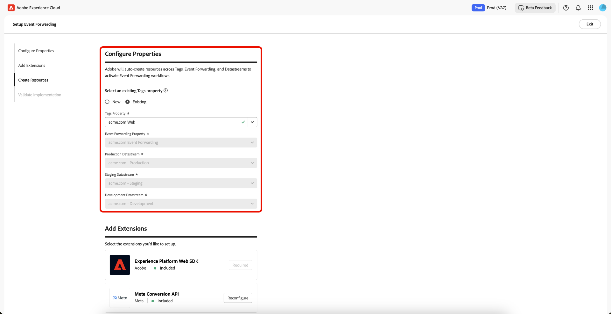

# Overzicht van de instructies voor het doorsturen van gebeurtenissen

>[!IMPORTANT]
>
>De functie voor het instellen van instructies is beschikbaar voor klanten die het pakket Real-Time CDP Prime en Ultimate hebben aangeschaft. Neem contact op met uw Adobe-vertegenwoordiger voor meer informatie.

>[!NOTE]
>
>Om het even welke bestaande cliënt kan de geleide opstellingswerkschema&#39;s gebruiken om een verwijzings implementatie tot stand te brengen die voor het volgende kan worden gebruikt:
>
>* Gebruik dit als het begin van een gloednieuwe implementatie.
>* Haal voordeel uit het als verwijzingsimplementatie die u kunt onderzoeken om te zien hoe het is gevormd en dan in uw huidige productieimplementaties repliceert.

Met de functie Geleide installatie kunt u eenvoudig en efficiënt aan de slag gaan. Dit hulpmiddel automatiseert veelvoudige stappen die in de markeringen van Adobe en gebeurtenis door:sturen worden uitgevoerd, beduidend verminderend de opstellingstijd.

Met deze installatie kunnen extensies automatisch worden geïnstalleerd. Deze hybride implementatie wordt door [!DNL Meta] aanbevolen voor het verzamelen en doorsturen van gebeurtenisconversies op de server. De geleide opstellingseigenschap wordt ontworpen om u te helpen met een gebeurtenis worden begonnen die implementatie door:sturen en is niet bedoeld om een eind aan eind te leveren, volledig - functionele implementatie die alle gebruiksgevallen aanpast.

## Aan de slag met instructies {#guided-setup}

Selecteer **[!UICONTROL Get Started]** in de gebruikersinterface van **[!UICONTROL Event Forwarding]** Gegevensverzamelingen om aan de slag te gaan met deze functie.

### Een nieuwe eigenschap voor tags maken {#new-property}

Selecteer **[!UICONTROL New]** in de sectie Eigenschappen configureren en voer de nieuwe **[!UICONTROL Property Domain]** -gegevens in.

Selecteer **[!UICONTROL Add]** voor [!DNL Meta Conversion API] in de sectie Extensies toevoegen. Op de pagina [!DNL Meta] Informatie configureren kunt u de opties **[!UICONTROL Meta Pixel ID]** , **[!UICONTROL Meta System User Access Token]** en **[!UICONTROL Data Layer Path]** handmatig invoeren. U kunt ook de optie **[!UICONTROL Connect to Meta]** gebruiken.

#### Verbinding maken met [!DNL Meta] via uw referenties {#meta-credentials}

Selecteer **[!UICONTROL Connect to Meta]**, voer vervolgens uw [!DNL Meta] referenties in en selecteer **[!UICONTROL Log in]** en selecteer vervolgens **[!UICONTROL Next]** .

U zal nu worden gevraagd **bedrijfs portefeuille** tot stand te brengen. Voer de **[!UICONTROL Business portfolio name]** in en selecteer **[!UICONTROL Next]** .

Selecteer in de lijst uw portfolio en selecteer vervolgens **[!UICONTROL Next]** . U kunt de instellingen voor Business Portfolio, Advertentieaccount en [!DNL Meta Pixel] bekijken. Selecteer **[!UICONTROL Continue]** om de instellingen te bevestigen en selecteer vervolgens **[!UICONTROL Next]** .

Wacht enkele minuten tot het installatieproces is voltooid en selecteer vervolgens **[!UICONTROL Done]** .

De **[!UICONTROL Meta Pixel ID]**, **[!UICONTROL Meta System User Access Token]** en **[!UICONTROL Data Layer Path]** worden automatisch ingevuld. Selecteer **[!UICONTROL Save]**.

#### Bronnen maken voor uw nieuwe eigenschap voor tags {#create-resources}

In de Create sectie van Middelen, selecteer **[!UICONTROL Pre-check resources]** om u organisatie en eigenschappen voor botsingen of bestaande noodzakelijke middelen voor uw implementatie te controleren.

Op de pagina Taakhandelingen wordt een lijst met taken en handelingen weergegeven. Selecteer **[!UICONTROL Create Resources]** om deze taken te maken.

Sta een paar minuten voor de vereiste regels, gegevenselementen, uitbreidingen, bibliotheken, SDKs, etc. toe om het installeren te beëindigen. De sectie Bronnen maken bevat koppelingen naar de gemaakte eigenschappen en bronnen.

#### Uw implementatie valideren {#validate-implementation}

De sectie Implementatie valideren bevat de insluitkoppeling die u op uw website kunt gebruiken. **[!UICONTROL Start Validation]** voert de test in uw huidige browser zitting op deze geleide opstellingspagina uit. Als de validatie hier slaagt, werkt dezelfde implementatie ook wanneer u de insluitkoppeling op uw site implementeert.

Selecteer **[!UICONTROL Send PageView Event]** om een testgebeurtenis via de Adobe Experience Platform Edge Network te verzenden. Vervolgens wordt de server doorgestuurd naar [!DNL Meta] . Selecteer **[!UICONTROL Finished Validation]** om de installatie te voltooien.

>[!NOTE]
>
>Als er tijdens het validatieproces fouten optreden, selecteert u de koppeling **[!UICONTROL Assurance]** om gebeurtenissen te controleren die mogelijk zijn mislukt.

### Bestaande eigenschap tags gebruiken {#existing-property}

Selecteer **[!UICONTROL Existing]** in de sectie Eigenschappen configureren en selecteer vervolgens uw eigenschap voor tags in het vervolgkeuzemenu. Het systeem probeert om de gebeurtenis te vinden die bezit door:sturen dat reeds aan dit bezit door de gegevensstromen in bijlage is. U kunt nu doorgaan met het opnieuw configureren van de [!DNL Meta Conversion API] , en vervolgens resources vooraf controleren en maken.

Als het geselecteerde markeringsbezit niet met een gebeurtenis wordt verbonden die bezit door:sturen of als de gegevensstromen ontbreken, zullen zij automatisch tot stand worden gebracht.

Om uw [!DNL Meta Conversion API] te vormen volg het hierboven benadrukte proces in [&#x200B; verbind met  [!DNL Meta]  gebruikend uw geloofsbrieven &#x200B;](#meta-credentials).

Nu u **[!UICONTROL Meta Pixel ID]** , **[!UICONTROL Meta System User Access Token]** en **[!UICONTROL Data Layer Path]** hebt gegenereerd, selecteert u **[!UICONTROL Pre-Check resources]** om de workflow voor het doorsturen van gebeurtenissen te maken.

Aangezien u een bestaand markeringsbezit gebruikt, verschilt het opstellingsproces lichtjes van het nieuwe bezitswerkschema. U kunt zien dat het systeem de creatie van het Webbezit, de gastheer, en het milieu zal overslaan aangezien deze reeds bestaan. Tot slot selecteert u **[!UICONTROL Create Resources]** om de taken te maken die nog niet beschikbaar zijn.

 worden overgeslagen

>[!INFO]
>
>De instelling met instructies voegt automatisch notities toe aan eigenschappen die tijdens het proces worden bijgewerkt. U kunt deze in de sectie Notities in het rechterdeelvenster van de eigenschap Tags weergeven in de bewerkingsmodus. U kunt zien wanneer de eigenschap is bijgewerkt of gemaakt met het instellingsgereedschap Met instructies. Met dit audittrail kunt u wijzigingen bijhouden die zijn aangebracht door de functie voor gestuurde installatie.

Sta een paar minuten voor de vereiste regels, gegevenselementen, uitbreidingen, bibliotheken, SDKs, etc. toe om het installeren te beëindigen. De sectie Bronnen maken bevat koppelingen naar de gemaakte eigenschappen en bronnen.

De sectie Implementatie valideren bevat de insluitkoppeling die u op uw website kunt gebruiken. **[!UICONTROL Start Validation]** voert de test in uw huidige browser zitting op deze geleide opstellingspagina uit. Als de validatie hier slaagt, werkt dezelfde implementatie ook wanneer u de insluitkoppeling op uw site implementeert.

Selecteer **[!UICONTROL Send PageView Event]** om een testgebeurtenis via de Adobe Experience Platform Edge Network te verzenden. Vervolgens wordt de server doorgestuurd naar [!DNL Meta] . Selecteer **[!UICONTROL Finished Validation]** om de installatie te voltooien.

>[!NOTE]
>
>Als er tijdens het validatieproces fouten optreden, selecteert u de koppeling **[!UICONTROL Assurance]** om gebeurtenissen te controleren die mogelijk zijn mislukt.

## Volgende stappen {#next-steps}

In deze handleiding wordt beschreven hoe u het gereedschap Instellingen met instructies kunt gebruiken om eigenschappen voor de [!DNL Meta Conversions API] te maken en configureren.

Zie de [!DNL Meta] documentatie over [&#x200B; beste praktijken voor  [!DNL Conversions API] &#x200B;](https://www.facebook.com/business/help/308855623839366?id=818859032317965) voor meer begeleiding op hoe te om uw integratie effectief uit te voeren. Voor meer algemene informatie over markeringen en gebeurtenis die in Adobe Experience Cloud door:sturen, verwijs naar het [&#x200B; overzicht van markeringen &#x200B;](../../home.md).
