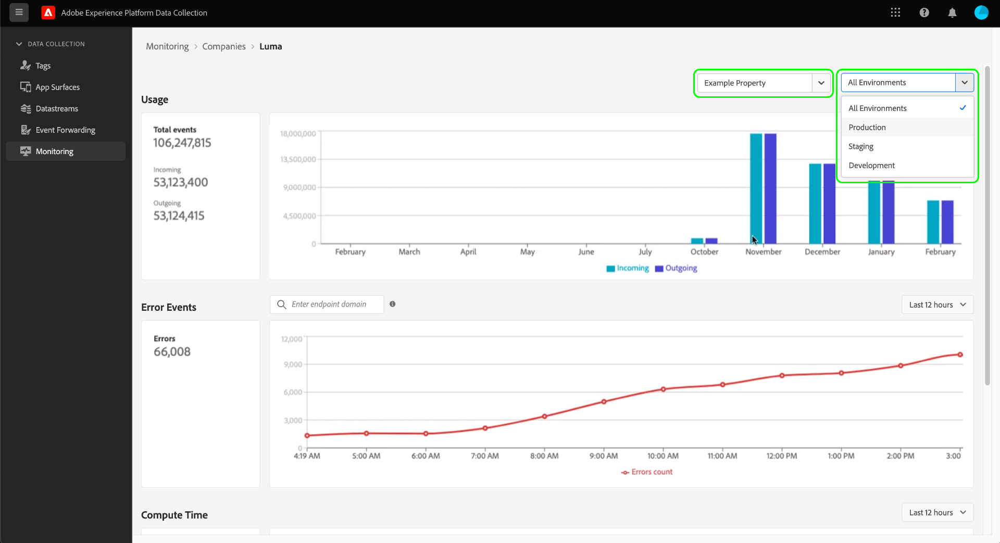

# Bewaking van activiteiten bij het doorsturen van gebeurtenissen (Beta)

>[!IMPORTANT]
>
>Deze functie bevindt zich momenteel in bèta en uw organisatie heeft er wellicht nog geen toegang toe. De functionaliteit en documentatie kunnen worden gewijzigd.

Het **[!UICONTROL Monitoring]** lusje in de UI van de Inzameling van Gegevens staat u toe om gebruikspatronen, fouten te controleren, en tijd van uw gebeurtenis te berekenen door:sturen eigenschappen. Deze gids verstrekt een overzicht op hoog niveau van hoe te om de rapporten te bekijken en te begrijpen die in het lusje worden getoond.

## Vereisten

Deze gids veronderstelt dat u gebeurtenis hebt gekocht door:sturen en dat u een werkend inzicht in hebt hoe gebeurtenis het door:sturen werkt. Zie de [&#x200B; gebeurtenis door:sturen overzicht &#x200B;](./overview.md) voor meer informatie.

## Video-overzicht

Bekijk de volgende video voor een overzicht op hoog niveau van de controlefunctie:

>[!VIDEO](https://video.tv.adobe.com/v/343999?quality=12&learn=on)

## Eigenschappen en omgevingen selecteren

U kunt metriek binnen een individuele milieu en een bezit, of over alle eigenschappen en milieu&#39;s bekijken die door uw organisatie worden bezeten.

Als u metrische gegevens voor één eigenschap wilt weergeven, selecteert u het vervolgkeuzemenu voor de eigenschap en kiest u de eigenschap of interest in de lijst. Nadat u een eigenschap hebt gekozen, kunt u ook het vervolgkeuzemenu voor de omgeving gebruiken om een belangwekkende omgeving te selecteren.

## [!UICONTROL Usage]

>[!NOTE]
>
>De gegevens van het gebruik worden elke maand vernieuwd nadat de vorige maand beëindigt.

Het **[!UICONTROL Usage]** rapport toont inkomende en uitgaande vraag voor een bepaalde tijdspanne. De inkomende vraag vertegenwoordigt gegevens die naar gebeurtenis door:sturen worden verzonden. De uitgaande vraag vertegenwoordigt gegevens die van gebeurtenis door:sturen worden verzonden. Het **[!UICONTROL Total events]** aantal in de linkerruit is de som inkomende en uitgaande vraag voor de bepaalde tijdspanne.

## [!UICONTROL Error Events]

Het **[!UICONTROL Error Events]** rapport toont fouten in aggregaat, en uitgesplitst door de reactiecode van HTTP wanneer u uw curseur over het lijndiagram beweegt. De getoonde fouten zijn van uitgaande vraag en de reactiecodes zijn van het eindpunt dat gebeurtenis door:sturen met interactie heeft.

De fouten worden weergegeven voor een bepaalde periode, die kan worden aangepast in het beschikbare vervolgkeuzemenu.

Het onderzoeksvakje voor de foutengebeurtenis staat u toe om gebeurtenis te vragen door:sturen om fouten voor een bepaald eindpuntdomein te begrijpen. U moet het exacte domein invoeren, omdat de zoekfunctie geen benaderingen of &quot;vage&quot; overeenkomsten accepteert. Zodra u een nauwkeurig domein verstrekt waarvoor er uitgaande foutengegevens zijn, druk binnengaan en het rapport verfrist zich om uitgaande fouten voor dat domein te tonen. Als u bijvoorbeeld fouten wilt zien bij het eindpunt van de Facebook Conversions API, moet het domein worden geschreven als `https://graph.facebook.com` .

## [!UICONTROL Compute Time]

Het **[!UICONTROL Compute Time]** rapport toont de compute tijd van alle regels over gebeurtenis die servers door:sturen.

>[!NOTE]
>
>De weergegeven tijden vertegenwoordigen geen end-to-end latentie. Het door:sturen van de gebeurtenis heeft een gegevens-tijd beperking van 50 milliseconden. Als deze limiet wordt overschreden, worden de bijbehorende gegevens verwijderd.

De volgende factoren beïnvloeden de computertijd:

1. Het aantal regels
2. De complexiteit van de regels, meestal afhankelijk van de hoeveelheid aangepaste JavaScript die wordt uitgevoerd

Bijvoorbeeld, als een actie in gebeurtenis het door:sturen een eindpunt raakt en dat eindpunt twee seconden vergt om te antwoorden, zal deze twee-tweede latentie niet tegen gegevens berekenen tijd tellen omdat de gebeurtenis het door:sturen enkel wacht en niet actief om het even wat verwerkt. De reactietijd kan niet langer zijn dan 30 seconden, anders zullen de gegevens worden gelaten vallen.
