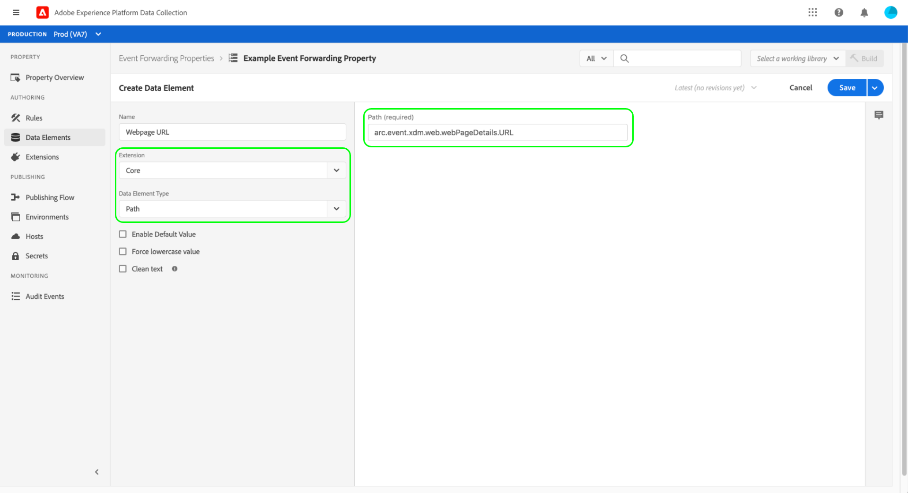

# Overzicht van het doorsturen van gebeurtenissen

>[!NOTE]
>
>Het door:sturen van gebeurtenissen is een betaalde eigenschap die als deel van het aanbod van de Verbindingen van Adobe Real-Time Customer Data Platform, Prime, of Ultimate inbegrepen is.

Door:sturen van gebeurtenissen in Adobe Experience Platform (vroeger genoemd geworden server-kant van Adobe Experience Platform Launch) staat u toe om verzamelde gebeurtenisgegevens naar een bestemming voor server-zijverwerking te verzenden. Het doorsturen van gebeurtenissen vermindert het gewicht van de webpagina en de toepassing doordat Adobe Experience Platform Edge Network wordt gebruikt om taken uit te voeren die normaal op de client worden uitgevoerd. Geïmplementeerd op een vergelijkbare manier als labels, kunnen de regels voor het doorsturen van gebeurtenissen gegevens transformeren en verzenden naar nieuwe doelen, maar in plaats van deze gegevens te verzenden vanuit een clienttoepassing zoals een webbrowser, worden deze gegevens verzonden vanuit Adobe-servers.

Dit document biedt een uitgebreid overzicht van het doorsturen van gebeurtenissen in Experience Platform.

>[!NOTE]
>
>Voor informatie over hoe gebeurtenis het door:sturen past binnen het ecosysteem van de gegevensinzameling in Experience Platform, zie het [&#x200B; overzicht van de gegevensinzameling &#x200B;](/help/collection/home.md).

De gebeurtenis die met Adobe Experience Platform [&#x200B; wordt gecombineerd SDK van het Web &#x200B;](/help/collection/js/js-overview.md) en [&#x200B; Mobiele SDK &#x200B;](https://experienceleague.adobe.com/docs/platform-learn/data-collection/mobile-sdk/overview.html) verstrekt de volgende voordelen:

**Prestaties**:

* Maak één enkele vraag van een pagina die een nuttige lading van gegevens bevat die dan op de serverkant federeert om cliënt-zijnetwerkverkeer te verminderen en een snellere ervaring voor klanten te leveren.
* Verlaag de tijd die het duurt voordat webpagina&#39;s worden geladen om de prestaties van de site te verbeteren.
* Verlaag het aantal vereiste cliënt-zijtechnologieën om uw ervaring te leveren en gegevens naar vele bestemmingen te verzenden.

**het bestuur van Gegevens**:

* Verhoog de transparantie en controleer welke gegevens naar alle eigenschappen worden verzonden.

## Verschillen tussen het doorsturen van gebeurtenissen en tags {#differences-from-tags}

In termen van configuratie, gebruikt de gebeurtenis door:sturen vele van de zelfde concepten zoals markeringen, zoals [&#x200B; regels &#x200B;](../managing-resources/rules.md), [&#x200B; gegevenselementen &#x200B;](../managing-resources/data-elements.md), en [&#x200B; uitbreidingen &#x200B;](../managing-resources/extensions/overview.md). Het belangrijkste verschil tussen beide kan als volgt worden samengevat:

* Tags **verzamelt** gebeurtenisgegevens van een website of een inheemse mobiele toepassing en verzendt het naar Experience Platform Edge Network.
* De gebeurtenis die **door:sturen verzendt** inkomende gebeurtenisgegevens van Experience Platform Edge Network naar een eindpunt dat een definitieve bestemming of een eindpunt vertegenwoordigt dat gegevens verstrekt die u de originele nuttige lading wilt verrijken met.

Terwijl de markeringen gebeurtenisgegevens direct van uw plaats of inheemse mobiele toepassing gebruikend het Web van Experience Platform en Mobiele SDKs verzamelt, vereist de gebeurtenis het door:sturen gebeurtenisgegevens om reeds door Experience Platform Edge Network worden verzonden het naar bestemmingen door:sturen. Met andere woorden, moet u Experience Platform Web of Mobiele SDK op uw digitale bezit (of door markeringen of het gebruiken van ruwe code) uitvoeren om gebeurtenis te gebruiken door:sturen.

### Properties {#properties}

Gebeurtenis doorsturen behoudt een eigen reeks eigenschappen, gescheiden van labels, die u kunt weergeven in de gebruikersinterface van Experience Platform of de gebruikersinterface van gegevensverzameling door **[!UICONTROL Event Forwarding]** te selecteren in de linkernavigatie.

>[!TIP]
>
>Gebruik in product hulp in het juiste paneel om meer over gebeurtenis te leren door:sturen en extra beschikbare middelen te bekijken.

Alle gebeurtenis die eigenschappen door:sturen maakt een lijst **[!UICONTROL Edge]** als hun platform. Ze maken geen onderscheid tussen web en mobiele apparaten, omdat ze alleen gegevens verwerken die ze van Experience Platform Edge Network hebben ontvangen, die zelf gebeurtenisgegevens van zowel internet- als mobiele platforms kan ontvangen.

### Extensies {#extensions}

De gebeurtenis door:sturen heeft zijn eigen catalogus van compatibele uitbreidingen, zoals de [&#x200B; uitbreiding van de Kern &#x200B;](../../extensions/server/core/overview.md) en [&#x200B; de 3&rbrace; uitbreiding van de Verbinding van de Wolk van Adobe. &#x200B;](../../extensions/server/cloud-connector/overview.md) U kunt de beschikbare extensies voor eigenschappen voor het doorsturen van gebeurtenissen weergeven in de gebruikersinterface door **[!UICONTROL Extensions]** te selecteren in de linkernavigatie, gevolgd door **[!UICONTROL Catalog]** .

U kunt extra middelen bekijken beschikbaar om meer over deze eigenschap te leren door  van het juiste paneel te selecteren.

### Gegevenselementen {#data-elements}

De types van gegevenselementen die in gebeurtenis beschikbaar zijn door:sturen zijn beperkt tot de catalogus van compatibele [&#x200B; uitbreidingen &#x200B;](#extensions) die hen verstrekken.

Terwijl de gegevenselementen zelf worden gecreeerd en gevormd de zelfde manier in gebeurtenis door:sturen zoals zij voor markeringen zijn, zijn er sommige belangrijke syntaxisverschillen wanneer het over hoe zij gegevens van Experience Platform Edge Network van verwijzingen voorzien.

#### Verwijzen naar gegevens van Experience Platform Edge Network {#data-element-path}

Als u wilt verwijzen naar gegevens uit Experience Platform Edge Network, moet u een gegevenselement maken dat een geldig pad naar die gegevens biedt. Wanneer u het gegevenselement in de gebruikersinterface maakt, selecteert u **[!UICONTROL Core]** voor de extensie en **[!UICONTROL Path]** voor het type.

De **[!UICONTROL Path]** -waarde voor het gegevenselement moet het patroon `arc.event.{ELEMENT}` volgen (bijvoorbeeld: `arc.event.xdm.web.webPageDetails.URL` ). Dit pad moet correct zijn opgegeven om gegevens te kunnen verzenden.

U kunt extra middelen bekijken beschikbaar om meer over deze eigenschap te leren door  van het juiste paneel te selecteren.

### Regels {#rules}

Het maken van regels bij het doorsturen van eigenschappen voor gebeurtenissen werkt op vergelijkbare wijze als labels, waarbij het belangrijkste verschil is dat u geen gebeurtenissen als regelcomponenten kunt selecteren. In plaats daarvan, verwerkt een gebeurtenis die regel door:sturen alle gebeurtenissen het van [&#x200B; datastream &#x200B;](/help/datastreams/overview.md) ontvangt en door:sturen die gebeurtenissen aan bestemmingen als bepaalde voorwaarden worden voldaan.

Bovendien is er een onderbreking van 30 seconden die op één enkele gebeurtenis van toepassing is aangezien het over alle regels (en vandaar alle acties) binnen een gebeurtenis wordt verwerkt die bezit door:sturen. Dit betekent dat alle regels en alle handelingen voor één gebeurtenis binnen dit tijdsbestek moeten worden voltooid.

U kunt extra middelen bekijken beschikbaar om meer over deze eigenschap te leren door  van het juiste paneel te selecteren.

#### Tokenisering gegevenselement {#tokenization}

In labelregels worden gegevenselementen verdeeld met een `%` aan het begin en einde van de naam van het gegevenselement (bijvoorbeeld: `%viewportHeight%` ). In geval van regels voor het doorsturen van gegevens worden gegevenselementen in plaats daarvan samengevoegd met `{{` aan het begin en `}}` aan het einde van de naam van het gegevenselement (bijvoorbeeld: `{{viewportHeight}}` ).

U kunt extra middelen bekijken beschikbaar om meer over deze eigenschap te leren door  van het juiste paneel te selecteren.

#### Reeks handelingen {#action-sequencing}

De [!UICONTROL Actions] sectie van een gebeurtenis die regel door:sturen wordt altijd opeenvolgend uitgevoerd. Bijvoorbeeld, als een regel twee acties heeft, zal de tweede actie niet met uitvoering beginnen tot de vorige actie volledig is (en in gevallen waar een reactie van een eindpunt wordt verwacht, heeft dat eindpunt geantwoord). Zorg ervoor dat de volgorde van de handelingen correct is wanneer u een regel opslaat. Deze uitvoeringsvolgorde kan niet asynchroon worden uitgevoerd, zoals wel mogelijk is met labelregels.

## Geheimen {#secrets}

Gebeurtenis door:sturen staat u toe om, geheimen tot stand te brengen te leiden en op te slaan die kunnen worden gebruikt om aan de servers voor authentiek te verklaren die u gegevens verzendt naar. Zie de gids op [&#x200B; geheimen &#x200B;](./secrets.md) op de verschillende soorten beschikbare geheime types en hoe zij in UI worden uitgevoerd.

## Video-overzicht {#video}

De volgende video is bedoeld om u te helpen Gebeurtenis door:sturen en de verbindingen van Real-Time CDP beter begrijpen.

>[!VIDEO](https://video.tv.adobe.com/v/3429308)

## Volgende stappen

Dit document verstrekte een inleiding op hoog niveau aan gebeurtenis het door:sturen. Voor meer informatie over hoe te opstelling deze eigenschap voor uw organisatie, zie [&#x200B; begonnen gids &#x200B;](./getting-started.md) worden.
